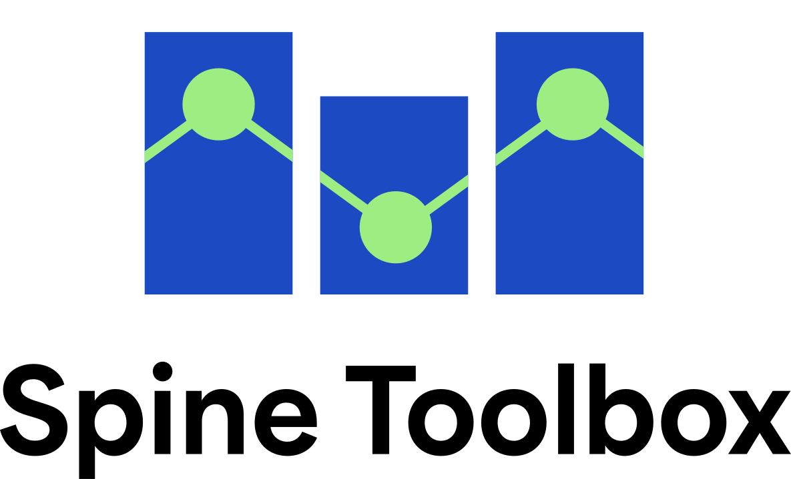

# Spine Toolbox
Link to the documentation: [https://spine-toolbox.readthedocs.io/en/latest/?badge=latest](https://spine-toolbox.readthedocs.io/en/latest/?badge=latest)

[](https://www.python.org/downloads/release/python-379/)
[](https://spine-toolbox.readthedocs.io/en/latest/?badge=latest)
[](https://github.com/spine-tools/Spine-Toolbox/actions/workflows/test_runner.yml)
[](https://codecov.io/gh/spine-tools/Spine-Toolbox)
[](https://badge.fury.io/py/spinetoolbox)
[](https://gitter.im/spine-tools/Spine-Toolbox?utm_source=badge&utm_medium=badge&utm_campaign=pr-badge&utm_content=badge)

Spine Toolbox is an open source Python package to manage data, scenarios and workflows for modelling and simulation. 
You can have your local workflow, but work as a team through version control and SQL databases.

<p align="center" width="100%">
  <picture>
    <source media="(prefers-color-scheme: dark)" srcset="./fig/spinetoolbox_logo.svg" width="50%">
    
  </picture>
</p>

## Programming language

- Python 3.8*
- Python 3.9
- Python 3.10**
- Python 3.11**

*Python 3.8.0 is not supported (use Python 3.8.1 or later).<br>
**Python 3.10 and Python 3.11 require Microsoft Visual C++ 14.0 or greater on Windows.

## License

Spine Toolbox is released under the GNU Lesser General Public License (LGPL) license. 
All accompanying documentation, original graphics and other material are released under the 
[Creative Commons BY-SA 4.0 license](https://creativecommons.org/licenses/by-sa/4.0/).
Licenses of all packages used by Spine Toolbox are listed in the Spine Toolbox User 
Guide.

## Attribution

If you use Spine Toolbox in a published work, please cite the following publication (Chicago/Turabian Style).

Kiviluoma Juha, Pallonetto Fabiano, Marin Manuel, Savolainen Pekka T., Soininen Antti, Vennström Per, Rinne Erkka, 
Huang Jiangyi, Kouveliotis-Lysikatos Iasonas, Ihlemann Maren, Delarue Erik, O’Dwyer Ciara, O’Donnel Terence, 
Amelin Mikael, Söder Lennart, and Dillon Joseph. 2022. "Spine Toolbox: A flexible open-source workflow management 
system with scenario and data management" SoftwareX, Vol. 17, 100967, https://doi.org/10.1016/j.softx.2021.100967.

## Installation

We provide three options for installing Spine Toolbox: 
- [Python/pipx](#installation-with-python-and-pipx) (we intend to make stable releases every month or so)
- [From source files](#installation-from-sources-using-git) (this is the cutting edge - and more likely to have bugs)
- [Windows installation package](#windows-64-bit-installer-package) (these are quite old - not recommended)

### Installation with Python and pipx

This works best for users that just want to use Spine Toolbox and keep it updated 
with new releases. The instructions below are written for Windows, but they also 
apply to Linux and Mac where applicable.

1. If you don't have Python installed, please install e.g. **Python 3.9**
   from [Python.org](https://www.python.org/downloads/release/python-3913/).

2. If you want to use Python 3.10 or 3.11 on Windows, please install **Microsoft Visual C++ 14.0 or greater** on 
   Windows. Get it with *Microsoft C++ Build Tools*: 
   https://visualstudio.microsoft.com/visual-cpp-build-tools/. (Earlier versions of Python use earlier versions of 
   C++ libraries that should be available with Windows.)
   
3. If you don't have Git, Windows version can be found here: https://git-scm.com/download/win.

4. Open a terminal (e.g., Command Prompt). Windows: If you have issues with Python and/or git not found in path, 
   you can add the paths to environment variables manually. This can be done from Windows Control Panel 
   (use find with 'environmental') or from a command prompt using `set PATH=%PATH%;[path-to-executable]` e.g. 
   `set PATH=%PATH%;C:\Users\my_user_name\AppData\Local\Programs\Git\Cmd`. 

5. Get the latest version of `pip` (pip is a package manager for Python)

        python -m pip install --upgrade pip

6. Install [pipx](https://pypa.github.io/pipx/). pipx helps in creating an isolated 
   environment for Spine Toolbox to avoid package conflicts.

        python -m pip install --user pipx
        python -m pipx ensurepath

7. Restart the terminal or re-login for the changes of the latest command to take effect.

8. Choose which Toolbox version to install (**NOTE: There is no release version for Python 3.11, yet**). Latest 
   *release* version is installed using 

        python -m pipx install spinetoolbox

   or get the latest *development* version using

        python -m pipx install git+https://github.com/spine-tools/spinetoolbox-dev

That’s it! To launch Spine Toolbox, open a terminal and run

    spinetoolbox

If for some reason the command is not found, the executable can be found under `~/.local/bin` 
(`%USERPROFILE%\.local\bin` on Windows).

To update Spine Toolbox to the latest available release, open a terminal and run

    python -m pipx upgrade spinetoolbox

Here, replace `spinetoolbox` with `spinetoolbox-dev` if you installed the latest
development version.

### Installation from sources using Git

This option is for developers and other contributors who want to debug or edit Spine Toolbox source code. First, 
follow the instructions above to install Python and get the latest version of pip.

1. Make sure you have git: https://git-scm.com/download/win

2. Clone or download the source code from this repository.
   
3. Browse to the folder where Spine Toolbox was cloned and create a Python virtual environment using

        python -m venv .venv
    
    Make sure you have the right Python version in the system path, or then use the full path of the Python 
    version you want to use.
    <br>
    <br>
    Instead of venv, one can also use a 
    [miniconda](https://docs.conda.io/projects/conda/en/stable/glossary.html#miniconda-glossary) environment. You 
    can [download miniconda from here](https://docs.conda.io/en/latest/miniconda.html). **Note: Anaconda 
    environments are not supported.** Create a new miniconda environment without linking packages from the base 
    environment for e.g. Python 3.9 using

        conda create -n spinetoolbox python=3.9
    
4. Activate the environment using `.venv\Scripts\activate.bat` (Windows cmd.exe) 
   or `source .venv/bin/activate` (bash, zsh) or `conda activate spinetoolbox`. 

5. Make sure that the terminal prompt indicates the active environment
   and get the latest version of `pip` (pip is a package manager for Python)

        python -m pip install --upgrade pip

6. Install Spine Toolbox along with its dependencies with

        python -m pip install -r requirements.txt
    
7. (Optional) Install additional development packages with

        python -m pip install -r dev-requirements.txt

You can now launch Spine Toolbox by calling `spinetoolbox` when the environment 
is active. 

**To upgrade**, pull (or copy) the latest changes from the Spine Toolbox repository 

    git pull
 
and run (to upgrade the other Spine Toolbox packages)

    python -m pip install -U -r requirements.txt

### Windows 64-bit installer package

There are old Windows installer packages available for a quick install, but they are
at this point (26.1.2023) quite obsolete and cannot be recommended for anything but 
a quick look at how Spine Toolbox looks and feels (although even that has changed).
Download the installer package from 
[here](https://github.com/spine-tools/Spine-Toolbox/releases),
run it, and follow the instructions to install Spine Toolbox.

### About requirements

Python 3.8.1-3.11 is required. Python 3.8.0 is not supported due to problems in DLL loading on Windows.

See file `setup.cfg` and `requirements.txt` for packages required to run Spine Toolbox.
(Additional packages needed for development are listed in `dev-requirements.txt`.)

The requirements include three packages ([`spinedb_api`](https://github.com/spine-tools/Spine-Database-API),
[`spine_engine`](https://github.com/spine-tools/spine-engine), and 
[`spine_items`](https://github.com/spine-tools/spine-items)), developed by the Spine project consortium.

### Building the User Guide

You can find the latest documentation on [readthedocs](https://spine-toolbox.readthedocs.io/en/latest/index.html).
If you want to build the documentation yourself,
source files for the User Guide can be found in `docs/source` directory. In order to 
build the HTML docs, you need to install the *optional requirements* (see section 
'Installing requirements' above). This installs Sphinx (among other things), which 
is required in building the documentation. When Sphinx is installed, you can build the 
HTML pages from the user guide source files by using the `bin/build_doc.bat` script on 
Windows or the `bin/build_doc.sh` script on Linux and Mac. After running the script, the 
index page can be found in `docs/build/html/index.html`. The User Guide can also 
be opened from Spine Toolbox menu Help->User Guide (F2).

### Troubleshooting

#### Obscure crashes that may produce a traceback related to PySide6's model classes

The first thing is to make sure that you are not using Anaconda. Only Miniconda is supported. Anaconda's base 
environment includes Qt related packages and we suspect that they leak some shared Qt libraries into environments,
even when specifically requesting that base environment packages should not be linked to environment packages. See
also [Problems in starting the application](#problems-in-starting-the-application) below.

#### Installation fails

Please make sure you are using Python 3.8, 3.9, 3.10, or 3.11 to install the requirements.

If you are on **Python 3.10 or 3.11**, please install **Microsoft Visual C++ 14.0 or greater** on Windows. 
Get it with *Microsoft C++ Build Tools*: https://visualstudio.microsoft.com/visual-cpp-build-tools/.

#### 'No Python' error when installing with pipx

If you see the following error when running the command `python -m pipx install spinetoolbox`

```
No Python at 'c:\python38\python.exe'
Fatal error from pip prevented installation. Full pip output in file:
```

Where c:\python38\python.exe may be some other path. To fix this, delete the folder 
`C:\Users\<user name>\.local\pipx\shared` and run the `python -m pipx install spinetoolbox` command again.

#### Installation fails on Linux
If Python runs into errors while installing on Linux systems, running the 
following command in a terminal may help:

```shell
$ sudo apt install libpq-dev
```

#### Problems in starting the application

If there are problems in starting Spine Toolbox, the chances are that the required 
packages were not installed successfully. In case this happens, the first thing you 
should check is that you don't have `Qt`, `PyQt4`, `PyQt5`, `PySide`, `PySide2`, and 
`PySide6` packages installed in the same environment. These do not play nice together 
and may introduce conflicts. In addition, make sure that you do not have multiple versions 
of these `Qt` related packages installed in the same environment. The easiest way 
to solve this problem is to create a blank (e.g. venv virtual environment) Python 
environment just for `PySide6` applications and installing the requirements again.

**Warning: Using the *conda-forge* channel for installing the requirements is not 
recommended.**

The required `qtconsole` package from the ***conda-forge*** channel also
installs `qt` and `PyQt` packages. Since this is a `PySide6` application, those 
are not needed and there is a chance of conflicts between the packages.

**Note**: Python 3.8.0 is not supported. Use Python 3.8.1 or later.

## Recorded Webinars showing the use of Spine Tools

### Spine Toolbox: Data, workflow and scenario management for modelling
*Wednesday Sep 8, 17:00-18:30 CEST (11:00-12:30 EDT) - Organized together with G-PST*

Spine Toolbox is an open source software to manage data, scenarios and workflows for modelling and simulation. You can have your local workflow, but work as a team through version control and SQL databases. This webinar gives a quick overview of the different functionalities and showcases them through two examples.

Recording Chapters:
- [00:00-00:05](https://www.youtube.com/watch?v=jaDIxonOmfY) Relation to G-PST Pillar 5 (Clayton Barrows, NREL)
- [00:05-00:35](https://youtu.be/jaDIxonOmfY?t=1350) Building a workflow in Spine Toolbox [PDF](http://www.spine-model.org/pdf/webinar/Spine%20Toolbox%20-%20Building%20a%20workflow%20in%20Toolbox%20by%20Juha%20Kiviluoma.pdf), *(Juha Kiviluoma, VTT)*
- [00:35-00:55](https://youtu.be/jaDIxonOmfY?t=2445) Example workflow from Canada to manage lots of input sources [PDF](http://www.spine-model.org/pdf/webinar/Spine%20Toolbox%20-%20Case%20in%20energy%20system%20integration%20with%20Toolbox%20by%20Madeleine%20McPherson%20and%20Jacob%20Monroe.pdf), *(Madeleine McPherson and Jake Monroe, University of Victoria)*
- [01:05-01:15](https://youtu.be/jaDIxonOmfY?t=3722) Example workflow from EU project TradeRES to serve
multiple models *(Milos Cvetkovic and Jim Hommes, TU Delft)*
- [01:15-01:30](https://youtu.be/jaDIxonOmfY?t=4500) Moderated Q&A 

### SpineOpt: A flexible energy system modelling framework in Julia
*Tuesday Sep 7, 14:00-15:30 CEST (8:00-9:30 EDT) - Organized together with EERA ESI*

The importance of operational details in planning future energy systems has been rapidly increasing. One driver for this is the increasing role of variable power generation, which requires that the energy system models consider higher temporal granularity, longer time series and new aspects in power system stability. Another important driver is a consequence of sector coupling through the electrification of transport, space heating and industries. As the other sectors become more integrated with electricity, they need to be modelled at a granularity that is sufficient for describing the potential flexibility they can bring to the power system dominated by variable and uncertain power generation.

This webinar will present the open source Julia based energy system modelling framework SpineOpt, which has been built with these challenges in mind. It can represent different energy sectors using representation typically available only in sector specific models and with highly adaptable temporal and stochastic structures available both for planning and operations. More information at https://spine-project.github.io/SpineOpt.jl/latest/index.html.

Recording Chapters:
- [00:00-00:08](https://www.youtube.com/watch?v=FiiqZNcx7Ds) Introduction [PDF](http://www.spine-model.org/pdf/webinar/SpineOpt_Introduction%20by%20Erik%20Delarue.pdf)
- [00:08-00:31](https://www.youtube.com/watch?v=FiiqZNcx7Ds&t=475s) Basic elements of SpineOpt and the flexible spatial structure [PDF](http://www.spine-model.org/pdf/webinar/SpineOpt_Basic%20elements%20of%20SpineOpt%20by%20Maren%20Ihlemann.pdf)
- [00:31-00:40](https://youtu.be/FiiqZNcx7Ds?t=1876) Adaptable temporal and stochastic structures [PDF](http://www.spine-model.org/pdf/webinar/SpineOpt_Flexible%20temporal%20and%20stochastic%20structure%20by%20Topi%20Rasku.pdf)
- [00:50-01:30](https://youtu.be/FiiqZNcx7Ds?t=3608) Representation of different energy sectors &
Attempts to make the model faster [PDF](http://www.spine-model.org/pdf/webinar/SpineOpt_Different%20energy%20sectors%20and%20accomodating%20complexity%20by%20Jody%20Dillon.pdf)
- [01:25-01:35](https://youtu.be/FiiqZNcx7Ds?t=5065) Q&A + Step-by-step 10 minute demo on how to build a simple model with SpineOpt using Spine Toolbox

### Demonstration of Spine modelling tools through selected case studies
*Thursday Sep 9, 14:00-16:00 CEST (8:00-10:00 EDT)*

[Full recording](https://youtu.be/i2fxDwsMuF8), all presentations slides [PDF](http://www.spine-model.org/pdf/webinar/Case_Studies_all_presentations.pdf)

Over the past 4 years, the EU project Spine has developed a set of open-source tools for modelling complex energy systems. This webinar demonstrates the Spine software through six selected case studies, covering topics such as sector coupling, co-optimization of operation and investments, stochastic modelling, and rolling horizon optimization. Each subsection described below consists of a brief introduction followed by a live demonstration of the particular case, where some of the outstanding features of Spine are highlighted and discussed.

Recording Chapters:
- [00:05-00:15](https://youtu.be/i2fxDwsMuF8?t=252) Introduction to Spine: This section uses a simple example to demonstrate the SpineOpt modelling principle. First, the user defines the different objects in their system, such as units and nodes, as well as the relationships between them, such as which units are connected to which nodes. Then, they specify values for certain pre-defined parameters such as node demand, unit capacity, cost, and conversion ratio. The resulting dataset is passed to SpineOpt which generates the corresponding optimisation model, optimizes it, and delivers the results.
- [00:15-00:30](https://youtu.be/i2fxDwsMuF8?t=939) Hydro: This section demonstrates hydropower modelling in Spine as performed in Case study A5. The objective is to model part of the Swedish hydropower system, namely the Skellefte river with its 15 power stations, by coupling the river system with the power system. The model maximizes income from electricity supply over one week with an hourly resolution, while respecting basic hydrological constraints.
- [00:29-00:45](https://youtu.be/i2fxDwsMuF8?t=1745) Building heating: This section demonstrates building heating modelling in Spine as performed in Case study A4. The objective is to model the Finnish power and district heating system coupled with an electrically heated residential building stock. The result is a rolling unit commitment and economic dispatch model, that optimizes system performance over one year at hourly resolution.  
- [00:45-00:57] Break
- [00:57-01:06](https://youtu.be/i2fxDwsMuF8?t=3411) Gas grid: This section demonstrates gas grid modelling in Spine as performed in Case study A2. The objective is to model a natural gas transmission system with pressure-driven gas and couple it with an electricity system to capture the flexibility provided by the gas network. The result is a dispatch model that co-optimizes operations in both systems over a day at hourly resolution.
- [01:06-01:22](https://youtu.be/i2fxDwsMuF8?t=3992) Stochastic: This section demonstrates stochastic modelling in Spine using a simple example system. Three different stochastic structures are demonstrated: purely deterministic, stochastic fan, and converging fan.
- [01:22-01:35](https://youtu.be/i2fxDwsMuF8?t=4970) Power grid investments: This section demonstrates power grid investment modelling in Spine as performed in case study C2. The objective is twofold: (i) to model the Nordic synchronous power system (Norway, Sweden, Finland, and Denmark) with high operational detail; and (ii) to find optimal transmission line investment decisions over a long-term horizon of 10 years, for three different wind penetration scenarios.      
- [01:35-01:40](https://youtu.be/i2fxDwsMuF8?t=5652) Q&A 

### SpineInterface: How to quickly and easily create new optimization models in Julia Friday
*Friday Sep 10, 14:00-15:30 CEST (8:00-9:30 EDT)*

[Full recording](https://youtu.be/cUopRUTzXpY), all presentations [PDF](http://www.spine-model.org/pdf/webinar/SpineInterface_all_presentations.pdf)

Creation of new optimisation models requires a lot of work to get the data to the models and the results out of the models. Spine Toolbox is an open source data and workflow management tool to assist with these tasks and can work with models written in any language. Meanwhile, SpineInterface is a Julia package that links the data management capabilities of Spine Toolbox with Julia/JuMP modelling environment in a very direct way.

The data interfaces of Spine Toolbox together with SpineInterface simplifies the process of developing optimization models by allowing the model developer to focus on the constraint equations. The required data structures and data are defined with a graphical interface in Spine Toolbox and are immediately available to the model developer inside the constraint equation code without any action or code required by the model developer. SpineInterface supports the full range of data parameter types supported by Toolbox and provides a mechanism for representation of time and time-based data, either time series, time patterns or arbitrarily varying temporal data.

This session will be of interest to model developers and/or students who want a significant head start in developing optimization models. The sessions will also be of interest to model developers who may wish to translate existing models developed in other platforms such as GAMS, into the Spine framework using SpineInterface. The power of SpineInterface will be demonstrated in an interactive session where the full modelling workflow will be illustrated from data structure design and implementation to constraint equation development.

Agenda:
- Overview of SpineInterface
- Toolbox concepts and data structures including the Spine data API
- SpineInterface: convenience functions and accessing Spine Toolbox data in Julia
- Defining a model data structure in Spine Toolbox
- Building and solving an optimization model using SpineInterface
- Q&A + live demo [00:45-01:21](https://youtu.be/cUopRUTzXpY?t=2737)

## Contribution Guide

All are welcome to contribute!

See detailed instructions for contribution in 
[Spine Toolbox User Guide](https://spine-toolbox.readthedocs.io/en/latest/contribution_guide.html).

Below are the bare minimum things you need to know.

### Setting up development environment

1. Install the developer requirements:

        python -m pip install -r dev-requirements.txt

2. Optionally, run `pre-commit install` in project's root directory. This sets up some git hooks.

### Coding style

- [Black](https://github.com/python/black) is used for Python code formatting.
  The project's GitHub page includes instructions on how to integrate Black in IDEs.
- Google style docstrings

### Linting

It is advisable to run [`pylint`](https://pylint.readthedocs.io/en/latest/) 
regularly on files that have been changed.
The project root includes a configuration file for `pylint`.
`pylint`'s user guide includes instructions on how to 
[integrate the tool in IDEs](https://pylint.readthedocs.io/en/latest/user_guide/ide-integration.html#pylint-in-pycharm).

### Unit tests

Unit tests are located in the `tests` directory.
You can run the entire test suite from project root by

    python -m unittest

### Reporting bugs
If you think you have found a bug, please check the following before creating a new 
issue:
1. **Make sure you’re on the latest version.** 
2. **Try older versions.**
3. **Try upgrading/downgrading the dependencies**
4. **Search the project’s bug/issue tracker to make sure it’s not a known issue.**

What to put in your bug report:
1. **Python version**. What version of the Python interpreter are you using? 32-bit 
    or 64-bit?
2. **OS**. What operating system are you on?
3. **Application Version**. Which version or versions of the software are you using? 
    If you have forked the project from Git, which branch and which commit? Otherwise, 
    supply the application version number (Help->About menu).
4. **How to recreate**. How can the developers recreate the bug? A screenshot 
    demonstrating the bug is usually the most helpful thing you can report. Relevant 
    output from the Event Log and debug messages from the console of your run, should 
    also be included.

### Feature requests
The developers of Spine Toolbox are happy to hear feature requests or ideas for improving 
existing functionality. The format for requesting new features is free. Just fill 
out the required fields on the issue tracker and give a description of the new feature. 
A picture accompanying the description is a good way to get your idea into development
faster. But before you make a new issue, please check that there isn't a related idea 
already open in the issue tracker.

&nbsp;
<hr>
<center>
<table width=500px frame="none">
<tr>
<td valign="middle" width=100px>
</td>
<td valign="middle">This work has been partially supported by EU project Mopo (2023-2026), which has received funding 
from European Climate, Infrastructure and Environment Executive Agency under the European Union’s HORIZON Research and 
Innovation Actions under grant agreement N°101095998.</td>
<tr>
<td valign="middle" width=100px>
</td>
<td valign="middle">This work has been partially supported by EU project Spine (2017-2021), which has received funding 
from the European Union’s Horizon 2020 research and innovation programme under grant agreement No 774629.</td>
</table>
</center>
