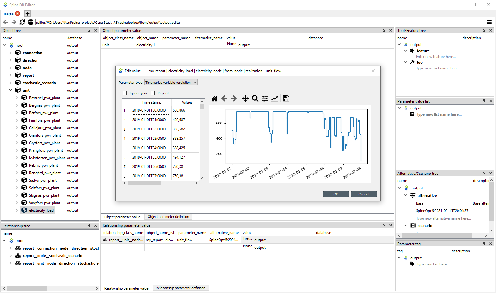
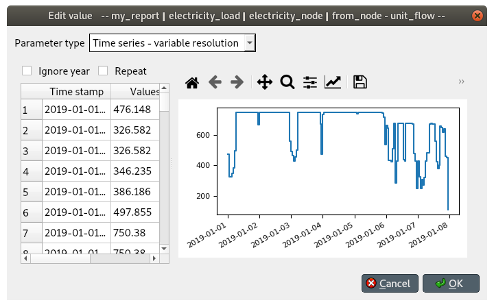

..  Case Study A5 tutorial
    Created: 18.6.2018

.. |ds_icon| image:: ../../spinetoolbox/ui/resources/project_item_icons/database.svg
            :width: 16
.. |tool_icon| image:: ../../spinetoolbox/ui/resources/project_item_icons/hammer.svg
             :width: 16
.. |execute_project| image:: ../../spinetoolbox/ui/resources/project_item_icons/play-circle-solid.svg
             :width: 16

**********************
Case Study A5 tutorial
**********************

Welcome to Spine Toolbox's Case Study A5 tutorial.
Case Study A5 is one of the Spine Project case studies designed to verify
Toolbox and Model capabilities.
To this end, it *reproduces* an already existing study about hydropower
on the `Skellefte river <https://en.wikipedia.org/wiki/Skellefte_River>`_,
which models one week of operation of the fifteen power stations
along the river.

This tutorial provides a step-by-step guide to run Case Study A5 on Spine Toolbox
and is organized as follows:

.. contents::
   :local:

Introduction
------------

Model assumptions
=================

For each power station in the river, the following information is known:

- The capacity, or maximum electricity output. This datum also provides the maximum water discharge
  as per the efficiency curve (see next point).
- The efficiency curve, or conversion rate from water to electricity.
  In this study, a piece-wise linear efficiency with two segments is assumed.
  Moreover, this curve is monotonically decreasing, i.e., the efficiency in the first segment is strictly greater
  than the efficiency in the second segment.
- The maximum magazine level, or amount of water that can be stored in the reservoir.
- The magazine level at the beginning of the simulation period, and at the end.
- The minimum amount of water that the plant needs to discharge at every hour.
  This is usually zero (except for one of the plants).
- The minimum amount of water that needs to be *spilled* at every hour.
  Spilled water does not go through the turbine and thus does not serve to produce electricity;
  it just helps keeping the magazine level at bay.
- The downstream plant, or next plant in the river course.
- The time that it takes for the water to reach the downstream plant.
  This time can be different depending on whether the water is discharged (goes through the turbine) or spilled.
- The local inflow, or amount of water that naturally enters the reservoir at every hour.
  In this study, it is assumed constant over the entire simulation period.
- The hourly average water discharge. It is assumed that before the beginning of the simulation,
  this amount of water has constantly been discharged at every hour.

The system is operated so as to maximize total profit over the week,
while respecting capacity constraints, maximum magazine level constrains, and so on.
Hourly profit per plant is simply computed as the product of the electricity price and the production,
minus a penalty for changes on the water discharge in two consecutive hours.
This penalty is computed as the product of a constant penalty factor, common to all plants,
and the absolute value of the difference in discharge with respect to the previous hour.

Modelling choices
=================

The model of the electric system is fairly simple, only two elements are needed:

- A common electricity node.
- A load unit that takes electricity from that node.

On the contrary, the model of the river system is more detailed.
Each power station in the river is modelled using the following elements:

- An upper water node, located at the entrance of the station.
- A lower water node, located at the exit of the station.
- A power plant unit, that discharges water from the upper node into the lower node,
  and feeds electricity produced in the process to the common electricity node.
- A spillway connection, that takes spilled water from the upper node and releases it to the downstream upper node.
- A discharge connection, that takes water from the lower node and releases it to the downstream upper node.

Below is a schematic of the model. For clarity, only the Rebnis station is presented in full detail:

.. image:: img/case_study_a5_schematic.png
   :align: center
   :scale: 50%

Guide
-----

Installing requirements
=======================

.. note:: This tutorial is written for Spine Toolbox `version 0.5 
   <https://github.com/Spine-project/Spine-Toolbox/tree/release-0.5>`_. 

Make sure that Spine Toolbox version 0.5 and Julia 1.2 (or greater) are properly 
installed as described at the following links:

- `Running Spine Toolbox <https://github.com/Spine-project/Spine-Toolbox#running-spine-toolbox>`_
- `Julia downloads <https://julialang.org/downloads/>`_

Setting up project
==================

Each Spine Toolbox project resides in its own directory. In this directory the user 
can collect all data, programming scripts and other material needed for the project. 
The Toolbox application also creates its own special subdirectory `.spinetoolbox`, 
for project settings etc.

#. Launch Spine Toolbox and from the main menu, select **File -> New project...** 
   to create a new project. Browse to a location where you want to create the project
   and create a new folder for it, e.g. ‘Case Study A5’.

#. Drag the Data Store icon (|ds_icon|) from the toolbar and drop it into the 
   *Design View*. This will open the *Add Data Store* dialog. 
   Type ‘input’ as the Data Store name and click **Ok**.

#. Repeat the above operation to create a Data Store called ‘output’.

#. Drag the Tool icon (|tool_icon|) from the toolbar and drop it into the 
   *Design View*. This will open the *Add Tool* dialog. Type ‘SpineOpt’ as 
   the Tool name and click **Ok**.

   .. note:: Each item in the *Design view* is equipped with three *connectors*
      (the small squares at the item boundaries).

#. Click on one of ‘input’ connectors and then on one of ‘SpineOpt’ connectors. 
   This will create a *connection* from the former to the latter.

#. Repeat the procedure to create a *connection* from `SpineOpt` to `output`. 
   It should look something like this:

   .. image:: img/case_study_a5_item_connections.png
      :align: center

#. From the main menu, select **File -> Save project**.

Configuring Julia
~~~~~~~~~~~~~~~~~

#. Go to Spine Toolbox main window and select **File -> Settings...**. This will 
   open the *Settings* dialog.

#. Go to the *Tools* page and select *Use Julia executable*.

#. Enter the path to your julia executable path or  leave blank to use the 
   executable in your PATH.

#. Choose your current project directory as the Julia project.

#. Also select *Use Python interpreter* and leave the path blank.

#. Click **Ok**.

Configuring SpineOpt 
~~~~~~~~~~~~~~~~~~~~

.. note:: This tutorial is written for SpineOpt 
   `version 0.4.0 <https://github.com/Spine-project/SpineOpt.jl/tree/v0.4.0>`_. 

#. Choose **File -> Tool configuration assistants... -> SpineOpt.jl** from the 
   main menu. The application will install the right version of SpineOpt.

#. Create a new file called `run_spineopt.jl` in your project directory
   and put the following contents to it:

   .. code-block:: julia

      using SpineOpt
      run_spineopt(ARGS...)

   Make sure that the activated package on line 2 equals the name of the directory
   you put SpineOpt source files.

#. Open the *Edit Tool Specification* form by clicking the wrench icon with
   a green plus sign and selecting **Create Tool Specification...**

   .. image:: img/create_tool_specification.png
         :align: center

   Type ‘SpineOpt’ as the name of the specification and select ‘Julia’ as the type.
   Unselect **Execute in work directory**. Select the previously created Julia 
   script as the main program file, and enter :code:`@@url_inputs@@ @@url_outputs@@` 
   to the command line arguments box. Hit **Ok** and save the specification as 
   `spineopt.json` in your project directory.

#. Now that you’ve created a specification you can link it to the Tool item. 
   Select `SpineOpt` item, and choose the ‘SpineOpt’ tool specification in the 
   *Tool Properties* panel. 

#. Save the project (**File -> Save project** or Ctrl+S).

Entering input data
===================

Creating input database
~~~~~~~~~~~~~~~~~~~~~~~

Follow the steps below to create a new Spine database for SpineOpt in the 
`input` Data Store:

#. Download `the SpineOpt database template <https://raw.githubusercontent.com/Spine-project/SpineOpt.jl/v0.4.0/data/spineopt_template.json>`_.

#. Select the `input` Data Store item in the *Design View*.

#. Go to *Data Store Properties* and hit **New Spine db**.

#. Still in *Data Store Properties*, click **Open editor**. This will open 
   the newly created database in the *Spine database editor*, looking similar to this:

   .. image:: img/case_study_a5_treeview_empty.png
      :align: center

   |

   .. note:: The *Spine database editor* is a dedicated interface within Spine Toolbox
      for visualizing and managing Spine databases.

#. Select **File -> Import...** and select the template file you previously downloaded. 
   You should then see classes like ‘commodity’, ‘connection’ and ‘model’ uder 
   the root node of the tree view panel on the left.

#. From the main menu, select **Session -> Commit** to open the *Commit changes* dialog.
   Enter ‘Import SpineOpt template’ as the message and click **Commit**.

Creating objects
~~~~~~~~~~~~~~~~

#. To add power plants to the model, create objects of class ``unit`` as follows:

   a. Select the list of plant names from the text-box below
      and copy it to the clipboard (**Ctrl+C**):

      ::

        Rebnis_pwr_plant
        Sadva_pwr_plant
        Bergnäs_pwr_plant
        Slagnäs_pwr_plant
        Bastusel_pwr_plant
        Grytfors_pwr_plant
        Gallejaur_pwr_plant
        Vargfors_pwr_plant
        Rengård_pwr_plant
        Båtfors_pwr_plant
        Finnfors_pwr_plant
        Granfors_pwr_plant
        Krångfors_pwr_plant
        Selsfors_pwr_plant
        Kvistforsen_pwr_plant

   b. Go to *Object tree* (on the top left of the window, usually),
      right-click on ``unit`` and select **Add objects** from the context menu. This will
      open the *Add objects* dialog.

   c. Select the first cell under the **object name** column
      and press **Ctrl+V**. This will paste the list of plant names from the clipboard into that column,
      looking similar to this:

        .. image:: img/add_power_plant_units.png
          :align: center

   d. Click **Ok**.
   e. Back in the *Spine database editor*, under *Object tree*, double click on ``unit``
      to confirm that the objects are effectively there.
   f. Commit changes with the message ‘Add power plants’.

#. To add discharge and spillway connections, create objects of class ``connection``
   with the following names:
   ::

     Rebnis_to_Bergnäs_disch
     Sadva_to_Bergnäs_disch
     Bergnäs_to_Slagnäs_disch
     Slagnäs_to_Bastusel_disch
     Bastusel_to_Grytfors_disch
     Grytfors_to_Gallejaur_disch
     Gallejaur_to_Vargfors_disch
     Vargfors_to_Rengård_disch
     Rengård_to_Båtfors_disch
     Båtfors_to_Finnfors_disch
     Finnfors_to_Granfors_disch
     Granfors_to_Krångfors_disch
     Krångfors_to_Selsfors_disch
     Selsfors_to_Kvistforsen_disch
     Kvistforsen_to_downstream_disch
     Rebnis_to_Bergnäs_spill
     Sadva_to_Bergnäs_spill
     Bergnäs_to_Slagnäs_spill
     Slagnäs_to_Bastusel_spill
     Bastusel_to_Grytfors_spill
     Grytfors_to_Gallejaur_spill
     Gallejaur_to_Vargfors_spill
     Vargfors_to_Rengård_spill
     Rengård_to_Båtfors_spill
     Båtfors_to_Finnfors_spill
     Finnfors_to_Granfors_spill
     Granfors_to_Krångfors_spill
     Krångfors_to_Selsfors_spill
     Selsfors_to_Kvistforsen_spill
     Kvistforsen_to_downstream_spill

#. To add water nodes, create objects of class ``node`` with the following names:

   ::

     Rebnis_upper
     Sadva_upper
     Bergnäs_upper
     Slagnäs_upper
     Bastusel_upper
     Grytfors_upper
     Gallejaur_upper
     Vargfors_upper
     Rengård_upper
     Båtfors_upper
     Finnfors_upper
     Granfors_upper
     Krångfors_upper
     Selsfors_upper
     Kvistforsen_upper
     Rebnis_lower
     Sadva_lower
     Bergnäs_lower
     Slagnäs_lower
     Bastusel_lower
     Grytfors_lower
     Gallejaur_lower
     Vargfors_lower
     Rengård_lower
     Båtfors_lower
     Finnfors_lower
     Granfors_lower
     Krångfors_lower
     Selsfors_lower
     Kvistforsen_lower

#. Next, create the following objects:

   a. ``water`` and ``electricity`` of class ``commodity``.

   b. ``electricity_node`` of class ``node``.

   c. ``electricity_load`` of class ``unit``.

   d. ``some_week`` of class ``temporal_block``.

#. Finally, create the following objects to get results back from Spine Opt:

   a. ``my_report`` of class ``report``.

   b. ``unit_flow``, ``connection_flow``, and ``node_state`` of class ``output``.

.. _Specifying object parameter values:

Specifying object parameter values
~~~~~~~~~~~~~~~~~~~~~~~~~~~~~~~~~~

#. To specify the general behaviour of our model, enter ``model`` parameter values as follows:

   a. Select the model parameter value data from the text-box below
      and copy it to the clipboard (**Ctrl+C**):

      .. literalinclude:: data/cs-a5-model-parameter-values.txt

   b. Go to *Object parameter value* (on the top-center of the window, usually).
      Make sure that the columns in the table are ordered as follows:
      
      ::

         object_class_name | object_name | parameter_name | alternative_name | value | database

   c. Select the first empty cell under ``object_class_name`` and press **Ctrl+V**.
      This will paste the model parameter value data from the clipboard into the table.
      The form should be looking like this:

      .. image:: img/case_study_a5_model_parameters.png
            :align: center

#. To specify the resolution of our temporal block, repeat the same procedure with the data below:

   .. literalinclude:: data/cs-a5-temporal_block-parameter-values.txt

#. To specify the behaviour of all system nodes, repeat the same procedure with the data below, where:

   a. ``demand`` represents the local inflow (negative in most cases).
   b. ``fix_node_state`` represents fixed reservoir levels (at the beginning and the end).
   c. ``has_state`` indicates whether or not the node is a reservoir (true for all the upper nodes).
   d. ``state_coeff`` is the reservoir 'efficienty' (always 1, meaning that there aren't any loses).
   e. ``node_state_cap`` is the maximum level of the reservoirs.

   .. literalinclude:: data/cs-a5-node-parameter-values.txt

Establishing relationships
~~~~~~~~~~~~~~~~~~~~~~~~~~

.. tip:: To enter the same text on several cells, copy the text into the clipboard, then select all
   target cells and press **Ctrl+V**.

#. To establish that power plant units receive water from 
   the station's upper node, create relationships of class ``unit__from_node`` as follows:

   a. Select the list of power plant and corresponding upper node names from the text-box below
      and copy it to the clipboard (**Ctrl+C**).

      .. literalinclude:: data/cs-a5-unit__from_node-upper.txt

   b. Go to *Relationship tree* (on the bottom left of the window, usually),
      right-click on ``unit__from_node``
      and select **Add relationships** from the context menu. This will
      open the *Add relationships* dialog.

   c. Select the first cell under the *unit* column
      and press **Ctrl+V**. This will paste the list of plant and node names from the clipboard into the table.
      The form should be looking like this:

      .. image:: img/add_pwr_plant_water_from_node.png
        :align: center

   d. Click **Ok**.
   e. Back in the *Spine database editor*, under *Relationship tree*, double click on
      ``unit__from_node`` to confirm that the relationships are effectively there.
   f. From the main menu, select **Session -> Commit** to open the *Commit changes* dialog.
      Enter ‘Add from nodes of power plants‘ as the commit message and click **Commit**.

#. To establish that power plant units release water to the station's lower node,
   create relationships of class ``unit__to_node`` with the following data:

   .. literalinclude:: data/cs-a5-unit__to_node-lower.txt

   .. note:: At this point, you might be wondering what's the purpose of the ``unit__node__node``
      relationship class. Shouldn't it be enough to have ``unit__from_node`` and ``unit__to_node`` to represent
      the topology of the system? The answer is yes; but in addition to topology, we also need to represent
      the *conversion process* that happens in the unit, where the water from one node is turned into electricty
      for another node. And for this purpose, we use a relationship parameter value on the ``unit__node__node``
      relationships (see :ref:`Specifying relationship parameter values`).

#. To establish that the electricity load unit takes electricity from the common
   electricity node, create a relationship of class ``unit__from_node`` between
   ``electricity_load`` and ``electricity_node``.

#. To establish that power plant units inject electricity to the common electricity node,
   create the following ``unit__to_node`` relationships:

   .. literalinclude:: data/cs-a5-unit__to_node-electricity.txt

#. To establish that discharge connections take water from the *lower* node of the upstream station,
   create the following relationships of class ``connection__from_node``:

   .. literalinclude:: data/cs-a5-connection__from_node-disch.txt

#. To establish that spillway connections take water from the *upper* node of the upstream station,
   create the following relationships of class ``connection__from_node``:

   .. literalinclude:: data/cs-a5-connection__from_node-spill.txt

#. To establish that discharge and spillway connections release water onto 
   the upper node of the downstream station, create the following ``connection__to_node`` relationships:

   .. literalinclude:: data/cs-a5-connection__to_node-water.txt

   .. note:: At this point, you might be wondering what's the purpose of the ``connection__node__node``
      relationship class. Shouldn't it be enough to have ``connection__from_node`` and ``connection__to_node``
      to represent the topology of the system? The answer is yes; but in addition to topology, we also need to represent
      the *delay* in the river branches.
      And for this purpose, we use a relationship parameter value on the ``connection__node__node``
      relationships (see :ref:`Specifying relationship parameter values`).

#. To establish that water nodes balance water and the electricity node balances 
   electricity, create ``node__commodity`` relationships between all upper and lower reservoir nodes 
   and the ``water`` commodity, as well as between the ``electricity_node`` and ``electricity``.

#. Next, to establish that all nodes are balanced at each time slice in the one week horizon,
   create relationships of class ``node__temporal_block`` between all the nodes 
   and the temporal_block ``some_week``.

#. Finally, create one relationships of class ``report__output`` between ``my_report`` and each of
   the following ``output`` objects: ``unit_flow``, ``connection_flow``, and ``node_state``.
   This is so results from running Spine Opt are written to the ouput database.

.. _Specifying relationship parameter values:

Specifying relationship parameter values
~~~~~~~~~~~~~~~~~~~~~~~~~~~~~~~~~~~~~~~~

#. To specify the capacity of hydro power plants, enter ``unit__from_node`` parameter values as follows:

   a. Select the parameter value data from the text-box below
      and copy it to the clipboard (**Ctrl+C**):

      .. literalinclude:: data/cs-a5-unit__from_node-relationship-parameter-values.txt

   b. Go to *Relationship parameter value* (on the bottom-center of the window, usually).
      Make sure that the columns in the table are ordered as follows:

      ::

         relationship_class_name | object_name_list | parameter_name | alternative_name | value | database

   c. Select the first empty cell under ``relationship_class_name`` and press **Ctrl+V**.
      This will paste the parameter value data from the clipboard into the table.

#. To specify the variable operating cost of the electricity unit (equal to the negative electricity price),
   repeat the same procedure with the data below:

   .. literalinclude:: data/cs-a5-unit__from_node-vom_cost-relationship-parameter-values.txt

#. To specify the conversion ratio from water to electricity of different hydro power plants,
   repeat the same procedure with the data below:

   .. literalinclude:: data/cs-a5-unit__node__node-relationship-parameter-values.txt

#. To specify the average discharge of power plants in the first hours of the simulation,
   repeat the same procedure with the data below:

   .. literalinclude:: data/cs-a5-connection__from_node-relationship-parameter-values.txt

#. Finally, to specify the delay in different water connections,
   repeat the same procedure with the data below:

   .. literalinclude:: data/cs-a5-connection__node__node-relationship-parameter-values.txt

#. When you're ready, commit all changes to the database.

Executing the workflow
======================

Once the workflow is defined and input data is in place, the project is ready
to be executed. Hit the **Execute project** button (|execute_project|) on 
the toolbar.

You should see ‘Executing All Directed Acyclic Graphs’ printed to *Event log*
in the lower left panel (by default).
SpineOpt output messages will appear to the *Process Log* panel in the middle.
After some processing, ‘DAG 1/1 completed successfully’ appears and the 
execution is complete.

Examining the results
=====================

Select the output data store and open the database editor to it.

To checkout the flow on the common electricity, go to *Object tree*, expand the ``unit`` object class,
and select ``electricity_load``, as illustrated in the picture above.
Next, go to *Relationship parameter value* and double-click the first cell under `value`.
The *Parameter value editor* will pop up. You should see something like this:

