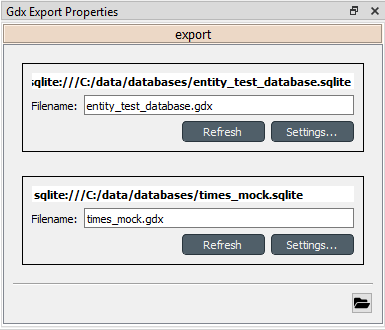

..  Importing and exporting data
    Created: 15.5.2019

.. _Importing and exporting data:

****************************
Importing and exporting data
****************************

.. note:: This section is a work in progress.

This section explains the different ways of importing and exporting data to and from a Spine database.

Excel
-----
In this section the excel import/export functionality is explained.

To import/export an excel file, select a **Data store** and open the **Tree view**.
Then select **File -> Import** or **File -> Export** from the main menu.

Format
~~~~~~

The excel files for import/export are formatted in the following way:

.. tip:: An easy way to get a excel template is to export an existing spine-database to excel.

Object classes:

.. image:: img/excel_object_sheet.png
   :align: center

Object timeseries:

.. image:: img/excel_object_sheet_timeseries.png
   :align: center

Relationship classes:

.. image:: img/excel_relationship_sheet.png
   :align: center

Relationship timeseries:

.. image:: img/excel_relationship_sheet_timeseries.png
   :align: center

When importing, all sheets with a valid format are imported, whereas sheets with invalid format are simply ignored.
When exporting all object classes and relationship classes are exported.
Only parameter values with timeseries data are exported in the timeseries format.

GAMS
----

Databases can be exported to GAMS :literal:`.gdx` files by the *Gdx Export* project item.
When a project is executed, *Gdx Export* writes its output files to the project item's data folder
and forwards file paths to project items downstream.
If a *Tool* is to use such a file, remember to add the file as one of the *Tool Template*'s input files!

.. note::
   You need to have GAMS Python bindings installed to use this functionality.
   See the GAMS `Python tutorial <https://www.gams.com/latest/docs/API_PY_TUTORIAL.html>`__ for instructions
   on how to install the bindings.

The mapping between a database and GAMS is as follows:

====================== ========================
Database entity        GAMS entity
====================== ========================
Object class           Universal set
Object                 Universal set member
Object parameter       Parameter
Relationship class     Subset of universal sets
Relationship           Subset member
Relationship parameter Parameter
====================== ========================

It is also possible to designate a single object class as *Global parameter*.
The parameters of the objects of that class will be exported as GAMS scalars.

Some GAMS models need their data to be in a specific order in the :literal:`.gdx`.
This is not directly supported by the database.
Rather, user has to specify the desired exporting order using the *Gdx Export* item's settings.

Gdx Export Project Item
~~~~~~~~~~~~~~~~~~~~~~~

The image below shows the settings tab of *Gdx Export* with two *Data Sources* connected to it.

For each connected *Data Store* a box with the database's path and export file name field is shown on the tab.
The *Settings* buttons open *Gdx Export settings* windows to further edit database specific export parameters
such as the order in which entities are exported from the database.

.. image:: img/gdx_export_settings_window.png
   :align: center

The *Gdx Export settings* window (see above) contains a *Sets* list which shows all GAMS sets (gray background) and
subsets that are available in the database. The sets are exported in the order they are shown in the list.
The *Move Up* and *Move Down* buttons can be used to move the selected set around.
Note that you cannot mix sets with subsets so all sets always get exported before the subsets.

The checkbox next to the set name is used to control which sets are actually exported.

The *Set Contents* box lists the members of the selected set or subset.
Their order of export can be changed the same way as with sets by *Move Up* and *Move Down*.

Finally, one of the sets can be designated as the global parameter set.
This is achieved by filling the corresponding object class's name in the *Object Class* field.
Note that this set is not exported, only its parameters are. They end up as GAMS scalars.
