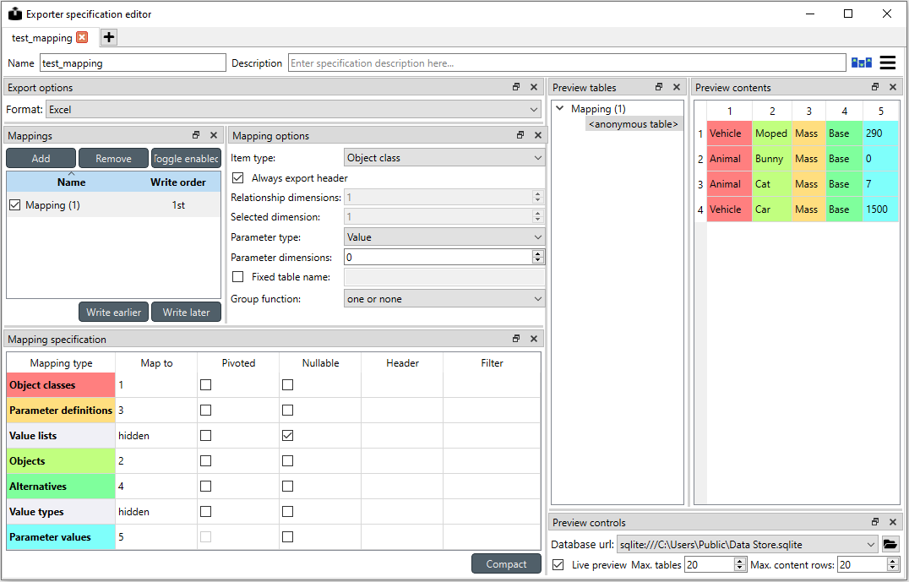
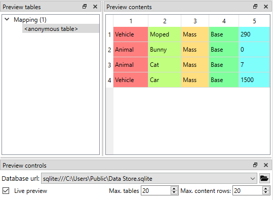

..  Importing and exporting data
    Created: 15.5.2019

.. |open-folder| image:: ../../spinetoolbox/ui/resources/menu_icons/folder-open-solid.svg
   :width: 16
.. |wrench| image:: ../../spinetoolbox/ui/resources/wrench.svg
   :width: 16

.. _Importing and exporting data:

****************************
Importing and exporting data
****************************

This section explains the different ways of importing and exporting data to and from a Spine database.

Importing data with Importer
----------------------------

Data importing is handled by the Importer project item
which can import tabulated and to some degree tree-structured data
into a Spine database from various formats.
The same functionality is also available in **Spine database editor** from **File->Import**
but using an Importer item is preferred because then the process is documented and repeatable.

.. tip::
   A Tool item can also be connected to Importer to import tool's output files to a database.

The heart of Importer is the **Import Editor** window in which the mappings from source data
to Spine database entities are set up. The editor window can be accessed
by the **Import Editor...** button in Importer's Properties dock.
Note, that you have to select one of the files in the **Source files** list before clicking the button.

.. image:: img/importer_properties.png
   :align: center

The **Import Editor** windows is divided into two parts:
**Sources** shows all the 'sheets' contained in the file,
some options for reading the file correctly,
and a preview table to visualize and configure how the data on the selected sheet would be mapped.
**Mappings**, on the other hand, shows the actual importing settings, the mappings from the input
data to database entities.

The options in the Mappings part declare if the currently selected sheet will be imported as an object or relationship
and what type of parameters, if any, the sheet contains.
The table can be used to configure how the input data is interpreted:
which row or column contains the entity class names, parameter values, time stamps and so on.

.. image:: img/import_editor_mapping_options.png
   :align: center

It might be helpful to fill in the mapping options using the preview table in the Sources part.
Right clicking on the table cells shows a popup menu
that lets one to configure how the rows and colunms are read upon importing.

.. image:: img/import_editor_preview_table_mapping_menu.png
   :align: center

An important aspect of data import is whether each item in the input data should be read as a string, a number,
a time stamp, or something else.
By default all input data is read as strings.
However, more often than not things like parameter values are actually numbers.
It is possible to control what type of data each column (and, sometimes, each row) contains from the preview table.
Clicking the data type indicator button on column headers pops up a menu with a selection of available data types.
Right clicking the column header also gives the opportunity to change the data type of all columns at once.

.. image:: img/import_editor_column_data_type_menu.png
   :align: center

Exporting data with Exporter
----------------------------

Exporter writes database data into regular files that can be used by Tools and external software
that do not read the Spine database format. Various tabulated file formats are supported
some of which require specific export settings; see below for more details.

At its heart Exporter maps database items such as entity class or entity names to an output table.
Each item has a user given output **position** on the table, for example a column number.
By default data is mapped to columns but it is also possible to create pivot tables.

Exporter saves its settings or export **mappings** as a specification
that can be reused by other exporters or even other projects.
The specification can be edited in *Exporter specification editor*
which is accessible by the |wrench| button in the item's Properties dock
or by double clicking exporter's icon on the Design view.
A specification that is not associated with any specific Exporter project item can be created
and edited from the Main toolbar.

Properties dock
~~~~~~~~~~~~~~~

Exporter's Properties dock controls project item specific settings
that are not part of the item's specification.

.. image:: img/exporter_properties.png
   :align: center

Specification used by the active Exporter item can be selected from the *Specification* combobox.
The |wrench| button opens *Exporter specification editor*
where it is possible to edit the specification.

Databases available for export from connected project items such as Data stores are listed in
separate boxes below the Specification combobox. An output filename is required for each database.

Checking the *Time stamp output directories* box adds a time stamp to the item's output directories
preventing output files from being overwritten. This may be useful for debugging purposes.

The *Cancel export on error* checkbox controls whether execution bails out on errors
that may be otherwise non-fatal.

Exporter's data directory can be opened in system's file browser by the |open-folder| button.
The output files are written in data directory's :literal:`output` subdirectory.

Exporter specification editor
~~~~~~~~~~~~~~~~~~~~~~~~~~~~~

Specification editor is used to create **mappings** that define how data is exported to the output file.
Mappings define one or more tables and their contents but are otherwise output format agnostic.
Some output formats, e.g. SQL and gdx, interpret the tables in specific ways, however.
Other formats which inherently cannot write multiple tables into a single file,
such as csv, may end up exporting multiple files.
See the sections below for format specific intricacies.

When opened for the first time Specification editor looks like in the figure below.
The window is tabbed allowing multiple specifications to be edited at the same time.
Each tab consists of dock widgets which can be reorganized to suit the user's needs.
The 'hamburger' menu on the top right corner gives access to some important actions
such as *Save* and *Close*. *Undo* and *redo* can be found from the menu as well.

The only requirement for a specification is a name.
This can be given on the *Name* field field on the top bar.
The *Description* field allows for an additional explanatory text.

The current output format can be changed by the *Format* combobox on *Export options* dock.

.. image:: img/exporter_mappings_dock.png
   :align: center

Specification's mappings are listed in the *Mappings* dock shown above.
The *Add* button adds a new mapping while the *Remove* button removes selected mappings.
Mappings can be renamed by double clicking their names on the list.
The checkbox in front of mapping's name shows if the mapping is currently enabled.
Use the *Toggle enabled* button to toggle the enabled state of all mappings at once.

The tables defined by the mappings are written in the order shown on the mapping list's *Write order* column.
This may be important if the tables need to be in certain order in the output file
or when multiple mappings output to a single table.
Mappings can be sorted by their write order by clicking the header of the *Write order* column.
The *Write earlier* and *Write later* buttons move the currently selected mapping up and down the list.

.. image:: img/exporter_mapping_options_dock.png
   :align: center

.. image:: img/exporter_mapping_specification_dock.png
   :align: center

Currently selected mapping is edited using the controls in *Mapping options* and *Mapping specification* docks.
The *Mapping options* dock contains controls that apply to the mapping as a whole,
e.g. what data the output tables contain. *Mapping specification*, on the other hand,
contains a table which defines the structure of the mapping's output tables.

What database items the mapping outputs is chosen using the *Item type* combobox in *Mapping options* dock.
For instance, the *Object classes* option outputs object classes, objects
and, optionally, object parameters and related items
while the *Relationship classes* option outputs relationship classes and relationships.
Checking the *Always export header* checkbox outputs a table that has fixed headers
even if the table is otherwise empty.
If *Item type* is Relationship class,
the *Relationship dimensions* spinbox can be used to specify the maximum number
of relationships' dimensions that the mapping is able to handle.
Parameters can be outputted by choosing their value type using the *Parameter type* combobox.
The *Value* choice adds rows to *Mapping specification* for parameter values associated with
individual entities while *Default value* allows outputting parameters' default values.
The maximum number of value dimensions in case of indexed values
(time series, maps, time patterns, arrays)
the mapping can handle is controlled by the *Parameter dimensions* spinbox.
The *Fixed table name* checkbox enables giving a user defined table name to the mapping's output table.
In case the mapping is pivoted and *Mapping specification* contains items that are *hidden*,
it is possible that a number of data elements end up in the same output table cell.
The *Group function* combobox offers some basic functions to aggregate such data into the cells.

The contents of the table on the *Mapping specification* dock depends on choices on *Mapping options*,
e.g. the item type, parameter type or dimensions.
Each row corresponds to an item in the database: object class names, object names, parameter values etc.
The item's name is given in the *Mapping type* column.
The colors help to identify the corresponding elements in the preview.
The *Map to* column defines the **position** of the item,
that is, where the item is written or otherwise used when the output tables are generated.
By default, a plain integral number in this column means that the item is written to that column in the output table.
From the other choices, *hidden* means that the item will not show on the output.
*Table name*, on the other hand, uses the item as output table names.
For example, outputting object classes as table names will generate one new table for every object class
in the database, each named after the class.
Each table in turn will contain the parameters and objects of the table's object class.
If multiple mappings generate a table with a common name then each mapping appends to the same table
in the order specified by the *Write order* column on *Mappings* dock.
The *column header* position makes the item a column header for a **buddy item**.
Buddy items have some kind of logical relationship with their column header,
for instance the buddy of an object class is its objects;
setting the object class to *column header* will write the name of the class as the objects' column header.

.. note::
   Currently, buddies are fixed and defined only for a small set database items.
   Therefore, *column header* will not always produce sensible results.

Changing the column and pivot header row positions leaves sometimes gaps in the output table.
If such gaps are not desirable the *Compact* button reorders the positions by removing the gaps.
This may be useful when the output format requires such gapless tables.

The checkboxes in *Pivoted* column on the *Mapping specification* dock toggle the mapping into pivoted mode.
One or more items on the table can be set as pivoted.
They then act as a pivot header for the data item which is the last non-hidden item on the list.
Once checked as pivoted, an item's position column defines a pivot header row instead of output column.

By default a row ends up in the output table only when all mapping items yield some data.
For example, when exporting object classes and objects, only classes that have objects get written to output.
However, sometimes it is useful to export 'empty' object classes as well.
For this purpose a mapping can be set as **nullable** in the *Nullable* column.
Continuing the example, checking the *Nullable* checkbox for *Objects* would produce an output table with
all object classes including ones without objects.
The position where objects would normally be outputted are left empty for those classes.

Besides the *column header* position it is possible give fixed column headers to items
using the *Header* column in *Mapping specification* dock.
Note that checking the *Always export header* option in the *Mapping options* dock outputs the fixed headers
even if there is no other data in a table.

The *Mapping specification* dock's *Filter* column provides refined control on which database items the mapping outputs.
The column uses `regular expressions <https://en.wikipedia.org/wiki/Regular_expression>`_
to filter what gets outputted. See _`Basic regular expression for filtering`.

A preview of what will be written to the output is available in the preview dock widgets.
A database connection is needed to generate the preview.
The *Preview controls* dock provides widgets to choose an existing database or to load one from a file.
Once a database is available and the preview is enabled the mappings and the tables they would output
are listed on the *Preview tables* dock.
Selecting a table from the list shows the table's contents on the *Preview contents* dock.
The colors on the table correspond to the colors in *Mapping specification* dock.

Basic regular expressions for filtering
~~~~~~~~~~~~~~~~~~~~~~~~~~~~~~~~~~~~~~~

The *Filter* field in *Mapping specification* accepts
`regular expressions <https://en.wikipedia.org/wiki/Regular_expression>`_
to filter what data gets outputted by that mapping item.
Below are examples on how to create some basic filters.

*Single item*

Writing the item's name to the field filters out all other items.
For example, to output the object class called 'node' only, write :literal:`node` to the *Filter* field.

*OR operator*

The vertical bar :literal:`|` serves as the OR operator.
:literal:`node|unit` as a filter for object classes would output classes named 'node' and 'unit'.

*Excluding an item*

While perhaps not the most suitable task for regular expressions it is still possible to 'negate' a filter.
`^(?!node).` would exclude all items names of which start with 'node'.

Csv and multiple tables
~~~~~~~~~~~~~~~~~~~~~~~

Csv files are flat text files and therefore do not directly support multiple tables.
Instead, multiple tables are handled as separate output files.

Only mappings that output an **anonymous table**
actually write to the file specified on the Exporter's properties dock.
Named tables get written to files named after the table plus the :literal:`.csv` extension.
For example, a table named :literal:`node` would result in a file called `node.csv`.

SQL export
~~~~~~~~~~

.. note::
   Currently only sqlite is supported.

The SQL backend writes the tables to the target database in a relatively straightforward way:

* Tables are named after the table name provided by the mappings. **Anonymous tables** are not supported.
* The first row of each table is used as column names in the database. Thus, each column in a mapping should
  have a fixed header or a header produced by an item set to *column header* position.
* Column data types are sniffed from the second row. Empty values or a missing row result in string type.
* There must be an item assigned to each column. Empty columns confuse the SQL backend.
* Pivot tables do not generally make sense with the SQL backend
  unless the resulting table somehow follows the above rules.

GAMS gdx export
~~~~~~~~~~~~~~~

.. note::
   You need to have GAMS installed to use this functionality.
   However, you do not need to own a GAMS license as the demo version works just as well.

.. note::
   The bitness (32 or 64bit) of GAMS must match the bitness of the Python interpreter.

The gdx backend turns the output tables to GAMS sets, parameters and scalars following the rules below:

* Table names correspond the names of sets, parameters and scalars.
  Thus, **anonymous tables** are not supported.
* There must be an item assigned to each column. Empty columns confuse the gdx backend.
* Pivot tables do not generally make sense with the gdx backend
  unless the resulting table somehow follows the rules listed here.

**Sets:**

* Everything that is not identified as parameter or scalar is considered a GAMS set.
* Each column corresponds to a dimension.
* The first row is used to name the dimension's domain. Thus, each column in a mapping should
  have a fixed header or a header produced by an item set to *column header* position.
  Note that :literal:`*` is a valid fixed header and means that the dimension has no specific domain.

**Parameters:**

* A table that contains numerical values as the last (rightmost) column is considered a GAMS parameter.
* The last column should contain the parameter's values while the other columns contain the values' dimension.
* Dimensions' domains are taken from the header row, see **Sets** above.
  Note, that the value column does not need a header.

**Scalars:**

* A table that contains a numerical value in the top left cell is considered a GAMS scalar.
  Everything else (except the table name) is ignored.
* The data in the top left cell is the scalar's value.

Exporting to GAMS with GdxExporter
----------------------------------

.. note::
   GdxExporter is pending for removal and its use in new projects is discouraged.
   Use Exporter instead.

.. note::
   You need to have GAMS installed to use this functionality.
   However, you do not need to own a GAMS license as the demo version works just as well.

.. note::
   The bitness (32 or 64bit) of GAMS has to match the bitness of the Python interpreter.

Databases can be exported to GAMS :literal:`.gdx` files by the *GdxExporter* project item.
When a project is executed, *GdxExporter* writes its output files to its data folder
and forwards file paths to project items downstream.
If a *Tool* is to use such a file, remember to add the file as one of the *Tool specification*'s input files!

The mapping between entities in a Spine database and GAMS is as follows:

====================== =========================
Database entity        GAMS entity
====================== =========================
Object class           Universal set (or domain)
Object                 Universal set member
Object parameter       Parameter
Relationship class     Subset of universal sets
Relationship           Subset member
Relationship parameter Parameter
====================== =========================

.. note::
   Currently, it is not possible to use subsets (relationship classes) as dimensions for other
   subsets due to technical limitations.
   For example, if there is a domain **A(*)** and a subset **foo(A)**,
   a subset of **foo** has to be expressed as **bar(A)** instead of **bar(foo)**.

It is also possible to designate a single object class as a *Global parameter*.
The parameters of the objects of that class will be exported as GAMS scalars.

Some GAMS models need their data to be in a specific order in the :literal:`.gdx`.
This is not directly supported by the database.
Rather, user has to specify the desired exporting order using the *GdxExporter* item's settings.

GdxExporter Project Item
~~~~~~~~~~~~~~~~~~~~~~~~

The image below shows the properties dock of *GdxExporter* with two *Data Sources* connected to it.

.. image:: img/gdx_exporter_properties.png
   :align: center

For each connected *Data Store* a box with the database's URL and export file name field is shown on the dock.
The *Settings...* buttons open *Gdx Export settings* windows to allow editing database specific export parameters
such as the order in which entities are exported from the database.

.. image:: img/gdx_export_settings_window.png
   :align: center

The *Gdx Export settings* window (see above) contains a *Sets* list which shows all GAMS sets (gray background) and
subsets that are available in the database. The sets are exported in the order they are shown in the list.
The *Move Up* and *Move Down* buttons can be used to move the selected set around.
Note that you cannot mix sets with subsets so all sets always get exported before the subsets.

The checkbox next to the set name is used to control which sets are actually exported.
Note that it is not possible to change this setting for certain sets.
Global parameters domain is never exported, only its parameters which become GAMS scalars.
Further, sets created for *Indexed paramaters* are always exported.

The *Set Contents* box lists the members of the selected set or subset.
Their order of export can be changed the same way as with sets by *Move Up* and *Move Down*.
The *Alphabetic* button sorts the members alphabetically.

Time series and time patterns cannot be exported as-is. They need to be tied up to a GAMS set.
This can be achieved from the window that opens from the *Indexed parameters...* button.
See the `Exporting time series and patterns`_ section below for more information.

Finally, one of the sets can be designated as the global parameter set.
This is achieved by choosing the set's name in the *Global parameters domain* box.
Note that this set is not exported, only its parameters are. They end up as GAMS scalars.

Exporting time series and patterns
~~~~~~~~~~~~~~~~~~~~~~~~~~~~~~~~~~

Since GAMS has no notion of time series or time patterns these types need special handling when exported
to a :literal:`.gdx` file. Namely, the time stamps or time periods (i.e. parameter indexes) need be available
as GAMS sets in the exported file. It is possible to use an existing set or create a new one for this purpose.
The functionality is available in *Gdx Parameter Indexing Settings* window
accessible from the *Indexed Parameters...* button.

.. image:: img/gdx_export_parameter_indexing_window_using_existing_domain.png
   :align: center

The above figure shows the indexing settings when an existing GAMS set is used to replace the original
time stamps of a time series in a parameter called 'size'. The choice between using an existing set or
creating a new one can be changed by the *Use existing domain* and *Create new index domain* radio buttons.
When using an existing set it is selected by the combobox.
In the above figure, *ALL TS* set is used for indexing.

In case of existing set it is possible that not all the set's contents are used for indexing.
The table occupying the right side of the above figure shows which of the set's keys index which parameter values.
The first column contains the keys of the currently selected set whereas the other columns contain the parameter's
values, one column for each object that has the parameter.
Selecting and deselecting rows in the table changes the indexing as only the keys on selected rows are used to
index the parameter.
**Shift**, **ctrl** and **ctrl-A** help in manual selection.
If the selected indexes have certain pattern it might be useful to utilize the *Label picking expression* field
which selects the set keys using a Python expression returning a boolean value. Some examples:

====================================== ============================
Expression                             Effect
====================================== ============================
:literal:`i == 3`                      Select the third row only
:literal:`i % 2 == 0`                  Select even rows
:literal:`(i + 1) % 2 == 0 and i != 9` Select odd rows except row 9
====================================== ============================

The *Indexing domains* list allows to shuffle the order of the parameter's dimensions.
The **bold** dimension is the new dimension that is added to the parameter.
It can be moved around by the *Move Left* and *Move Right* buttons.

.. image:: img/gdx_export_parameter_indexing_window_using_new_domain.png
   :align: center

It is possible to create a new indexing set by choosing *Create new index domain* as shown in the figure above.
*Domain name* is mandatory for the new domain. A *Description* can also be provided but it is optional.
There are two options to generate the index keys: extract the time stamps or time periods from the parameter
itself or generate them using a Python expression.
The *Extract index from parameter* button can be used to extract the keys from the parameter.
The *Generator expression* field, on the other hand, is used to generate index keys for the new set.
The expression should return Python object that is convertible to string.
Below are some example expressions:

======================== ====================
Expression               Keys
======================== ====================
:literal:`i`             1, 2, 3,...
:literal:`f"{i - 1:04}"` 0000, 0001, 0002,...
:literal:`f"T{i:03}"`    T001, T002, T003,...
======================== ====================
