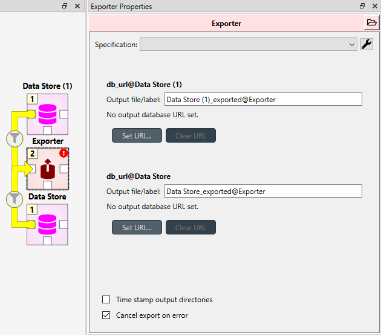

..  Importing and exporting data
    Created: 15.5.2019

.. _Importing and exporting data:

****************************
Importing and exporting data
****************************

.. note:: This section is a work in progress.

This section explains the different ways of importing and exporting data to and from a Spine database.

Excel
-----
In this section the excel import/export functionality is explained.

To import/export an excel file, select a **Data store** and open the **Tree view**.
Then select **File -> Import** or **File -> Export** from the main menu.

Format
~~~~~~

The excel files for import/export are formatted in the following way:

.. tip:: An easy way to get a excel template is to export an existing spine-database to excel.

Object classes:

.. image:: img/excel_object_sheet.png
   :align: center

Object timeseries:

.. image:: img/excel_object_sheet_timeseries.png
   :align: center

Relationship classes:

.. image:: img/excel_relationship_sheet.png
   :align: center

Relationship timeseries:

.. image:: img/excel_relationship_sheet_timeseries.png
   :align: center

When importing, all sheets with a valid format are imported, whereas sheets with invalid format are simply ignored.
When exporting all object classes and relationship classes are exported.
Only parameter values with timeseries data are exported in the timeseries format.

GAMS
----

.. note::
   You need to have GAMS installed to use this functionality.
   However, you do not need to own a GAMS license as the demo version works just as well.

.. note::
   The bitness (32 or 64bit) of GAMS has to match the bitness of the Python interpreter.

Databases can be exported to GAMS :literal:`.gdx` files by the *Exporter* project item.
When a project is executed, *Exporter* writes its output files to its data folder
and forwards file paths to project items downstream.
If a *Tool* is to use such a file, remember to add the file as one of the *Tool specification*'s input files!

The mapping between entities in a Spine database and GAMS is as follows:

====================== =========================
Database entity        GAMS entity
====================== =========================
Object class           Universal set (or domain)
Object                 Universal set member
Object parameter       Parameter
Relationship class     Subset of universal sets
Relationship           Subset member
Relationship parameter Parameter
====================== =========================

.. note::
   Currently, it is not possible to use subsets (relationship classes) as dimensions for other
   subsets due to technical limitations.
   For example, if there is a domain **A(*)** and a subset **foo(A)**,
   a subset of **foo** has to be expressed as **bar(A)** instead of **bar(foo)**.

It is also possible to designate a single object class as a *Global parameter*.
The parameters of the objects of that class will be exported as GAMS scalars.

Some GAMS models need their data to be in a specific order in the :literal:`.gdx`.
This is not directly supported by the database.
Rather, user has to specify the desired exporting order using the *Exporter* item's settings.

Exporter Project Item
~~~~~~~~~~~~~~~~~~~~~

The image below shows the settings tab of *Exporter* with two *Data Sources* connected to it.

For each connected *Data Store* a box with the database's URL and export file name field is shown on the tab.
The *Settings...* buttons open *Gdx Export settings* windows to allow editing database specific export parameters
such as the order in which entities are exported from the database.

.. image:: img/gdx_export_settings_window.png
   :align: center

The *Gdx Export settings* window (see above) contains a *Sets* list which shows all GAMS sets (gray background) and
subsets that are available in the database. The sets are exported in the order they are shown in the list.
The *Move Up* and *Move Down* buttons can be used to move the selected set around.
Note that you cannot mix sets with subsets so all sets always get exported before the subsets.

The checkbox next to the set name is used to control which sets are actually exported.
Note that it is not possible to change this setting for certain sets.
Global parameters domain is never exported, only its parameters which become GAMS scalars.
Further, sets created for *Indexed paramaters* are always exported.

The *Set Contents* box lists the members of the selected set or subset.
Their order of export can be changed the same way as with sets by *Move Up* and *Move Down*.
The *Alphabetic* button sorts the members alphabetically.

Time series and time patterns cannot be exported as-is. They need to be tied up to a GAMS set.
This can be achieved from the window that opens from the *Indexed parameters...* button.
See the `Exporting time series and patterns`_ section below for more information.

Finally, one of the sets can be designated as the global parameter set.
This is achieved by choosing the set's name in the *Global parameters domain* box.
Note that this set is not exported, only its parameters are. They end up as GAMS scalars.

Exporting time series and patterns
~~~~~~~~~~~~~~~~~~~~~~~~~~~~~~~~~~

Since GAMS has no notion of time series or time patterns these types need special handling when exported
to a :literal:`.gdx` file. Namely, the time stamps or time periods (i.e. parameter indexes) need be available
as GAMS sets in the exported file. It is possible to use an existing set or create a new one for this purpose.
The functionality is available in *Gdx Parameter Indexing Settings* window
accessible from the *Indexed Parameters...* button.

.. image:: img/gdx_export_parameter_indexing_window_using_existing_domain.png
   :align: center

The above figure shows the indexing settings when an existing GAMS set is used to replace the original
time stamps of a time series in a parameter called 'size'. The choice between using an existing set or
creating a new one can be changed by the *Use existing domain* and *Create new index domain* radio buttons.
When using an existing set it is selected by the combo box.
In the above figure, *ALL TS* set is used for indexing.

In case of existing set it is possible that not all the set's contents are used for indexing.
The table occupying the right side of the above figure shows which of the set's keys index which parameter values.
The first column contains the keys of the currently selected set whereas the other columns contain the parameter's
values, one column for each object that has the parameter.
Selecting and deselecting rows in the table changes the indexing as only the keys on selected rows are used to
index the parameter.
**Shift**, **ctrl** and **ctrl-A** help in manual selection.
If the selected indexes have certain pattern it might be useful to utilize the *Label picking expression* field
which selects the set keys using a Python expression returning a boolean value. Some examples:

====================================== ============================
Expression                             Effect
====================================== ============================
:literal:`i == 3`                      Select the third row only
:literal:`i % 2 == 0`                  Select even rows
:literal:`(i + 1) % 2 == 0 and i != 9` Select odd rows except row 9
====================================== ============================

The *Indexing domains* list allows to shuffle the order of the parameter's dimensions.
The **bold** dimension is the new dimension that is added to the parameter.
It can be moved around by the *Move Left* and *Move Right* buttons.

.. image:: img/gdx_export_parameter_indexing_window_using_new_domain.png
   :align: center

It is possible to create a new indexing set by choosing *Create new index domain* as shown in the figure above.
*Domain name* is mandatory for the new domain. A *Description* can also be provided but it is optional.
There are two options to generate the index keys: extract the time stamps or time periods from the parameter
itself or generate them using a Python expression.
The *Extract index from parameter* button can be used to extract the keys from the parameter.
The *Generator expression* field, on the other hand, is used to generate index keys for the new set.
The expression should return Python object that is convertible to string.
Below are some example expressions:

======================== ====================
Expression               Keys
======================== ====================
:literal:`i`             1, 2, 3,...
:literal:`f"{i - 1:04}"` 0000, 0001, 0002,...
:literal:`f"T{i:03}"`    T001, T002, T003,...
======================== ====================
