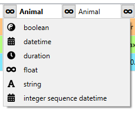
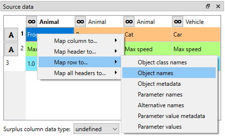
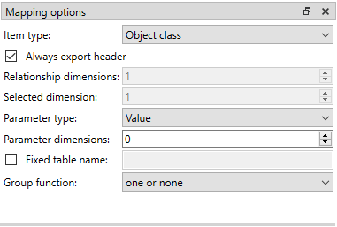
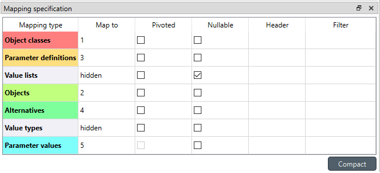

..  Importing and exporting data

.. |open-folder| image:: ../../spinetoolbox/ui/resources/menu_icons/folder-open-solid.svg
   :width: 16
.. |wrench| image:: ../../spinetoolbox/ui/resources/wrench.svg
   :width: 16

.. _Importing and exporting data:

****************************
Importing and Exporting Data
****************************

This section explains the different ways of importing and exporting data to and from a Spine database.

.. contents::
   :local:

Importing Data with Importer
****************************

Data importing is handled by the Importer project item
which can import tabulated and to some degree tree-structured data
into a Spine database from various formats.
An Importer lets you define *mappings* that map the input data to Spine data structure.
Importing is also available in **Spine database editor** from **File->Import...**
but it uses fixed mappings.
Even then using an Importer item is preferred because then the process is documented and repeatable.

A common use case for Importer is to transform data from one or more input files to a Data Store
as the first step in a workflow.
The files can be provided by one or more Data Connection items.

If importing multiple CSV files with differing contents, it might be beneficial to pack the files into a datapackage
by checking **Pack CSV file (as datapackage.json)** in the properties of the incoming link.
This way the files appear as a single source in Importer
where each file represents a separate table.

It might also be worth checking **Purge before writing** in the outgoing link.
This ensures that the target database gets cleaned before new data is imported.

If multiple Importers are to write to the same Data Store,
consider setting write indexes in the outgoing arrow.
This makes the process repeatable
and is crucial if the data imported by one of the Importers depends on data from another Importer.

Another common use case is to import the results of a data processing Tool to an output Data Store.
The Tool's specification has to have **Output files** specified so Importer knows what files to expect.

Again, if the Tool produces multiple CSV files, using a datapackage might a good option.

If no alternative is specified by Importer's mappings,
parameter values will be imported for a synthetic alternative,
name of which consists of the selected scenario and current time stamp.
This allows identification of the results by scenario and run time.
In this case there is no need set the target Data Store to be purged before writing.

Properties Dock
~~~~~~~~~~~~~~~

At the top of the **Properties** dock (or tab), there is a combo box and the |wrench| button
which you can use to select and modify the Importer's specification.

The **Available resources** pane lists files and database URLs provided by predecessor project items,
e.g Data Connections, that can be imported.
The items in the list can be checked and unchecked for import.

.. note::

   The mappings defined in Importer's specification are applied to each selected resource individually,
   meaning that the resources must be of the same input type and contain the same tables.
   For example, Excel files with different sheets and content need different Importers.

There is also the option to cancel the import if a non-fatal error occurs during execution and
three options for how to handle if some of the values that you are trying to import already exist in the target Data Store.
The three choices are:

*Keep existing*
    When this is selected, data that is already in the target Data Store will
    be kept and the new data the Importer tried to import is forgotten.

*Replace*
    This option means that the imported data replaces old data in the target Data Store.

*Merge indexes*
    This option works mostly like the *Replace* option,
    but for indexed values like maps, time series and arrays the behavior is a little different.
    With these value types the old index-value pairs in the target Data Store will be kept and the new value pairs will
    be appended to it. If an index that is going to get imported already exist, the new imported value will overwrite
    the old value.

Importer Specification Editor
~~~~~~~~~~~~~~~~~~~~~~~~~~~~~

The heart of Importer is the **Importer Specification Editor** window
in which the mappings from source data to Spine data are set up.
The editor window can be accessed
by the |wrench| button in Importer's Properties dock where existing specifications can also be selected,
or by double-clicking the item on the **Design View**.

When the specification editor is opened for an Importer without a specification, a list of supported
file formats or other data sources is presented.
If the Importer is connected to some data, it may have already selected
the proper connector and is only waiting for confirmation

When creating a Importer specification, it is usually helpful to have the data already connected to the Importer in
question so it is easier to visualize how the importer is handling the data.

In the upper part of the specification editor, the name and description for the specification can be set.

Underneath, a modifiable **Input file/URL** field is shown.
Importer reads table names and the data that is shown in the center pane from this input source.
Usually, you would use the Importer's actual input resource as the input source here,
but nothing stops you from building or viewing the mappings based on any other file or database.

Next to the input file/URL the input type is shown.
This can be changed from **Menu->Switch input type...**.
On the left side, the different tables the file has or that user has set up are shown.
In top center, there are input type specific options that apply to the currently selected table.
Below the options, a preview of the selected table is shown.
The items in the table are highlighted according to the selected mapping.
The selection is done from the table-specific mapping list in the right side of the editor.
Underneath the list, the to be imported item types can be specified and other options set for the selected mapping.
Below that you can select the specific places in the source data where the entity names, values etc. will be taken from.

.. image:: img/import_editor_window.png
   :align: center

All tables available in the source selected in **Input file/URL** are listed in the leftmost pane.
If the file does not have tables or the file type does not support them (e.g. CSV), all of the file's data will be
in a single table called 'data'.
The tables can be selected and deselected using the check boxes
and only the selected ones will be imported.
The option *Select All* is useful for selecting or deselecting all tables.
If the Importer is opened in `anonymous mode`_, there is also the option to add tables.
The tables are imported in the order show on the list.
The order can be changed by dragging and dropping the table names.

.. tip:: Multiple CSV files can be bundled into a *datapackage* which has its own input type in Importer.
   Specifically, each CSV file in the datapackage shows up as a separate table in the table list.
   See :ref:`Setting up datapackages in Links` for more information on how to pack CSVs into a datapackage
   automatically within your workflow.

Next to the table list, there is a small widget that allows to "format" the selected table.
The available options differ depending on the selected input type. The above picture shows some of the available
options for Excel files. **Max rows** specifies the amount of rows from the input data that are considered
by the Importer. The option **Has header** converts the first row into headers. **Skip rows** and **Skip columns**
skip the first *N* specified rows or columns from the table. If the table has empty rows or columns and some
other data after that that you don't want to use, **Read until empty row/column on first column/row** options
can be used to "crop" the imported data to the first relevant block of information. Other possible options for
different input types include **Encoding**, **Delimiter**, **Custom Delimiter**, **Quotechar** and
**Maximum Depth**. **Load default mapping** button sets all of the selections in the spec editor to their default values.
Be careful not to press this button unless you want to wipe the whole specification clean.

.. note:: If you are working on a specification and accidentally press the **Load default mapping** button
          you can undo previous changes for the specification from the hamburger menu or by pressing **Ctrl+Z**.
          To redo actions, or press **Crl+Y**.

When a table is selected, it's data and a preview of how the selected mapping will
import the data will be presented under the options widget. An important aspect of data import is
whether each item in the input data should be read as a string, a number,
a time stamp or something else. In other words, the importer should know the data types of the input data.
By default all input data is read as strings.
However, often things like parameter values are actually numbers.
Clicking the data type indicator button on column or row headers pops up a menu with a selection of available data types.
Right clicking the column/row header also gives the opportunity to change the data type of all columns/rows at once.
Below the preview table, the **Surplus column data type** allows selecting data type for the "rest"
of the columns if the tables have more columns when executing the importer.
This is often the case with pivoted data.

The input data should conform to the specified data type. For float (number) type the decimal separator 
should be the dot :literal:`.`.
For datetimes such as time stamps the recommended format is ISO8601 (e.g. ``2020-03-01T01:00``).
If non-ISO8601 format is 
detected, the importer falls back to the dateutil Python library which supports a lot of different formats.
However, it is slow and still, ambiguous formats can be interpreted wrongly.
For example, 01-03-2020 is interpreted as January 3, 2020.
If the source file is an Excel file, date cells are interpreted correctly although the way they are shown in
Excel can be ambiguous. For time durations you can use long units in the format ``x unit``, where x is an integer 
and unit is either ``year``, ``month``, ``day``, ``hour``, ``minute``, or ``second``. Plural forms of the unit
names can also be used. Alternative is short units 
in the format ``xU`` where x is an integer and U is either ``Y`` (for year), ``M`` (for month), ``D`` (for day), 
``h`` (for hour), ``m`` (for minute), or ``s`` (for second). 
Integer sequence datetimes allow converting integers into datetimes.  In this case the user has to specify the
time step and time of the first integer. 

Under **Mappings** you can manage mappings by adding new ones, removing or duplicating existing ones
and reordering by dragging and dropping.
Each table has it's own mappings and every mapping has its own options. In **Mappings** you can select the mapping
that you want to start modifying. Having multiple mappings for a single table allows to for example import
multiple item types at the same time from a single table in a file.

Underneath **Mappings** there are options that help the importer get a feel for what kind of data it will be importing.
The available *item type* options are *Entity class, Entity group, Alternative, Scenario,
Scenario alternative* and *Parameter value list*. The other available
options are dependent on the Item type.
*Parameter type* is used to specify what type of parameters, if any, the table contains. It has options
*Value, Definition* and *None*. If *Value* or *Definition* is selected
the value or respectively the default value type can be set from the *Value* drop-down list.
*Number of dimensions* sets the number of dimensions the entity to be imported has.
*Map dimensions* sets the number of map indexes when importing Map values.
*Read data from row* lets you specify the row where the importer
starts to read the data.
Note, that this is additive to the possible *Skip rows* option in the table-specific options above the preview table.
*Ignore columns* allows you to select individual columns that you want to exclude from the
whole importing process.
*Import entity alternatives* should be selected if the table contains entity alternative data.
*Import entities* allows to import the elements of N-dimensional entities
or members of entity groups.
It is off by default to prevent importing invalid entries due to e.g. typos in the table.
*Repeat time series* sets the repeat flag to true when importing time series.
*Compress Maps* can be set to compress Map values if their leaf values can be converted to time series.

Once everything in the before mentioned options is in order, the next step is to set the mapping specification.
Below the options there is the part where the decisions are made on how the input data is interpreted:
which row or column contains the entity class names, parameter values, time stamps and so on.
The table contains all of the targets that the selected mapping options specify.
Each target has a *Source type*, *Source ref.* and *Filter*. *Source type* specifies if the data for the target
is coming in the form of a column, row, table name etc. In the *Source ref.* section you can pinpoint the
exact row, column etc. to use as the data.
The available *Source types* and the corresponding interpretations of the *Source ref.* are listed in the table below.
The *Filter* section can be used to further specify which values to
include using regular expressions. More on regular expressions in section `Basic Regular Expressions for Filtering`_.

============= ========================== ============================================
Source type   Source ref.                Description
============= ========================== ============================================
Constant      data                       Import the data in *Source ref.*
Column        column number/name         Import from given column
Row           row number                 Import from given row; pivots the table
Column Header column number              Import specific column header
Headers       N/A                        Import from column headers
Table Name    N/A                        Import table name
Mapping Name  N/A                        Import mapping's name
Fixed         <table name>: <row>, <col> Import the value in the given table cell
Fixed         <row>, <col>               Same as above, <table name> is current table
None          N/A                        Not imported
============= ========================== ============================================

It might be helpful to fill in the *Source type* and *Source ref.* using the preview table.
Right clicking on the table cells shows a popup menu that lets one to configure where the selected row/column/header
is mapped to. It can also be used to simultaneously map all headers to one target.

.. _anonymous mode:

Anonymous Mode
~~~~~~~~~~~~~~

The importer specification editor can be opened in a mode where there is no input data available.
This might be useful when creating or modifying a generalized specification.
Anonymous mode can be entered when opening the specification of an Importer without incoming files or when
opening the spec editor from Toolbox **Main Toolbar**.

In anonymous mode new tables can be created by double clicking *<rename this to add table>*
and writing in a name for the new table. The preview will show an infinite grid of cells on which you
can create different mappings.

.. note:: You can exit the Anonymous mode by browsing to and selecting an existing file using the controls in
   **Input file/URL**.

Exporting Data with Exporter
****************************

Exporter writes database data into regular files that can be used by Tools and external software
that do not read the Spine database format. Various tabulated file formats are supported
some of which require specific export settings; see below for more details.

At its heart Exporter maps database items such as entity class or entity names to an output table.
Each item has a user given output **position** on the table, for example a column number.
By default data is mapped to columns but it is also possible to create pivot tables.

Exporter also uses specifications so the same configurations
can be reused by other exporters even in other projects.
The specification can be edited in **Exporter specification editor**
which is accessible by the |wrench| button in the item's **Properties** dock
or by double clicking Exporter's icon on the **Design View**.
A specification that is not associated with any specific Exporter project item can be created
and edited from the Main toolbar.

Properties Dock
~~~~~~~~~~~~~~~

Exporter's **Properties** dock controls project item specific settings
that are not part of the item's specification.

.. image:: img/exporter_properties.png
   :align: center

Specification used by the active Exporter item can be selected from the *Specification* combobox.
The |wrench| button opens **Exporter specification editor**
where it is possible to edit the specification.

Data Stores that are connected to the exporter and are available for export are listed below
the *Specification* combobox. An output label is required for each database and one Exporter
can't have the same output label for two different Data Stores at the same time. Two different
Exporters can have the same output label names since they are located in a different directories.
The default label for the output files is of the format ``<name of input Data Store>_exported@<name of Exporter>``.

Checking the *Time stamp output directories* box adds a time stamp to the item's output directories
preventing output files from being overwritten. This may be useful for debugging purposes.

The *Cancel export on error* checkbox controls whether execution bails out on errors
that may be otherwise non-fatal.

Exporter's data directory can be opened in system's file browser by the |open-folder| button.
The output files are written in data directory's :literal:`output` subdirectory.

Exporter Specification Editor
~~~~~~~~~~~~~~~~~~~~~~~~~~~~~

Specification editor is used to create **mappings** that define how data is exported to the output file.
Mappings define one or more tables and their contents but are otherwise output format agnostic.
Some output formats, e.g. SQL and gdx, interpret the tables in specific ways, however.
Other formats which inherently cannot write multiple tables into a single file,
such as CSV, may end up exporting multiple files.
See the sections below for format specific intricacies.

When opened for the first time Specification editor looks like in the image below.
The window is tabbed allowing multiple specifications to be edited at the same time.
Each tab consists of dock widgets which can be reorganized to suit the user's needs.
The 'hamburger' menu on the top right corner gives access to some important actions
such as *Save* and *Close*. *Undo* and *redo* can be found from the menu as well.
There is also a *Duplicate* option which creates a new tab in the spec editor that
is otherwise the same but has no name and is missing the database url under *Preview
controls*. This is handy if you want to create a new Exporter specification using an
existing template instead of always starting form the beginning.

.. image:: img/exporter_specification_editor.png
   :align: center

The only requirement for a specification is a name.
This can be given on the *Name* field field on the top bar.
The *Description* field allows for an additional explanatory text.
The current output format can be changed by the *Format* combobox on *Export options* dock.

Specification's mappings are listed in the *Mappings* dock widget shown below.
The *Add* button adds a new mapping while the *Remove* button removes selected mappings.
Mappings can be renamed by double clicking their names on the list.
The checkbox in front of mapping's name shows if the mapping is currently enabled.
Only enabled mappings are exported when the Exporter is executed.
Use the *Toggle enabled* button to toggle the enabled state of all mappings at once.

.. image:: img/exporter_mappings_dock.png
   :align: center

The tables defined by the mappings are written in the order shown on the mapping list's *Write order* column.
This may be important if the tables need to be in certain order in the output file
or when multiple mappings output to a single table.
Mappings can be sorted by their write order by clicking the header of the *Write order* column.
The *Write earlier* and *Write later* buttons move the currently selected mapping up and down the list.

.. image:: img/exporter_preview_docks.png
   :align: center

A preview of what will be written to the output is available in the preview dock widgets.
To enable it, check the *Live preview* checkbox.
A database connection is needed to generate the preview.
The *Preview controls* dock provides widgets to choose an existing database or to load one from a file.
Once a database is available and the preview is enabled the mappings and the tables they would output
are listed on the *Preview tables* dock.
Selecting a table from the list shows the table's contents on the *Preview contents* dock.

.. note:: The preview is oblivious of any filters possibly set up in the workflow.
   Therefore, it may show entries, e.g. parameter values, that would be filtered out during execution.

Mapping Options
---------------

The currently selected mapping is edited using the controls in *Mapping options* and *Mapping specification* docks.
The *Mapping options* dock contains controls that apply to the mapping as a whole, e.g. what data the output tables
contain. It is important to choose *Item type* correctly since it determines what database items the mapping outputs
and also dictates the mapping types that will be visible in the *Mapping specification* dock widget. It has options
*Entity class, Entity class with dimension parameter, Entity group, Alternative, Scenario,
Scenario alternative* and *Parameter value list*. The rest of the
options besides *Group function* are item type specific and may not be available for all selections.

Checking the *Always export header* checkbox outputs a table that has fixed headers even if the table is
otherwise empty. If *Item type* is Entity class, the *Entity dimensions* spinbox can be used
to specify the maximum number of entity's dimensions that the mapping is able to handle.
*Selected dimensions* option is only available for the *Entity class with dimension parameter* item
type and it is used to specify the entity dimension where the entity parameters are selected from.
Parameters can be outputted by choosing their value type using the *Parameter type* combobox. The *Value*
choice adds rows to *Mapping specification* for parameter values associated with individual entities while
*Default value* allows outputting parameters' default values. The maximum number of value dimensions in
case of indexed values (time series, maps, time patterns, arrays) the mapping can handle is controlled
by the *Parameter dimensions* spinbox. The *Fixed table name* checkbox enables giving a user defined
table name to the mapping's output table. In case the mapping is pivoted and *Mapping specification*
contains items that are *hidden*, it is possible that a number of data elements end up in the same
output table cell. The *Group function* combobox offers some basic functions to aggregate such data
into the cells.

Mapping Specification
---------------------

*Mapping specification* contains a table which defines the structure of the mapping's output tables.
Like mentioned before, the contents of the table depends on choices on *Mapping options*,
e.g. the item type, parameter type or dimensions.
Each row corresponds to an item in the database: entity class names, entity names, parameter values etc.
The item's name is given in the *Mapping type* column.
The colors help to identify the corresponding elements in the preview.

The *Map to* column defines the **position** of the item,
that is, where the item is written or otherwise used when the output tables are generated.
By default, a plain integral number in this column means that the item is written to that column in the output table.
From the other choices, *hidden* means that the item will not show on the output.
*Table name*, on the other hand, uses the item as output table names.
For example, outputting entity classes as table names will generate one new table for every entity class
in the database, each named after the class.
Each table in turn will contain the parameters and entities of the table's entity class.
If multiple mappings generate a table with a common name then each mapping appends to the same table
in the order specified by the *Write order* column on *Mappings* dock.

The *column header* position makes the item a column header for a **buddy item**.
Buddy items have some kind of logical relationship with their column header,
for instance the buddy of an entity class is its entities;
setting the entity class to *column header* will write the name of the class as the entity's column header.

.. note::
   Currently, buddies are fixed and defined only for a small set database items.
   Therefore, *column header* will not always produce sensible results.

Changing the column and pivot header row positions leaves sometimes gaps in the output table.
If such gaps are not desirable the **Compact** button reorders the positions by removing the gaps.
This may be useful when the output format requires such gapless tables.

The checkboxes in *Pivoted* column on the *Mapping specification* dock toggle the mapping into pivoted mode.
One or more items on the table can be set as pivoted.
They then act as a pivot header for the data item which is the last non-hidden item on the list.
Once checked as pivoted, an item's position column defines a pivot header row instead of output column.

By default a row ends up in the output table only when all mapping items yield some data.
For example, when exporting entity classes and entities, only classes that have entities get written to output.
However, sometimes it is useful to export 'empty' entity classes as well.
For this purpose a mapping can be set as **nullable** in the *Nullable* column.
Continuing the example, checking the *Nullable* checkbox for *Entities* would produce an output table with
all entity classes including ones without entities.
The position where entities would normally be outputted are left empty for those classes.

Besides the *column header* position it is possible to give fixed column headers to items
using the *Header* column in *Mapping specification* dock.
Note that checking the *Always export header* option in the *Mapping options* dock outputs the fixed headers
even if there is no other data in a table.

The *Mapping specification* dock's *Filter* column provides refined control on which database items the mapping outputs.
The column uses regular expressions (see section `Basic Regular Expressions for Filtering`_)
to filter what gets outputted.

CSV and Multiple Tables
~~~~~~~~~~~~~~~~~~~~~~~

CSV files are flat text files and therefore do not directly support multiple tables.
Instead, multiple tables are handled as separate output files.

Only mappings that output an **anonymous table**
actually write to the file/label specified on the Exporter's properties dock.
Named tables get written to files named after the table plus the :literal:`.csv` extension.
For example, a table named :literal:`node` would result in a file called ``node.csv``.

SQL Export
~~~~~~~~~~

To set up export to a remote database, first an Exporter specification with SQL selected as the format needs
to be saved. The Exporter needs to also be connected to some input Data Store. From the Exporters **Properties**
dock widget an output database can be specified for each input Data Store respectively by clicking the **Set URL...**
button. A small new window opens with a few settings to set up the output database. Currently only mysql and sqlite
are supported, even though mssql, postgresql and oracle are also listed as options for the dialect. Once a URL is set
it can be removed by pressing the **Clear URL** button on the **Properties** tab.

.. image:: img/select_url_for_remote_db_export.png
   :align: center

The SQL backend writes the tables to the target database in a relatively straightforward way:

* Tables are named after the table name provided by the mappings. **Anonymous tables** are not supported.
* The first row of each table is used as column names in the database. Thus, each column in a mapping should
  have a fixed header or a header produced by an item set to *column header* position.
* Column data types are sniffed from the second row. Empty values or a missing row result in string type.
* There must be an item assigned to each column. Empty columns confuse the SQL backend.
* Pivot tables do not generally make sense with the SQL backend
  unless the resulting table somehow follows the above rules.

GAMS GDX Export
~~~~~~~~~~~~~~~

.. note::
   You need to have GAMS installed to use this functionality.
   However, you do not need to own a GAMS license as the demo version works just as well.
   See :ref:`Setting up Consoles and External Tools` for more information.

The gdx backend turns the output tables to GAMS sets, parameters and scalars following the rules below:

* Table names correspond the names of sets, parameters and scalars.
  Thus, **anonymous tables** are not supported.
* There must be an item assigned to each column. Empty columns confuse the gdx backend.
* Pivot tables do not generally make sense with the gdx backend
  unless the resulting table somehow follows the rules listed here.

**Sets:**

* Everything that is not identified as parameter or scalar is considered a GAMS set.
* Each column corresponds to a dimension.
* The first row is used to name the dimension's domain. Thus, each column in a mapping should
  have a fixed header or a header produced by an item set to *column header* position.
  Note that :literal:`*` is a valid fixed header and means that the dimension has no specific domain.

**Parameters:**

* A table that contains no header in the last (rightmost) column is considered a GAMS parameter.
* The last column should contain the parameter's values while the other columns contain the values' dimension.
* Dimensions' domains are taken from the header row, see **Sets** above.
  Note, that the value column must not have a header.

**Scalars:**

* A table that contains a numerical value in the top left cell is considered a GAMS scalar.
  Everything else (except the table name) is ignored.
* The data in the top left cell is the scalar's value.

The following conversions are done for GAMS special values:

==================  ====================================================
GAMS special value  Original value
==================  ====================================================
+Inf                IEEE 754 infinity
-Inf                Negative IEEE 754 infinity
Eps                 2.2250738585072014e-308, 1e-10 or the string ``EPS``
==================  ====================================================

.. _Basic Regular Expressions for Filtering:

Basic Regular Expressions for Filtering
***************************************

See regular expressions on `wikipedia <https://en.wikipedia.org/wiki/Regular_expression>`_ and on
Python's `documentation <https://docs.python.org/3/library/re.html#regular-expression-syntax>`_.
Both the Exporter and Importer have applications for regular expressions in their respective
*Mapping specifications* dock widgets. Below are examples on how to create some basic filters
for these applications.

*Single item*
    Writing the item's name to the field filters out all other items.
    For example, to output the entity class called 'node' only, write :literal:`node` to the *Filter* field.

*OR operator*
    The vertical bar :literal:`|` serves as the OR operator.
    :literal:`node|unit` as a filter for entity classes would output classes named 'node' and 'unit'.

*Excluding an item*
    While perhaps not the most suitable task for regular expressions it is still possible to 'negate' a filter.
    As an example, :literal:`^(?!node)` excludes all item names that start with 'node'.
