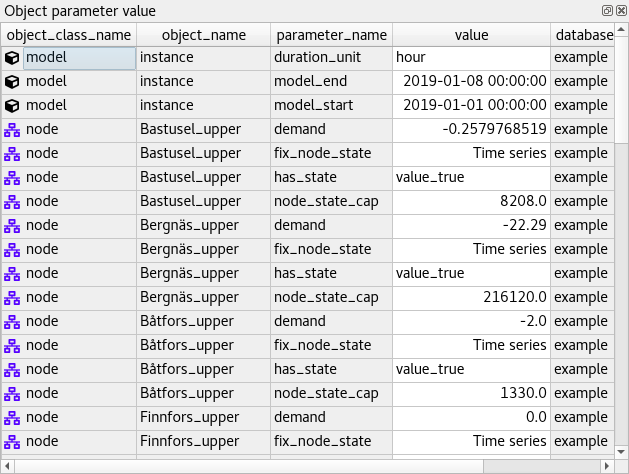
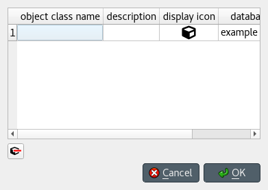

.. _Data store form:

***************
Data store form
***************

This section describes the *Data store form*, that you can use to visualize and edit data in
one or more Spine databases.

.. contents::
   :local:

Launching the form
------------------

From Spine Toolbox
==================

To open a single database in the *Data store form*:

1. Create a *Data Store* project item.
2. Select the *Data Store*.
3. Enter the url of the database in *Data Store Properties*.
4. Press the **Open form** button in *Data Store Properties*.

To open multiple databases in the *Data store form*:

1. Repeat steps 1 to 3 above for each database.
2. Create a *View* project item.
3. Connect each *Data Store* item to the *View* item.
4. Select the *View* item.
5. Press **Open DS form** in *View Properties*.

From the command line
=====================

To open a single SQLite database in the *Data store form*, use the ``open_ds_form.py`` script in the ``bin`` folder::

    open_ds_form.py "...path of the database file..."

Using the UI
------------

The form has the following main UI components:

- *Entity trees* (*Object tree* and *Relationship tree*): 
  They present the structure of classes and entities in all databases in the shape of a tree.
- *Stacked tables* (*Object parameter value*, *Object parameter definition*, 
  *Relationship parameter value*, and *Relationship parameter definition*): 
  they present object and relationship parameter data in the form of stacked tables.
- *Pivot table* and *Frozen table*: They present data for a given class in the form of a pivot table,
  optionally with frozen dimensions.
- *Entity graph*: it presents the structure of classes and entities in the shape of a graph.
- *Parameter value list*: it presents parameter value lists available in the database.
- *Parameter tag toolbar*: it presents parameter tags defined in the database.

.. tip:: You can show or hide form components using the *View* menu,
   or select among three predefined layout styles: Stacked style, Pivot style, and Graph style.

Viewing data
------------

This section describes the available tools to view data.

Viewing entities and classes
============================

Using *Entity trees*
~~~~~~~~~~~~~~~~~~~~

*Entity trees* present the structure of classes and entities in all databases in the shape of a tree:

.. image:: img/data_store_form/object_tree.png
   :align: center

What is shown in the trees depends on the items you expand or collapse. In *Object tree*:

- To view all object classes from all databases,
  expand the root item (automatically expanded when loading the form).
- To view all objects of a class, expand the corresponding object class item.
- To view all relationship classes involving an object class, expand any objects of that class.
- To view all relationships of a class involving a given object,
  expand the corresponding relationship class item under the corresponding object item.

In *Relationship tree*:

- To view all relationship classes from all databases, 
  expand the root item (automatically expanded when loading the form).
- To view all relationships of a class, 
  expand the corresponding relationship class item.

.. note:: To expand an item in *Object tree* or *Relationship tree*, 
   double-click on the item or press the right arrow while it's active.
   Items in gray don't have any children, thus they cannot be expanded.
   To collapse an expanded item, double-click on it again or press the left arrow while it's active.

.. tip:: To expand or collapse an item and all its descentants in *Object tree* or *Relationship tree*, 
   right click on the item to display the context menu, and select **Fully expand** or **Fully collapse.**

.. tip:: In *Object tree*, the same relationship appears in many places (as many as it has dimensions). 
   To jump to the next ocurrence of a relationship item, either double-click on the item,
   or right-click on it to display the context menu, and select **Find next**.

Using *Entity graph*
~~~~~~~~~~~~~~~~~~~~

*Entity graph* presents the structure of classes and entities from one database in the shape of a graph:

.. image:: img/data_store_form/entity_graph.png
   :align: center

Building the graph
******************

To build the graph, select any number of items in either *Object tree* or *Relationship tree*.
What is included in the graph depends on the specific selection you make:

- To include all objects and relationships from the database,
  select the root item in either *Object tree* or *Relationship tree*.
- To include all objects of a class, select the corresponding class item in *Object tree*.
- To include all relationships of a class, select the corresponding class item in *Relationship tree*.
- To include all relationships of a specific class involving a specific object,
  select the corresponding relationship class item under the corresponding object item in *Object tree*.
- To include specific objects or relationships,
  select the corresponding item in either *Object tree* or *Relationship tree*

.. note:: In *Entity graph*, a small unnamed vertex represents a relationship,
   whereas a bigger named vertex represents an object. An arc between a relationship and an object
   indicates that the object is a member in that relationship.

Whenever *all* member objects in a relationship are included in the graph,
the graph automatically includes the relationship
(even if it's not selected in *Object tree* or *Relationship tree*).

*Entity graph* also supports *Full relationship expansion*, i.e.,
whenever an object is included in the graph, the graph automatically includes *all* its relationships.
You can enable or disable **Full relationship expansion** via the **Graph** menu,
or via *Entity graph*'s context menu.

.. note:: To *extend* the selection in *Object tree* or *Relationship tree*, press and hold the **Ctrl** key
   while clicking on additional items.

.. tip:: *Object tree* and *Relationship tree* also support **Sticky selection**, i.e., 
   extending the selection by clicking on the items *without pressing Ctrl*.
   To enable **Sticky selection**, go to **File -> Settings** and check the corresponding box.

.. note:: At the moment, *Entity graph* only shows data from the first database open in the form.

Manipulating the graph
**********************

You can move items in the graph by dragging them with your mouse.
To make relationship items stay in the same relative position with respect to their member objects,
go to **File -> Settings** and check the box next to, *Move relationships along with objects in Entity graph*.

To save the position of items into the database,
select the items in the graph and then choose **Graph -> Save positions** from the menu bar.
To clear saved positions, select the items again and choose **Graph -> Clear saved positions**.

To hide part of the graph, select the items you want to hide and then choose **Graph -> Hide selected**.
To show the hidden items again, select **Graph -> Show hidden**.

To prune the graph, select the items you want to prune and then choose **Graph -> Prune selected entities**
or **Prune selected classes**.
To restore specific prunned items,
go to **Graph -> Restore prunned** and select the items you want to restore from the popup menu.
To restore all prunned items, select **Graph -> Restore all prunned**.

.. note:: *Entity graph* supports extended selection and rubber-band selection.
   To extend a selection, press and hold **Ctrl** while clicking on the items.
   To perform rubber-band selection, press and hold **Ctrl** while dragging your mouse
   around the items you want to select.

.. note:: Prunned items are remembered across graph builds.

To zoom in and out, scroll your mouse wheel over *Entity graph* or use the buttons in **Graph -> Zoom**.
To rotate clockwise or anti-clockwise, press and hold the **Shift** key while scrolling your mouse wheel,
or use the buttons in **Graph -> Rotate**.

Viewing parameter definitions and values
========================================

Using *Stacked tables*
~~~~~~~~~~~~~~~~~~~~~~

*Stacked tables* present object and relationship parameter data from all databases in the form of stacked tables:

To filter *Stacked tables* by any entities and/or classes,
select the corresponding items in either *Object tree*, *Relationship tree*, or *Entity graph*.
To remove filters, select the root item in either *Object tree* or *Relationship tree*.

To filter parameter definitions and values by certain parameter tags, 
select those tags in the *Parameter tag toolbar*.

To apply a custom filter on a *Stacked table*, click on any horizontal header.
A menu will pop up listing the items in the corresponding column;
check the ones you want to see and press **Ok**.
Additionally, you can type in the search bar at the top of the menu to filter the list of items.
To remove the current filter, select **Remove filters**.

To filter a *Stacked table* according to a selection of items,
right-click on the selection to show the context menu,
and then select **Filter by** or **Filter excluding**.
To remove these filters, select *Remove filters* from the header menus of the filtered columns.

.. tip:: You can rearrange columns in *Stacked tables* by dragging the headers with your mouse.
   The ordering will be remembered the next time you open the Data store form.

Viewing parameter values and relationships
==========================================

.. _using_pivot_table_and_frozen_table:

Using *Pivot table* and *Frozen table*
~~~~~~~~~~~~~~~~~~~~~~~~~~~~~~~~~~~~~~

*Pivot table* and *Frozen table* present data for an individual class from one database in the form of a pivot table,
optionally with frozen dimensions:

.. image:: img/data_store_form/pivot_table.png
   :align: center

To populate the tables with data for a certain class,
just select the corresponding class item in either *Object tree* or *Relationship tree*.

Selecting the input type
************************

*Pivot table* and *Frozen table* support three different input types:

- **Parameter value** (the default): it shows objects and parameter definitions in the headers,
  and corresponding parameter values in the table body.
- **Index expansion**: Similar to the above, but it also shows parameter indexes in the headers.
  Indexes are extracted from special parameter values, such as time-series.
- **Relationship**: it shows objects in the headers, and corresponding relationships in the table body.
  It only works when selecting a relationship class in *Relationship tree*.

You can select the input type from the **Pivot table** menu in the menu bar.

.. note:: In *Pivot table*,
   header blocks in the top-left area indicate what is shown in each horizontal and vertical header.
   For example, in **Parameter value** input type, by default,
   the horizontal header has a single row listing parameter names,
   whereas the vertical header has one or more columns listing object names.

Pivoting and freezing
*********************

To pivot the data, drag a header block across the top-left area of the table.
You can turn a horizontal header into a vertical header and viceversa,
as well as rearrange headers vertically or horizontally.

To freeze a dimension, drag the corresponding header block from *Pivot table* into *Frozen table*.
To unfreeze a frozen dimension, just do the opposite.

.. note:: Your pivoting and freezing selections for any class will be remember when switching to another class.

Filtering
*********

To apply a custom filter on *Pivot table*, click on the arrow next to the name of any header block.
A menu will pop up listing the items in the corresponding row or column;
check the ones you want to see and press **Ok**.
Additionally, you can type in the search bar at the top of the menu to filter the list of items.
To remove the current filter, select **Remove filters**.

To filter the pivot table by an individual vector across the frozen dimensions,
select the corresponding row in *Frozen table*.

.. note:: At the moment, *Pivot table* shows data for only one class at the time,
   and only for the first database open in the form.

Viewing parameter value lists
=============================

You can find parameter value lists from all databases in *Parameter value list*:

.. image:: img/data_store_form/parameter_value_list.png
   :align: center

To view the parameter value lists from each database, 
expand the corresponding top-level item in *Parameter value list*.
To view the values for each list, expand the corresponding list item.

Viewing parameter tags
======================

You can find parameter tags from all databases in *Parameter tag toolbar*:

.. image:: img/data_store_form/parameter_tag_toolbar.png
   :align: center

Adding data
-----------

This section describes the available tools to add new data.

Adding object classes
=====================

Using *Add object classes* dialog
~~~~~~~~~~~~~~~~~~~~~~~~~~~~~~~~~

Do one of the following:

- Select **Edit -> Add object classes**.
- Right-click on the root item in *Object tree* to display the context menu, and select **Add object classes**.

The *Add object classes* dialog will pop up:

Enter the names of the classes you want to add under the *object class name* column. 
Optionally, you can enter a description for each class under the *description* column.
To select icons for your classes, double click on the corresponding cell under the *display icon* column.
Finally, select the databases where you want to add the classes under *databases*.
When you're ready, press **Ok**.

Adding objects
==============

Using *Add objects* dialog
~~~~~~~~~~~~~~~~~~~~~~~~~~

Do one of the following:

- Select **Edit -> Add objects**.
- Right-click on an object class item in *Object tree* to display the context menu, 
  and select **Add objects**.

The *Add objects* dialog will pop up:

.. image:: img/data_store_form/add_objects_dialog.png
   :align: center

Enter the names of the object classes under *object class name*, and the names of the objects under *object name*.
To display a list of available classes, start typing or double click on any cell under the *object class name* column.
Optionally, you can enter a description for each object under the *description* column.
Finally, select the databases where you want to add the objects under *databases*.
When you're ready, press **Ok**.

Using *Pivot table*
~~~~~~~~~~~~~~~~~~~
To add an object to a specific class, bring the class to *Pivot table* using any input type
(see :ref:`using_pivot_table_and_frozen_table`).
Then, enter the object name in the last cell of the header corresponding to that class.

Adding relationship classes
===========================

Using *Add relationship classes* dialog
~~~~~~~~~~~~~~~~~~~~~~~~~~~~~~~~~~~~~~~

Do one of the following:

- Select **Edit -> Add relationship classes**. 
- Right-click on an object class item in *Object tree* to display the context menu, 
  and select **Add relationship classes**. 
- Right-click on the root item in *Relationship tree* to display the context menu,
  and select **Add relationship classes**. 

The *Add relationship classes* dialog will pop up:

.. image:: img/data_store_form/add_relationship_classes_dialog.png
   :align: center

Select the number of dimensions using the spinbox at the top;
then, enter the names of the object classes for each dimension under *object class name (dim)*,
and the names of the relationship classes under *relationship class name*.
To display a list of available object classes, 
start typing or double click on any cell under the *object class name* columns.
Optionally, you can enter a description for each relationship class under the *description* column.
Finally, select the databases where you want to add the relationship classes under *databases*.
When you're ready, press **Ok**.

Adding relationships
====================

Using *Add relationships* dialog
~~~~~~~~~~~~~~~~~~~~~~~~~~~~~~~~

Do one of the following:

- Select **Edit -> Add relationships**. 
- Right-click on a relationship class item in *Object tree* or *Relationship tree*
  to display the context menu, and select **Add relationships**.

The *Add relationships* dialog will pop up:

.. image:: img/data_store_form/add_relationships_dialog.png
   :align: center

Select the relationship class from the combo box at the top;
then, enter the names of the objects for each member object class under the corresponding column,
and the name of the relationship under *relationship name*.
To display a list of available objects for a member class, 
start typing or double click on any cell under that class's column.
Finally, select the databases where you want to add the relationships under *databases*.
When you're ready, press **Ok**.

Using *Pivot table*
~~~~~~~~~~~~~~~~~~~
To add a relationship for a specific class, 
bring the class to *Pivot table* using the **Relationship** input type
(see :ref:`using_pivot_table_and_frozen_table`).
The *Pivot table* headers will be populated
with all possible combinations of objects across the member classes.
Locate the objects you want as members in the new relationship,
and check the corresponding box in the table body.

Using *Entity graph*
~~~~~~~~~~~~~~~~~~~~
Make sure all the objects you want as members in the new relationship are in the graph.
To start the relationship, either double click on one of the objects,
or right click to display the context menu and choose **Add relationships**.
A menu will pop up showing the available relationship classes.
Select the class you want; the mouse cursor will adopt a cross-hairs shape.
Click on each of the remaining member objects one by one to make the relationships.

.. tip:: All the dialogs to add items support pasting tabular (spreadsheet) data from the clipboard.
   Just select any cell in the table and press **Ctrl+V**. 
   If needed, the table will grow to accommodate the exceeding data.
   To paste data on multiple cells, select all the cells you want to paste on and press **Ctrl+V**.

Adding parameter definitions
============================

Using *Stacked tables*
~~~~~~~~~~~~~~~~~~~~~~

To add new parameter definitions for an object class,
just fill the last empty row of *Object parameter definition*.
Enter the name of the class under *object_class_name*, and the name of the parameter under *parameter_name*.
To display a list of available object classes, 
start typing or double click on the cell under the *object_class_name* column.
Optionally, you can also specify a default value, a parameter value list, or any number of parameter tags
under the appropriate columns.
The parameter is added when the background of the *object_class_name*
and *parameter_name* cells become gray.

To add new parameter definitions for a relationship class,
just fill the last empty row of *Relationship parameter definition*,
following the same guidelines as above.

Using *Pivot table*
~~~~~~~~~~~~~~~~~~~

To add a new parameter definition for a class,
bring the corresponding class to *Pivot table* using the **Parameter** input type
(see :ref:`using_pivot_table_and_frozen_table`).
*Pivot table* will be populated with parameter value data for the class.
Then, enter the name of the new parameter in the last cell of the *parameter* header.

Adding parameter values
=======================

Using *Stacked tables*
~~~~~~~~~~~~~~~~~~~~~~

To add new parameter values for an object,
just fill the last empty row of *Object parameter value*.
Enter the name of the class under *object_class_name*, the name of the object under *object_name*,
and the name of the parameter under *parameter_name*.
Optionally, you can also specify the parameter value right away under the *value* column.
To display a list of available object classes, objects, or parameters,
start typing or double click on the cell under the appropriate column.
The parameter is added when the background of the *object_class_name*,
*object_name*, and *parameter_name* cells become gray.

To add new parameter values for a relationship class,
just fill the last empty row of *Relationship parameter value*,
following the same guidelines as above.

.. note:: To add parameter values for an object, the object has to exist beforehand.
   However, when adding parameter values for a relationship, you can specify any valid combination
   of objects under *object_name_list*, and a relationship will be created among those objects
   if one doesn't yet exist.

Using *Pivot table*
~~~~~~~~~~~~~~~~~~~

To add parameter value for any object or relationship,
bring the corresponding class to *Pivot table* using the **Parameter** input type
(see :ref:`using_pivot_table_and_frozen_table`).
Then, enter the parameter value in the corresponding cell in the table body.

.. tip:: All *Stacked tables* and *Pivot table* support pasting tabular (spreadsheet) data from the clipboard.
   Just select any cell in the table and press **Ctrl+V**. 
   If needed, *Stacked tables* will grow to accommodate the exceeding data.
   To paste data on multiple cells, select all the cells you want to paste on and press **Ctrl+V**.

Adding parameter value lists
============================

To add a new parameter value list, just enter the name of the list in the last row of
*Parameter value list*, under the corresponding database item.

To add new values for the list, enter the values in the rows under the corresponding
list item.

.. note:: To be actually added to the database, a parameter value list must have at least two values.

Updating data
-------------

This section describes the available tools to update existing data.

Updating entities and classes
=============================

Using *Edit items* dialogs
~~~~~~~~~~~~~~~~~~~~~~~~~~

Select any number of entity and/or class items in *Object tree*
or *Relationship tree*, or any number of object and/or relationship items in *Entity graph*.
Then do one of the following:

- Select **Edit -> Edit selected items** from the menu bar.
- Right-click on the selection to bring the context menu, and select **Edit selected items**.

One separate *Edit items* dialog will pop up for each selected entity or class type,
and the tables will be filled with the current data of selected items. E.g.:

.. image:: img/data_store_form/edit_object_classes_dialog.png
   :align: center

Modify the field(s) you want under the corresponding column(s).
Specify the databases where you want to apply the modifications for each item
under the *databases* column.
When you're ready, press **Ok**.

Using *Pivot table*
~~~~~~~~~~~~~~~~~~~

To rename an object of a specific class, bring the class to *Pivot table* using any input type
(see :ref:`using_pivot_table_and_frozen_table`).
Then, just edit the appropriate cell in the corresponding class header.

Updating parameter definitions and values
=========================================

Using *Stacked tables*
~~~~~~~~~~~~~~~~~~~~~~

To update parameter data, just go to the appropriate *Stacked table* and edit the corresponding row.

Using *Pivot table*
~~~~~~~~~~~~~~~~~~~

To rename parameter definitions for a class,
bring the corresponding class to *Pivot table* using the **Parameter** input type
(see :ref:`using_pivot_table_and_frozen_table`).
Then, just edit the appropriate cell in the `parameter` header.

To modify parameter values for an object or relationship,
bring the corresponding class to *Pivot table* using the **Parameter** input type
(see :ref:`using_pivot_table_and_frozen_table`).
Then, just edit the appropriate cell in the table body.

Updating parameter value lists
==============================

To rename parameter value list, just edit the appropriate row in *Parameter value list.*

Removing data
-------------

This section describes the available tools to remove data.

Removing entities and classes
=============================

Using *Remove items* dialog
~~~~~~~~~~~~~~~~~~~~~~~~~~~

Select the items in *Object tree* or *Relationship tree* corresponding to the entities and classes
you want to remove.
Then do one of the following:

- Select **Edit -> Remove selected items** from the menu bar.
- Right-click on the selection to bring the context menu, and select **Remove selected items**.
- Press **Ctrl + Del**.

The *Remove items* dialgo will popup:

.. image:: img/data_store_form/remove_entities_dialog.png
   :align: center

Specify the databases from where you want to remove each item
under the *databases* column.
When you're ready, press **Ok**.

Using *Entity graph*
~~~~~~~~~~~~~~~~~~~~

Select the items in *Entity graph* corresponding to the objects and/or relationships you want to remove.
Then do one of the following:

- Select **Edit -> Remove selected items** from the menu bar.
- Press **Ctrl + Del**.

Using *Pivot table*
~~~~~~~~~~~~~~~~~~~
Select the cells in *Pivot table* headers corresponding to the object and/or relationships you want to remove.
Then do one of the following:

- Select **Edit -> Remove selected items** from the menu bar.
- Right-click on the selection to bring the context menu, then select **Remove object(s)** or **Remove relationship(s)**.
- Press **Ctrl + Del**.

.. Removing parameter definitions and values
.. =========================================
.. Managing data
.. -------------
.. This section describes the available tools to manage data, i.e., adding, updating or removing at the same time.
.. Managing parameter tags
.. =======================

Committing and rolling back
---------------------------

Changes are not immediately saved to the database(s). They need to be committed separately.
To do that, select **Session -> Commit** from the menu bar, enter a commit message and press **Commit**.
Any changes made in the current session with the form will be saved into the database.

To undo any changes since the last commit, select **Session -> Rollback** from the menu bar.

.. Advanced
.. --------

.. Entering parameter values of special type
.. =========================================

.. Plotting parameter values
.. =========================