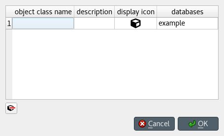
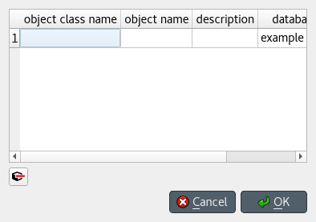

Adding data
-----------

This section describes the available tools to view data.

.. contents::
   :local:

This section describes the available tools to add new data.

Adding object classes
=====================

Using *Add object classes* dialog
~~~~~~~~~~~~~~~~~~~~~~~~~~~~~~~~~

Choose one:

- Select **Edit -> Add object classes**.
- Right-click on the root item in *Object tree* to display the context menu, and select **Add object classes**.

The *Add object classes* dialog will pop up:

Enter the names of the classes you want to add under the *object class name* column. 
Optionally, you can enter a description for each class under the *description* column.
To select icons for your classes, double click on the corresponding cell under the *display icon* column.
Finally, select the databases where you want to add the classes under *databases*.
When you're ready, press **Ok**.

Adding objects
==============

Using *Add objects* dialog
~~~~~~~~~~~~~~~~~~~~~~~~~~

Choose one:

- Select **Edit -> Add objects**.
- Right-click on an object class item in *Object tree* to display the context menu, 
  and select **Add objects**.

The *Add objects* dialog will pop up:

Enter the names of the object classes under *object class name*, and the names of the objects under *object name*.
To display a list of available classes, start typing or double click on any cell under the *object class name* column.
Optionally, you can enter a description for each object under the *description* column.
Finally, select the databases where you want to add the objects under *databases*.
When you're ready, press **Ok**.

Using *Pivot table*
~~~~~~~~~~~~~~~~~~~
To add an object to a specific class, bring the class to *Pivot table* using any input type
(see :ref:`using_pivot_table_and_frozen_table`).
Then, enter the object name in the last cell of the header corresponding to that class.

Duplicating objects
~~~~~~~~~~~~~~~~~~~

To duplicate an existing object with all its relationships and parameter values,
right-click over the corresponding object item in *Object tree* to display the context menu,
and select **Duplicate object**. Enter a name for the duplicate and press **Ok**.

Adding relationship classes
===========================

Using *Add relationship classes* dialog
~~~~~~~~~~~~~~~~~~~~~~~~~~~~~~~~~~~~~~~

Choose one:

- Select **Edit -> Add relationship classes**. 
- Right-click on an object class item in *Object tree* to display the context menu, 
  and select **Add relationship classes**. 
- Right-click on the root item in *Relationship tree* to display the context menu,
  and select **Add relationship classes**. 

The *Add relationship classes* dialog will pop up:

.. image:: img/add_relationship_classes_dialog.png
   :align: center

Select the number of dimensions using the spinbox at the top;
then, enter the names of the object classes for each dimension under *object class name (dim)*,
and the names of the relationship classes under *relationship class name*.
To display a list of available object classes, 
start typing or double click on any cell under the *object class name* columns.
Optionally, you can enter a description for each relationship class under the *description* column.
Finally, select the databases where you want to add the relationship classes under *databases*.
When you're ready, press **Ok**.

Adding relationships
====================

Using *Add relationships* dialog
~~~~~~~~~~~~~~~~~~~~~~~~~~~~~~~~

Choose one:

- Select **Edit -> Add relationships**. 
- Right-click on a relationship class item in *Object tree* or *Relationship tree*
  to display the context menu, and select **Add relationships**.

The *Add relationships* dialog will pop up:

.. image:: img/add_relationships_dialog.png
   :align: center

Select the relationship class from the combo box at the top;
then, enter the names of the objects for each member object class under the corresponding column,
and the name of the relationship under *relationship name*.
To display a list of available objects for a member class, 
start typing or double click on any cell under that class's column.
Finally, select the databases where you want to add the relationships under *databases*.
When you're ready, press **Ok**.

Using *Pivot table*
~~~~~~~~~~~~~~~~~~~
To add a relationship for a specific class, 
bring the class to *Pivot table* using the **Relationship** input type
(see :ref:`using_pivot_table_and_frozen_table`).
The *Pivot table* headers will be populated
with all possible combinations of objects across the member classes.
Locate the objects you want as members in the new relationship,
and check the corresponding box in the table body.

Using *Entity graph*
~~~~~~~~~~~~~~~~~~~~
Make sure all the objects you want as members in the new relationship are in the graph.
To start the relationship, either double click on one of the objects,
or right click to display the context menu and choose **Add relationships**.
A menu will pop up showing the available relationship classes.
Select the class you want; the mouse cursor will adopt a cross-hairs shape.
Click on each of the remaining member objects one by one to make the relationships.

.. tip:: All the dialogs to add items support pasting tabular (spreadsheet) data from the clipboard.
   Just select any cell in the table and press **Ctrl+V**. 
   If needed, the table will grow to accommodate the exceeding data.
   To paste data on multiple cells, select all the cells you want to paste on and press **Ctrl+V**.

Adding parameter definitions
============================

Using *Stacked tables*
~~~~~~~~~~~~~~~~~~~~~~

To add new parameter definitions for an object class,
just fill the last empty row of *Object parameter definition*.
Enter the name of the class under *object_class_name*, and the name of the parameter under *parameter_name*.
To display a list of available object classes, 
start typing or double click on the cell under the *object_class_name* column.
Optionally, you can also specify a default value, a parameter value list, or any number of parameter tags
under the appropriate columns.
The parameter is added when the background of the *object_class_name*
and *parameter_name* cells become gray.

To add new parameter definitions for a relationship class,
just fill the last empty row of *Relationship parameter definition*,
following the same guidelines as above.

Using *Pivot table*
~~~~~~~~~~~~~~~~~~~

To add a new parameter definition for a class,
bring the corresponding class to *Pivot table* using the **Parameter** input type
(see :ref:`using_pivot_table_and_frozen_table`).
*Pivot table* will be populated with parameter value data for the class.
Then, enter the name of the new parameter in the last cell of the *parameter* header.

Adding parameter values
=======================

Using *Stacked tables*
~~~~~~~~~~~~~~~~~~~~~~

To add new parameter values for an object,
just fill the last empty row of *Object parameter value*.
Enter the name of the class under *object_class_name*, the name of the object under *object_name*,
and the name of the parameter under *parameter_name*.
Optionally, you can also specify the parameter value right away under the *value* column.
To display a list of available object classes, objects, or parameters,
start typing or double click on the cell under the appropriate column.
The parameter is added when the background of the *object_class_name*,
*object_name*, and *parameter_name* cells become gray.

To add new parameter values for a relationship class,
just fill the last empty row of *Relationship parameter value*,
following the same guidelines as above.

.. note:: To add parameter values for an object, the object has to exist beforehand.
   However, when adding parameter values for a relationship, you can specify any valid combination
   of objects under *object_name_list*, and a relationship will be created among those objects
   if one doesn't yet exist.

Using *Pivot table*
~~~~~~~~~~~~~~~~~~~

To add parameter value for any object or relationship,
bring the corresponding class to *Pivot table* using the **Parameter** input type
(see :ref:`using_pivot_table_and_frozen_table`).
Then, enter the parameter value in the corresponding cell in the table body.

.. tip:: All *Stacked tables* and *Pivot table* support pasting tabular (spreadsheet) data from the clipboard.
   Just select any cell in the table and press **Ctrl+V**. 
   If needed, *Stacked tables* will grow to accommodate the exceeding data.
   To paste data on multiple cells, select all the cells you want to paste on and press **Ctrl+V**.

Adding parameter value lists
============================

To add a new parameter value list, just enter the name of the list in the last row of
*Parameter value list*, under the corresponding database item.

To add new values for the list, enter the values in the rows under the corresponding
list item.

.. note:: To be actually added to the database, a parameter value list must have at least one value.
