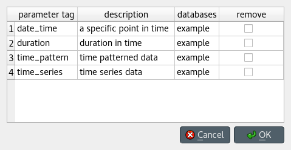

Managing data
-------------

This section describes the available tools to manage data, i.e., adding, updating or removing at the same time.

.. contents::
   :local:

Managing parameter tags
=======================

To add, update, and/or remove parameter tags, press **Manage parameter tags** on *Parameter tag toolbar*,
or select **Edit -> Manage parameter tags** from the menu bar.
The *Manage parameter tags* dialog will pop up:

To add new parameter tags, just fill the last empty row in the table:
Enter the tag under *parameter tag*, and optionally a description under *description*.
Finally, select the databases where you want to add the tag to under *databases*.

To update existing parameter tags, just edit the appropriate row in the table,
and select the databases where you want to update the tag in under *databases*.

To remove parameter tags, just check the corresponding box under the *remove* column,
and select the databases where you want to remove the tag from under *databases*.

When you're ready, press **Ok**.

.. note:: Changes made using the *Manage parameter tags* dialog are not applied to
   any databases until you press **Ok**.

Managing relationships
======================

Select **Edit -> Manage relationships** from the menu bar.
The *Manage relationships* dialog will pop up:

.. image:: img/manage_relationships_dialog.png
   :align: center

To get started, select a relationship class and a database from the combo boxes at the top.

To add relationships, select the member objects for each class under *Available objects*
and press the **Add relationships** button at the middle of the form.
The relationships will appear at the top of the table under *Existing relationships*.

To add multiple relationships at the same time,
select multiple objects for one or more of the classes.

.. tip:: To *extend* the selection of objects for a class, 
   press and hold the **Ctrl** key while clicking on additional items.

.. note:: The set of relationships to add is determined by applying the *product*
   operation over the objects selected for each class.

To remove relationships, select the appropriate rows under *Existing relationships*
and press the **Remove relationships** button on the left.

When you're happy with your changes, press **Ok**.

.. note:: Changes made using the *Manage relationships* dialog are not applied to
   the database until you press **Ok**.