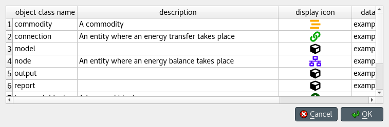

Updating data
-------------

This section describes the available tools to update existing data.

.. contents::
   :local:

Updating entities and classes
=============================

Using *Edit items* dialogs
~~~~~~~~~~~~~~~~~~~~~~~~~~

Select any number of entity and/or class items in *Object tree*
or *Relationship tree*, or any number of object and/or relationship items in *Entity graph*.
Then do one of the following:

- Select **Edit -> Edit selected items** from the menu bar.
- Right-click on the selection to bring the context menu, and select **Edit selected items**.

One separate *Edit items* dialog will pop up for each selected entity or class type,
and the tables will be filled with the current data of selected items. E.g.:

Modify the field(s) you want under the corresponding column(s).
Specify the databases where you want to update each item under the *databases* column.
When you're ready, press **Ok**.

Using *Pivot table*
~~~~~~~~~~~~~~~~~~~

To rename an object of a specific class, bring the class to *Pivot table* using any input type
(see :ref:`using_pivot_table_and_frozen_table`).
Then, just edit the appropriate cell in the corresponding class header.

Updating parameter definitions and values
=========================================

Using *Stacked tables*
~~~~~~~~~~~~~~~~~~~~~~

To update parameter data, just go to the appropriate *Stacked table* and edit the corresponding row.

Using *Pivot table*
~~~~~~~~~~~~~~~~~~~

To rename parameter definitions for a class,
bring the corresponding class to *Pivot table* using the **Parameter value** input type
(see :ref:`using_pivot_table_and_frozen_table`).
Then, just edit the appropriate cell in the `parameter` header.

To modify parameter values for an object or relationship,
bring the corresponding class to *Pivot table* using the **Parameter value** input type
(see :ref:`using_pivot_table_and_frozen_table`).
Then, just edit the appropriate cell in the table body.

Updating parameter value lists
==============================

To rename a parameter value list or any of its values, just edit the appropriate row in *Parameter value list*.

