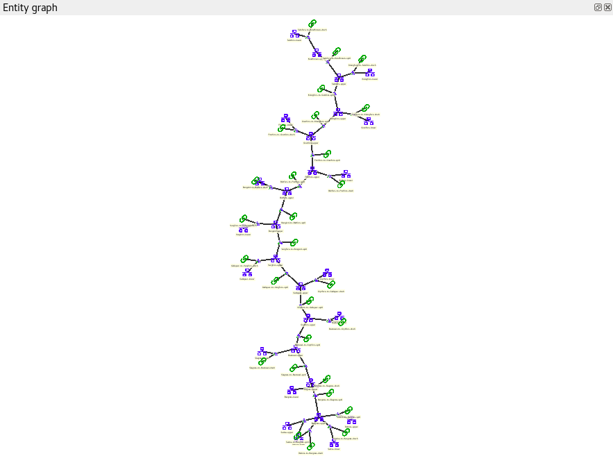
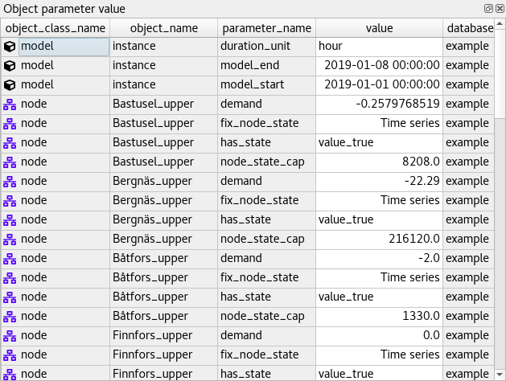
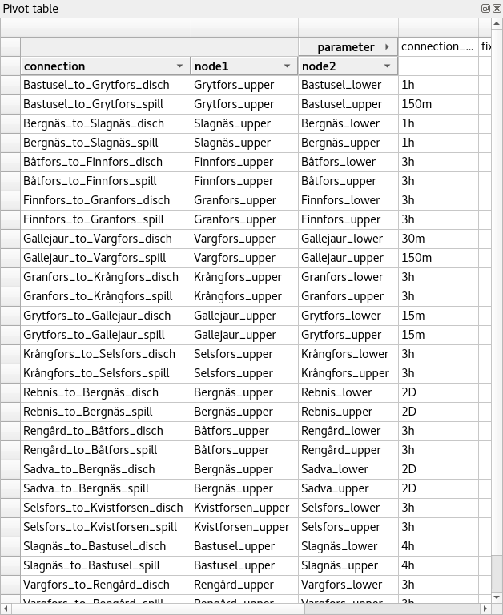
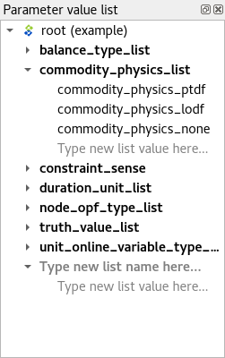

Viewing data
------------

This section describes the available tools to view data.

.. contents::
   :local:

Viewing entities and classes
============================

Using *Entity trees*
~~~~~~~~~~~~~~~~~~~~

*Entity trees* present the structure of classes and entities in all databases in the shape of a tree:

.. image:: img/object_tree.png
   :align: center

What is shown in the trees depends on the items you expand or collapse. In *Object tree*:

- To view all object classes from all databases,
  expand the root item (automatically expanded when loading the form).
- To view all objects of a class, expand the corresponding object class item.
- To view all relationship classes involving an object class, expand any objects of that class.
- To view all relationships of a class involving a given object,
  expand the corresponding relationship class item under the corresponding object item.

In *Relationship tree*:

- To view all relationship classes from all databases, 
  expand the root item (automatically expanded when loading the form).
- To view all relationships of a class, 
  expand the corresponding relationship class item.

.. note:: To expand an item in *Object tree* or *Relationship tree*, 
   double-click on the item or press the right arrow while it's active.
   Items in gray don't have any children, thus they cannot be expanded.
   To collapse an expanded item, double-click on it again or press the left arrow while it's active.

.. tip:: To expand or collapse an item and all its descentants in *Object tree* or *Relationship tree*, 
   right click on the item to display the context menu, and select **Fully expand** or **Fully collapse.**

.. tip:: In *Object tree*, the same relationship appears in many places (as many as it has dimensions). 
   To jump to the next ocurrence of a relationship item, either double-click on the item,
   or right-click on it to display the context menu, and select **Find next**.

Using *Entity graph*
~~~~~~~~~~~~~~~~~~~~

*Entity graph* presents the structure of classes and entities from one database in the shape of a graph:

Building the graph
******************

To build the graph, select any number of items in either *Object tree* or *Relationship tree*.
What is included in the graph depends on the specific selection you make:

- To include all objects and relationships from the database,
  select the root item in either *Object tree* or *Relationship tree*.
- To include all objects of a class, select the corresponding class item in *Object tree*.
- To include all relationships of a class, select the corresponding class item in *Relationship tree*.
- To include all relationships of a specific class involving a specific object,
  select the corresponding relationship class item under the corresponding object item in *Object tree*.
- To include specific objects or relationships,
  select the corresponding item in either *Object tree* or *Relationship tree*.

.. note:: In *Entity graph*, a small unnamed vertex represents a relationship,
   whereas a bigger named vertex represents an object. An arc between a relationship and an object
   indicates that the object is a member in that relationship.

The graph automatically includes relationships whenever *all* the member objects are included
(even if these relationships are not selected in *Object tree* or *Relationship tree*).
You can change this behavior to automatically include relationships
whenever *any* of the member objects are included.
To do this, enable **Full relationship expansion** via the **Graph** menu,
or via *Entity graph*'s context menu.

.. tip:: To *extend* the selection in *Object tree* or *Relationship tree*, press and hold the **Ctrl** key
   while clicking on additional items.

.. tip:: *Object tree* and *Relationship tree* also support **Sticky selection**, i.e., 
   extending the selection by clicking on the items *without pressing Ctrl*.
   To enable **Sticky selection**, go to **File -> Settings** and check the corresponding box.

.. note:: At the moment, *Entity graph* only shows data from the first database open in the form.

Manipulating the graph
**********************

You can move items in the graph by dragging them with your mouse.
To make relationship items stay in the same relative position with respect to their member objects,
go to **File -> Settings** and check the box next to, *Move relationships along with objects in Entity graph*.

To save the position of items into the database,
select the items in the graph and then choose **Graph -> Save positions** from the menu bar.
To clear saved positions, select the items again and choose **Graph -> Clear saved positions**.

To hide part of the graph, select the items you want to hide and then choose **Graph -> Hide selected**.
To show the hidden items again, select **Graph -> Show hidden**.

To prune the graph, select the items you want to prune and then choose **Graph -> Prune selected entities**
or **Prune selected classes**.
To restore specific prunned items,
go to **Graph -> Restore prunned** and select the items you want to restore from the popup menu.
To restore all prunned items at once, select **Graph -> Restore all prunned**.

.. note:: *Entity graph* supports extended selection and rubber-band selection.
   To extend a selection, press and hold **Ctrl** while clicking on the items.
   To perform rubber-band selection, press and hold **Ctrl** while dragging your mouse
   around the items you want to select.

.. note:: Prunned items are remembered across graph builds.

To zoom in and out, scroll your mouse wheel over *Entity graph* or use the buttons in **Graph -> Zoom**.
To rotate clockwise or anti-clockwise, press and hold the **Shift** key while scrolling your mouse wheel,
or use the buttons in **Graph -> Rotate**.

To export the current graph as a PDF file, select **File -> Export graph as PDF**.

Viewing parameter definitions and values
========================================

Using *Stacked tables*
~~~~~~~~~~~~~~~~~~~~~~

*Stacked tables* present object and relationship parameter data from all databases in the form of stacked tables:

To filter *Stacked tables* by any entities and/or classes,
select the corresponding items in either *Object tree*, *Relationship tree*, or *Entity graph*.
To remove all these filters, select the root item in either *Object tree* or *Relationship tree*.

To filter parameter definitions and values by certain parameter tags, 
select those tags in the *Parameter tag toolbar*.

To apply a custom filter on a *Stacked table*, click on any horizontal header.
A menu will pop up listing the items in the corresponding column:

.. image:: img/object_name_filter_menu.png
   :align: center

Uncheck the items you don't want to see in the table and press **Ok**.
Additionally, you can type in the search bar at the top of the menu to filter the list of items.
To remove the current filter, select **Remove filters**.

To filter a *Stacked table* according to a selection of items,
right-click on the selection to show the context menu,
and then select **Filter by** or **Filter excluding**.
To remove these filters, select **Remove filters** from the header menus of the filtered columns.

.. tip:: You can rearrange columns in *Stacked tables* by dragging the headers with your mouse.
   The ordering will be remembered the next time you open the form.

Viewing parameter values and relationships
==========================================

.. _using_pivot_table_and_frozen_table:

Using *Pivot table* and *Frozen table*
~~~~~~~~~~~~~~~~~~~~~~~~~~~~~~~~~~~~~~

*Pivot table* and *Frozen table* present data for an individual class from one database in the form of a pivot table,
optionally with frozen dimensions:

To populate the tables with data for a certain class,
just select the corresponding class item in either *Object tree* or *Relationship tree*.

Selecting the input type
************************

*Pivot table* and *Frozen table* support three different input types:

- **Parameter value** (the default): it shows objects and parameter definitions in the headers,
  and corresponding parameter values in the table body.
- **Index expansion**: Similar to the above, but it also shows parameter indexes in the headers.
  Indexes are extracted from special parameter values, such as time-series.
- **Relationship**: it shows objects in the headers, and corresponding relationships in the table body.
  It only works when selecting a relationship class in *Relationship tree*.

You can select the input type from the **Pivot table** menu in the menu bar.

.. note:: In *Pivot table*,
   header blocks in the top-left area indicate what is shown in each horizontal and vertical header.
   For example, in **Parameter value** input type, by default,
   the horizontal header has a single row listing parameter names,
   whereas the vertical header has one or more columns listing object names.

Pivoting and freezing
*********************

To pivot the data, drag a header block across the top-left area of the table.
You can turn a horizontal header into a vertical header and viceversa,
as well as rearrange headers vertically or horizontally.

To freeze a dimension, drag the corresponding header block from *Pivot table* into *Frozen table*.
To unfreeze a frozen dimension, just do the opposite.

.. note:: Your pivoting and freezing selections for any class will be remembered when switching to another class.

Filtering
*********

To apply a custom filter on *Pivot table*, click on the arrow next to the name of any header block.
A menu will pop up listing the items in the corresponding row or column:

.. image:: img/object_name_filter_menu.png
   :align: center

Uncheck the items you don't want to see in the table and press **Ok**.
Additionally, you can type in the search bar at the top of the menu to filter the list of items.
To remove the current filter, select **Remove filters**.

To filter the pivot table by an individual vector across the frozen dimensions,
select the corresponding row in *Frozen table*.

.. note:: At the moment, *Pivot table* shows data for only one class at a time,
   and only for the first database open in the form.

Viewing parameter value lists
=============================

You can find parameter value lists from all databases in *Parameter value list*:

To view the parameter value lists from each database, 
expand the corresponding top-level item.
To view the values for each list, expand the corresponding list item.

Viewing parameter tags
======================

You can find parameter tags from all databases in *Parameter tag toolbar*:

.. image:: img/parameter_tag_toolbar.png
   :align: center
