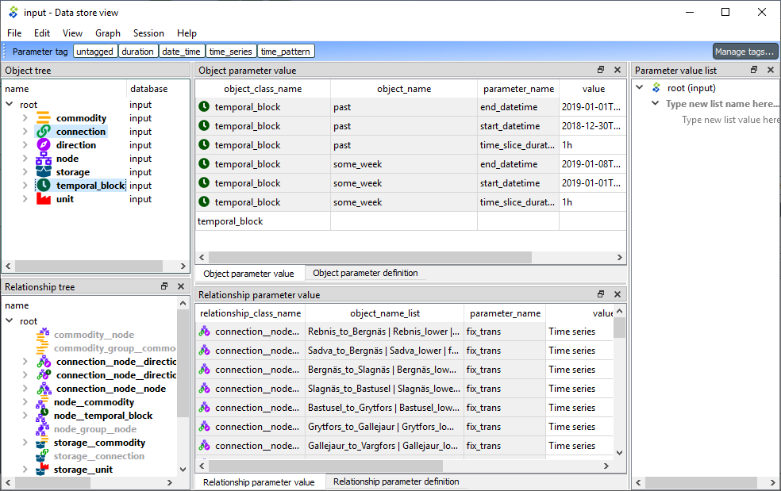
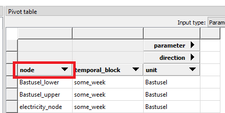
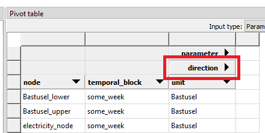
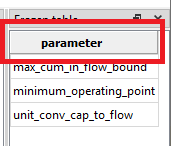
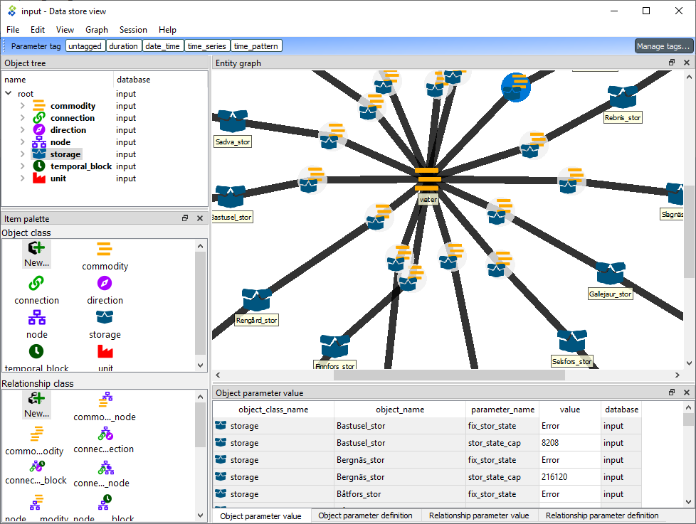

.. _Data store view:

.. |tree_style| image:: ../../spinetoolbox/ui/resources/menu_icons/tree.svg
   :width: 16
.. |tabular_style| image:: ../../spinetoolbox/ui/resources/menu_icons/table.svg
   :width: 16
.. |graph_style| image:: ../../spinetoolbox/ui/resources/project-diagram.svg
   :width: 16

***************
Data store view
***************

This section describes the different interfaces available in *Data Store view*
for viewing and editing data in a Spine database.

.. contents::
   :local:

To open Data store view, select a **Data Store** and click the *Open view* button
in its *Properties*:

.. image:: img/data_store_edit.png
   :align: center

Data store view consists of a number of dockable views that display the data in the database in different ways.
Three pre-defined layouts or *styles* are available from the *View* menu:

- In Tree style layout (|tree_style|) you can edit, add and remove all database entities and parameters
- In Tabular style layout (|tabular_style|) you can display the the data in a pivot table
- In Graph style layout (|graph_style|) you can view the structure of classes, objects and relationships
  in a graph representation

Commit/Rollback changes
-----------------------

Changes are not immediately saved to the database. They need to be committed separately.
To do that select **Session -> Commit** from the menu bar, enter a commit message and press **Commit**.
Any changes made in the Data store view will be saved into the database.

To undo any changes since the last commit, select **Session -> Rollback** from the menu bar.

Tree style
----------

The **Tree style** layout is useful to get an overview of the data and the relationships
within a Spine database:

In the default **Tree style** layout the left side of the Data store view is occupied by two tree views which
display the different object and relationship classes, with their objects and relationships in a hierarchical tree.
These and the other views allow you to add, edit, and delete object classes, relationship classes, objects,
relationships, parameters and parameter values.

The interface has five main components:

1. *Object tree*, where you can expand and collapse the different levels of the hierarchy.
   It also acts as a filtering tool for the two table components, so that only items selected in the
   *Object tree* are shown in the *Parameter tables*.
2. *Relationship tree*, similar to *Object tree* but for relationships.
3. *Object parameter value* table, where you can view, add, edit, and delete object parameter definitions and values.
4. *Relationship parameter value* table, where you can view, add, edit, and delete relationship parameter
   definitions and values.
5. *Parameter value list* allows you to create value lists that can be associated to parameter definitions.

Editing items
~~~~~~~~~~~~~

To add object classes, relationship classes, objects or relationships you can use the **Edit** menu from the main
menu bar, as well as the context menu from the *Object tree*.
In the dialog that pops up you can enter new items by typing their names or pasting data from the clipboard.

.. image:: img/tree_view_add_objects.png
   :align: center

To delete an item, you can again use the **Edit** menu from the main
menu bar or the item's context menu from the *Object tree*.

.. image:: img/tree_view_context_menu.png
   :align: center

Editing items is done following a similar procedure.

Viewing parameter definitions and values
~~~~~~~~~~~~~~~~~~~~~~~~~~~~~~~~~~~~~~~~

In the *Parameter tables*, you can switch between viewing parameter definitions or values by using the tabs
in the lower left corner.

You can also (further) filter the tables by clicking on the column headers.

Editing parameters definitions and values
~~~~~~~~~~~~~~~~~~~~~~~~~~~~~~~~~~~~~~~~~

To add new parameter definitions or values you can directly do it in the last row of each table.
The tables also support pasting values from the clipboard.

Tabular style
-------------

The **Tabular style** layout is used to display and edit data in a Spine database via a table-like interface.
The interface lets you filter and pivot the data for exploration and editing.

.. image:: img/tabular_style.png
   :align: center

The interface has four main components:

1. *Object tree*, where you can expand and collapse the different levels of the hierarchy.
   The item selected in the *Object tree* is shown in the *Pivot table*.
2. *Relationship tree*, similar to *Object tree* but for relationships.
3. *Pivot table*, where you can transform the data view by dragging and dropping the header blocks.
   You can choose, e.g., which items go into rows and which into columns.
4. *Frozen table*: dragging header blocks here freezes the selected items in the *Pivot table*.

From the drop-down *Input type* list at the top of the Pivot table,
you can select two different input types:

* *Parameter value*: display all objects (or relationships), as well as all parameters and parameter values
  for the selected object (or relationship) class.
* *Relationship*: display only the objects (or relationships) for the selected object (or relationship) class.

Pivoting and filtering data
~~~~~~~~~~~~~~~~~~~~~~~~~~~

You can transform (pivot) the data view by dragging header blocks across the *Pivot table* and to *Frozen table*:

.. image:: img/tabular_view_pivot.png
   :align: center

When you drag a header block in Pivot table in a column header position like the 'node' header below,
items under that header are displayed in that column of the Pivot table so there is a unique row for each item.

When you drag a header block in Pivot table in a row header position like the 'direction' header below,
items under that header are displayed in that row of the Pivot table.

When you drag a header block to the *Frozen table* all items in under the header are excluded from the Pivot table
and shown in the Frozen table instead.
The Pivot table is then filtered by the selected item in the Frozen table.

To filter a specific item you can use the filter buttons in the header blocks.
It is possible to apply multiple filters at the same time.

Graph style
-----------

The **Graph style** layout is used to visualize the Spine database structure into a graph.
Here you can select objects to see how they are related.
You can also view parameter definition and values same as in the **Tree style** layout.

