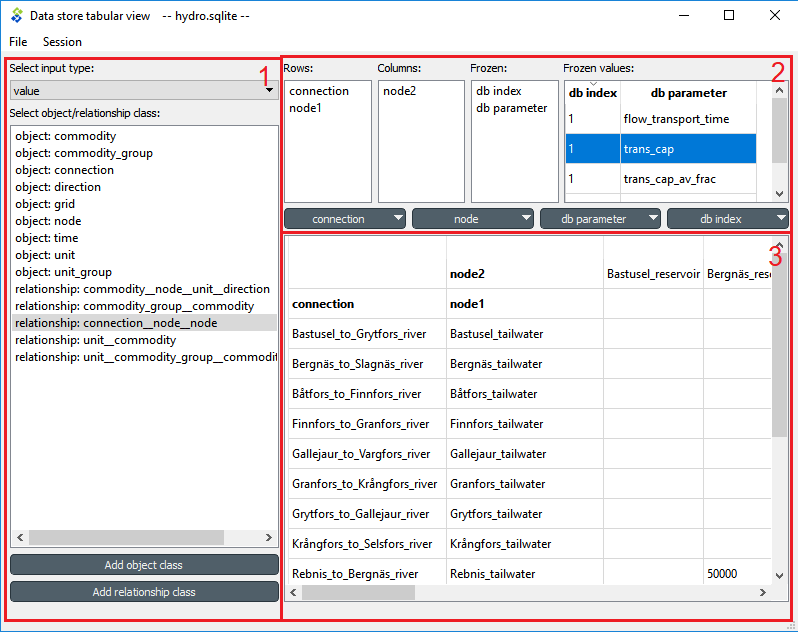
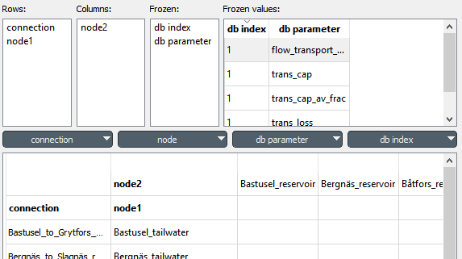
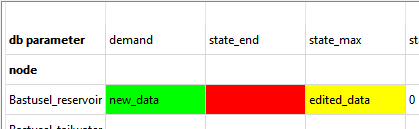
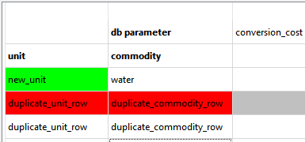
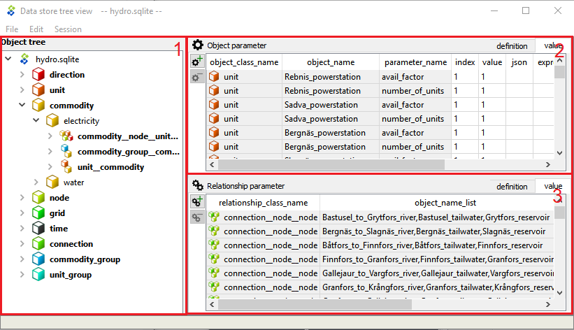
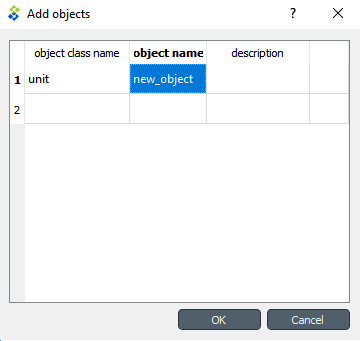
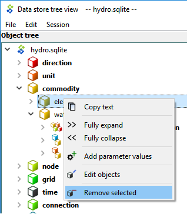
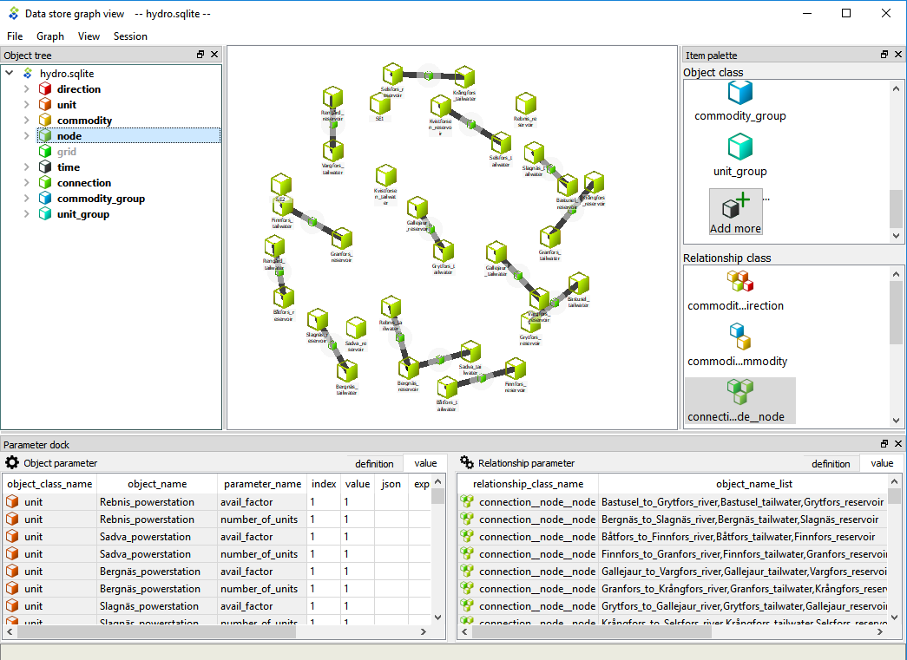

.. _Data store views:

****************
Data store views
****************

This section describes the different interfaces for viewing and editing data in a Spine database.

.. contents::
   :local:

To open any of the viewing interfaces, select a **Data Store** and click the corresponding button
in its *Properties*:

.. image:: img/data_store_edit.png
   :align: center

Tabular view
------------

The **Tabular view** is used to display and edit the data in a Spine database via a table-like interface.
The interface lets you filter and pivot the data for exploration and editing.
To start the **Tabular view**, select a **Data Store** item and press the **Tabular view** button in its *Properties*.

The **Tabular view** has three main components:

* *Selection component* (1), where you can select the object class or relationship class
  to visualize.
* *Pivot lists* (2), where you can transform the data view and choose, e.g., which items go
  into rows and which into columns.
* *Main table* (3), where the actual data is displayed.

From the drop-down list at the top of the selection component,
you can select two different input types:

* *value*: display all objects (or relationships), as well as all parameters and parameter values
  for the selected object (or relationship) class.
* *set*: display only the objects (or relationships) for the selected object (or relationship) class.

Pivoting and filtering data
~~~~~~~~~~~~~~~~~~~~~~~~~~~

You can transform (pivot) the data-view by dragging items across the *Pivot lists*:

Here is how each of the *Pivot lists* works:

* *Rows*: All items in this list are displayed in the *Main table*
  so there is a unique row for each object (or relationship)
  that belongs to that object (or relationship) class.
* *Columns*: All items in this list are displayed in the *Main table*
  so there is a unique column for each object (or relationship)
  that belongs to that object (or relationship) class.
* *Frozen*: All items in this list are excluded from the *Main table*
  and shown in the *Frozen values* table instead;
  the *Main table* is then filtered by the selected item in the *Frozen values* table.

To filter a specific item you can use the filter buttons just above the *Main view*.
You can apply multiple filters at the same time.

Editing Data
~~~~~~~~~~~~

When editing parameter *values*, cells get painted in different colors:

* Green: New data
* Yellow: Edited data
* Red: Deleted data

To restore a cell to its initial value, right click on it and select **Restore value** from the context menu.
You can also hover an edited cell to see the original value.

When editing item *names*, cells also get painted in different colors although their meaning is a bit different:

* Green: New item. This means that all objects and parameters in green cells will be inserted when committing changes.
* Red: Invalid item. This means that the item, as well as all data for that row/column cannot be inserted
  when committing changes. The affected rows/columns will get a gray background. Invalid names are:

 * Empty names: An item must have a name.
 * Duplicate names: If the name (or combination of item names) is already assigned to an object (or relationship).
 * Existing name: If the name is already taken by another object or parameter.

If you edit an item's name, the original item is not deleted from the database on commit.
To delete an item from the database, right click on the cell with the name, and select **Delete item:name** from
the context menu.

A new relationship is added as soon as a valid combination of objects for that relationship class is entered,
even if the row/column is invalid. To remove a relationship, right click on it and select **Delete item:name** from
the context menu.

Commit/Rollback changes
~~~~~~~~~~~~~~~~~~~~~~~

To save changes select **Session -> Commit** from the menu bar, enter a commit message and press **Commit**.
Any changes made in the **Tabular view** will be saved into the database.

To undo any changes since the last commit, select **Session -> Rollback** from the menu bar.

Tree view
---------

The **Tree view** is used to display the different object and relationship classes,
with their objects and relationships in a hierarchical tree.
You can also add, edit, and delete object classes, relationship classes, objects, relationships,
parameters and parameter values. The **Tree view** is useful to get an overview of the data and the relationships
within a Spine database:

The interface has four main components:

1. *Object tree*, where you can expand and collapse the different levels of the hierarchy.
   It also acts as a filtering tool for the other two table components, so that only items selected in the
   *Object tree* are shown in the *Parameter tables*.
2. *Relationship tree*, similar to *Object tree* but for relationships.
3. *Object parameter table*, where you can view, add, edit, and delete object parameter definitions and values.
4. *Relationship parameter table*, where you can view, add, edit, and delete relationship parameter
   definitions and values.

Editing items
~~~~~~~~~~~~~

To add object classes, relationship classes, objects or relationships you can use the **Edit** menu from the main
menu bar, as well as the context menu from the *Object tree*.
In the dialog that pops up you can enter new items by typing their names or pasting data from the clipboard.

To delete an item, you can again use the **Edit** menu from the main
menu bar or the item's context menu from the *Object tree*.

Editing items is done following a similar procedure.

Viewing parameter definitions and values
~~~~~~~~~~~~~~~~~~~~~~~~~~~~~~~~~~~~~~~~

In the *Parameter tables*, you can switch between viewing parameter definitions or values by using the tabs
in the upper right corner.

You can also (further) filter the tables by clicking on the column headers.

Editing parameters definitions and values
~~~~~~~~~~~~~~~~~~~~~~~~~~~~~~~~~~~~~~~~~

To add new parameter definitions or values you can directly do it in the last row of each table.
The tables also support pasting values from the clipboard.

Graph view
----------

The **Graph view** is used to visualize the Spine database structure into a graph.
Here you can select objects to see how they are related.
You can also view parameter definition and values same as in the **Tree view**.

