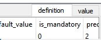
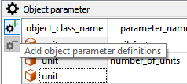

************************
Edit/View Spine-database
************************

This section explains the different ways of viewing and editing the data in an existing spine-database.

.. contents::
    :local:

To open any of the viewing tools, select a **Data store** and click the corresponding button in the **Data store** preferences:

.. image:: img/data_store_edit.png
   :align: center

Tabular view
------------

The **Tabular view** is used to display and edit the data in a spine-database in a table-like interface. The interface lets you filter and pivot the data for exploration and editing. To start the **Tabular view** select a **Data store** item and press the **Tabular view** button in the properties window.

.. image:: img/tabular_view.png
   :align: center

The **Tabular view** has two main components:

* Select component (1): here you can select which object classes or relationship classes that you want to view and which parameter data you wish to view.
* Tabular component (2, 3): here the selected data is displayed.

The different data-viewing modes that exists are:

* value: This displays all objects/relationships, parameters and parameter values for the selected object/relationship class.
* json: This displays timeseries data stored in the json field for the selected object/relationship class.
* set: This displays only the objects/relationships for the selected object/relationship class.

Pivoting and filtering data
~~~~~~~~~~~~~~~~~~~~~~~~~~~

In the tabular component you can transform the view of the data by draging an index between the pivot lists:

.. image:: img/tabular_view_pivot.png
   :align: center

The pivot options are:

* Rows: All indexes in this list are displayed so each row contains a unique row for the indexes in the list.
* Columns: All indexes in this list are displayed so each column contains a unique column for the indexes in the list.
* Frozen: All indexes in the frozen list are excluded from the display table and instead shown in the **Frozen values** table, the main table is then filtered by the selected indexes in the **Frozen values** table.
* Frozen values: All unique index values for the indexes in the *Frozen* index list are displayed here. Selecting a row will cause the main table to be filtered to the selected row index values.

To filter a specific index you can use the filter buttons:

When applying a filter the main table will be filtered for the selected filter for that index. You can filter multiple index values at the same time.

Editing Data
~~~~~~~~~~~~

When editing data you will see tre colors:

.. image:: img/tabular_view_edit_data.png
   :align: center

* Green: New data
* Yellow: Edited data
* Red: Deleted data

To restore a cell to it's initial value, select the cell and right click, in the context menu choose: Restore value. You can also hoover a edited cell to see the original value.

When editing index values you will also see three colors, how ever their meaning is a bit different:

.. image:: img/tabular_view_edit_index.png
   :align: center

* Green: New index value, For objects and parameters this means that all green cells will be inserted when commiting changes.
* Red: This means that the index value is invalid and all data for that row/column cannot be inserted when commiting data. The affected rows/columns will get a grey background. Invalid values are:

 * Empty values: An index must have a value.
 * Duplicate values: If the combination of index values already exists.
 * Existing name: If the index value is already taken by another object or parameter.

If you edit an index value, the original index value is not deleted from the database on commit. To delete a index value from the database, select the cell with the value and right click and select: Delete index1: value

When working with relationships, a new relationship is added as soon as a combination of valid objects for that relationship class is entered even if the row/column is not valid. To remove a relationships, select the relationship and right click and select: Delete relationship:

Commit/Rollback changes
~~~~~~~~~~~~~~~~~~~~~~~

To save changes made in the **Tabular view** use the Session menu and click commit, enter a commit message and press commit. Any changes made in the **Tabular view** is now saved into the database.

To undo any changes since the last commit, use the Session menu and click Rollback

Tree view
---------

The **Tree view** is used to display the different object/relationship classes with their objects/relationships in a hierarchical tree. You can also edit/add/delete classes, objects, relationships, parameters and parameter values. You can use the **Tree view** to get an overview of the data and the relations of the data in a spine database:

.. image:: img/tree_view.png
   :align: center

The **Tree view** has three main components:

1. Tree component: In this component you can expand/collapse the different levels of hierarchy of the spine database structure. This component also works as a selection tool for the other two table components.
2. Object parameter table: In this component you can view/add/edit/delete parameter definitions and values for object classes and objects.
3. Relationship parameter table: In this component you can view/add/edit/delete parameter definitions and values for relationship classes and relationships.

Editing Classes, Objects, Relationship and Parameters
~~~~~~~~~~~~~~~~~~~~~~~~~~~~~~~~~~~~~~~~~~~~~~~~~~~~~

To add object classes, relationship classes, objects or relationships you can use the **Edit** menu or right clicking on any item in the object tree. In the menu that pops up you can enter new items by typing the new names or pasting from the clipboard.

.. image:: img/tree_view_add_objects.png
   :align: center

To delete an item, right click the item in the object tree and click the delete option in the context menu.

.. image:: img/tree_view_context_menu.png
   :align: center

From this menu you can also rename or edit classes/objects/relationships

Editing Parameters and Parameter values
~~~~~~~~~~~~~~~~~~~~~~~~~~~~~~~~~~~~~~~
In the Object parameter table and the Relationship parameter table you can add/edit/delete parameters and parameter values. To filter the tables you can either select a class/object/relationship item from the object tree hierarchy or click on a column header to show filter options for that column.

You can choose to view parameter defintions or values in the object and relationship parameter tables by the tabs showed in to top right corner of the table:

To add new definitions or values you can use the add tools on the left of the tables: 

You can also enter new parameter definitions or values by entering new data in the last row of the tables. The tables also support pasting values from the clipboard.

Graph view
----------

The **Graph view** is a tool to visualize the spine database structure in a graph. In the **Graph view** you can select relationships and objects to see the connections between them. This widget also contains the parameter tables in the **Tree view** to which are filtered by the graph.

.. image:: img/graph_view.png
   :align: center
