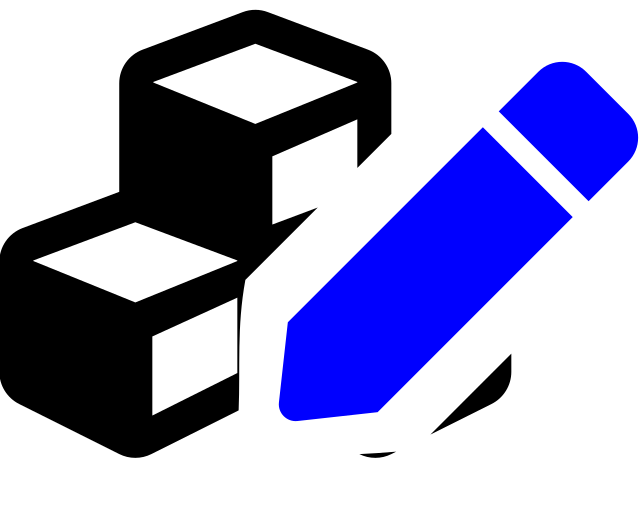
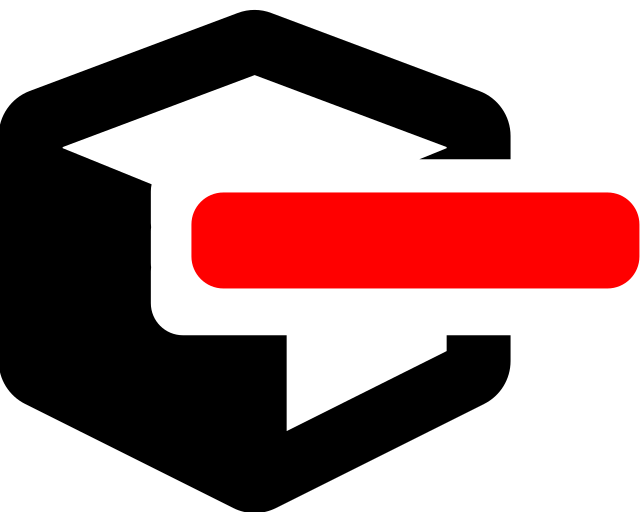

.. _Adding Relationships in the Manage Elements Dialog:

**************************************************
Adding Relationships in the Manage Elements Dialog
**************************************************

In this basic level tutorial we will get acquainted with the **Manage elements** dialog.
It is mainly used to generate large quantities of multidimensional relationships on one go,
but it offers other functionalities, too.

This tutorial relies on entity classes and entities created in :ref:`First Relationship`.
Make sure you have Spine Database Editor with the tutorial data open,
and off we go.

Bonding Fish with the Manage Elements Dialog
============================================

The **Manage elements** dialog can be accessed by **right-clicking** the Bond class in **Entity tree**
and selecting |manage_elements| **Manage elements...** from the popup menu.

The left side of the dialog shows available elements for each dimension
while the right side contains a table of existing entities in the Bond class.
The dialog works such that it creates all possible combinations of the elements that are selected
in **Available elements** when the |add_elements| button is clicked.

Let's utilize the machinery to create all possible bonds where :literal:`cheep cheep` is the first element!
Select :literal:`cheep cheep` from the left column in **Available entities**.
Next, select the first element name in the second column.
Then, while holding the **Shift** key, select the last element.
**Shift** makes the selection extend between the previously selected element (the first one)
and the element that was selected last.
Click on |add_elements| to create the new entities in **Existing entities**.

Does a bond between :literal:`cheep cheep` and :literal:`cheep cheep` make sense?
Perhaps not, so let's remove that entity.
Select the row containing the non-sensical entity in **Existing entities** and click |remove_rows|.
This gets us rid of it.

Try creating different combinations of bonds between the fish!
Note, that in addition to **Shift**, you can use **Ctrl** to select multiple elements in **Available elements**,
though it works a bit differently, as you may notice.
You can always remove entities with the |remove_rows| button.

Once satisfied playing The God of Bond Creation and Destruction,
press **Ctrl+Enter** or click **OK** to accept the changes.
If in doubt, cancel by pressing **Esc** or by clicking **Cancel**.

That is it! You are now a certified manager of elements.
