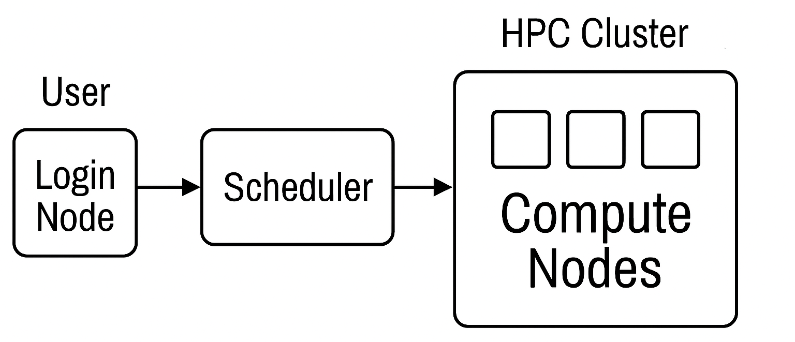
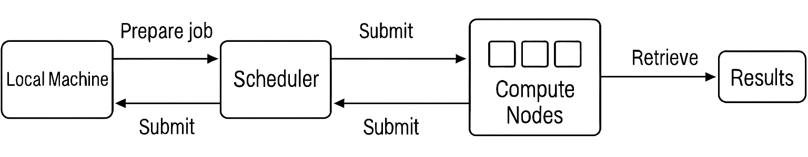
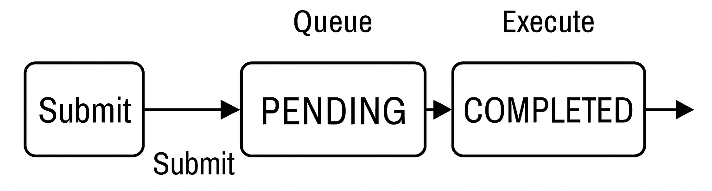

.. _HPC Basics:

==================================================
Basics of High-Performance Computing (HPC) Systems
==================================================

This section briefly describes how common HPC systems work. The description is intentionally general so it applies to:

- University HPC clusters
- Company internal clusters
- Cloud-based HPC environments (e.g., AWS, Azure)

If you are already familiar with HPC systems, you can jump directly to the next section :ref:`Spine Toolbox on HPC`.

************
Introduction
************

Most HPC systems follow a similar architecture composed of three main components:

- **Login node**: the entry point to the system where users connect, prepare job scripts, and submit jobs
- **Compute nodes**: the machines where the actual computational work is executed
- **Scheduler (e.g., Slurm)**: the system responsible for allocating resources and dispatching jobs to compute nodes

   Conceptual structure of an HPC cluster

Users typically interact only with the login node. After a job is submitted, the scheduler assigns it to available
compute nodes, where it runs—often in parallel across multiple CPUs or nodes.

.. warning::

   Do not run heavy computations on the login node. It is intended only for job preparation and submission.

*****************
Workflow Overview
*****************

A typical HPC workflow separates job preparation from execution:

1. The user prepares input data and job scripts on their local machine
2. The job is submitted to the scheduler via the login node
3. The scheduler places the job in a queue and assigns resources when available
4. The job runs on compute nodes
5. Results are stored on the cluster and can be retrieved back to the local environment

This separation allows HPC systems to efficiently share resources among many users.

   Overview of the HPC workflow

*************
Job Lifecycle
*************

When a job is submitted to the scheduler (such as Slurm), it goes through several states:

- **PENDING**: the job is waiting in the queue for resources to become available
- **RUNNING**: the job is actively executing on compute nodes
- **COMPLETED**: the job has finished successfully (or terminated with an error)

Understanding these states helps explain why jobs may not start immediately—waiting in the queue is normal and
depends on factors such as resource availability and system load.

   Lifecycle of a Slurm job, including submission, queuing, execution,
   and completion stages.

*************************
Connecting to the Cluster
*************************

Login
-----

You need access rights (username/password) for your HPC cluster, which you should request from the HPC administrator.
Once you have the necessary rights, you can make an SSH connection from your terminal to the HPC login node.

.. code-block:: bash

   ssh username@cluster.address

On Windows, you can use Command Prompt, Powershell or a dedicated SSH client such as PuTTY. You can
install PuTTY from the Windows Store or from the `PuTTY site <https://putty.software/>`_.

File Transfer
-------------

You can use scp to transfer files between your local system and the login node.

.. code-block:: bash

   scp -r my_project/ username@cluster:/home/username/

However, in the long run this may become tedious, so it is recommended that you use for example
`WinSCP <https://winscp.net/>`_, which makes file transfers quicker by providing an easy to use drag-and-drop UI.

*************************************
Understanding the Cluster Environment
*************************************

Working on an HPC cluster differs from working on a local machine. The filesystem is typically distributed and
shared across compute nodes, and different directories are designed for specific purposes. Using them correctly
is essential for performance, data safety, and efficient workflows.

Common Directory Types
----------------------

Running applications on a cluster requires that all compute nodes involved in a job can access the same files.
This is usually achieved through a shared parallel filesystem. While directory names vary between systems,
most clusters provide the following *types* of storage:

- ``$HOME`` (or home directory)

  Your personal home directory. This is **persistent storage**, meaning files are kept long-term and often backed up.
  However, it is typically **not optimized for heavy I/O workloads**, so it should mainly be used for:

  - Source code
  - Configuration files
  - Small input datasets
  - Scripts and job submission files

- High-performance temporary storage (often called ``$SCRATCH`` or similar)

  A fast storage area intended for **temporary data and intensive I/O operations**.
  The exact location and name vary by system. Examples include:

  - ``$SCRATCH`` (if defined)
  - ``/scratch``
  - ``/tmp``
  - ``/jobs`` (on some systems)

  Consult your system documentation to find the correct path.

  Use this storage for:

  - Large simulation outputs
  - Intermediate data
  - Temporary working files

  .. note::
     These locations are usually not backed up and may be cleaned automatically
     after a retention period. Always copy important data to persistent storage.

- Project or shared storage (often called ``$PROJECT`` or ``$WORK``)

  A shared directory intended for **collaborative work within a project or research group**.
  Not all systems provide this, but when available it typically offers more space than ``$HOME``
  and longer retention than temporary storage.

  Common uses include:

  - Shared datasets
  - Group software installations
  - Results that need to be preserved longer-term

  .. note::
     If your system does not provide a dedicated project directory, you may need
     to manage shared data manually in agreed-upon locations.

Best Practices
--------------

Because directory names vary between systems, always adapt these guidelines to the paths provided on your cluster:

- Copy input data from persistent storage (e.g. ``$HOME`` or project space) to temporary high-performance storage
  before running jobs.
- Perform all **compute-intensive tasks** using the high-performance temporary storage (e.g. ``$SCRATCH`` or ``/jobs``).
- Regularly clean up unnecessary files from temporary storage.
- Avoid running large jobs directly from your home directory.

Example Workflow
----------------

A typical workflow might look like:

1. Prepare input files and scripts in your home directory (``$HOME``)
2. Copy necessary data to the system's temporary work directory (e.g. ``$SCRATCH`` or ``/jobs``)
3. Run the job using the scheduler
4. Copy final results back to persistent storage (``$HOME`` or project space)
5. Clean up temporary data

This approach ensures efficient use of cluster resources while keeping your data safe and organized. Next section
provides an actual example workflow for executing Spine Toolbox projects in an HPC environment.

Module System
-------------

Environment modules is a system tool to manage the shell environment. It makes it easier to handle the shell
environment when there are e.g. multiple versions of the same software installed. You can get a list of available
modules with command

.. code-block:: bash

   module avail

The needed module can be loaded with the command

.. code-block:: bash

   module load <module_name>

A module can be unloaded with the command

.. code-block:: bash

   module unload <module_name>

You can load any modules you need in a Slurm script with the `module load` command.

Slurm - Basic Commands
----------------------

These basic commands should be available in the HPC login node to help you get started. There are many more
commands available, please also read your HPC documentation if there are special circumstances you should be
aware of when using Slurm.

sinfo
*****

This command gives a quick overview of the cluster status. It shows the status of different partitions, time
limits, and available nodes.

squeue
******

This command outputs information of all queues on all partitions. You can filter the output by partition with the
**-p** argument, or by username with the **-u** argument. For example, `squeue -u <username>` prints the queued
jobs of user <username>.

sbatch
******

This command will submit a job script to the queue. For example, `sbatch job.sh`. Please make sure that the batch
script file uses **Unix (LF)** line endings.

scancel
*******

This command cancels a job. It needs a job id as an argument. For example, `scancel 10346`.

srun
****

This command runs a single command on Slurm. It needs the same arguments for resource reservation as `sbatch`.
For example `srun -J jobname --mem=64000 --pty -n 36 -p large36 /bin/bash`.

scontrol show job
*****************

This command outputs detailed information about a job. It needs job id as an argument. For example,
`scontrol show job 10345`.
