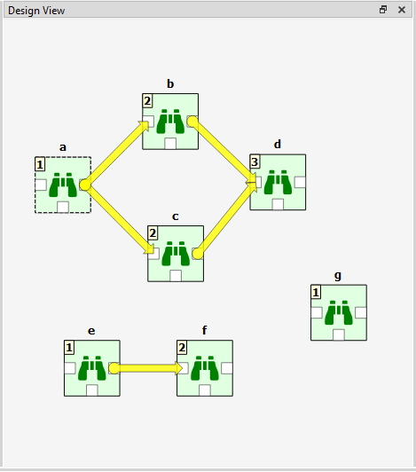
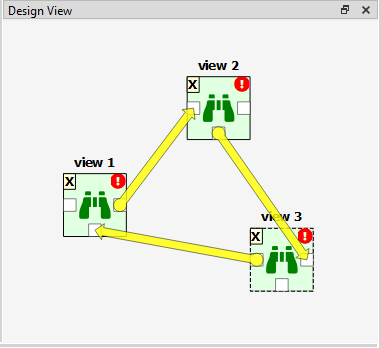
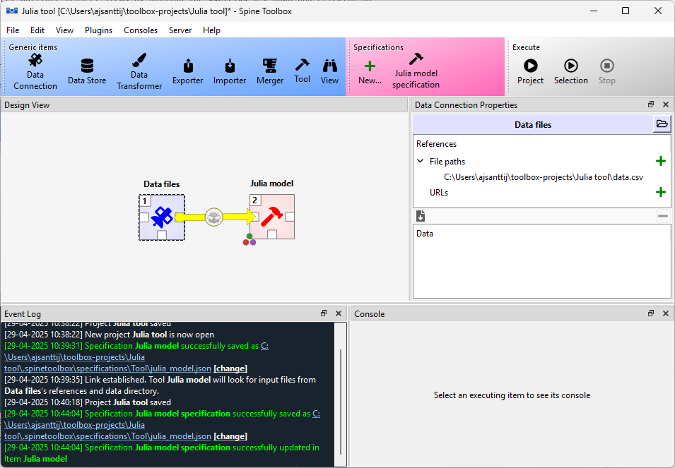
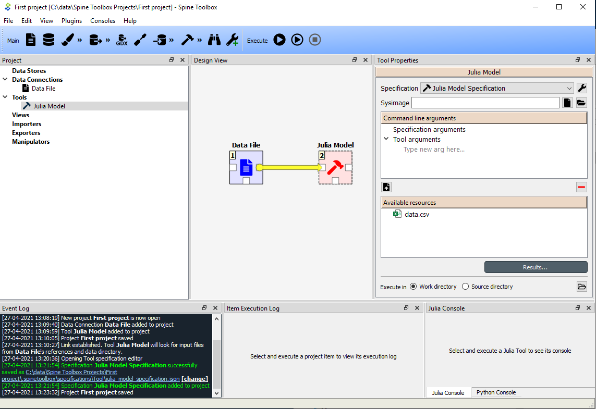

.. Executing Projects documentation
   Created 16.1.2019

.. |play-all| image:: ../../spinetoolbox/ui/resources/menu_icons/play-circle-solid.svg
            :width: 16
.. |play-selected| image:: ../../spinetoolbox/ui/resources/menu_icons/play-circle-regular.svg
            :width: 16
.. |stop| image:: ../../spinetoolbox/ui/resources/menu_icons/stop-circle-regular.svg
            :width: 16

.. _Executing Projects:

******************
Executing Projects
******************

This section describes how executing a project works and what resources are passed between project
items at execution time. The buttons used to control executions are located in the **Toolbar**'s Execute -section.
Execution happens by either pressing the *Execute Project* button (|play-all|) to execute the
whole project, or by pressing the *Execute Selected* button (|play-selected|) to only execute selected items.
Next to these buttons is the **Stop** button (|stop|), which can be used to stop an ongoing execution.
A project consists of project items and connections (yellow arrows) that are visualized on the **Design View**.
You use the project items and the connections to build a **Directed Acyclic Graph (DAG)**, with the project
items as *nodes* and the connections as *edges*. The DAG is traversed using the **breadth-first-search** algorithm.

Rules of DAGs:

1. A single project item with no connections is a DAG.
2. All project items that are connected, are considered as a single DAG (no matter, which
   direction the arrows go). If there is a path between two items, they are considered as belonging
   to the same DAG.
3. Loops are not allowed (this is what acyclic means).

You can connect the nodes in the **Design View** how ever you want but you cannot execute the resulting
DAGs if they break the rules above. Here is an example project with three DAGs.

- DAG 1: items: `a`, `b`, `c`, `d`. connections: `a`-`b`, `a`-`c`, `b`-`d`, `c`-`d`
- DAG 2: items: `e`, `f`. connections: `e`-`f`
- DAG 3: items: `g`. connections: None

The numbers on the upper left corners of the icons show the item's **execution ranks**
which roughly tell the order of execution within a DAG.
Execution order of DAG 1 is `a->b->c->d` or `a->c->b->d` because `b` and `c` are **siblings**
which is also indicated by their equal execution rank.
DAG 2 execution order is `e->f` and DAG 3 is just `g`.
All three DAGs are executed in a row though which DAG gets executed first is undefined.
Therefore all DAGs have their execution ranks starting from 1.

We use the words **predecessor** and **successor** to refer to project items that are upstream or
downstream from a project item. **Direct predecessor** is a project item that is the immediate predecessor
while **Direct Successor** is a project item that is the immediate successor.
For example, in the DAG 1 presented before, the
successors of `a` are project items `b`, `c` and `d`. The direct successor of `b` is `d`. The
predecessor of `b` is `a`, which is also its direct predecessor.

After you press the |play-all| button, you can follow the progress
and the current executed item in the **Event Log**.
**Design view** also animates the execution.

Items in a DAG that breaks the rules above are marked by X as their rank.
Such DAGs are skipped during execution.
The image below shows such a DAG where the items form a loop.

You can also execute only the selected parts of a project by multi-selecting the items you want to
execute and pressing the |play-selected| button in the tool bar. For example, to execute only items
*b*, *d* and *f*, select the items in **Design View** |play-selected| button.

.. tip::
   You can select multiple project items by holding the **Ctrl** key down and clicking on
   desired items or by drawing a rectangle on the **Design view**.

Example DAG
===========

When you have created at least one Tool specification, you can execute a Tool as part of the DAG. The
Tool specification defines the process that is executed by the Tool project item. As an example, below
we have two project items; *Data Files* Data Connection and *Julia model* Tool connected to each other.

In ths example, *Data Files* has a single file reference ``data.csv``.
Data Connections make their files visible to direct successors
and thus the connection between *Data Files* and *Julia model* provides ``data.csv`` to the latter.

Selecting the *Julia model* shows its properties in the **Properties** dock widget.

In the top of the Tool Properties, there is **Specification** drop-down menu.
From this drop-down menu, you can select the Tool specification for this particular Tool item.
The *Julia Model Specification* tool specification has been selected for *Julia model*.
Below the drop-down menu, you can choose a precompiled sysimage
and edit Tool's command line arguments.
Note that the command line argument editor already 'sees' the ``data.csv`` file provided by `Data Files`.
The `Execute in` radio buttons control, whether this Tool is first copied to a work directory and executed
there, or if the execution should happen in the source directory where the main program file is located.
In Group id, an execution group identifier can be given. Below that, there is a checkbox with the choice
to kill consoles after execution.
*Results...* button opens the Tool's result archive directory in system's file browser
(all Tools have their own result directory).

When you click on the |play-all| button, the execution starts from the *Data Files* Data Connection
as indicated by the execution rank numbers.
When executed, Data Connection items *advertise* their files and references
to project items that are their direct successors.
In this particular example, ``data.csv`` contained in *Data Files*
is also a required input file in *Julia model Specification*.
When it is the *Julia model* tool's turn to be executed, it checks if it finds the ``data.csv`` from
its direct predecessor items that have already been executed.
Once the input file has been found the Tool starts processing the main program file *script.jl*.
Note that if the connection would be the other way around (from *Julia Model* to *Data Files*)
execution would start from the *Julia model* and it would fail because it cannot find the required ``data.csv``.
The same thing happens if there is no connection between the two project items.
In this case the project items would be in separate DAGs.

Since the Tool specification type was set as *Julia* and the main program is a Julia script, Spine Toolbox starts the
execution in the Julia Console (if you have selected this in the application `Settings`, See :ref:`Settings` section).
