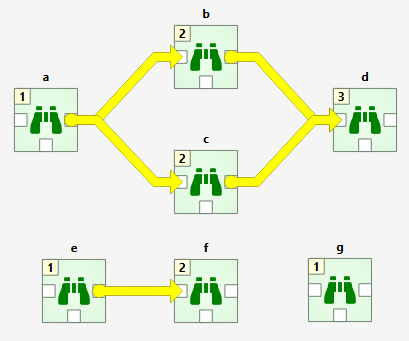
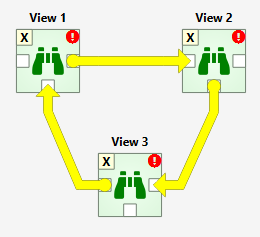
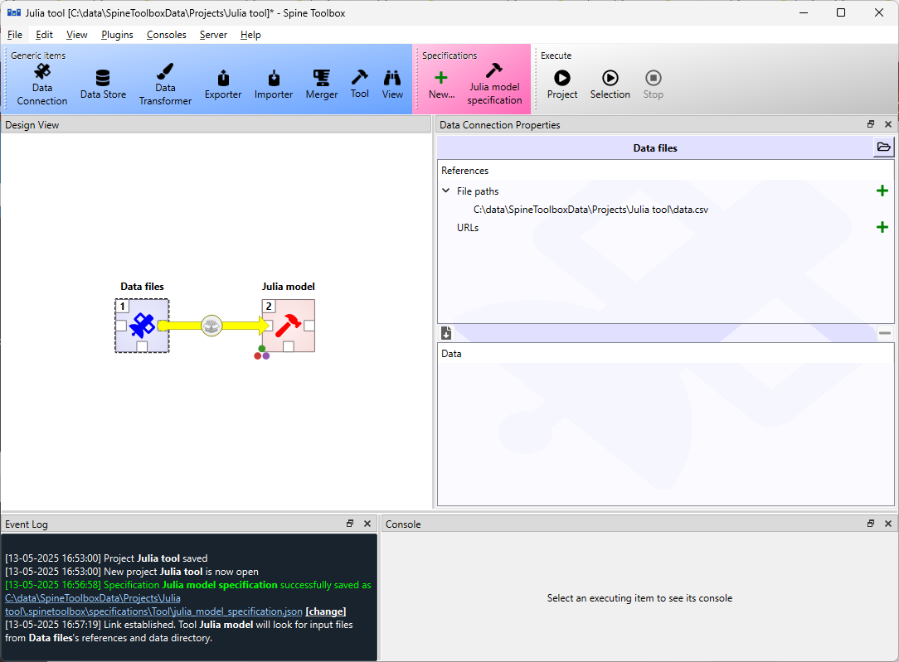

.. Executing Projects documentation
   Created 16.1.2019

.. |play-all| image:: ../../spinetoolbox/ui/resources/menu_icons/play-circle-solid.svg
            :width: 16
.. |play-selected| image:: ../../spinetoolbox/ui/resources/menu_icons/play-circle-regular.svg
            :width: 16
.. |stop| image:: ../../spinetoolbox/ui/resources/menu_icons/stop-circle-regular.svg
            :width: 16

.. _Executing Projects:

******************
Executing Projects
******************

This section describes how executing a project works and what resources are passed between project
items at execution time. The buttons used to control executions are located in the **Toolbar**'s Execute -section.
Execution happens by either pressing the *Execute Project* button (|play-all|) to execute the
whole project, or by pressing the *Execute Selected* button (|play-selected|) to only execute selected items.
Next to these buttons is the **Stop** button (|stop|), which can be used to stop an ongoing execution.
A project consists of project items and connections (yellow arrows) that are visualized on the **Design View**.
You use the project items and the connections to build a **Directed Acyclic Graph (DAG)**, with the project
items as *nodes* and the connections as *edges*. The DAG is traversed using the **breadth-first-search** algorithm.

Rules of DAGs:

1. A single project item with no connections is a DAG.
2. All project items that are connected, are considered as a single DAG (no matter, which
   direction the arrows go). If there is a path between two items, they are considered as belonging
   to the same DAG.
3. Even though loops are not allowed in classic DAG's, these are allowed in Spine Toolbox! See section
   :ref:`Links and Loops`.

You can connect the nodes in the **Design View** how ever you want but you cannot execute the resulting
DAGs if they break the rules above. Here is an example project with three DAGs.

- DAG 1: items: **a**, **b**, **c**, **d**. connections: **a**-**b**, **a**-**c**, **b**-**d**, **c**-**d**
- DAG 2: items: **e**, **f**. connections: **e**-**f**
- DAG 3: items: **g**. connections: None

The numbers on the upper left corners of the icons show the item's **execution ranks**
which roughly tell the order of execution within a DAG.
Execution order of DAG 1 is **a->b->c->d** or **a->c->b->d** because **b** and **c** are **siblings**
which is also indicated by their equal execution rank.
DAG 2 execution order is **e->f** and DAG 3 is just **g**.
All three DAGs are executed in a row though which DAG gets executed first is undefined.
Therefore all DAGs have their execution ranks starting from 1.

We use the words **predecessor** and **successor** to refer to project items that are upstream or
downstream from a project item. **Direct predecessor** is a project item that is the immediate predecessor
while **Direct Successor** is a project item that is the immediate successor.
For example, in the DAG 1 presented before, the
successors of **a** are project items **b**, **c** and **d**. The direct successor of **b** is **d**. The
predecessor of **b** is **a**, which is also its direct predecessor.

After you press the |play-all| button, you can follow the progress
and the current executed item in the **Event Log**.
**Design view** also animates the execution.

Items in a DAG that breaks the rules above are marked by X as their rank.
Such DAGs are skipped during execution.
The image below shows such a DAG where the items form a loop (see how to make a loop in :ref:`Links and Loops`)

You can also execute only the selected parts of a project by multi-selecting the items you want and
pressing the |play-selected| button in the tool bar. For example, to execute only items
**b**, **d** and **f**, select the items in **Design View** and click |play-selected| button.

.. tip::
   You can select multiple project items by holding the **Ctrl** key down and clicking on
   desired items or by drawing a rectangle on the **Design view**.

Example DAG
===========

When you have created at least one Tool specification, you can execute a Tool as part of the DAG. The
Tool specification defines the process that is executed by the Tool project item. As an example, below
we have two project items; **Data files** Data Connection and **Julia model** Tool connected to each other.

In this example, **Data files** has a single file reference ``data.csv``.
Data Connections make their files visible to direct successors and thus the connection between **Data Files**
and **Julia model** provides ``data.csv`` to the latter.

Selecting the **Julia model** shows its properties in the **Tool Properties** dock widget.

.. image:: img/execution_julia_tool_selected.png
   :align: center

In the top of the Tool Properties, there is a **Specification** drop-down menu.
From this drop-down menu, you can select the Tool specification for this particular Tool item.
In this case, the **Julia model specification** tool specification has been selected for the **Julia model** Tool.
Below the drop-down menu, you can make and/or choose a precompiled sysimage (only available for Julia tools) and
edit the Tool's **Command line arguments**. Note that the **Available resources** list contains
``<project>/data.csv`` resource, which is provided to this Tool by the **Data files** project item. You can make this
resource available to the Tool, by dragging the ``<project>/data.csv`` item with your mouse from the
**Available resources** list and dropping it under the *Tool arguments* item in the **Command line arguments** list.
The **Execute in** radio buttons control whether the files defined for this Tool (in the Tool specification editor)
are first copied to a **work** directory and executed there, or if the execution should happen in the **source**
directory where the main program file is located. **Source code root directory** lets you specify an alternative
source directory which is useful e.g. if the Tool is a software package that should be run from the package root
instead of the location of the main program file. In **Reuse console id**, a free console name can be given.
This can be used to execute multiple Tools in the workflow using the same console, which can be useful for limiting
the number of concurrent processes Spine Toolbox spawns (See also **File->Settings->Engine**) or for debugging. When
no console id is given, the Tool is executed in its own console. The executable used in executing the Tool is shown
below the console id. Below that, there is a checkbox with the choice to **kill consoles at the end of execution**
which might be useful to constraint memory usage. **Log process output to a file** redirects the Tool's stdout &
stderr to a file in ``<project dir>/.spinetoolbox/<Tool name>/logs/``
**Results...** button opens the Tool's result archive directory in system's file browser. You can change the default
result archive directory from the line edit and the Open folder button next to the **Results** button.

When you click on the |play-all| button, the execution starts from the **Data files** Data Connection as indicated by
the execution rank numbers (the number in the upper-left corner of the project item icon). When executed, Data
Connection items *advertise* their files and references to project items that are their direct successors. In this
particular example, ``data.csv`` contained in **Data files** is also a required input file for
**Julia model specification**. When the **Julia model** is executed, it checks if it finds ``data.csv`` from its direct
predecessor items that have already been executed. Once the input file has been found the Tool starts processing
the main program file *script.jl*. Note that if the connection would be the other way around (from **Julia model**
to **Data files**) execution would start from the **Julia model** and it would fail because it wouldn't be able to
find the required ``data.csv``. The same thing happens if there is no connection between the two project items.

Since the Tool specification type was set as *Julia* and the main program is a Julia script, Spine Toolbox starts the
execution in the Julia Basic Console by default (See :ref:`Settings` section).
