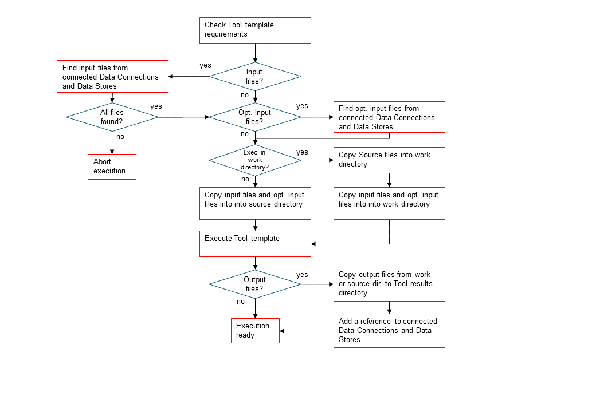

.. Executing Projects documentation
   Created 16.1.2019

.. _Executing Tools:

.. |play-all| image:: ../../spinetoolbox/ui/resources/project_item_icons/play-circle-solid.svg
            :width: 16
.. |play-selected| image:: ../../spinetoolbox/ui/resources/project_item_icons/play-circle-regular.svg
            :width: 16

******************
Executing Projects
******************
This section describes how executing a project works. Execution happens by pressing the |play-all| (Execute project)
or the |play-selected| (Execute selection) buttons in the main window tool bar. A project consists of project items
and connections (yellow arrows) that are visualized on the *Design View*. You use the project items and the connections
to build a **Directed Acyclic Graph (DAG)**, with the project items as *nodes* and the connections as *edges*. A DAG is
traversed using the **breadth-first-search** algorithm.

Rules of DAGs:

1. A single project item with no connections is a DAG.
2. All project items that are connected, are considered as a single DAG. It does not matter, which direction the
   connections go. If there is a path between two items, they are considered as belonging to the same DAG.
3. Loops are not allowed (this is what acyclic means).

You can connect the nodes in the *Design View* how ever you want but you cannot execute the resulting DAGs if they break
the rules above. Here is an example project with three DAGs.

.. image:: img/example_dags.png
   :align: center

- DAG 1: items: a, b, c, d. connections: a-b, a-c, b-d, c-d
- DAG 2: items: e, f. connections: e-f
- DAG 3: items: g. connections: None

When you press the |play-all| button, all three DAGs are executed in a row. You can see the progress and the current
executed item in the *Event Log*. Execution order of DAG 1 is *a->b->c->d* or
*a->c->b->d* since items b and c are siblings. DAG 2 execution order is *e->f* and DAG 3 is just *g*. If you have
a DAG in your project that breaks the rules above, that DAG is skipped and the execution continues with the next DAG.

You can execute a selected parts of a project by selecting the desired pressing the |play-selected|
button in the tool bar. For example, to execute only items b, d and f, you select the items in *Design View* or in the
project item list in *Project* dock widget and then press the |play-selected| button.

.. tip::
   If you are not sure how execution works in your DAG, you can test the execution just like in the above picture
   by adding and connecting empty Data Connection items and then pressing the play buttons.

Executing Tools as a part of the DAG
====================================
All project items in the DAG are *executed*, but the real processing only happens when a Tool project item is
executed. When you have created at least one Tool specification, you can execute a Tool as part of the DAG. The Tool
specification defines the process that is depicted by the Tool project item. As an example, below we have two project
items; *Julia Model* Tool and *Data File* Data Connection connected to each other.

.. image:: img/execution_julia_tool_selected.png
   :align: center

Selecting the *Julia Model* shows its properties in the *Properties* dock widget. In the top of the Tool
Properties, there is a specification drop-down menu. From this drop-down menu, you can select the Tool specification
for this particular Tool item. The *Julia Model Specification* tool specification has been selected for the Tool
*Julia Model*. Below the drop-down menu, you can see the details of the Tool specification, command line arguments,
Source files (the first one is the main program file), Input files, Optional input files and Output files.
*Results...* button opens the Tool's result archive directory in the File Explorer (all Tools have their own result
directory). The *Execute in* radio buttons control, whether this Tool is first copied to a work directory and executed
there, or if the execution should happen in the source directory where the main program file is located.

When you click on the |play-all| button, the execution starts from the *Data File* Data Connection. When executed,
Data Connection items *advertise* their files and references to project items that are in the same DAG and
executed after them. In this particular example, the *Data File* item contains a file called *data.csv* as depicted
in the picture below.

.. image:: img/execution_data_connection_selected.png
   :align: center

When it's the *Julia Model* tools turn to be executed, it checks if it finds the file *data.csv* from project items,
that have already been executed. When the DAG is set up like this, the Tool finds the input file that it requires
and then starts processing the Tool specification starting with the main program file *script.jl*. Note that if the
connection would be the other way around (from *Julia Model* to *Data File*) execution would start from the
*Julia Model* and it would fail because it cannot find the required file *data.csv*. The same thing happens if there
is no connection between the two project items. In this case the project items would be in separate DAGs.

Since the Tool specification type was set as *Julia* and the main program is a Julia script, Spine Toolbox starts the
execution in the Julia Console (if you have selected this in the application *Settings*, See :ref:`Settings` section).

Tool execution algorithm
========================
The below figure depicts what happens when a Tool item with a valid Tool specification is executed.

