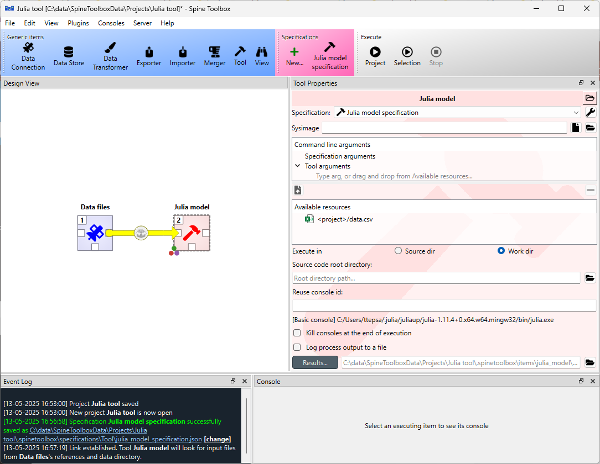

.. Executing Tools (Tool templates) documentation
   Created 16.1.2019

.. _Executing Tools:

***************
Executing Tools
***************

This section describes how to execute Tool templates using Tools and what happens when the Execute button is clicked.

When you have created at least one Tool template to your project, you are almost ready to execute it. As an example,
in the figure below, when you select the *Julia Script* Tool (created previously), its properties are shown in
the *Properties* dock widget.

In the top of the Tool Properties, there is a template drop-down menu. Since we only have a single Tool template in our
project, it is attached automatically to the Tool. If there were more than one Tool template in the project, you could
switch the Tool template from this drop-down menu. Below the drop-down menu, you can see the details of the Tool
template, command line arguments, Source files (the first one is the main program file), Input files, Optional input
files and Output files. Below these, you can see three buttons. Tool template execution starts from the *Execute*
button. You can terminate the execution from the *Stop* button (enabled only when execution is in progress).
*Results...* button open the selected Tools results directory in the File Explorer (all Tools have their own results
directory). Since the Tool template type is Julia and the main program is a Julia script, Spine Toolbox starts the
execution according to your choices in the application *Settings* (See *Settings* section in the User Guide). The below
figure depicts the complete execution algorithm.

.. image:: img/execution_algorithm.png
   :align: center

Since the example Tool template does not have any input files, optional input files, nor output files, the execution
process is simple.
