..  Getting Started
    Created: 18.6.2018

.. |dc_icon| image:: ../../spinetoolbox/ui/resources/project_item_icons/file-alt.svg
            :width: 16
.. |file| image:: ../../spinetoolbox/ui/resources/file.svg
          :width: 16
.. |file_link| image:: ../../spinetoolbox/ui/resources/file-link.svg
          :width: 16
.. |tool_icon| image:: ../../spinetoolbox/ui/resources/project_item_icons/hammer.svg
             :width: 16
.. |execute| image:: ../../spinetoolbox/ui/resources/project_item_icons/play-circle-solid.svg
             :width: 16
.. |add_tool_specification| image:: ../../spinetoolbox/ui/resources/wrench_plus.svg
              :width: 16
.. |tool_specification_options| image:: ../../spinetoolbox/ui/resources/wrench.svg
             :width: 16

.. _SpineData.jl: https://gitlab.vtt.fi/spine/data/tree/manuelma
.. _SpineModel.jl: https://gitlab.vtt.fi/spine/model/tree/manuelma
.. _Jupyter: http://jupyter.org/
.. _IJulia.jl: https://github.com/JuliaLang/IJulia.jl

.. _Getting Started:

***************
Getting Started
***************

Welcome to the Spine Toolbox's getting started guide.
In this guide you will learn two ways of running a `"Hello, World!" program
<https://en.wikipedia.org/wiki/%22Hello,_World!%22_program>`_ on Spine Toolbox.
The following topics are touched (although not exhaustively covered):

.. contents::
   :local:

Spine Toolbox Interface
-----------------------

The central element in Spine Toolbox's interface is the *Design View*,
where you can visualize and manipulate your project in a pictorial way.
Alongside *Design View* there are a few 'dock widgets' that provide additional functionality:

- *Project* provides a more concise view of your project, including:

   - *Items* currently in the project, grouped by category:
     Data Stores, Data Connections, Tools, Views, Importers and Exporters.
   - *Tool specifications* available in the project.

- *Properties* provides an interface to interact with the currently selected project item.
- *Event Log* shows relevant messages about every performed action.
- *Process Log* shows the output of executed Tools.
- *Julia console* provides an interface to interact with the Julia programming language,
  and also allows Spine Toolbox to execute Julia Tools.
- *Python console* provides an interface to interact with the Python programming language,
  and also allows Spine Toolbox to execute Python Tools.

.. tip:: You can drag-and-drop the Dock Widgets around the screen,
   customizing the interface at your will.
   Also, you can select which ones are shown/hidden using either the **View/Dock Widgets** menu,
   or the main menu toolbar's context menu.
   Spine Toolbox remembers your configuration between sessions. Selecting **Restore Dock Widgets**
   from the **View/Dock Widgets** menu restores the widgets back to their default location.

.. tip:: Most elements in the Spine Toolbox's interface are equipped with *tool tips*. Leave your mouse
   cursor over an element (button, view, etc.) for a moment to make the tool tip appear.

Creating a Project
------------------

To create a new project, please do one of the following:

A) From the application main menu, select **File -> New project...**
B) Press *Ctrl+N*.

The *Select project directory (New project...)* dialog will show up.
Browse to a folder of your choice and create a new directory called 'hello world' there.
Then select the 'hello world' directory.
Spine Toolbox will populate that directory with some files and directories it needs to store the project's data.

Congratulations, you have created a new project.

Creating a Tool specification
-----------------------------

.. note:: Spine Toolbox is designed to run and connect multiple tools, which are specified using **Tool specifications**.
   You may think of a Tool specification as a self-contained program specification including a list of source files,
   required and optional input files, and expected output files. Once a Tool specification is added to a project, it can
   then be associated to a **Tool** item for its execution as part of the project workflow.

In the *Project* dock widget, click on the 'add tool specification button' (|add_tool_specification|)
just below the *Tool specifications* list, and select **New** from the popup menu.
The *Edit Tool specification* form will appear. Follow the instructions below to create a minimal Tool specification:

- Type 'hello_world' in the *Type name here...* field.
- Select 'Python' from the *Select type...* dropdown list,
- Click on the |file| button right next to the field that reads *Add main program file here...*, and
  select the option **Make new main program** from the popup menu.
- A file browser dialog should open. Name the file *hello_world.py* and save it in a folder of your choice,
  e.g. in 'hello world'

After this, the *Edit Tool specification* form should be looking similar to this:

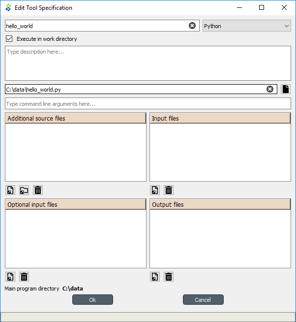

Click **Ok** at the bottom of the form. A new system dialog will appear, allowing you to
select a file name and location to save the Tool specification we've just created.
Don't change the default file name, which should be *hello_world.json*.
Just select a folder from your system (it can be the same where you saved the main program file)
and click **Save**.

Now you should see the new tool specification in the *Project* widget, *Tool specifications* list.

.. tip:: Saving the Tool specification into a file allows you to add and use the same Tool specification in
   another project. To do this, you just need to click on the add tool button (|add_tool_specification|),
   select **Add existing...** from the popup menu, and then select the tool specification file from your system.

Congratulations, you have just created your first Tool specification.

However, the main program file *hello_world.py* was created empty, so for the moment this Tool
specification does absolutely nothing. To change that, we need to add instructions to that program file so it actually
does something when executed.

Right click on the 'hello_world' item in the *Tool specifications* list and select **Edit main program file...** from the
context menu. This will open the file *hello_world.py* in your default editor.

Enter the following into the file's content::

    print("Hello, World!")

Save the file.

Now, whenever *hello_world.py* is executed, the sentence 'Hello, World!'
will be printed to the standard output.

Adding a Tool item to the project
---------------------------------

.. note:: The **Tool** item is used to run Tool specifications available in the project.

Let's add a Tool item to our project, so that we're able to run the Tool specification we created above.
To add a Tool item drag-and-drop the Tool icon (|tool_icon|) from the *Drag & Drop Icon* toolbar
onto the *Design View*.

The *Add Tool* form will popup.
Type 'say hello world' in the name field, select 'hello_world' from the dropdown list just below, and click **Ok**.
Now you should see the newly added Tool item as an icon in the *Design View*,
and also as an entry in the *Project* dock widget, *Items* list, under the 'Tools' category. It should
look similar to this:

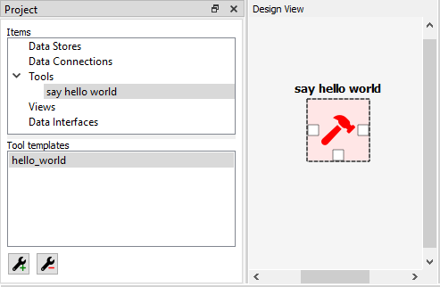

Executing a Tool
----------------

As long as the 'say hello world' Tool item is selected, you will be able to see its *Properties* on the right part
of the window, looking similar to this:

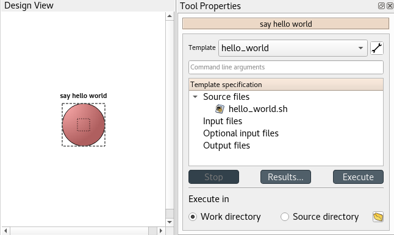

Press *execute project* |execute| button on the toolbar. This will execute the Tool specification 'hello world',
which in turn will run the main program file *hello_world.py* in a dedicated process.

You can see more details about execution in the *Event Log*. Once it's finished, you will see its output in
the *Process Log* or in the *Python Console* depending on your settings (See :ref:`Settings`).

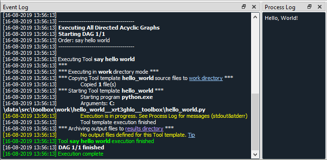

Congratulations, you just ran your first Spine Toolbox project.

Editing a Tool specification
----------------------------

To make things more interesting, we will now specify an *input file* for our 'hello_world' Tool specification.

.. note:: Input files specified in the Tool specification can be used by the program source files, to obtain some relevant
   information for the Tool's execution. When executed, a Tool item looks for input files in
   **Data Connection** and **Data Store** items connected to its input.

Click on the 'Tool specification options' button (|tool_specification_options|) in 'say hello world'
*Properties*, and select **Edit Tool specification** from the popup menu.
This will open the 'Edit Tool specification' form pre-filled with data from the 'hello_world' specification.

Click the *add input files and/or directories* |file_link| button right below the *Input files* list.
A dialog will appear that lets you enter a
name for a new input file. Type 'input.txt' and click **Ok**. The form
should now look like this:

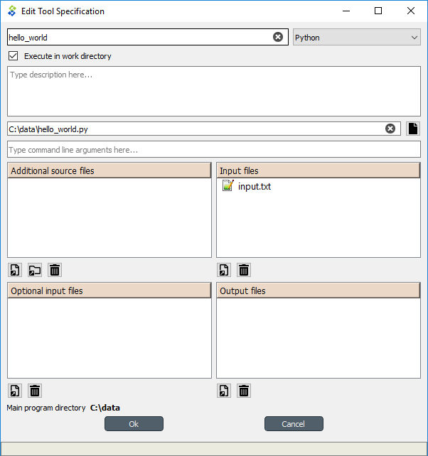

Click **Ok** at the bottom of the form.

.. note:: See :ref:`Tool specification editor` for more information on editing Tool specifications.

So far so good. Now let's use this input file in our program.
Click on the 'Tool specification options' button (|tool_specification_options|) again,
and this time select **Edit main program file...** from the popup menu. This will open the file
*hello_world.py* in your default editor.

Delete whatever it's in the file and enter the following instead::

    with open("input.txt") as input_file:
        print(input_file.read())

Save the file.

Now, whenever *hello_world.py* is executed, it will look for a file called 'input.txt'
in the current directory, and print its content to the standard output.

Try executing the tool by pressing |execute| in the toolbar.
*The execution will fail.* This is because the file 'input.txt' is not
made available for the Tool:

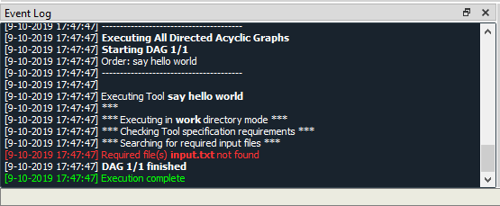

Adding a Data Connection item to the project
--------------------------------------------

.. note:: The **Data Connection** item is used to hold generic data files,
   so that other items, notably Importer and Tool items, can make use of that data.

Let's add a Data Connection item to our project, so that we're able to pass the file 'input.txt' to 'say hello world'.
To add a Data Connection item drag-and-drop the Data Connection icon (|dc_icon|) from the main window toolbar
onto the *Design View*.

The *Add Data Connection* form will show up.
Type 'pass input txt' in the name field and click **Ok**.
Now you should see the newly added Data Connection item as an icon in the *Design View*,
and also as an entry in the *Project* dock widget, *Items* list, under the 'Data Connections' category. It should
look similar to this:

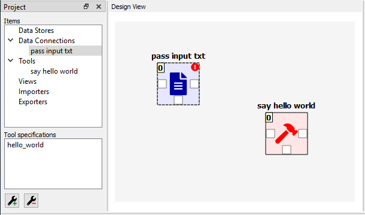

Adding data files to a Data Connection
--------------------------------------

As long as the 'pass input txt' Data Connection item is selected,
you will be able to see its *Properties* on the right part
of the window, looking similar to this:

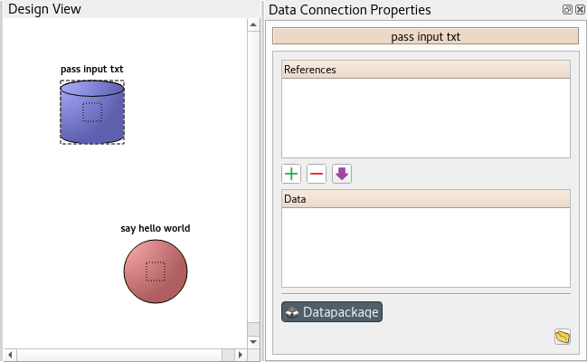

Right click anywhere within the *Data* box and select **New file...** from the context menu.
When prompted to enter a name for the new file, type 'input.txt' and click **Ok**.

Now you should see the newly created file in the *Data* list:

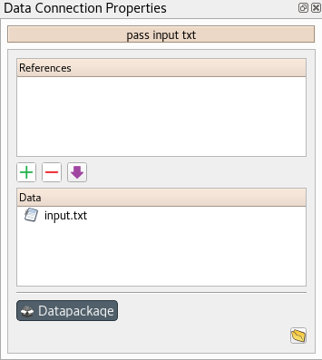

Double click on this file to open it in your default text editor. Then enter the following into the file's content::

    Hello again, World!

Save the file.

Connecting project items
------------------------

As mentioned above, a Tool item looks for input files in
Data Connection and Data Store items connected to its input. Thus, what we need to do now is
create a *connection* from 'pass input txt' to 'say hello world', so the file 'input.txt' gets passed.

To do this, click on one of the *connector* slots at the edges of 'pass input txt' in the *Design view*, and then
on a similar slot in 'say hello world'. This will create an arrow pointing from one to another,
as seen below:

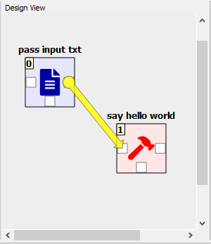

Press |execute| on the toolbar. The Tool will run successfully this time:

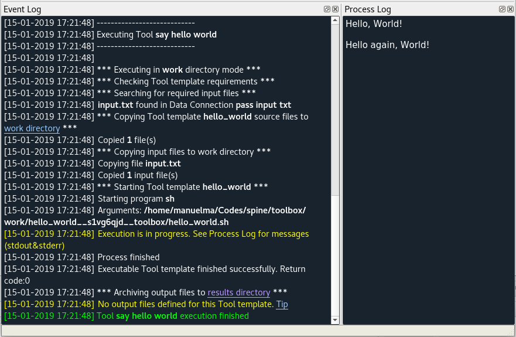

That's all for now. I hope you've enjoyed following this guide as much as I enjoyed writing it. See you next time.
