..  Tutorial for Spine Toolbox
    Created: 18.6.2018

.. |plus| image:: ../../spinetoolbox/ui/resources/plus.png
          :width: 16

.. |Spine| image:: ../../spinetoolbox/ui/resources/Spine_symbol.png
           :width: 16
.. |tool_icon| image:: ../../spinetoolbox/ui/resources/tool_icon.png
             :width: 24
.. |add_tool| image:: ../../spinetoolbox/ui/resources/add_tool.png
              :width: 24

.. _SpineData.jl: https://gitlab.vtt.fi/spine/data/tree/manuelma
.. _SpineModel.jl: https://gitlab.vtt.fi/spine/model/tree/manuelma
.. _Jupyter: http://jupyter.org/
.. _IJulia.jl: https://github.com/JuliaLang/IJulia.jl

***************
Getting Started
***************

Welcome to the getting started guide for Spine Toolbox. This section gives an introduction to the user interface,
and a tutorial on how to get started using the application. The following topics are covered:

.. contents::
   :local:

Knowing the Interface
---------------------

The Spine Toolbox interface revolves around the **Main View**,
where you can visualize and manipulate your project in a pictorial way.
Alongside **Main view** there are a few *docked widgets*:

- **Project** provides more concise views of your project into three tabs:

   - *Items* lists project items grouped by category:
     Data Stores, Data Connections, Tools and Views.
   - *Connections* shows connections between items.
   - *Templates* lists Tool templates that Tool items can run.

- **Item Controls** shows controls for the currently selected item.
- **Event Log** outputs informative messages, and also errors and warnings.
- **Subprocess Output** shows the output of command line tools.
- **Julia REPL** is the console where Julia tools are executed.

.. tip:: You can drag-and-drop the docked widgets around the screen,
   customizing the interface at your will.
   Also, you can select which ones are shown/hidden using either the **View** menu,
   or the *Add Item* toolbar's context menu.
   Spine Toolbox will remember your configuration between sessions.

.. tip:: Most elements in the Spine Toolbox's interface are equipped with *tool tips*. Leave your mouse
   cursor over an element (button, view, etc.) for a moment to make the tool tip appear.

Creating a Project
------------------

In the main menu bar, click **File**, **New...** to open the *New Project* form.
Type 'tutorial' in the name field ---we will leave the description empty this time--- and click **Ok**.

Congratulations, you have created a new project.

.. tip:: You can also create a new project with the keyboard combination *Ctrl+N*.

Working with Data Stores
------------------------

Let's add a Data Store to the project. You can do this in two different ways:

A) In the main menu bar, click **Edit**, **Add Data Store**.
B) Drag-and-drop the *Data Store* icon (|ds_icon|) from the *Add Item* toolbar onto the *Main View*.

The *Add Data Store* form will appear.
Type 'simple test system' in the name field and click **Ok**.
Now you should see the newly added item in the *Main View*, and also in the *Project* widget, *Items* tab. It should
look similar to this:

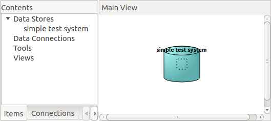

.. note:: The dotted square in the center of the item's figure is the *connector* button,
   and serves to make connections
   between this and other items in your project. You don't have other items yet so we'll leave
   this button alone for now.

Click anywhere in the Data Store item (outside of the connector button) to select it.

.. tip:: You can also select a project item
   by clicking on its name in the *Project* widget, *Items* tab.

With the Data Store item selected,
in the *Item Controls* area you should see two lists ---both empty for now---, *References* and *Data*:

- **References** lists sources where this Data Store can import data from. (These typically live *outside*
  the current Spine Toolbox project.)
- **Data** lists the contents of this Data Store's folder, where imported data is saved.
  You can open this folder in your file explorer by clicking **Open directory**.

Creating a new Spine database
~~~~~~~~~~~~~~~~~~~~~~~~~~~~~

Let's add data to this Data Store.
Click on the *Spine* button (|Spine|) under *Item controls*.
In the popup dialog, type 'simple' as the database name and click **Ok**.

Now you should see a new item in the *Data* list:

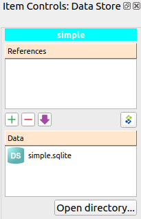

Using the Spine Data Store form
~~~~~~~~~~~~~~~~~~~~~~~~~~~~~~~

Double click on the 'simple.sqlite' file we've just created to open the **Spine Data Store** form. This is
a dedicated interface that you can use to manipulate databases in the Spine format. The interface is
divided in three main areas:

- **Object tree** displays the database contents into a tree,
  with object classes at the top level.
- **Object parameter** displays parameters associated with the object that is
  currently selected in the *Object tree*.
- **Relationship parameter** displays parameters associated with
  any relationships involving the currently selected object.

Right now you should see a list of pre-defined object classes in the *Object tree*.

.. note:: These pre-defined classes
   correspond to the *generic data structure* that Spine uses to define energy models.

Let's add a new object to the 'unit' object class. Right-click over the item tagged 'unit' in the *Object tree*
and select **Add object** from the context menu. In the popup dialog,
enter 'coal_import' in the name field and click **Ok**. Now you
should see the newly added object in the *Object tree*, under the 'unit' class.

Repeat the operation to add an object called 'Leuven' to the 'node' class.

Now let's add a relationship class between the 'node' and 'unit' object classes.
Right-clik on 'node' to display
the context menu, and this time select **Add relationship class**.
Enter 'node_unit' in the name field,
and select 'unit' from the drop-down list. Click **Ok** when you are done.
An item named 'node_unit' should appear now *both* under the 'coal_import' and 'Leuven' objects,
as below:

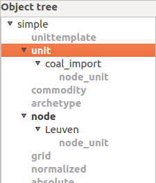

Let's add a relationship of class 'node_unit' between the two objects we've created.
Right-click on the 'node_unit' relationship class
below the 'coal_import' object and select **Add relationship** in the context menu.
Enter 'Leuven_coal_unit' in the name field and select 'Leuven' from the drop-down list (it should be
the only option available). Click **Ok**.

After this you should see an item called 'Leuven' under the 'node_unit' relationship class
(under the 'coal_import' object),
representing the newly added relationship.

Now expand the 'node_unit' relationship class under the 'Leuven' object. Here you will find an item named 'coal_import',
representing the same relationship but in the opposite sense:

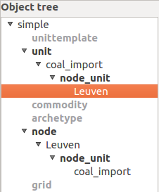

.. note:: Relationships in Spine are *omni-directional* (in simple terms, they work both ways).
   Therefore, for every relationship  you create, Spine Toolbox creates the symmetric relationship
   for you.

Let's go one step ahead and add a couple of parameters to the 'unit' class. Right click on 'unit'
and select **Add parameter** in the context menu.
Type 'conversion_cost' in the name field and press *Enter*.
This will automatically activate
the *Definition* tab in the *Object parameter* pane and highlight the newly inserted
parameter.

.. note:: Don't worry about the other fields in the *parameter* table for now. They are
   only there to support more sophisticated parameter definitions to be used, for instance,
   in time-varying energy models.

Repeat the operation to add a parameter named 'capacity_to_flow' to the 'unit' class. After this, you
should see something like this in the *Object parameter* pane, *Definition* tab:

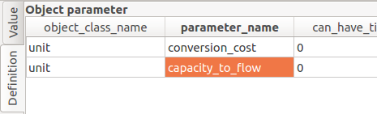

To finish our session with the *Spine Data Store* form, we will add a new parameter value. Right-click
on the 'coal_import' object under the 'unit' class, and select **Add parameter value** in the
context menu. In the drop-down list you should see the two parameters we have just
created. Select 'conversion_cost', type '12' in the value field and click **Ok** (don't worry
about the json field just yet).
This will automatically activate the *Value* tab in the *Object parameter* pane,
and highlight the newly inserted parameter value:

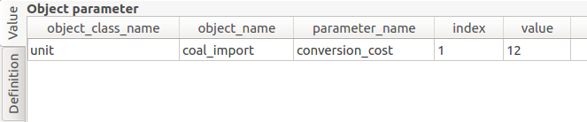

It's time to save our work. In the menu bar, click **Session**, **Commit**,
type 'Add coal_import, Leuven, and conversion_cost.' (or any other meaningful message)
and click **Ok**. All changes have now been committed to the 'simple.sqlite' database.

Select **Session**, **Close**, to close your session and go back to the main interface.

Now click on **Open directory** under
*Item Controls*. This will open your file explorer in the folder associated with
this Data Store.
You should see the 'simple.sqlite' file sitting there.
Take note of the file's path for the next step.
If you are using Windows with Spine Toolbox installed in the default location, it should
be something like this:
``C:\\SpineToolbox-0.0.16\projects\tutorial\simple_test_system\simple.sqlite``.

Adding an SQLite reference
~~~~~~~~~~~~~~~~~~~~~~~~~~

Just for illustration purposes, we will add a reference to the recently created 'simple.sqlite'
file. Please note that this is not something you would typically do in a real project.

Add a new *Data Store* item to the project and call it 'simple_reference'. Select this new item
to show its *Item Controls*, and
click on the plus button (|plus|) to open the *Add Database Reference* form.

.. note:: The *Add Database Reference* form allows you to access Spine databases in a number of
   SQL dialects. If you try to use a dialect that's currently not supported by your system,
   Spine Toolbox will offer to install the necessary packages for you. Just choose the
   appropriate package manager (*conda* or *pip*) when prompted. If you're unsure
   about which package manager to choose, it's usually safe to try one and then the other and see
   what works.

Select the 'sqlite' dialect in the drop-down list at the top,
and click on the **Browse...** button. This will
open a system dialog to let you
select an SQLite file from your computer. Find the 'simple.sqlite' file (recall the path
from the previous step) and click **Open**. Back in the *Add Database Reference* form, click
**Ok**. Now you should see an item called 'simple.sqlite' in the *References*
list.

You can open the 'simple.sqlite' reference using the *Spine Data Store* form by double-clicking on it (much in
the same way as you did with the 'simple.sqlite' file in the other Data Store).
Go ahead and do it. You will find the exact same
content that you just inserted in the 'simple.sqlite' database before.
Close the *Spine Data Store* form to go back to the main interface.

.. tip:: To remove a reference, select it by clicking on its name
   and then press the *minus* button (|minus|).
   You can also remove all references at once by pressing this button while nothing is selected.

.. tip:: You can share the 'simple.sqlite' file with other Spine Toolbox users so they can see
   (and possible continue) your work. All they need to do is add a reference to the 'simple.sqlite'
   file in their project, using the procedure we have just described.

Importing references
~~~~~~~~~~~~~~~~~~~~

Select the 'simple.sqlite' reference in the *References* list and then click on the *import* button (|import|).
This will copy the 'simple.sqlite' database into a file called 'simple.sqlite' in the Data Store folder.
After this, the *Item Controls* should look similar to this:

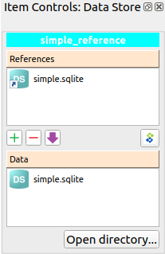

Working with Tools
------------------

Next we will run a simple optimisation model
in the system we've just created.
The model we will run is implemented in a file called `simple.jl`
supplied by `SpineModel.jl`.

.. important:: For this part of the tutorial you will need the `SpineData.jl` and `SpineModel.jl`
  Julia packages. Please follow the instructions at
  SpineData.jl_ and SpineModel.jl_ to get the latest versions.
  Note that `SpineData.jl` is a requirement
  for `Spinemodel.jl`, so you'll need to install `SpineData.jl` first.

Please locate the file `simple.jl` in your system in preparation for the next step.
If you are using Windows with Julia version 0.6+, the path should be something like this:
``C:\\Users\<your_username>\.julia\v0.6\SpineModel\examples\simple.jl``.

Creating Tool templates
~~~~~~~~~~~~~~~~~~~~~~~

.. note:: Tool templates are self-contained program definitions that can be executed by *Tool* items.
   A Tool template specifies the expected input and output files, as well as the program files
   that the Tool needs to run.

In the *Project* widget, select the *Templates* tab to see the list of
available *Tool templates*. There you should see an item called 'No tool template'
---don't worry about this, it's just an implementation detail.
To add a new Tool template, click on the add tool button (|add_tool|) just below the list,
and select **New** from the popup menu.
The *Tool Template* form will appear with a few options. Let's go from top to bottom:

- In the *name* field, type 'simple_tool_template'.
- In the *tool type* dropdown list, select Julia.
- Ignore the *description* and *command line arguments* fields this time.
- Click on the plus button (|plus|) under the *Source files* list. This will open a system
  dialog where you can select a Julia script from your computer. Select the
  `simple.jl` file from the `SpineModel.jl` examples folder (recall the path from above)
  and click **Open**.
- Finally, click on the plus button (|plus|) under the *Input files* list. Type
  `simple.sqlite` in the popup dialog and click **Ok**.

After all this, the *Tool Template* form should be looking like this:

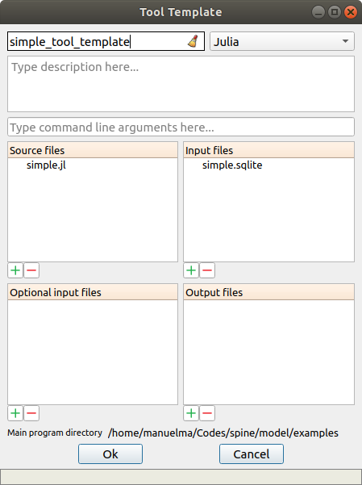

Click **Ok**. A system dialog will let you choose a location in your computer
to save the *simple_tool_template*
definition file. Click **Save** when you're done. Now you should see an item named
'simple_tool_template' in the list.

.. tip:: The Tool template definition file allows you to use the same Tool template in
   different projects. All you need to do is click on the add tool button (|add_tool|)
   and select **Open...** in the popup menu. A system dialog will appear to let you find
   and open any Tool template definition file stored in your computer.

From Tool Templates to Tool items
~~~~~~~~~~~~~~~~~~~~~~~~~~~~~~~~~

Let's add a *Tool* item to the project so we can run the Tool template created above.
Same as for Data Stores, you can add Tool items in two different ways:

A) In the main menu bar, click **Edit**, **Add Tool**.
B) Drag-and-drop the *Tool* icon (|tool_icon|) from the *Add Item* toolbar onto the *Main View*.

The *Add Tool* form will appear.
Type 'simple_model' in the name field, select 'simple_tool_template' from the dropdown list,
and click **Ok**.
Now you should see the newly added item in the *Main View*, next to the 'simple_test_system' Data Store,
and also in the *Project* widget, *Items* tab, under the 'Tools' category. It should
look similar to this:

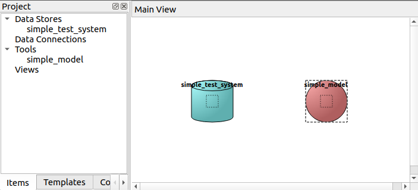

Select the 'simple_model' item to show it's *Item Controls*. (Remember that to select an
item, you just need to click anywhere on it outside of the central connector button.)
Here you will see that this Tool is set to execute the 'simple_tool_template'. Also, you
can see the list of input and output files from the Tool template definition:

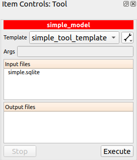

.. tip:: You can change which Tool template a Tool item will execute at any moment
   by using the *Template* dropdown list in its *Item Controls*. This means that you
   don't need to attach a Tool template when creating the Tool; you can always do it later
   from here.

Passing input data to Tools
~~~~~~~~~~~~~~~~~~~~~~~~~~~

In order for our 'simple_model' Tool to run, we need to provide it with the file 'simple.sqlite'
listed under its *Input files* (and every other file in there if it was more).

You may recall that our
'simple_test_system' Data Store has a file called exactly like that,
so we just need to pass it to 'simple_tool'. This is done by creating a *Connection* from
the Data Store to the Tool.

Click on the central connector button in the Data Store item to start 'drawing' the connection arrow.
Now click on the central connector button in the Tool item. That's it:

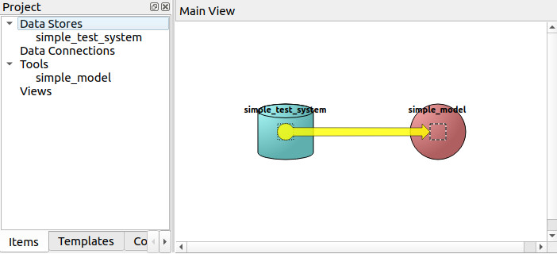

Now whenever the 'simple_model' Tool is executed, it will look for input files
in the 'simple_test_system' Data Store.

.. tip:: A Tool item looks for input files in all the Data Stores and Data Connections
   connected to its input. But not only that: if these Data Stores and Data Connections have
   themselves other Data Stores or Data Connections connected to *their* inputs, the Tool
   also looks in those and continues like this until the chain stops or goes into a loop.

Executing Tools
~~~~~~~~~~~~~~~

All set. The 'simple_model' Tool is ready to run. Click on the **Execute** button
under its *Item Controls*.

.. important:: By default, Spine Toolbox is configured to run Julia Tools using
   the Julia Jupyter_ kernel provided by the IJulia.jl_ package. In case you haven't
   installed `IJulia.jl`, Spine Toolbox will offer to do it for you
   the first time you execute a Julia Tool.

   However, if this process fails, Spine Toolbox will 'fallback' to run the Tool
   using the `julia` executable from the command prompt.

After the Tool's execution finishes, you should see the output of the
`simple.jl` script in the *Julia REPL*. For now it's just the definition of
the ``flow`` variable. Check out the script to learn more.

Collecting Tools output data
~~~~~~~~~~~~~~~~~~~~~~~~~~~~

.. TODO
.. Working with Data Connections
.. -----------------------------
..
..
..
.. Using the Julia REPL
.. --------------------
..
..
.. Miscellaneous
.. -------------
