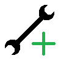
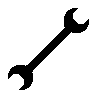
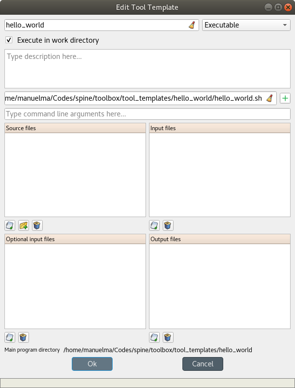
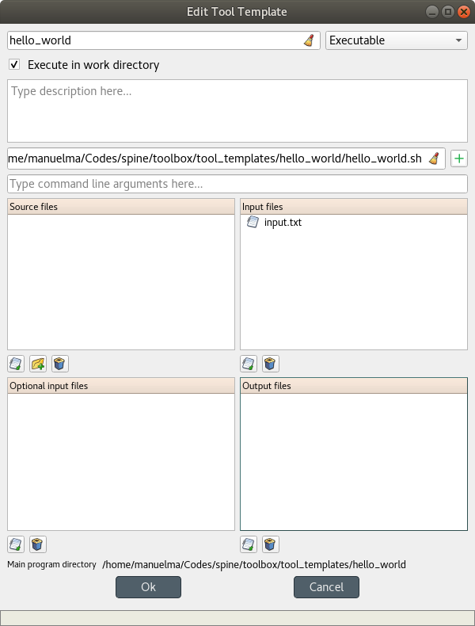

..  Tutorial for Spine Toolbox
    Created: 18.6.2018

.. _SpineData.jl: https://gitlab.vtt.fi/spine/data/tree/manuelma
.. _SpineModel.jl: https://gitlab.vtt.fi/spine/model/tree/manuelma
.. _Jupyter: http://jupyter.org/
.. _IJulia.jl: https://github.com/JuliaLang/IJulia.jl

***************
Getting Started
***************

Welcome to the Spine Toolbox's getting started guide.
In this guide you will learn how to run two versions of the Spine Toolbox's 'Hello, World!' project.
The following topics are touched (but not exhaustively covered):

.. contents::
   :local:

Spine Toolbox Interface
-----------------------

The central element in Spine Toolbox's interface is the **Design View**,
where you can visualize and manipulate your project in a pictorial way.
Alongside *Design view* there are a few 'docked widgets' that provide additional functionality:

- *Project* provides a more concise view of your project, including:

   - *Items* currently in the project, grouped by category:
     Data Stores, Data Connections, Tools and Views.
   - *Tool templates* available in the project.

- *Properties* provides an interface to interact with the currently selected project item.
- *Event Log* shows relevant messages about every performed action.
- *Process Log* shows the output of executed Tools.
- *Julia console* provides an interface to interact with the Julia programming language,
and also allows Spine Toolbox to execute Julia Tools.

.. tip:: You can drag-and-drop the Docked Widgets around the screen,
   customizing the interface at your will.
   Also, you can select which ones are shown/hidden using either the **View/Docked Widgets** menu,
   or the *Add Item* toolbar's context menu.
   Spine Toolbox will remember your configuration in between sessions.

.. tip:: Most elements in the Spine Toolbox's interface are equipped with *tool tips*. Leave your mouse
   cursor over an element (button, view, etc.) for a moment to make the tool tip appear.

Creating a Project
------------------

In the main menu bar, click **File**, **New...** to open the *New Project* form.
Type 'hello world' in the name field ---we will leave the description empty this time--- and click **Ok**.

Congratulations, you have created a new project.

.. tip:: You can also open the *New Project* form with the keyboard combination *Ctrl+N*.

Creating a Tool template
------------------------

.. note:: Spine Toolbox is designed to run and connect multiple tools, which are specified using **Tool Templates**.
   You may think of a Tool Template as a self-contained program specification including a list of source files,
   required and optional input files, and expected output files. Once a Tool template is added to a project, it can
   then be associated to a **Tool** item for its execution as part of the project workflow.

In the *Project* widget, click on the 'add tool template button' (|add_tool_template|)
just below the *Tool templates* list, and select **New** from the popup menu.
The *Edit Tool Template* form will appear. Follow the instructions below to create a minimal Tool template:

- Type 'hello_world' in the *name* field.
- Select 'Executable' from the *tool type* dropdown list,
- Click on the plus button (|plus|) right next to the field that reads *Add main program file here...*, and
  select the option **Make new main program** from the popup menu.
- Now you should enter the name of the main program file for this tool template.
  If you are on Windows, enter 'hello_world.bat';
  if you are on Linux or Mac, enter 'hello_world.sh'. Click **Ok**.
- A new dialog will open where you can select a folder to save this main program file.
  Select any folder and click **Open**.

After all this, the *Edit Tool Template* form should be looking similar to this:

Click **Ok** at the bottom of the form. A new system dialog will appear, allowing you to
select a file name and location to save the Tool template we've just created.
Don't change the default file name, which should be 'hello_world.json'.
Just select a folder from your system (it can be the same where you saved the main program file)
and click **Save**.

Now you should see the new tool template in the *Project* widget, *Tool templates* list.

.. tip:: Saving the Tool template into a file allows you to add and use the same Tool template in
   another project. All you need to do is click on the add tool button (|add_tool_template|),
   select **Add existing...** from the popup menu, and then select the tool template file from your system.

Congratulations, you have just created your first minimal Tool template.

However, the main program file 'hello_world.bat' (or 'hello_world.sh') was created empty, so for the moment this Tool
template does absolutely nothing. To change that, we need to add instructions to that file so it actually
does something when executed.

Right click on the 'hello_world' item in the *Tool templates* list and select **Edit main program file...** from the
context menu. This will open the file 'hello_world.bat' (or 'hello_world.sh') in your default text editor.

If you're on Windows and your main program file is called 'hello_world.bat', type the following in your text editor:

``@echo Hello, world!``

If you're on Linux or Mac and your main program file is called 'hello_world.sh',
type the following in your text editor:

``echo Hello, world!``

Save the file.
Now, whenever 'hello_world.bat' (or 'hello_world.sh') is executed, the sentence 'Hello, world!'
will be printed to the standard output.

Adding a Tool item to the project
---------------------------------

.. note:: The **Tool** item is used to run Tool templates available in the project.

Let's add a Tool item to our project, so that we're able to run the Tool template we created above.
To add a Tool item you have two alternatives:

A) In the main menu bar, click **Edit**, and then **Add Tool**.
B) Drag-and-drop the Tool icon (|tool_icon|) from the *Add Item* toolbar onto the *Design View*.

After doing one of these, the *Add Tool* form will popup.
Type 'say hello world' in the name field, select 'hello_world' from the dropdown list at the bottom, and click **Ok**.
Now you should see the newly added Tool item as an icon in the *Design View*,
and also as an entry in the *Project* widget, *Items* list, under the 'Tools' category. It should
look similar to this:

.. image:: img/say_hello_world_tool.png
   :align: center

Executing a Tool
----------------

As long as the 'say hello world' Tool item is selected, you will be able to see its properties on the right part
of the window, looking similar to this:

.. image:: img/say_hello_world_tool_properties.png
   :align: center

Press **Execute**. This will execute the Tool template 'hello world',
which in turn will run the main program file 'hello_world.bat' (or 'hello_world.sh') in a dedicated process.

You can see more details about execution in the *Event log*, and once finished, its output in
the *Process log*:

.. image:: img/hello_world_event_process_log.png
   :align: center

Congratulations, you just run your first Spine Toolbox project.

Editing a Tool template
-----------------------

To make things more interesting, we will now specify an *input file* for our 'hello_world' Tool template.

.. note:: Input files specified in the Tool template can be used by the program source files, to obtain some relevant
   information for the Tool's execution. When executed, a Tool item looks for input files in
   **Data Connection** and **Data Store** items connected to its input.

Click on the 'tool template options' button (|tool_template_options|) in the 'say hello world'
Tool item properties, and select **Edit Tool template** from the popup menu.
This will open the 'Edit Tool Template' form pre-filled with data from the 'hello_world' Tool template.

Right below the *Input files* list, you will find two buttons. Click on the left one.
A dialog will appear so that you can enter a
name for a new input file. Type 'input.txt' and click **Ok**. The 'Edit Tool Template' form
should be now looking like this:

Clik **Ok** at the bottom of the form.

So far so good. Now let's use this input file in our program file.
Click on the 'tool template options' button (|tool_template_options|) again,
and this time select **Edit main program file...** from the popup menu. This will open the file
'hello_world.bat' (or 'hello_world.sh') in your default text editor.

If you're on Windows and your main program file is called 'hello_world.bat',
modify the file's content to look like this:

``type input.txt``

If you're on Linux or Mac and your main program file is called 'hello_world.sh',
modify the file's content to look like this:

``cat input.txt``

Save the file.
Now, whenever 'hello_world.bat' (or 'hello_world.sh') is executed, it will look for a file called 'input.txt'
in the current directory, and print its content to the standard output.

Press **Execute** in 'say hello world' properties again.
*The execution will fail.* This is because the file 'input.txt' is not
made available for the Tool:

.. image:: img/hello_world_failed.png
  :align: center

Adding a Data Connection item to the project
--------------------------------------------

.. note:: The **Data Connection** item is used to hold and manipulate generic data files,
   so that other items, notably Tool items, can make use of that data.

Let's add a Data Connection item to our project, so that we're able to pass the input file to our 'say hello world'
Tool.
To add a Data Connection item you have two alternatives:

A) In the main menu bar, click **Edit**, and then **Add Data Connection**.
B) Drag-and-drop the Data Connection icon (|dc_icon|) from the *Add Item* toolbar onto the *Design View*.

After doing one of these, the *Add Data Connection* form will popup.
Type 'pass input txt' in the name field and click **Ok**.
Now you should see the newly added Data Connection item as an icon in the *Design View*,
and also as an entry in the *Project* widget, *Items* list, under the 'Data Connections' category. It should
look similar to this:

.. image:: img/pass_input_txt_dc_and_say_hello_world_tool.png
   :align: center

Adding data files to a Data Connection
--------------------------------------

As long as the 'pass input txt' Data Connection item is selected,
you will be able to see its properties on the right part
of the window, looking similar to this:

.. image:: img/pass_input_txt_dc_properties.png
   :align: center

At the bottom right part you will find a button. Press it to open the Data Connection's directory in your file folder.
It should be an empty folder at the moment.

Now use whatever mechanism is available in your system to create a new
file called 'input.txt' in this folder. Set the contents of this file to ``Hello again, World!``.

Back to Spine Toolbox, you should see the newly created file in 'pass input txt' properties:

.. image:: img/pass_input_txt_dc_properties_with_file.png
   :align: center

Connecting project items
------------------------

As mentioned above, a Tool item looks for input files in
Data Connection and Data Store items connected to its input. Thus, what we need to do now is
connect 'pass input txt' to the input of 'say hello world', so the file 'input.txt' gets passed.

To do this, click on the *connector* button at the center of 'pass input txt' in the *Design view*, and then
on the corresponding button of 'say hello world'. This will create an arrow pointing from one to another,
as seen below:

.. image:: img/pass_input_txt_dc_to_say_hello_world_tool.png
   :align: center

Select 'say hello world' and press **Execute**. The Tool will run successfully this time:

.. image:: img/hello_again_world_event_process_log.png
   :align: center
