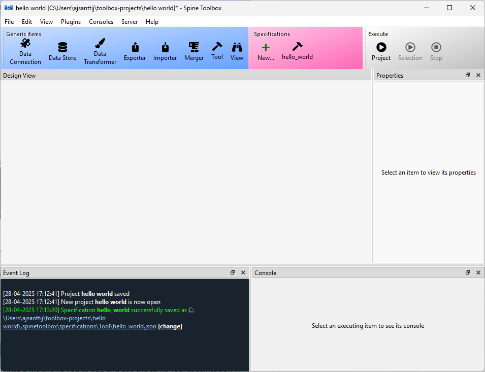
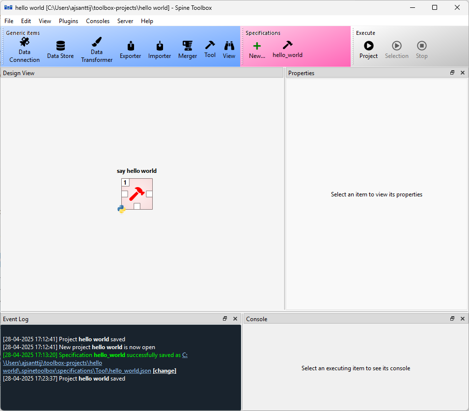
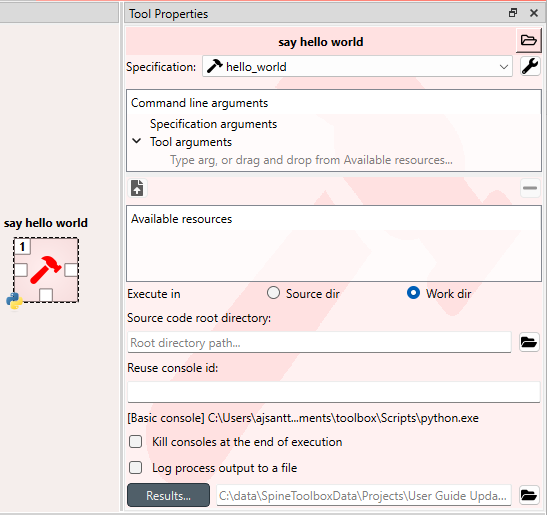
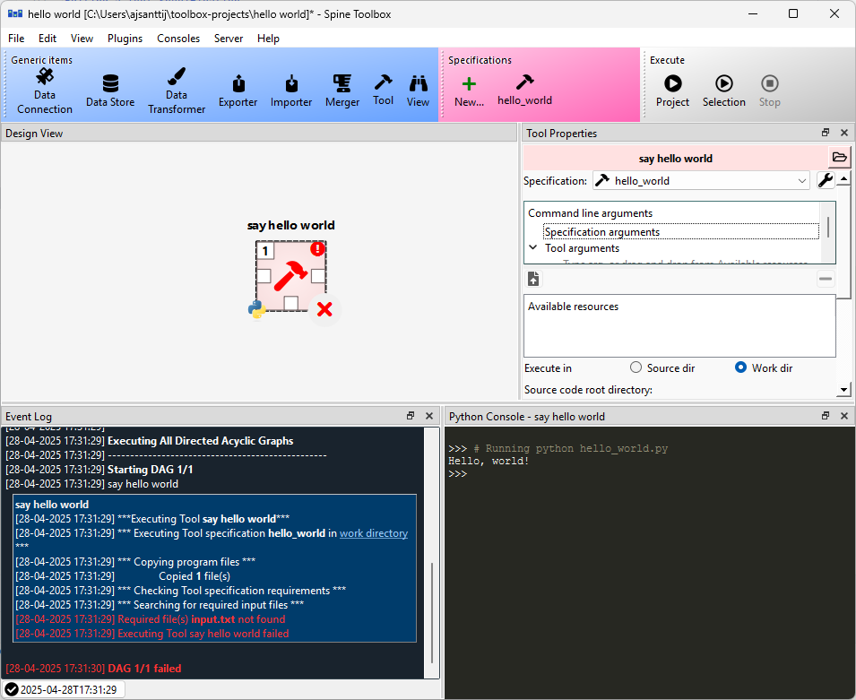
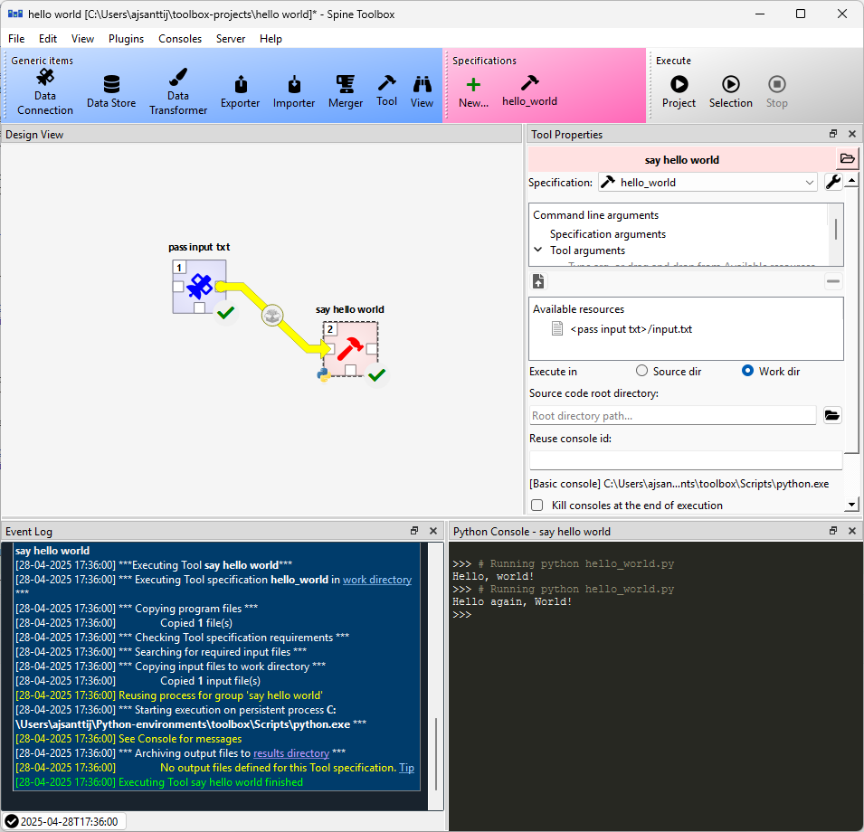

..  Getting Started
    Created: 18.6.2018

.. |dc_icon| image:: ../../spinetoolbox/ui/resources/project_item_icons/data_connection.svg
            :width: 16
.. |file| image:: ../../spinetoolbox/ui/resources/file.svg
          :width: 16
.. |file_regular| image:: ../../spinetoolbox/ui/resources/file-regular.svg
          :width: 16
.. |file_link| image:: ../../spinetoolbox/ui/resources/file-link.svg
          :width: 16
.. |tool_icon| image:: ../../spinetoolbox/ui/resources/project_item_icons/hammer.svg
             :width: 16
.. |execute| image:: ../../spinetoolbox/ui/resources/menu_icons/play-circle-solid.svg
             :width: 16
.. |add_tool_specification| image:: ../../spinetoolbox/ui/resources/wrench_plus.svg
              :width: 16
.. |tool_specification_options| image:: ../../spinetoolbox/ui/resources/wrench.svg
             :width: 16
.. |plus| image:: ../../spinetoolbox/ui/resources/plus.svg
          :width: 16

.. |wrench| image:: ../../spinetoolbox/ui/resources/wrench.svg
             :width: 16
.. _Getting Started:

***************
Getting Started
***************

Welcome to the Spine Toolbox's getting started guide.
In this guide you will learn two ways of running a `"Hello, World!" program
<https://en.wikipedia.org/wiki/%22Hello,_World!%22_program>`_ on Spine Toolbox.
If you need help on how to run **SpineOpt.jl** using Spine Toolbox, see chapter
:ref:`How to Set up SpineOpt.jl`. For small example projects utilizing **SpineOpt.jl**, see `SpineOpt tutorials
<https://spine-tools.github.io/SpineOpt.jl/latest/tutorial/simple_system/>`_.

This chapter introduces the following topics:

.. contents::
   :local:

Spine Toolbox Interface
-----------------------

The central element in Spine Toolbox's interface is the **Design View**,
which allows you to visualize and manipulate your project workflow.
In addition to the **Design View** there are a few `dock widgets` that provide additional functionality:

* **Project** provides a more concise view of your project, including the *Items* that are currently in the
  project, grouped by category: Data Stores, Data Connections, Tools, Views, Importers, Exporters and
  Manipulators.
* **Properties** provides an interface to interact with the currently selected project item.
* **Event Log** shows relevant messages about user performed actions and the status of executions.
* **Console** allows Spine Toolbox to execute Tools written in Python, Julia or GAMS and provides an interface to
  interact with the aforementioned programming languages. Also shows a list of parallel executions available in the
  project.

In addition to the **Design View** and the dock widgets, the main window contains a **Toolbar** split into
two sections. The **Items** section contains the project items that you can drag-and-drop onto the **Design
View** and the **Execute** section has buttons related to executing the project.

.. tip:: You can drag-and-drop the dock widgets around the screen, customizing the interface at your will.
   Also, you can select which ones are shown/hidden using either the **View -> Dock Widgets** menu,
   or the main menu **Toolbar**'s context menu.
   Spine Toolbox remembers your configuration between sessions. Selecting **Restore Dock Widgets**
   from the **View -> Dock Widgets** menu restores the widgets back to their default location.

.. tip:: Most elements in the Spine Toolbox's interface are equipped with *tool tips*. Leave your mouse
   cursor over an element (button, checkbox, list, etc.) for a moment to make the tool tip appear.

Creating a Project
------------------

To create a new project, please do one of the following:

* From the application main menu, select **File -> New project...**
* Press **Ctrl+N**.

The *Select project directory (New project...)* dialog will show up.
Browse to a folder of your choice and create a new directory called 'hello world' there.
Then select the 'hello world' directory and click Select Folder.
Spine Toolbox will populate the selected directory with some files and directories it needs to store
the project's data.

Congratulations, you have created your first Spine Toolbox project.

Creating a Tool Specification
-----------------------------

.. note:: Spine Toolbox is designed to run and connect multiple tools, which are specified using **Tool specifications**.
   You may think of a Tool specification as a self-contained program specification including a list of source files,
   required and optional input files, and expected output files. Once a Tool specification is added to a project, it can
   then be associated to a Tool item for its execution as part of the project workflow.

.. note:: Just like the main window, the **Tool specification editor** consists of dock widgets that you can reorganize
   however you like.

In the **Toolbar**, click on the |downward_triangle| icon next to the Tool icon |tool_icon|, to reveal the Tool
specification list. Since there are none in the project yet, click on the |black_plus| button to open the
**Tool specification editor**. Follow the instructions below to create a minimal Tool specification:

* Type 'hello_world' into the *Name:* field.
* Select 'Python' from the *Tool type* dropdown list,
* Click on the |file_regular| button next to the *Main program file* text in the **Program files** dock widget. A
  *Create new main program file* file browser dialog opens. Name the file ``hello_world.py`` and save it e.g. directly
  to the 'hello world' project directory or to a folder of your choice.

We have just created a ``hello_world.py`` Python script file, but at the moment the file is empty. Spine Toolbox provides
an mini **IDE** where you can view and edit the contents of Tool specification files. Let's try it out.

Select ``hello_world.py`` below the *Main Program File*. Click on the (black) editor dock widget with the title
'hello_world.py'.

Type in the following::

    print("Hello, world!")

Now, whenever ``hello_world.py`` is executed, the sentence 'Hello, World!' will be printed to the standard output.

The **Tool specification editor** should be looking similar to this now:

Note that the program file (``hello_world.py``) and the Tool specification (hello world) now have unsaved changes.
This is indicated by the star (*) character next to hello_world.py* and the Tool specification name in the tabbar
(hello_world*).

* Save changes to both by either pressing **Ctrl+S** or by mouse clicking on **Save** in the hamburger menu in
  the upper right hand corner.
* Close **Tool specification editor** by pressing **Alt+F4** or by clicking on 'X' in the top right hand corner of the
  window.

Your main window should look similar to this now.

Tool specifications are saved in JSON format by default into a dedicated directory under the project directory. If you
want you can open the newly created ``hello_world.json`` file by clicking on the file path in the Event log message. The
file will open in an external editor provided that you have selected a default program for files with the .json
extension (e.g in Windows 10 you can do this in **Windows Settings -> Apps -> Default apps**). In general, you don't need
to worry about *the contents* of the JSON Tool specification files. Editing these is done under the hood by the app.

If you want to save ``hello_world.json`` somewhere else, you can do this by clicking the white [Change] link
after the path in the Event Log.

.. tip:: Saving the Tool specification into a file allows you to add and use the same Tool specification in
   another project. To do this, you just need to click the *From file...* button
   (|plus|) in the **Toolbar** and select the Tool specification file (.json) from your system.

Congratulations, you have just created your first Tool specification.

Adding a Tool Item to the Project
---------------------------------

.. note:: The Tool project item is used to run Tool specifications.

Let's add a Tool item to our project, so that we're able to run the Tool specification we created above.
To add a Tool item drag-and-drop the Tool icon |tool_icon| from the **Toolbar** onto the **Design View**.

The **Add Tool** form will popup. Change name of the Tool to 'say hello world', and select 'hello_world' from the
dropdown list just below, and click **Ok**. Now you should see the newly added Tool item as an icon in the
**Design View**, and also as an entry in the **Project** dock widget, under the 'Tools' category. It
should look similar to this:

   
|

Another way to do the same thing is to drag the |tool_icon| with the 'hello world' text from the **Toolbar** onto
the **Design View**. Similarly, the **Add Tool** form will popup but the 'hello world' tool specification is already
selected from the dropdown list.

.. note:: The Tool specification is now saved to disk but the project itself is not. Remember to save the project
   every once in a while when you are working. You can do this from the main window **File -> Save project** button
   or by pressing **Ctrl+S** when the main window is active.

Executing a Tool
----------------

Select the 'say hello world' Tool on **Design View**, and you will see its *Properties* in the dedicated dock
widget. It looks similar to this:

   
|

Press **execute project** |execute| button on the **Toolbar**. This will execute the 'say hello world' Tool project item
which now has the 'hello world' Tool specification associated to it. In actuality, this will run the main program
file ``hello_world.py`` in a dedicated process.

Once the execution is finished, you can see the details about the item execution as well as the whole execution in
**Event Log**. The **Console** contains the output of the executed program file.

   
|

.. note:: For more information about setting up Consoles in Spine Toolbox, please see :ref:`Setting up Consoles and External Tools`
   for help.

Congratulations, you just executed your first Spine Toolbox project.

Editing a Tool Specification
----------------------------

To make things more interesting, we will now specify an *input file* for our 'hello_world' Tool specification.

.. note:: Input files specified in the Tool specification can be used by the program source files, to obtain
   input data for the Tool's execution. When executed, a Tool item looks for input files in **Data Connection**,
   **Data Store**, **Exporter**, and **Data Transformer** project items connected to its input.

Open the Tool specification editor for the 'hello world' Tool spec. You can do this for example, by double-clicking
the 'say hello world' Tool in **Design View**, or by right clicking the 'say hello world' -item in the **Project** dock
widget and selecting **Specification... -> Edit specification**, or from the **Tool Properties** by clicking the
Tool specification options button (|wrench|) next to the specification and selecting **Edit specification**.

In **Input & Output files** dock widget, click the |plus| button next to the `Input Files` text. A dialog appears,
that lets you enter a name for an input file. Type 'input.txt' and press Enter.

So far so good. Now let's use this input file in our program. Still in the Tool specification editor, replace the
text in the main program file (``hello_world.py``), with the following::

    with open("input.txt") as input_file:
        print(input_file.read())

Now, whenever ``hello_world.py`` is executed, it will look for a file called ``input.txt``
in the current directory, and print its content to the standard output.

The editor should now look like this:

|

Save the specification and close the editor by pressing **Ctrl+S** and then **Alt+F4**.

.. note:: See :ref:`Tool specification editor` for more information on editing Tool specifications.

Back in the main window, note the exclamation mark on the Tool icon in **Design View**, if you hover the mouse over
this mark, you will see a tooltip telling you in detail what is wrong. If you want you can try and execute the
Tool anyway by pressing |execute| in the **Toolbar**. *The execution will fail.* because the file ``input.txt`` is not
made available for the Tool:

  
|

Adding a Data Connection Item to the Project
--------------------------------------------

.. note:: The Data Connection item is used to hold generic data files,
   so that other items, notably Importer and Tool items, can make use of that data.

Let's add a Data Connection item to our project, so that we're able to pass the file ``input.txt`` to
'say hello world'. To add a Data Connection item, drag-and-drop the Data Connection icon (|dc_icon|) from the **Toolbar**
onto the **Design View**.

The *Add Data Connection* form will show up. Type 'pass input txt' in the name field and click **Ok**. The newly
added Data Connection item is now in the **Design View**, and also as an entry in the **Project** dock widgets items list,
under the 'Data Connections' category.

Adding Data Files to a Data Connection
--------------------------------------

Select the 'pass input txt' Data Connection item to view its properties in the *Properties* dock widget. It should look
similar to this:

   
|

Right click anywhere within the **Data** box and select **New file...** from the context menu.
When prompted to enter a name for the new file, type 'input.txt' and click **Ok**.

There's now a new file in the *Data* list:

   
|

Double click this file to open it in your default text editor. Then enter the following into the file's content::

    Hello again, World!

Save the file.

Connecting Project Items
------------------------

As mentioned above, a Tool item looks for input files in Data Connections or other items connected to its input. Thus
you now need to create a connection from 'pass input txt' to 'say hello world'. To do this, click on one of the
*connector* slots at the edges of 'pass input txt' in the **Design view**, and then on a similar slot in
'say hello world'. This will create an arrow pointing from one to another, as seen below:

   
|

Press |execute| once again. The project will be executed successfully this time:

   
|

That's all for now. I hope you've enjoyed following this guide as much as I enjoyed writing it. See you next time.

Where to next: If you need help on how to set up and run **SpineOpt.jl** using Spine Toolbox, see chapter
:ref:`How to Set up SpineOpt.jl`. After setting up SpineOpt, there are three tutorials over on **SpineOpt.jl**'s
documentation that will help you get started on using SpineOpt in Spine Toolbox:
`Simple system
<https://spine-tools.github.io/SpineOpt.jl/latest/tutorial/simple_system/>`_,
`Two hydro plants
<https://spine-tools.github.io/SpineOpt.jl/latest/tutorial/tutorialTwoHydro/>`_, and
`Case study A5
<https://spine-tools.github.io/SpineOpt.jl/latest/tutorial/case_study_a5/>`_.
