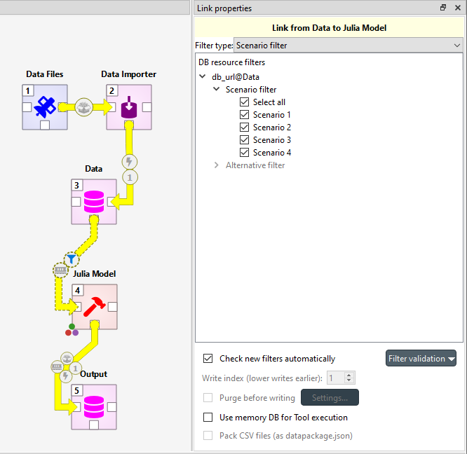
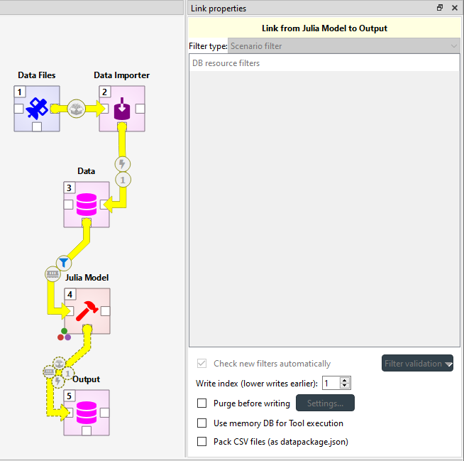

.. Links documentation
   Created 28.6.2023

.. |play-all| image:: ../../spinetoolbox/ui/resources/menu_icons/play-circle-solid.svg
            :width: 16
.. |play-selected| image:: ../../spinetoolbox/ui/resources/menu_icons/play-circle-regular.svg
            :width: 16
.. |stop| image:: ../../spinetoolbox/ui/resources/menu_icons/stop-circle-regular.svg
            :width: 16

.. _Links and Loops:

***************
Links and Loops
***************

Links
=====

Links are the things that connect project items to each other. If Tool is the heart of a DAG, then
links are the veins that connect the heart to other vital organs.

Creating a new link between items is simple. First you need to select any of the connector slots on the item where
you want the link to originate form. Then select any connector slot on the item that you
want to connect to. There are no limitations for how many links one connector slot can have.

Like items, links can also have properties, depending on the types of items
they are connecting. When a link is selected, these properties can be modified in the **Properties** dock widget.
The small bubble icons in a link represent the state of the link's properties. When an icon is blue, the
corresponding selection is active in the **Properties** dock widget.

Data Store as Source
--------------------

Below is an example of what the **Properties** dock widget might look like when a link originating from a Data Store
is selected:

**DB resource filters** is divided into **Scenario filters** and **Alternative filters**.
With the filters, you can select which scenarios or alternative are included in the execution of subsequent items.
You can read more about the filters in :ref:`Scenarios and Alternatives`.
Because the filter types are mutually exclusive,
you must to select the currently active type from the **Filter type** combo box at the top.

The **Check new filters automatically** option allows you to choose whether new scenarios or alternatives in the
database should be automatically selected in this specific link. **Filter validation** allows you to force that at least
one scenario or alternative is selected at all times in that specific link.

**Use memory DB for Tool execution** allows using a temporary in-memory database while executing a Tool which may
speed up execution if the Tool accesses the database a lot.

Data Store as Destination
-------------------------

In the image below, the selected link ends in a Data Store **Output**. Because of this,
the available selections in **Properties** differ from the previous image.

Now the link has no filters, but the write index and other various database related options become available.

**Write index** controls which items write to the database first.
Smaller indices take precedence over larger ones
while items with the same index write in an undefined order.
Defining a correct write order is crucial when multiple items writing to a common database
depend on each other,
or when the items might overwrite each other's data.
Below is an example of how write indices should be set up in case
where some structural data must be imported to Model Data
before prices can be imported:

**Purge before writing** option purges the target Data Store before write operations.
Click on **Settings...** to select which items to purge.

.. warning:: This purge has no undo available.

.. _Setting up datapackages in Links:

Packing CSV files into datapackage
----------------------------------

When the source item may provide output files, the **Pack CSV files (as datapackage.json)** option becomes enabled.
This option may be handy when an item provides a lot of CSV files that e.g. need to imported into a Data Store.
Checking this options does two things:

- A ``datapackage.json`` file is created in the common parent directory of all CSV files the source item provides.
  This file defines a datapackage that consists of the CSV files.
- The destination item receives only the ``datapackage.json`` file instead of any CSV files from the source item.

See `the datapackage specification <https://specs.frictionlessdata.io/data-package/>`_
for more information on datapackages.

Loops
=====

A loop is a special kind of link. They do exactly what their name reveals: they are used to create loops in DAGs.
If you try to add a normal link in a place where it would form a directed cycle in the DAG, you will be asked if you
want to create a loop instead. The other way to create a loop is to hold down **Alt** while creating a link like any
other. Loops can be distinguished from ordinary links by their color, which is turquoise instead of the ordinary yellow.

What sets apart loops from ordinary links, is their ability to control the item execution via loop conditions.
A loop condition can be an existing Tool specification or a Python script. A loop and its properties are
showcased in the image below.

.. image:: img/loop_properties.png
   :align: center

The default loop condition is a Python script that only has the line ``exit(1)`` in it. This causes the loop to act like
a regular link, since the loop runs only when the exit code of its condition is 0. The execution of the example project
would then go like this:

1. Tool is executed.
2. Tool (1) is executed.
3. Loop condition runs, exits with exit code 1, Tool is not executed again.

Here is a minimal example on how to control a loop:

.. image:: img/loop_example_dag.png
   :align: center

The Tool in the image is set to execute in the source directory from the
properties tab and has the following specification:

.. image:: img/loop_tool_spec.png
   :align: center

The loop has the following condition:

.. code-block:: python

   import sys

   file = sys.argv[1]
   num = -1
   for row in open(file):
      num = int(row.strip())
      if num == 5:
         exit(1)
   print(f"Going for round {num + 1}")

and has the file ``input.txt`` set as a command line argument.

When the Tool is executed, it will run a total of five times. Each time it writes a number, one bigger than the last,
to the file ``input.txt``. After writing to the file, it passes the file name as a command line argument to the loop.
The loop then reads all the lines in the text file and exits with code 0 if the number five is not in the file. Because
the exit code is 0, the Tool fires up again. If the loop runs into the number five when it is reading the text file, it
exits with code 1, meaning that it will no longer loop the execution. The print statements of the Tool are visible in
**Python console** and the lines that the loop prints out can be found in the **Event log**.
