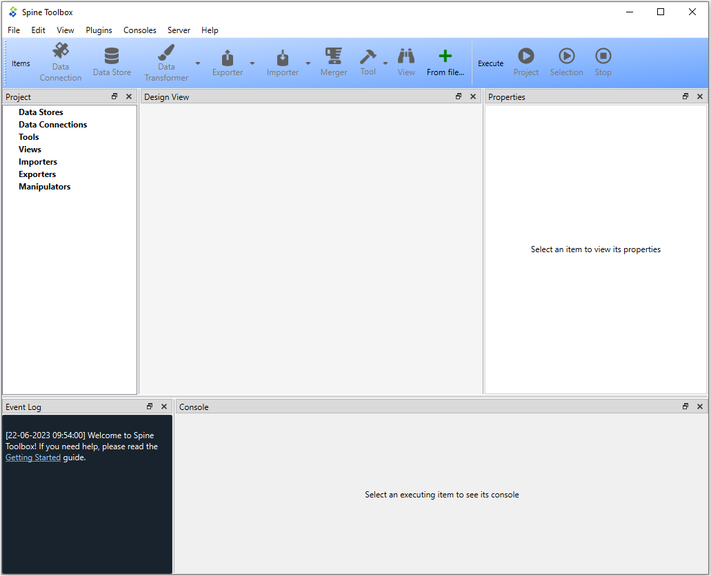

.. Main Window documentation
   Created 16.1.2019

.. |play-all| image:: ../../spinetoolbox/ui/resources/menu_icons/play-circle-solid.svg
            :width: 16
.. |play-selected| image:: ../../spinetoolbox/ui/resources/menu_icons/play-circle-regular.svg
            :width: 16
.. |stop| image:: ../../spinetoolbox/ui/resources/menu_icons/stop-circle-regular.svg
            :width: 16
.. |trash| image:: ../../spinetoolbox/ui/resources/menu_icons/trash-alt.svg
            :width: 16

.. _Main Window:

***********
Main Window
***********

This section describes the different components in the application main window.

The first time you start the application you will see the main window like this.

The application main window contains four dock widgets (**Design View**, **Properties**, **Event Log**, **Console**), a
**Toolbar**, and a menu bar with **File**, **Edit**, **View**, **Plugins**, **Consoles**, **Server**
and **Help** menus. The **Properties** dock widget shows the properties of the selected project item. **Event Log**
shows messages based on user actions and item executions. It shows messages from processes that are spawned by the
application, i.e. it shows the stdout and stderr streams of executable programs. In addition, it displays messages
related to item's execution.

**Console** provides Julia and Python consoles that can be interacted with. What kind of console
is shown depends on the Tool type of the specific Tool. Only an item that is currently executing or has already
executed shows something in this dock widget. To view an item's console, the item must be selected. When executing
Python/Julia tools, the Tool's Python/Julia code will be included into the console and executed there.

.. tip:: You can configure the Julia and Python versions you want to use in **File -> Settings**.

The menu bar in the top of the application contains **File**, **Edit**, **View**, **Plugins**, **Consoles**, **Server**
and **Help** menus. In the **File** menu you can create a new project, open an existing project, save the project or
open the application Settings among other things. Spine Toolbox is project based, which means that you need to create
a new project or open an existing one before you can do anything. You can create a new project by selecting
**File -> New project...** from the menu bar. In the **Edit** menu you can for example copy, paste and duplicate items
as well as undo and redo actions. In the **Plugins** menu you can install and manage plugins. **Consoles** menu
provides a way to start detached consoles. In the **Server** menu you can retrieve projects from a server. **Help**
contains a link to this documentation as well as various tidbits about Spine Toolbox.

The **Items** section of the **Toolbar** contains the available
:ref:`project item <Project Items>` types.
The **Execute** section contains icons that control the execution of the items in the **Design view**. The |play-all|
button executes all workflows in the project in parallel. The |play-selected| button
executes the selected project items only. The |stop| button terminates the execution (if running).

You can add a new project item to your project by pointing your mouse cursor on any of the draggable items
in the **Toolbar**, then click-and-drag the item on to the **Design view**.
After this you will be presented a dialog, which asks you to fill in basic information about the new project
item (name, description, etc.).

The main window is very customizable so you can e.g. close the dock widgets that you do not need, rearrange the order
of the dock widgets by dragging them around and/or resize the views to fit your needs and display size or
resolution. You can find more ways to customize the visual elements of Spine Toolbox in the :ref:`settings <Settings>`.

.. note:: If you want to restore all dock widgets to their default place use the menu item
   **View -> Dock Widgets -> Restore Dock Widgets**.
   This will show all hidden dock widgets and restore them to the main window.
