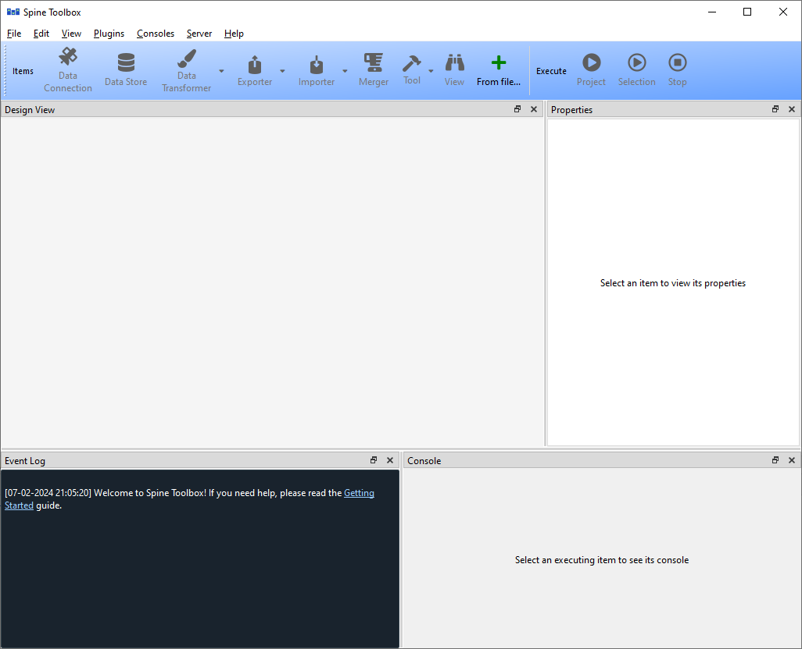

.. Main Window documentation
   Created 16.1.2019

***********
Main Window
***********

This section describes the different components in the application main window.

.. contents::
    :local:

The first time you start the application you will see the main window.

The application main window contains five dock widgets (*Project*, *Properties*, *Event Log*, *Process Log*, and *Julia
Console*), an *Add Item* tool bar, a project *Design view*, and a menu bar with *File*, *Edit*, *View*, and *Help*
menus. The Project dock widget contains a list of project items and Tool templates that are available in your
project. The Properties dock widget shows the properties of the selected project item. Event Log shows messages
depending on what you do in Spine Toolbox. Process Log shows messages from processes that are spawned by the
application, i.e. it shows the stdout and stderr streams of GAMS, Julia (if running without the Julia REPL, see
``Settings`` section in the User Guide), and executable programs. Julia Console provides an embedded Julia REPL.
If you choose to execute Julia tools in REPL, the Julia code will be included into the Julia REPL in the Julia
Console and executed there. You can interact with the Julia REPL in the Julia Console like you would with any
Julia REPL that you use.

.. tip:: You can configure the Julia version you want to use in ``File->Settings``.

The menu bar in the top of the application contains *File*, *Edit*, *View*, and *Help* menus. In the *File* menu
you can create a new project, save the project, open an existing project, rename your project, and open the
application Settings. Spine Toolbox is project based, which means that you need to create a new project or
open an existing one before you can do anything. You can create a new project by selecting ``File->New...``
from the menu bar. *Add Item* tool bar contains four draggable items *DS*, *DC*, *T*, and *V*, which represent
the available project item types. It also has a button with a red *X*, which can be used to remove all items from your
project. *Design view* is where you build your project using project items. You can add a new project item by
pointing your mouse cursor on any of the draggable items in the *Add Item* tool bar, then click-and-drag the
project item on to the *Design view*. After this you will be presented a dialog, which asks you to fill in basic
information about the new project item (name, description, etc.).

The main window is very customizable so you can e.g. close the dock widgets that you do not need and/or you can
resize the views to fit your needs and display size or resolution.

.. note:: If you want to restore all dock widgets to their default place use the menu item ``View->Dock Widgets->
   Restore Dock Widgets``. This will show all hidden dock widgets and restore them to the main window.

Here is one example, how you can customize the main window. In the picture, a user has created a project *First
project*, which contains four project items. A Data Store called *Database*, and Data Connection called *Data
Files*, A Tool called *Julia Script*, and a View called *Result Viewer*. You can also see the project items
categorized by their project item type in the *Project* dock widget.

.. image:: img/main_window_first_project_with_four_project_items.png
   :align: center
