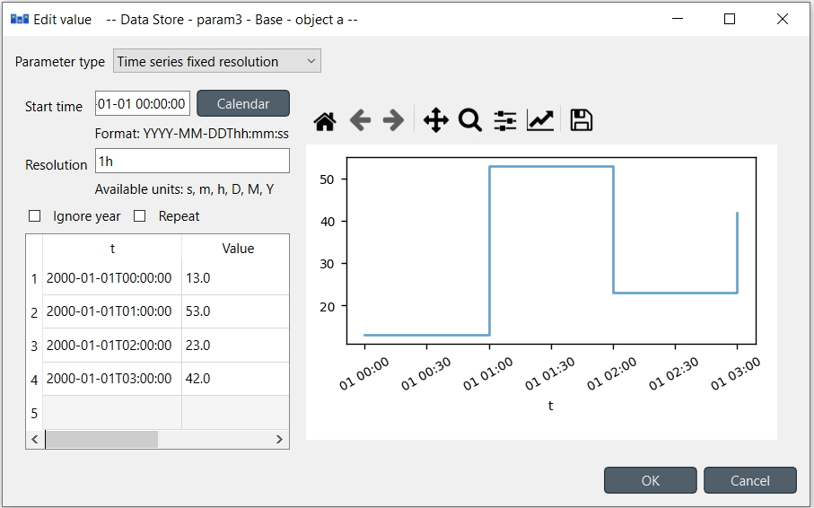
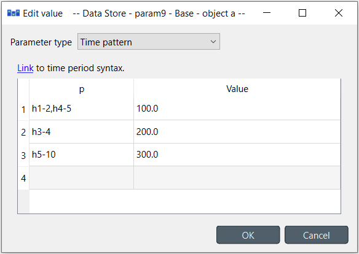

..  Parameter value editor
    Created: 15.8.2019

**********************
Parameter value editor
**********************

Parameter value editor is used to edit object and relationship parameter values
such as time series, time patterns or durations.
It can also convert between different value types, e.g. from a time series to a time pattern.

The editor is available from a **right click** popup menu
or by **double clicking** a parameter value in one of the data store views.

Choosing value type
-------------------

The combo box at the top of the editor window allows changing the type of the current value.

Plain values
------------

The simplest parameter values are of the *Plain value* type. These are numbers or booleans
which can be set by entering ``true`` or ``false`` on the *Parameter value* field.

.. image:: img/value_editor_plain.png
   :align: center

Time series
-----------

There are two types of time series: *variable* and *fixed resolution*.
Variable resolution means that the time stamps can be arbitrary
while in fixed resolution series the time steps between consecutive stamps are fixed.

.. image:: img/value_editor_time_series_variable.png
   :align: center

The editor windows is split into two in both cases.
The left side holds all the options and a table with all the data
while the right side shows a plot of the series.
The plot is not editable and is for visualization purposes only.

In the table rows can be added or removed from a popup menu available by a **right click**.
Data can be copied and pasted by **Ctrl-C** and **Ctrl-V**.
Copying from/to an external spreadsheet program is supported.

The time steps of a fixed resolution series are edited by the *Start time* and *Resolution* fields.
The format for the start time is `ISO8601 <https://en.wikipedia.org/wiki/ISO_8601>`_.
The *Resolution* field takes a single time step or a comma separated list of steps.
If a list of resolution steps is provided then the steps are repeated so as to fit the data in the table.

The *Ignore year* option available for both variable and fixed resolution time series
allows the time series to be used independent of the year.
Only the month, day and time information is used by the model.

The *Repeat* option means that the time series is cycled,
i.e. it starts from the beginning once the time steps run out.

Time patterns
-------------

The time pattern editor holds a single table which shows the period on the right column
and the corresponding values on the left.
Inserting/removing rows and copy-pasting works as in the time series editor.

Datetimes
---------

The datetime value should be entered in `ISO8601 <https://en.wikipedia.org/wiki/ISO_8601>`_ format.

.. image:: img/value_editor_datetime.png
   :align: center

Durations
---------

A single value or a comma separated list of time durations can be entered to the *Duration* field.

.. image:: img/value_editor_duration.png
   :align: center
