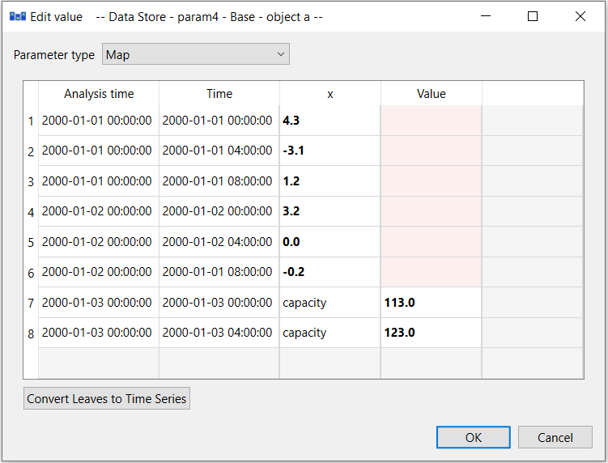
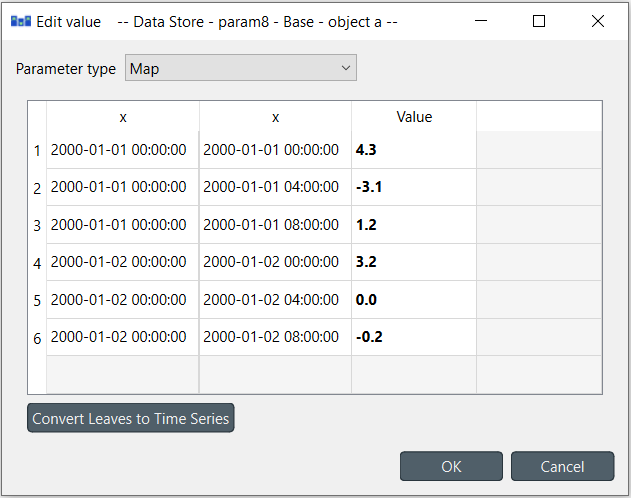
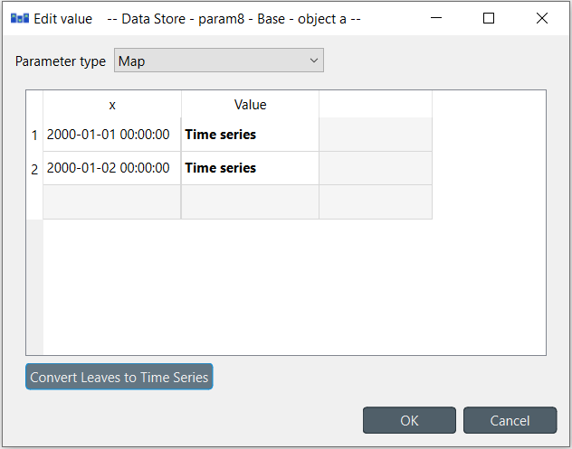
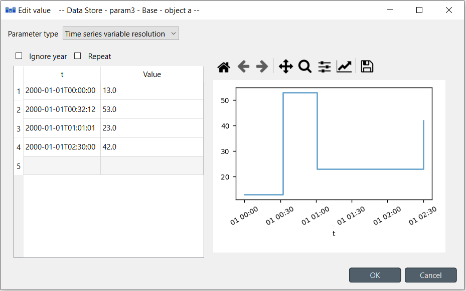
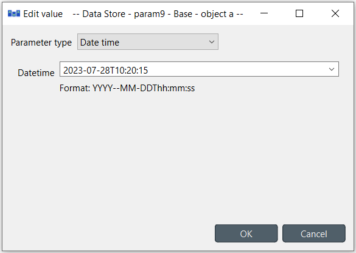
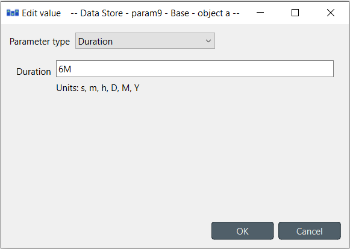

..  Parameter value editor
    Created: 15.8.2019

**********************
Parameter value editor
**********************

Parameter value editor is used to edit object and relationship parameter values
such as time series, time patterns or durations.
It can also convert between different value types, e.g. from a time series to a time pattern.

The editor is available from a **right click** popup menu
or by **double clicking** a parameter value in one of the Spine database editors.

Choosing value type
-------------------

.. image:: img/value_editor_parameter_type.png
   :align: center

The combo box at the top of the editor window allows changing the type of the current value.

Plain values
------------

The simplest parameter values are of the *Plain value* type.
The editor window lets you to write a number or string directly to the input field
or set it to true, false or null as needed.

Maps
----

Maps are versatile nested data structures designed to contain complex data
including one and multi dimensional indexed arrays.
In Parameter value editor a map is shown as a table where the last non-empty cell on each row
contains the value while the preceding cells contain the value's indexes.

The extra gray column on the right allows expanding the map with a new dimension.
You can append a value to the map by editing the bottom gray row.
The reddish cells are merely a guide for the eye to indicate that the map has different nesting depths.

A **Right click** popup menu gives options to open a value editor for individual cells,
to add/insert/remove rows or columns (effectively changing map's dimensions),
or to trim empty columns from the right hand side.

Copying and pasting data between cells and external programs works using the usual
**Ctrl-C** and **Ctrl-V** keyboard shortcuts.

**Convert leaves to time series** 'compacts' the map by converting the last dimension into time series.
This works only if the last dimension's type is datetime.
For example the following map contains two time dimensions.
Since the indexes are datetimes, the 'inner' dimension can be converted to time series.

After clicking **Convert leaves to time series** the map looks like this:

Time series
-----------

There are two types of time series: *variable* and *fixed resolution*.
Variable resolution means that the time stamps can be arbitrary
while in fixed resolution series the time steps between consecutive stamps are fixed.

.. image:: img/value_editor_time_series_fixed.png
   :align: center

The editor window is split into two in both cases.
The left side holds all the options and a table with all the data
while the right side shows a plot of the series.
The plot is not editable and is for visualization purposes only.

In the table rows can be added or removed from a popup menu available by a **right click**.
Editing the last gray row appends a new value to the series.
Data can be copied and pasted by **Ctrl-C** and **Ctrl-V**.
Copying from/to an external spreadsheet program is supported.

The time steps of a fixed resolution series are edited by the *Start time* and *Resolution* fields.
The format for the start time is `ISO8601 <https://en.wikipedia.org/wiki/ISO_8601>`_.
The *Resolution* field takes a single time step or a comma separated list of steps.
If a list of resolution steps is provided then the steps are repeated so as to fit the data in the table.

The *Ignore year* option available for both variable and fixed resolution time series
allows the time series to be used independent of the year.
Only the month, day and time information is used by the model.

The *Repeat* option means that the time series is cycled,
i.e. it starts from the beginning once the time steps run out.

Time patterns
-------------

The time pattern editor holds a single table which shows the time period on the right column
and the corresponding values on the left.
Inserting/removing rows and copy-pasting works as in the time series editor.

.. image:: img/value_editor_time_pattern.png
   :align: center

Arrays
------

Arrays are lists of values of a single type.
Their editor is split into two:
the left side holds the actual array while the right side contains a plot of the array values
versus the values' positions within the array.
Note that not all value types can be plotted.
The type can be selected from the *Value type* combobox.
Inserting/removing rows and copy-pasting works as in the time series editor.

Datetimes
---------

The datetime value should be entered in `ISO8601 <https://en.wikipedia.org/wiki/ISO_8601>`_ format.
Clicking small arrow on the input field pops up a calendar that can be used to select a date.

Durations
---------

A single value or a comma separated list of time durations can be entered to the *Duration* field.

