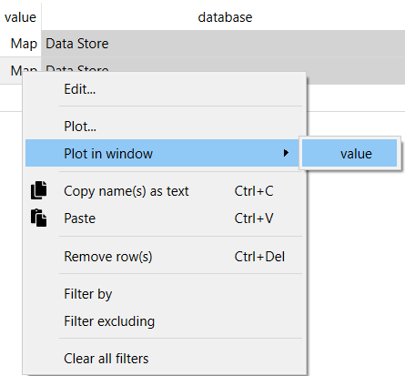
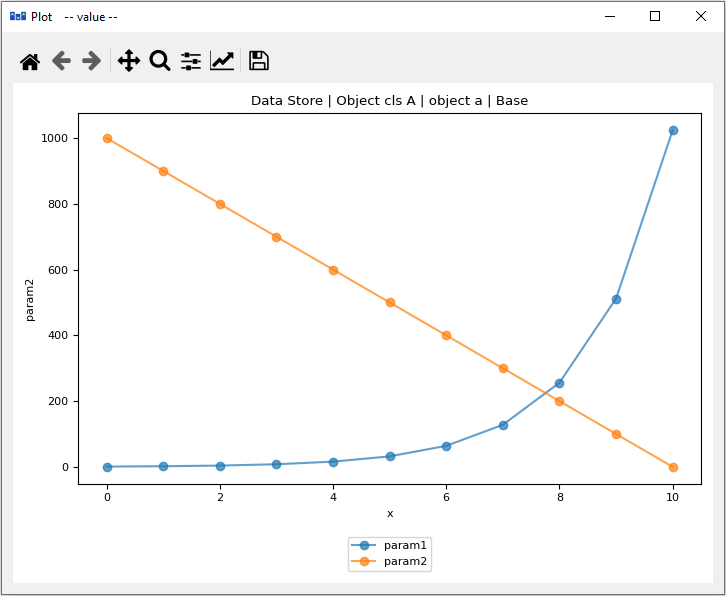

..  Plotting

Plotting
========

Basic data visualization is available in the Spine database editors.
Currently, it is possible to plot scalar values
as well as time series, arrays and one dimensional maps with some limitations.

To plot a column, select the values from a table and then *Plot* from the **right click** popup menu.

.. image:: img/plotting_popup_menu.png
   :align: center
   :width: 40%

.. image:: img/plotting_window_single_column.png
   :align: center
   :width: 70%

Selecting data in multiple columns plots the selection in a single window.

To add a plot to an existing window select the target plot window
from the *Plot in window* submenu. There are some restrictions for what kinds of plots can
be shown on the same window. In the example below two different maps have
been plotted on the same graph.

If a plot is clicked with the right mouse button, options to cpy or show the plot data
are presented. When the data is copied it is saved to the clipboard in csv format with
tab as the delimiter. If **Show plot data...** is clicked a new window opens that
contains a table of the data used in the plot.

X column in pivot table
-----------------------

It is possible to plot a column of scalar values against a designated X column
in the pivot table.

To set a column as the X column **right click** the top empty area above the column header
and select *Use as X* from the popup menu.
*(X)* in the topmost cell indicates that the column is designated as the X axis.

.. image:: img/plotting_use_as_x_popup.png
   :align: center

When selecting and plotting other columns in the same table the data will be plotted against
the values in the X column instead of row numbers.