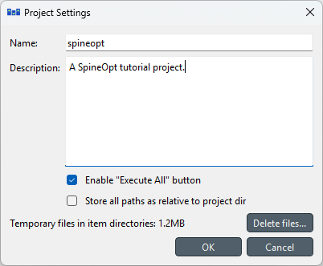

.. _Project Settings:

****************
Project Settings
****************

Project settings can be modified from a dialog that opens by selecting **File -> Project settings...***

The dialog displays the name of the project, its description, some options
and controls to manage temporary files in the project.
Note, that the name of the project is tied to the project directory,
and cannot be changed from Project settings.
To rename a project, select **File -> Save project as...**
or close the project and rename it's directory manually.

The **Description** field can be used to document the project.

The **Enable "Execute All"** checkbox controls whether the **Execute All** button in the **Execute toolbar** is enabled.
Disabling the button may be desirable if there is a danger that accidentally executing all project items
could overwrite sensitive data.

The **Store all paths as relative to project dir** option is useful if the project is shared
e.g. as a Git repository.
Checking the box forces all paths in ``project.json`` to be stored as relative to the project directory.
