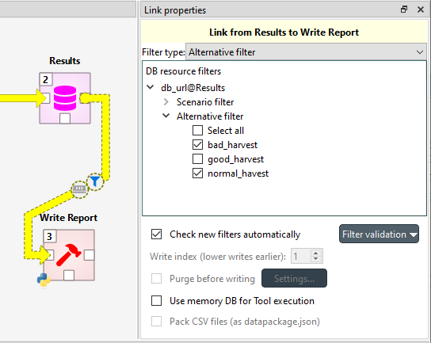

.. _Scenarios and alternatives:

**************************
Scenarios and Alternatives
**************************

One of the prominent features of Spine Toolbox is scenarios.
Scenarios are datasets which are composed of alternatives such that they form a meaningful whole.
Examples of scenarios could include *high_price*, *low_price* or *coal_and_wind*.
Scenarios can be build in the Database Editor
and, through scenario filters, they affect what data is passed to tools and how a workflow is executed.

Parameter Values, Alternatives and Scenarios
--------------------------------------------

The first use case for alternatives is to define alternative values for parameters in Spine data.
For instance, consider you had an entity class "fruit" which has a parameter "price"
and two types of fruits, "apples" and "oranges".
The prices of both fruits depends on how good the harvest is,
and this can be modelled nicely with alternatives:

===== ====== ================== =====
Class Entity Alternative        Price
===== ====== ================== =====
fruit apple  Base               10
fruit apple  bad_harvest_apple  15
fruit orange Base               13
fruit orange bad_harvest_orange 18
===== ====== ================== =====

The prices in the "Base" alternative are the usual prices
while the two additional alternatives contain occasional high prices for the corresponding fruits.
In a sense, alternatives are just additional dimension of the value:
the triplet "fruit", "apple" and "Base" uniquely identifies the price of 10.

Now, let's build some scenarios from the fruit price data:

================= =====================================
Scenario          Alternatives
================= =====================================
base              Base
costly_apples     Base, bad_harvest_apple
costly_oranges    Base, bad_harvest_orange
costly_everything bad_harvest_apple, bad_harvest_orange
================= =====================================

The "base" scenario consists of the "Base" alternative only.
The price of an apple in that scenario is 10
while an orange costs 13.
In the "costly_apples" scenario, on the other hand,
the fruit prices would be derived in the following way:

====== ==== ================= =================
Fruit  Base bad_apple_harvest Price in scenario
====== ==== ================= =================
apple  10   15                15
orange 13   --                13
====== ==== ================= =================

Because apple has more than one price in the costly_apples scenario, we need to pick one of them.
Which price "wins", depends on the order in which the alternatives are in the scenario:
the last one overrides the other prices.
Note, that since the price for orange is defined only in the Base alternative in costly_apples,
it is that price that holds up.

Let's now look at the price formation in the "costly_oranges" scenario:

====== ==== ================== =================
Fruit  Base bad_orange_harvest Price in scenario
====== ==== ================== =================
apple  10   --                 10
orange 13   18                 18
====== ==== ================== =================

This time it is the orange that gets its high price from the bad_orange_harvest alternative
which overrides the orange price in the Base alternative.

In the fourth scenario, costly_everything, the fruits get their high prices from the two alternatives:

====== ================= ================== =================
Fruit  bad_apple_harvest bad_orange_harvest Price in scenario
====== ================= ================== =================
apple  15                --                 15
orange --                18                 18
====== ================= ================== =================

In an imaginary scenario with just bad_apple_harvest or bad_orange_harvest, one of the fruits
would not have a price at all.

Entities and Alternatives
-------------------------

The second use case for alternatives is to control the visibility of entities
in scenarios.
This feature is called *entity alternatives*.
If an entity alternative is deduced to be false in a scenario, the entity is invisible.
Conversely, if entity alternative is true, the entity is visible.

.. note::

   Entity alternatives are usually defined only for 0-dimensional entities
   since any higher-dimensional entity will be invisible in a scenario anyway
   if *any* of its elements is invisible.

If no entity alternative is defined for an entity,
its visibility depends on the active_by_default setting of its class.
Entities of classes which have active_by_default set to true are visible by default
while you have to explicitly set entities visible in classes where active_by_default is false.

Otherwise, entity alternatives work much like parameter value alternatives
with latter alternatives overriding earlier ones in scenarios.

Let's say we add banana to our database containing the alternatives and scenarios of the previous section
and define the following entity alternatives for it:

====== ==== ================= ==================
Entity Base bad_apple_harvest bad_orange_harvest
====== ==== ================= ==================
banana --   false             true
====== ==== ================= ==================

The visibility of banana in each scenario is deduced the following way:

================= ========= ================= ================== ============================
Scenario          Base      bad_apple_harvest bad_orange_harvest banana visible
================= ========= ================= ================== ============================
base              --                                             depends on active_by_default
costly_apples     --        false                                no
costly_oranges    --                          true               yes
costly_everything           false             true               yes
================= ========= ================= ================== ============================

Because the base scenario contains only the Base alternative which for there is no entity alternative for banana,
banana's visibility depends on the active_by_default setting of the fruit class.
In the costly_apples scenario, the entity alternative set for banana in the bad_apple_harvest alternatives
overrides the default value making banana invisible in the scenario.
Similarly, in costly_oranges, bad_orange_harvest overrides the default value making banana visible.
The costly_everything scenario, on the other hand, is defined such that the entity alternative for banana
from bad_orange_harvest overrides the value from bad_apple_harvest making banana visible.

Scenario Filters: Scenarios in the Workflow
-------------------------------------------

Scenario filter is the machinery that can be applied to a database containing Spine data
that makes the database appear as if it contained only the scenario's dataset.
Anyone who reads the data will see the "winning" parameter values,
as well as entities that are deduced to be visible in the scenario through entity alternatives.

The scenarios a workflow will use are set in **Link properties** of links which have
Data Stores as sources as explained in :ref:`Links and Loops`.
The direct successors of the Data Store will get a specific database URL that contains the scenario name
and applies the filter it is used to instantiate a database mapping.

.. note::

   If multiple scenarios are selected in **Link properties**, the successor items will be executed in parallel,
   each execution running a different scenario.

Alternative Filter: Useful for Result Datasets
----------------------------------------------

Scenarios are a powerful tool when building input datasets.
However, when inspecting the output of Tools,
or when e.g. there is need to copy a specific subset of a dataset from one database to another,
alternative filter may become handy.
When using alternative filter, you select multiple alternatives for the filter.
After the filter is applied to Spine data, values and entities in all selected alternatives are visible.
This is in contrast to the scenario filter where visibility is decided by the winning alternative.

Let's say we have modelled pear prices using three different scenarios and stored the results
in corresponding alternatives in a results database.

============== =====
Alternative    Price
============== =====
bad_harvest    16
normal_harvest 11
good_harvest   9
============== =====

We also have a Tool connected to the results that can compare/analyze/report the prices:

Want to get a comparison of bad and good harvest?
Select bad_harvest and good_harvest for **Alternative filter** in **Link properties**.
Want to report on normal harvest only?
Select normal_harvest in **Link properties**.
