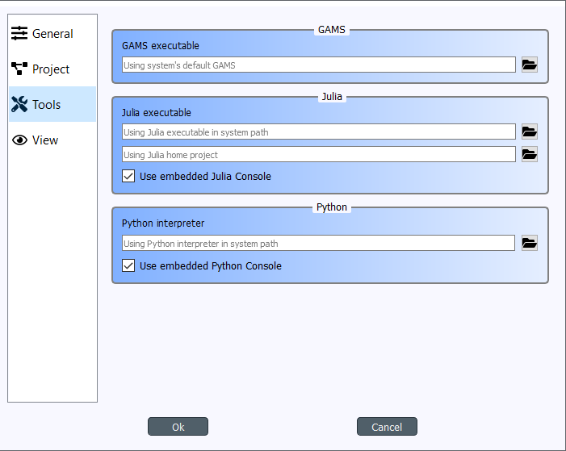
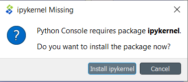
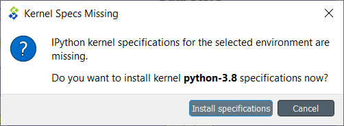
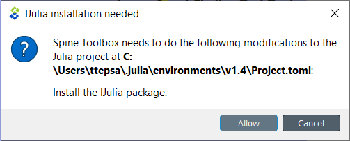

.. Setting up External Tools
   Created 2.4.2020

.. _Setting Up External Tools:

.. |browse| image:: ../../spinetoolbox/ui/resources/menu_icons/folder-open-solid.svg
            :width: 16
.. |play| image:: ../../spinetoolbox/ui/resources/project_item_icons/play-circle-solid.svg
            :width: 16
.. |stop| image:: ../../spinetoolbox/ui/resources/project_item_icons/stop-circle-regular.svg
            :width: 16

*************************
Setting up External Tools
*************************

This section describes how to set up Python, Julia, GAMS, and SpineModel.jl for Spine Toolbox.

.. contents::
   :local:

Executing Python or Julia Tools requires that Python or Julia are installed on your system. You can
download Python from `<https://www.python.org/downloads/>`_ and Julia from
`<https://julialang.org/downloads/>`_. In addition, you need an installation of GAMS to execute
GAMS Tools and Exporter project items. GAMS can be downloaded from `<https://www.gams.com/download/>`_.

Setting up Python
*****************

If you encounter the following message in Event Log when trying to execute a Python Tool.::

   Couldn't determine Python version. Please check the Python interpreter option in Settings.

After reading this section, you should know what this message means and how to set up Python for
Spine Toolbox so you can successfully execute Python Tools.

There are two ways you can install Spine Toolbox.

1. Clone Spine Toolbox repository from `<https://github.com/Spine-project/Spine-Toolbox>`_, checkout the
   branch you want and follow installation instructions on the page (README.md).

2. [On Windows] Use a single-file installation bundle (e.g. `spine-toolbox-0.4.0-x64.exe`). These are
   available for download in
   `[Spine Toolbox Release Archive] <https://drive.google.com/drive/folders/1t-AIIwRMl3HiYgka4ex5bCccI2gpbspK>`_

If you go with option 1, and you have successfully started the application, you already have a Python that
can be used in executing Python Tools. If you go with option 2, you need to have a Python installed on
your system to be able to execute Python Tools. You can select the Python you want to use on the Tools
tab in Settings (See :ref:`Settings`).

The Python interpreter you select here is the Python that is used when executing Python Tools with or
without the Embedded Python Console.

The default Python interpreter is the Python that is in your PATH environment variable. If you do not
have Python in your PATH, you can explicitly set the Python you want to use by clicking on the |browse|
button and selecting the Python interpreter file (`python.exe` on Windows). Note that you can use any
Python in your system by setting a Python interpreter here.

.. note::
   Embedded Python Console supports Python versions from 2.7 all the way to latest ones (3.8). Executing
   Python Tools without using the embedded Python Console possibly supports even earlier Pythons than 2.7.
   You can start Spine Toolbox only with Python 3.6 or with 3.7, but you can still set up an embedded
   Python Console into Spine Toolbox that uses e.g. Python 2.7. This means, that if you still have
   some old Python 2.7 scripts lying around, you can incorporate those into a Spine Toolbox project and
   execute them without any modifications.

Step-by-step instructions
-------------------------

You can either execute Python Tools in the embedded Python Console or as in the shell.
Here are the step-by-step instructions for setting up Spine Toolbox for both.

Shell execution
_______________

1. Go to `<https://www.python.org/downloads/>`_ and download the Python you want
2. Run the Python installer and follow instructions
3. Either let the installer put Python in your PATH or memorize the path where you installed it
   (e.g. `C:\\Python38`)
4. Start Spine Toolbox
5. Go to File -> Settings (or press F1) and click the Tools tab open
6. If the installed Python is now in your PATH, you can leave the Python interpreter line edit blank.
   Or you can set the Python interpreter explicitly by setting it to e.g. `C:\\Python38\\python.exe`
   by using the |browse| button.
7. Uncheck the `Use embedded Python Console` check box
8. Create a project with a Tool and a Python Tool specification (See :ref:`Getting Started`)
9. Press play to execute the project (See :ref:`Executing Projects`)
10. Executing your Tool project item starts. You can see the output (stdout and stderr) in the
    Process Log.

Python Console execution
________________________

If you want to use the embedded Python Console (and you should). There is an extra step involved since
the Python Console requires a couple of extra packages (`ipykernel` and its dependencies) to be
installed on the selected Python. In addition, kernel specifications for the selected Python need to be
installed beforehand. **Spine Toolbox can install these for you automatically.**

1. Go to `<https://www.python.org/downloads/>`_ and download the Python you want
2. Run the Python installer and follow instructions
3. Either let the installer put Python in your PATH or memorize the path where you installed it
   (e.g. `C:\\Python38`)
4. Start Spine Toolbox
5. Go to File -> Settings (or press F1) and click the Tools tab open
6. If the installed Python is now in your PATH, you can leave the Python interpreter line edit blank.
   Or you can set the Python interpreter explicitly by setting it to e.g. `C:\\Python38\\python.exe`
   by using the |browse| button.
7. Check the `Use embedded Python Console` check box
8. Create a project with a Tool and a Python Tool specification (See :ref:`Getting Started`)
9. Press play to execute the project (See :ref:`Executing Projects`)
10. You will see a question box

When you click on the *Install ipykernel* button, you can see the progress of the
operation in Process Log. The following packages will be installed on your selected Python.::

   backcall, colorama, decorator, ipykernel, ipython, ipython-genutils, jedi, jupyter-client,
   jupyter-core, parso, pickleshare, prompt-toolkit, pygments, python-dateutil, pywin32, pyzmq, six,
   tornado, traitlets, wcwidth

When this operation finishes successfully, you will see another guestion box.

Clicking on *Install specifications* button starts installing the kernel specs for the selected Python.
On the tested system, this creates a new kernel into directory
`C:\\Users\\ttepsa\\AppData\\Roaming\\jupyter\\kernels\\Python-3.8`, which contains the `kernel.json` file
required by the embedded Python Console (which is actually a jupyter qtconsole)

11. After the kernel specs have been installed, executing your Tool project item starts in the
    Python Console immediately. You can see the executed command and the Tool output in the Python
    Console.

.. note::
   If you want to set up your Python environment ready for Python Console manually, the following
   commands are executed by Spine Toolbox under the hood

   This installs all required packages::

      python -m pip install ipykernel

   And this installs the kernel specifications::

      python -m ipykernel install --user --name python-3.8 --display-name Python3.8

What about Anaconda and Miniconda Pythons?
------------------------------------------

If you installed Spine Toolbox on a Conda environment, the Python you started Spine Toolbox with has
been added to the conda environment variables. This means that you are ready to execute Python Tools
without using the embedded Python Console out of the box. For setting up the Python Console you just
need to let Spine Toolbox install the ipykernel package and the kernel specifications for this Python.
See section `Python Console execution`_ above for more info.

Setting up Julia
****************

Spine Toolbox requires a Julia installation that must be set up before Julia Tools can be executed. The
basic idea is the same as with Python. In File->Settings (Tools tab), there's a line edit for the
Julia executable. If you leave this blank, Spine Toolbox uses the Julia that is in your PATH environment
variable. Setting an explicit path to a Julia executable (e.g. `C:\\Julia-1.2.0\\bin\\julia.exe`) overrides
the Julia in PATH. As with Python Tools, you execute Julia Tools in the embedded Julia Console or
without it (shell execution).

If you see this (or similar) message in Event Log when trying to execute a Julia Tool.::

   julia.exe failed to start. Make sure that Julia is installed properly on your computer.

This means that you either don't have a Julia installation on your system, Julia is not set up in your
PATH environment variable or the Julia executable you have set in Settings is not valid.

Step-by-step instructions
-------------------------

Shell execution
_______________

1. Go to `<https://julialang.org/downloads/>`_ and download the Julia you want
2. Run the Julia installer and follow instructions
3. Either let the installer put Julia in your PATH or memorize the path where you installed it
   (e.g. `C:\\Julia-1.2.0`)
4. Start Spine Toolbox
5. Go to File -> Settings (or press F1) and click the Tools tab open
6. If the installed Julia is now in your PATH, you can leave the Julia executable line edit blank.
   Or you can set the Julia executable explicitly by setting it to e.g. `C:\\Julia.1.2.0\\bin\\julia.exe`
   by using the |browse| button.
7. Uncheck the `Use embedded Julia Console` check box
8. Create a project with a Tool and a Julia Tool specification (See :ref:`Getting Started`)
9. Press play to execute the project (See :ref:`Executing Projects`)
10. Executing your Tool project item starts. You can see the output (stdout and stderr) in the
    Process Log.

Julia Console execution
________________________

Like the Python Console, Julia Console requires some extra setting up.
**Spine Toolbox can set this up for you automatically**.

If you want to use the embedded Julia Console (and you should). There is an extra step involved since
the Julia Console requires a couple of extra packages (`IJulia`, etc.) to be installed and built.

1. Go to `<https://julialang.org/downloads/>`_ and download the Julia you want
2. Run the Julia installer and follow instructions
3. Either let the installer put Julia in your PATH or memorize the path where you installed it
   (e.g. `C:\\Julia-1.2.0`)
4. Start Spine Toolbox
5. Go to File -> Settings (or press F1) and click the Tools tab open
6. If the installed Julia is now in your PATH, you can leave the Julia executable line edit blank.
   Or you can set the Julia executable explicitly by setting it to e.g. `C:\\Julia.1.2.0\\bin\\julia.exe`
   by using the |browse| button.
7. Check the `Use embedded Julia Console` check box
8. Create a project with a Tool and a Julia Tool specification (See :ref:`Getting Started`)
9. Press play to execute the project (See :ref:`Executing Projects`)
10. You will see a question box

When you click on the *Allow* button, installing IJulia starts and you can see the progress of the
operation in Process Log. **This may take a few minutes**.

When you see the these messages in the Event Log, the Julia Console is ready to be used.::

   IJulia installation successful.
   *** Starting Julia Console ***

11. After the installation has finished, executing your Julia Tool project item starts in the
    Julia Console immediately. You can see the executed command and the Tool output in the Julia
    Console. If nothing seems to be happening in the Julia Console. Just click |Stop| button and
    then try executing the project again by clicking the |play| button.

.. note::
   If you want to set up your Julia environment ready for Julia Console manually, you need to install
   IJulia and the Julia kernel specifications.

Setting up GAMS
***************

Executing a GAMS Tool project item or executing an Exporter project item requires a GAMS installation on
your system.

.. note::
   You do not need to own a GAMS license as the demo version works just as well.

.. note::
   The bitness (32 or 64bit) of GAMS has to match the bitness of the Python interpreter.

If you have GAMS in your PATH environment variable, you can leave the GAMS executable line edit in
File->Settings blank and Spine Toolbox will find it. You can also override the GAMS in your PATH by
setting an explicit path to the GAMS executable (e.g. `C:\\GAMS\\win64\\28.2\\gams.exe`) line edit.

Setting up SpineModel.jl
************************

There's a built-in configuration assistant in Spine Toolbox that downloads and configures SpineModel.jl
for you automatically. You can find the configuration assistant in the main window menu
**File->Tool configuration assistants...->SpineModel.jl** Before you run this, you need to
set up Julia for Spine Toolbox. See instructions above (`Setting up Julia`_). After a Julia has been
set up correctly, run the Tool configuration assistant and follow the instructions given.
