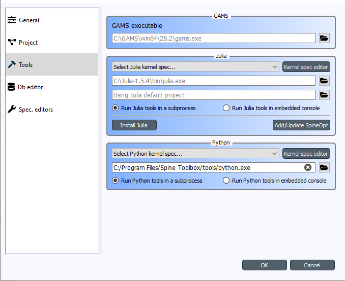
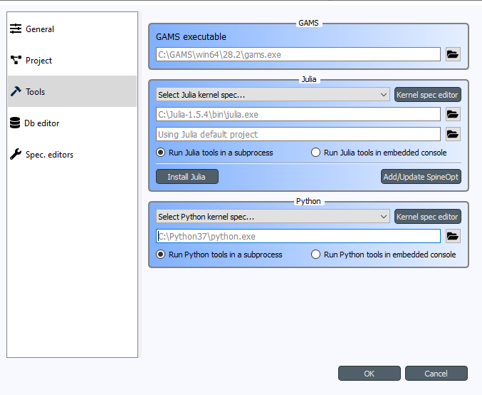

.. Setting up External Tools
   Created 2.4.2020

.. |browse| image:: ../../spinetoolbox/ui/resources/menu_icons/folder-open-solid.svg
            :width: 16
.. |play| image:: ../../spinetoolbox/ui/resources/menu_icons/play-circle-solid.svg
            :width: 16
.. |stop| image:: ../../spinetoolbox/ui/resources/menu_icons/stop-circle-regular.svg
            :width: 16

.. _Setting up External Tools:

*************************
Setting up External Tools
*************************

This section describes the default **Python** used by Spine Toolbox and how to change that. Here you can also find the
instructions on how to set up **Julia** and **Gams** for executing Julia and Gams Tools. To get started with
**SpineOpt.jl**, see :ref:`How to set up SpineOpt.jl`. See also :ref:`Executing Projects` and :ref:`Execution Modes`.

.. contents::
   :local:

Python
******
No set up required! Python Tools are executed using the **default Python**, which **depends on how you installed Spine Toolbox.** The
installation options are:

1. Using a single-file **installation bundle** (e.g. *spine-toolbox-0.6.0-final.2-x64.exe* or newer). You can
   find this file and all releases from
   `Spine Toolbox releases <https://github.com/Spine-project/Spine-Toolbox/releases>`_.
   The installation bundles are only available for Windows at the moment.
2. Cloning Spine Toolbox Git repository from `<https://github.com/Spine-project/Spine-Toolbox>`_. Checkout branch
   **release-0.6** or **master** and run `pip install -r requirements.txt` in the repo root.

.. tip:: You can always see the current Python configured for Spine Toolbox from the `Tools` page in
   `File->Settings...`.

Default Python for Spine Toolbox installed using an installation bundle
-----------------------------------------------------------------------
The default Python is the **Python in your PATH** environment variable. **If Python is not in your PATH**, the
default Python is an 'embedded' Python that is shipped with the installation bundle. The 'embedded' Python is
located in *<install_dir>\\tools\\python.exe*, where *<install_dir>* is *C:\\Program Files\\Spine Toolbox* if you
installed Spine Toolbox to the default directory for all users.

.. important:: If you want access to `spinedb_api` package from Tools and Consoles in Spine Toolbox, bear in mind
   that the version of `spinedb_api` must be compatible with the version of Spine Toolbox you are using! Spine
   Toolbox v0.6.0 is shipped with `spinedb_api` v0.12.1. If you want to use the Python in your PATH, **you must install
   the correct version of spinedb_api for this Python manually**. The correct version in this case is in the
   `release-0.12` branch of `spinedb_api` git repo
   (https://github.com/Spine-project/Spine-Database-API/tree/release-0.12).
   **To avoid this additional step, it is recommended** that you use the 'embedded' Python interpreter that is shipped
   with the application. You can set up this Python for Spine Toolbox by opening the `Tools` page of
   `File->Settings...` and replacing the path of the Python Interpreter with *<install_dir>\\tools\\python.exe*.
   **The 'embedded' Python interpreter has access to `spinedb_api` that is shipped with the application.**

Here are the recommended settings

Default Python for Spine Toolbox installed using Git
----------------------------------------------------
The default Python is the **Python that was used in launching the application** (i.e. *sys.executable*).
When you start the app for the first time (or if you clear the path), the path to the default Python is
shown as placeholder (gray) text in the line edit like this:

The default Python has access to the `spinedb_api` version that was installed with the application (the one in
in <python_dir>\\lib\\site-packages\\spinedb_api).

Changing the default Python
---------------------------
If you want to use another Python than the default, you can use existing Pythons in your system or you can
download additional Pythons from `<https://www.python.org/downloads/>`_. You can change the default Python
on the `Tools` page of `File->Settings...` by clicking the |browse| button and selecting the Python interpreter
(`python.exe` on Windows) you want. You can use **any Python in your system**.

.. note::
   Executing Python Tools using the Jupyter Console supports Python versions from 2.7 all the way to newest one.
   Executing Python Tools **without** using the Jupyter Console supports even earlier Pythons than 2.7.
   You can start Spine Toolbox only with Python 3.7 or with 3.8, but you can set up a Jupyter Console in
   Spine Toolbox that uses e.g. Python 2.7. This means, that if you still have some old Python 2.7 scripts
   lying around, you can incorporate those into a Spine Toolbox project workflow and execute them without
   modifications.

.. important:: If you want to have access to `spinedb_api`, you need to install it manually for the Python you
   select here.

Julia
*****
Executing Julia Tools in Spine Toolbox requires that Julia is installed on your system. Julia downloads are
available from `<https://julialang.org/downloads/>`_. You can see the current Julia on the `Tools` page in
`File->Settings...`. The **default Julia is the Julia in your PATH** environment variable. Setting some other
Julia to the line edit overrides the Julia in PATH. If you want to use a specific **Julia project environment**
(the place for Project.toml and Manifest.toml), you can set the path to the environment folder to the line
edit just below the Julia executable line edit (the one that says *Using Julia default project* when empty).

If you are trying to execute Julia Tools and you see an error message in Event Log complaining about not finding
Julia, you either don't have a Julia installation in your PATH, or the Julia path in Settings is invalid.

GAMS
****
Executing Gams Tools and the GDXExporter Project Item requires an installation of Gams on your system.
You can download Gams from `<https://www.gams.com/download/>`_.

.. note:: You do not need to own a Gams license as the demo version works just as well.

As with Julia, the default Gams is the Gams in your PATH environment variable. You can see the one that is currently
in use from the `Tools` page in `File->Settings...`. The placeholder text shows the Gams in your PATH if found.
You can also override the default Gams by setting some other gams.exe path to the line edit
(e.g. `C:\\GAMS\\win64\\28.2\\gams.exe`).

.. important:: The bitness (32 or 64bit) of Gams has to match the bitness of the Python interpreter.
