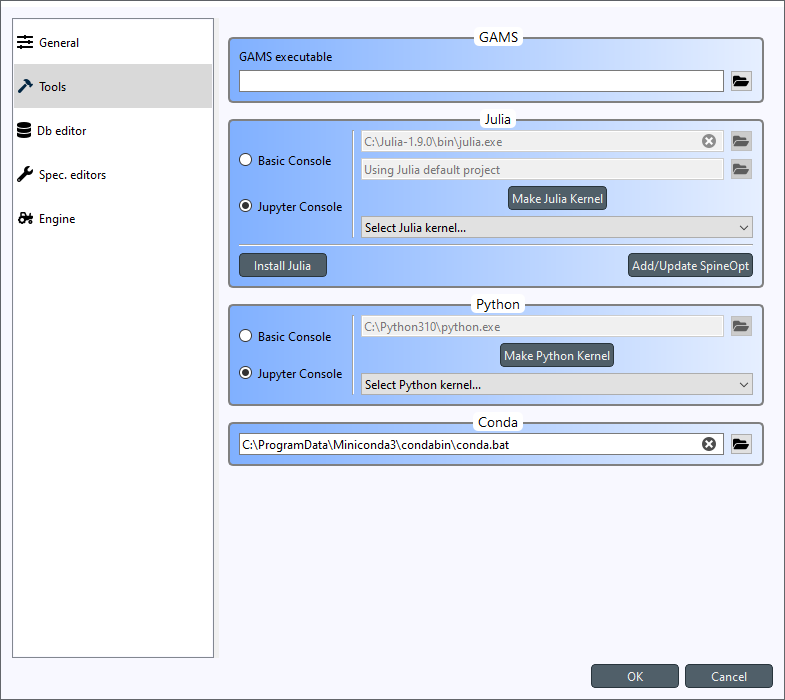
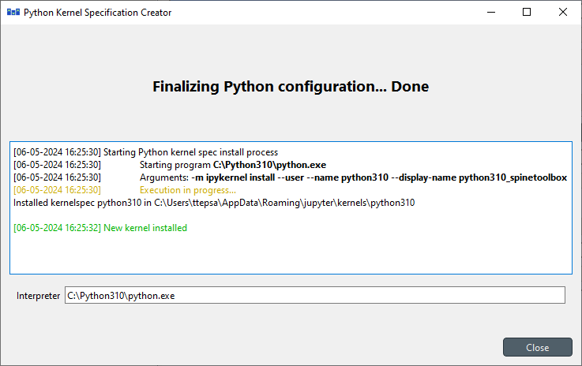
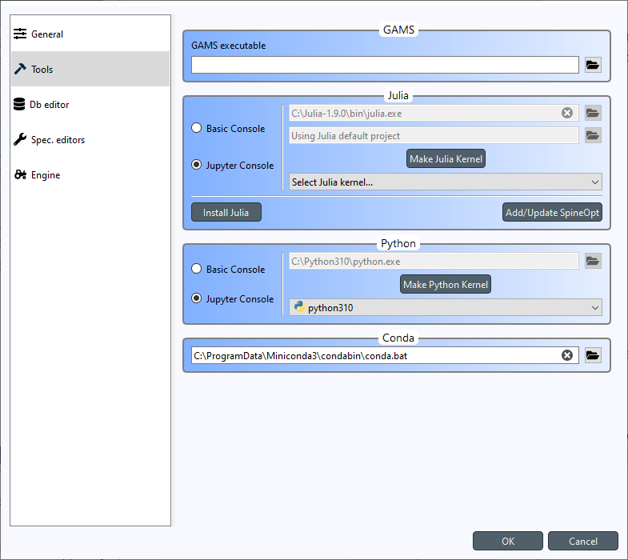
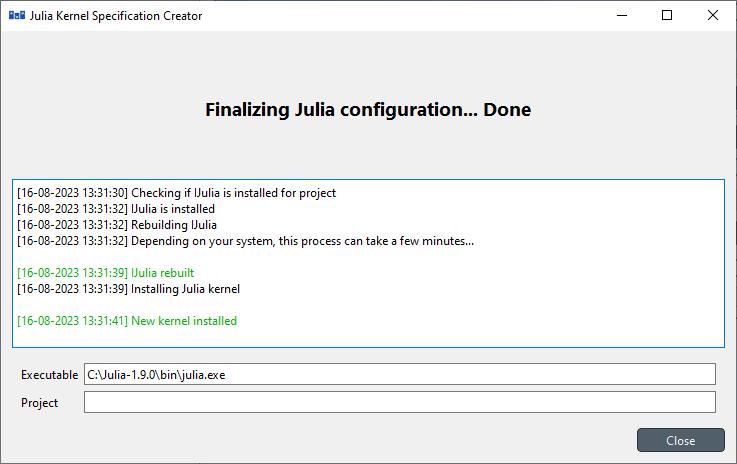
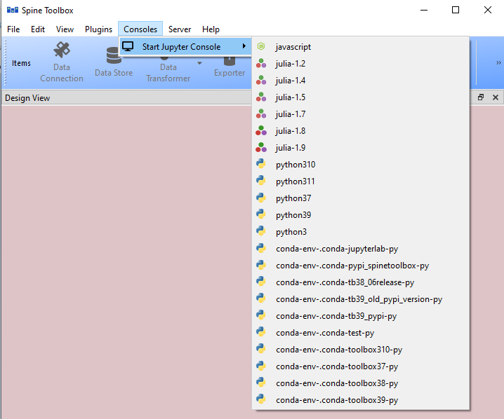
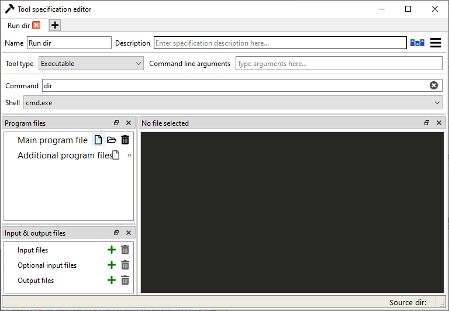

.. Setting up Consoles and External Tools

.. |browse| image:: ../../spinetoolbox/ui/resources/menu_icons/folder-open-solid.svg
            :width: 16
.. |play| image:: ../../spinetoolbox/ui/resources/menu_icons/play-circle-solid.svg
            :width: 16
.. |stop| image:: ../../spinetoolbox/ui/resources/menu_icons/stop-circle-regular.svg
            :width: 16

.. _Setting up Consoles and External Tools:

**************************************
Setting up Consoles and External Tools
**************************************

This section describes the options for executing different Python, Julia, Gams, and Executable Tools and how to set
them up. To get started with **SpineOpt.jl**, see :ref:`How to Set up SpineOpt.jl`. See also
:ref:`Executing Projects`.

.. contents::
   :local:

Python and Julia Tools can be executed either in an embedded *Basic Console* or in a *Jupyter Console*. GAMS Tools
are executed in a sub-process. Executable Tools (external programs) are executed in a shell or by running the
executable file directly. You can also make a Tool that executes a shell command by creating an *Executable* Tool
Spec in **Tool Specification Editor**, entering the shell command to the *Command* line edit and then selecting the
Shell for this Tool.

Basic Consoles
--------------
Basic Console appears to the **Console** dock widget in the main window when you execute (|play|) a project
containing either a Python or a Julia Tool with Basic Console selected.

Python
******
Executing a Python Tool in the Basic Console requires no set up. Simply create a *Python* Tool Spec in
**Tool Specification Editor** and select the Basic Console radio button. The default Python interpreter used
in launching the Console is the same Python that was used in launching Spine Toolbox. You can also select another
Python by changing the Python interpreter line edit. Remember to save the new Tool Spec when closing the **Tool
Spec. Editor**. Then drag the Python Tool Spec into the **Design View**, and press |play| to execute it.

.. note:: The Python settings on the *Tools* page in **File -> Settings** are the *default* settings for new Python
   Tool Specs. You can select a different Python executable for each Python Tool Spec separately using the
   **Tool Specification Editor**.

Julia
*****
To execute Julia Tools in the Basic Console, first install Julia (v1.6 or later recommended)
`from here <https://julialang.org/downloads/>`_ and add `<julia install path>/bin` to your PATH environment variable
(if not done automatically by the installer). Then go to the *Tools* page in **File -> Settings** and make sure that
the Basic Console radio button is selected in the Julia group. If Julia is in your PATH, the Julia executable line
edit should show the path as (grey) placeholder text. If you want to use another Julia on your system, you can change
the path in the line edit. You can also set a Julia Project below the Julia executable line edit.

.. note:: The Julia settings on the *Tools* page in **File -> Settings** are the *default* settings for new Julia
   Tool Specs. You can select a different Julia executable & project for each Julia Tool Spec separately using the
   **Tool Specification Editor**.

Jupyter Consoles
----------------
Jupyter Console appears to the **Console** dock widget in the main window when you execute (|play|) a project
containing either a Python or a Julia Tool with the *Jupyter Console* selected. The Jupyter Console
requires a Jupyter kernel to be installed on your system. Kernels are programming language specific processes
that run independently and interact with the Jupyter Applications and their user interfaces.

Python
******
Select *Jupyter Console* radio button in **File -> Settings**. You also need to select the Python kernel you
wish to use from the *Select Python kernel...* combo box. If this list is empty, you need to install the kernel specs
on your system. You can either do this manually or click the **Make Python Kernel** button. Clicking the button opens
a **Python Kernel Specification Creator** window, that first installs the **ipykernel** package (if missing) for
the Python that is currently selected in the Python interpreter line edit (the kernel specs will be created
for `C:/Python39/python.exe` in the picture below). You can make kernel specs for other Pythons and virtual
environments (venv) by changing the Python interpreter line edit path to point to another Python. Please see
specific instructions for creating kernel specs for Conda environments below.

Once the **ipykernel** package is installed, the wizard runs the **ipykernel install** command, which creates the
kernel specs directory on your system. Once the process finishes, click *Close*, and the newly created kernel spec
(*python39* in this case) should be selected automatically. For convenience, there is a context-menu (mouse
right-click menu) in the **Select Python Kernel...** combo box that opens the the kernel spec directory in your
file browser. Click *Ok* to close the **Settings** widget and to save your selections.

If something went wrong, or if you want to remake the kernel specs, you can remove the kernel spec directory from
your system, try the **Make Python Kernel** button again, or install the kernel specs manually.

If you want to install the Python kernel specs manually, these are the commands that you need to run.

To install **ipykernel** and it's dependencies, run::

      python -m pip install ipykernel

And to install the kernel specs run::

      python -m ipykernel install --user --name python39 --display-name python39_spinetoolbox

Make sure to use the ``--user`` argument to in order to make the kernel specs discoverable by Spine Toolbox.

.. important:: If you want to have access to `spinedb_api`, you need to install it manually for the Python you
   select here.

.. note::
   Clicking **Make Python Kernel** button when the kernel specs have already been installed, does NOT open the
   **Python Kernel Specification Creator**, but simply selects the Python kernel automatically.

.. note::
   Executing Python Tools using the Jupyter Console supports Python versions from 2.7 all the way to latest one.
   This means, that if you still have some old Python 2.7 scripts lying around, you can incorporate those into
   a Spine Toolbox project workflow and execute them without modifications.

Julia
*****
To use the Jupyter Console with Julia Tools, go to the *Tools* page in **File -> Settings** and select the
Jupyter Console radio button like in the picture below.

Like with Python, you need to select an existing Julia kernel for the Julia Jupyter Console, or create one
either manually, or by clicking the **Make Julia Kernel** button.

Clicking the button opens **Julia Kernel Specification Creator** window, that first installs the **IJulia** package
(if missing) for the Julia and Julia project that are currently selected in the Julia executable and Julia Project
line edits (the kernel specs will be created for the default project of `C:/Julia-1.9.0/bin/julia.exe` in the
picture above).

If something went wrong, or if you want to remake the kernel specs, you can remove the kernel spec directory from
your system, try the **Make Julia Kernel** button again, or install the kernel specs manually.

If you want to install the Julia kernel specs manually, these are the commands that you need to run.

To install **IJulia** and it's dependencies, open Julia REPL with the project you want and run::

      using Pkg
      Pkg.add("IJulia")

Rebuild IJulia::

      Pkg.build("IJulia")

And to install the kernel specs run::

      using IJulia
      installkernel("julia", --project="my_project")

.. note::
   Clicking **Make Julia Kernel** button when the kernel specs have already been installed, does NOT open the
   **Julia Kernel Specification Creator**, but simply selects a Julia kernel that matches the selected Julia
   executable and Julia Project. If a kernel spec matching the Julia executable is found but the Julia project is
   different, a warning window appears, saying that Julia kernel spec may be overwritten if you continue.

Conda
*****
You also have the option of running Python Tools in a Conda environment. All you need to do is the following.

1. Open Anaconda Prompt and make a new Conda environment::

      conda create -n test python=3.10

2. Activate the environment::

      conda activate test

3. Install **ipykernel**::

      pip install ipykernel

4. Back in Spine Toolbox, add path to Conda executable on the *Tools* page in **File -> Settings**.

That's it! Now, in Spine Toolbox main window, open the **Consoles -> Start Jupyter Console** menu, wait a second,
and the new kernel should appear in the list. In this case, the new kernel name is *conda-env-.conda-test-py*.
This autogenerated name will most likely change to something more readable in the future. You can use Conda Python
kernels just like regular Python kernels, i.e. select one of them as the default kernel in the
**File -> Settings** widget or select them for individual Python Tool Specs in **Tool Specification Editor** directly.

Detached Consoles
*****************
You can open 'detached' Jupyter Consoles from the main window menu **Consoles -> Start Jupyter Console**. The menu
is populated dynamically with every Jupyter kernel that Spine Toolbox is able to find on your system. 'Detached'
here means that the Consoles are not bound to any Tool. These Consoles are mostly useful e.g. for
checking that the kernel has access to the correct packages, debugging, small coding, testing, etc. These may be
especially useful for checking that everything works before running a full workflow that may take hours to finish.

Officially, Spine Toolbox only supports Python and Julia Jupyter kernels but it's possible that other kernels can
be accessed in a Detached Console as well. For example, if you install a javascript kernel on your system, you can
open a Detached Console for it, but this does not mean that Spine Toolbox projects should support Javascript. However,
if there's interest and legitimate use cases for other kernels, we may build support for them in future releases.

If interested, you can `read more on Jupyter kernels <https://docs.jupyter.org/en/latest/projects/kernels.html>`_ .
There you can also find a `list of available kernels <https://github.com/jupyter/jupyter/wiki/Jupyter-kernels>`_.

GAMS
----
Executing Gams Tools or needing to use the GDX file format requires an installation of Gams on your system.
You can download Gams from `<https://www.gams.com/download/>`_.

.. note:: You do not need to own a Gams license as the demo version works just as well.

.. important:: The bitness (32 or 64bit) of Gams has to match the bitness of the Python interpreter.

The default Gams is the Gams defined under ``gams.location`` in Windows registry or in your PATH environment
variable. You can see the one that is currently in use from the *Tools* page in **File -> Settings**. The
placeholder text shows the default Gams if found. You can also override the default Gams by setting some other
gams executable path to the line edit.

Executable
----------
Executable Tool Spec types can be used to execute virtually any program as part of a Spine Toolbox workflow. They
also provide the possibility to run Shell commands as part the workflow. To run an executable with a shell you
need to select a shell out of the three available options that is appropriate for your operating system.
Then you can write a command that runs the executable with the arguments that it needs into the *Command*
line edit just like you would on a normal shell.

To run an executable file without a shell you can either select the executable file as the main program
file of the Tool and write the possible arguments into *Command line arguments* or select *no shell* and
write the filepath of the executable file followed by it's arguments into the *Command* textbox.
Either way the file is executed independent of a shell and with the provided arguments.

To run a Shell command, just type the command into the *command* line edit and select the appropriate Shell from the
list. Picture below depicts an Executable Tool Spec that runs *dir* in in cmd.exe.

