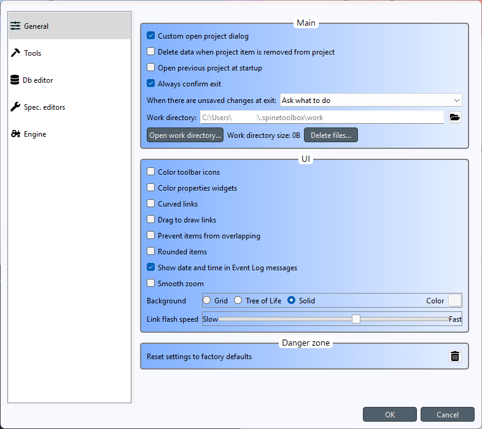
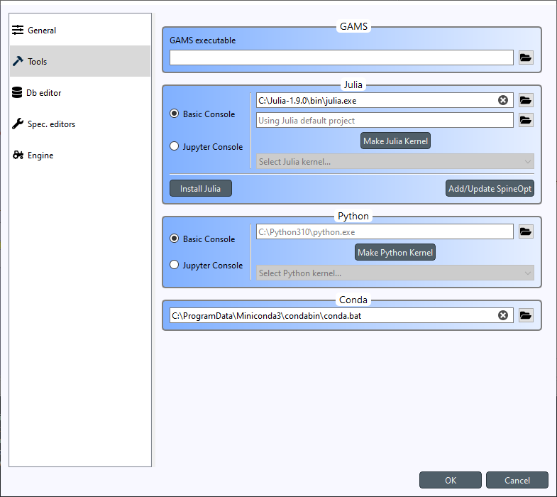
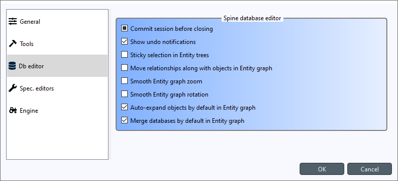
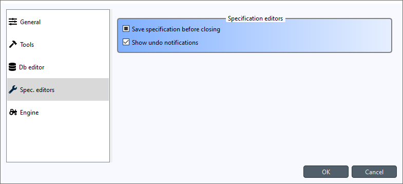
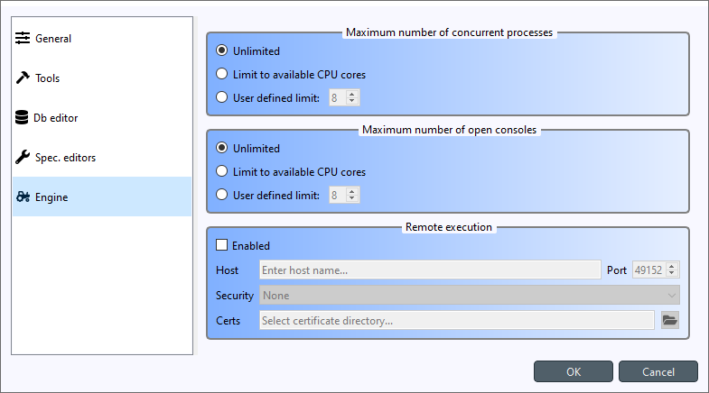

.. Settings form documentation

.. |open-folder| image:: ../../spinetoolbox/ui/resources/menu_icons/folder-open-solid.svg
   :width: 16

.. _Settings:

********
Settings
********

You can open Spine Toolbox settings from the main window menu **File -> Settings...**, or by
pressing **Ctrl+,**. Settings are categorized into five tabs;
*General*, *Tools*, *Db editor*, *Spec. editors* and *Engine*.
In addition to application settings, each project item has user adjustable
properties (See :ref:`Project Items`). See also :ref:`Setting up Consoles and External Tools`
for more information on how to set up Consoles and external Tools.

.. contents::
   :local:

General Settings
----------------

The General tab contains the general application settings.

Settings in the **Main** group:

- **Custom open project dialog** If checked, the application uses a special-purpose dialog
  when opening a project. If left unchecked, the operating system's default dialog is used.

- **Delete data when project item is removed from project** Check this box to delete project item's data
  when a project item is removed from project. This means that the *project item directory* and its
  contents will be deleted from your hard drive. You can find the project item directories from the
  `<proj_dir>/.spinetoolbox/items/` directory, where `<proj_dir>` is your current project directory.

- **Open previous project at startup** If checked, application opens the project at startup that was
  open the last time the application was shut down. If left unchecked, application starts without a
  project open.

- **Always confirm exit** If checked, confirm exit prompt is shown always. If unchecked, application
  exits without prompt when there are no unsaved changes.

- **When there are unsaved changes at exit** The combo box chooses what to do with unsaved changes
  when the application exits.

- **Work directory** Directory where processing the Tool takes place. Default place (if left empty) is
  the `/work` subdirectory of Spine Toolbox install directory. You can change this directory.
  Make sure to clean up the directory every now and then.

Settings in the **UI** group:

- **Color toolbar icons** Check this box to give some color to the otherwise black toolbar icons.

- **Color properties widgets** Check this box to make the background of Project item properties
  more colorful.

- **Curved links** Controls the look of the arrows on **Design View**.

- **Drag to draw links** When checked, the mouse button needs to be pressed while
  drawing links between project items. If unchecked, single clicks at link source and destination
  items suffices.

- **Prevent items from overlapping** When checked, other project items can be pushed away when
  moving an item around the **Design view**. If left unchecked, items can be piled on top of each other.

- **Rounded items** Check this box to round the corners of otherwise rectangular project items.

- **Show date and time in Event Log messages** If checked, every **Event Log** message is prepended with
  a date and time 'tag'.

- **Smooth zoom** Controls the way zooming (by using the mouse wheel) behaves in **Design View** and in
  **Spine DB Editor**. Controls if the zoom in/out is continuous or discrete. On older computers,
  smooth zoom is not recommended because it may be slower.

- **Background** Has some pattern options for the background of the **Design View**.
  Clicking on the square next to 'Color' let's you choose the pattern's color.

- **Link flash speed** This slider controls the speed of the link animation on **Design
  View** when execution is ongoing.

Tools Settings
--------------

The Tools tab contains settings for external tools.

Settings in the **GAMS** group:

- **GAMS executable** Set the path to GAMS executable you want to use when executing GAMS tools. If you have GAMS in
  your PATH environment variable, it will be automatically used. You can also choose another GAMS by clicking the
  |open-folder| button.

Settings in the **Julia** group:

Choose the settings on how Julia Tools are executed.

- **Basic Console** When selected, Julia Tools will be executed in a custom interactive Julia REPL.

- **Julia executable** Set the path to a Julia Executable used in launching the Basic Console. If Julia is in PATH
  this will be autofilled, but you can also choose another Julia executable.

- **Julia project** Set the Julia project you want to activate in the Basic Console.

- **Jupyter Console** Choosing this option runs Julia Tools in a custom Jupyter QtConsole embedded into Spine Toolbox.

- **Select Julia kernel... drop-dowm menu** Select the kernel you want to launch in Jupyter Console.

- **Make Julia Kernel** clicking this button makes a new kernel based on the selected *Julia executable*, and *Julia
  project*. The progress of the operation is shown in another dialog. Installing a Julia kernel requires the **IJulia**
  package which will be installed to the selected *Julia project*. After **IJulia** has been installed, the kernel is
  installed. This process can take a couple of minutes to finish.

- **Install Julia** Installs the latest Julia on your system using the **jill** package.

- **Add/Update SpineOpt** Installs the latest compatible **SpineOpt** to the selected Julia project. If the selected
  *Julia project* already has SpineOpt, it is upgraded if there's a new version available.

.. note:: These Julia settings are *global* application settings. All Julia Tools are executed with the settings
  selected here.

Settings in the **Python** group:

Choose the settings on how Python Tools are executed.

- **Basic Console** When selected, Python Tools will be executed in a custom interactive Python REPL.

- **Python executable** Set the path to a Python Executable used in launching the Basic Console. The default option
  (if the line edit is blank) is the Python executable that was used in launching Spine Toolbox.

- **Jupyter Console** Choosing this option runs Python Tools in a custom Jupyter QtConsole embedded into Spine
  Toolbox.

- **Select Python kernel... drop-dowm menu** Select the kernel you want to launch in Jupyter Console.

- **Make Python Kernel** clicking this button makes a new kernel based on the selected *Python executable*. The
  progress of the operation is shown in another dialog. Installing a Python kernel (actually IPython kernel)
  requires the **ipykernel** package which will be installed to the selected *Python executables*. After
  **ipykernel** has been installed, the kernel is installed. This process can take a couple of minutes to finish.

.. note:: These Python settings are just the default settings *for new Python Tool Specs*. You can select a
  specific Python kernel for each Python Tool Spec separately using the **Tool Specification Editor**.

Settings in the **Conda** group:

- **Miniconda executable** If you want to run Python Tools in a Conda environment, you can set the path
  to your Conda executable here.

See :ref:`Setting up Consoles and External Tools` for more information and examples.

Db editor Settings
------------------

This tab contains settings for the Spine Database editor. The same settings can be accessed directly
from the Database editor itself.

- **Commit session before closing** This checkbox controls what happens when you close a
  database editor which has uncommitted changes. When this is unchecked, all changes are discarded without
  notice. When this is partially checked (default), a message box warning you about uncommitted
  changes is shown. When this is checked, a commit message box is shown immediately without first
  showing the message box.

- **Show undo notifications** Checking this will show undo notification boxes in the editor
  every time something undoable happens. Unchecking hides the notifications.

- **Sticky selection in entity trees** Controls how selecting items in Spine database editor's
  Object and Relationships trees using the left mouse button works.
  If checked, multiple selection is enabled and pressing **Ctrl** enables single selection.
  If unchecked, single selection is enabled and pressing **Ctrl** enables multiple selection.

- **Move relationships along with objects in Entity graph** This controls how relationship nodes
  behave on the Graph view when object nodes are moved around.
  If checked, connected relationship nodes move along with the object node.
  If unchecked, connected relationship nodes remain where they are when objects nodes are moved.

- **Smooth Entity graph zoom** Checking this enables smooth zoom on the Graph view.

- **Smooth Entity graph rotation** Checking this enables smooth rotation on the Graph view.

- **Auto-expand objects by default in Entity graph** This checkbox controls which relationship
  nodes to show on the Graph view.
  If checked, all relationships that contain a visible object node are included.
  If unchecked, relationship nodes are included only if all their objects are show on the Graph view.

- **Merge databases by default in Entity graph** If checked, Graph view will combine all databases
  that are open on the same table into a single graph if they contains common object nodes.
  If unchecked, a separate graph will be drawn for each database.

Spec. editor Settings
---------------------

The Spec. editor tab contains common settings for all specification editors.

- **Save specification before closing** If checked, specification editors will save the specification
  automatically at exit.
  If partially checked, the editors will prompt what to do explicitly.
  If unchecked, no prompts will be shown and all changes will be lost at exit.

- **Show undo notifications** Checking this will show undo notification boxes in the editor
  every time something undoable happens. Unchecking hides the notifications.

Engine settings
---------------

The Engine settings tab contains settings for Spine Engine.

- **Maximum number of concurrent processes** This sets a limit on how many concurrent processes
  the Engine can launch. *Unlimited* means that there is no upper limit.
  With no limits to concurrent processes the execution never stalls waiting for processes to finish.
  It may, however, consume all system's resources.
  *Limit to available CPU cores* sets the upper limit to the number of cores on the system.
  Finally, exact upper limit can be set by the *User defined limit* spin box.

- **Maximum number of open consoles** This sets a limit on how many concurrent Python or Julia
  consoles (Basic and Jupyter) there can be running at the same time.
  Note, that this is a separate limit from the number of concurrent processes above.
  *Unlimited* means that there is no upper limit.
  With no limits to open consoles the execution never stalls waiting for console to become free.
  It may, however, consume all system's resources.
  *Limit to available CPU cores* sets the upper limit to the number of cores on the system.
  Finally, exact upper limit can be set by the *User defined limit* spin box.

- **Remote execution** This group is for executing workflows on a remote Spine engine.
  You can find instructions on how to set it up in :ref:`Spine Engine Server`

Application preferences
-----------------------
Spine Toolbox remembers the size, location, and placement of most of the application windows from the
previous session (i.e. when closing and restarting the app).

Where are the application settings stored?
------------------------------------------
Application settings and preferences (see above) are saved to a location that depends on your
operating system. On Windows, they are stored into registry key
``HKEY_CURRENT_USER\Software\SpineProject\Spine Toolbox``. It is safe to delete this key if you
want to reset Spine Toolbox to factory defaults.
