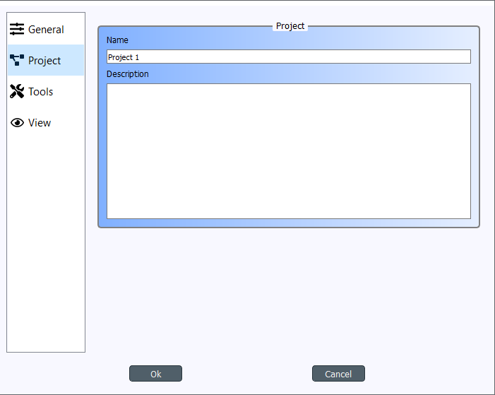
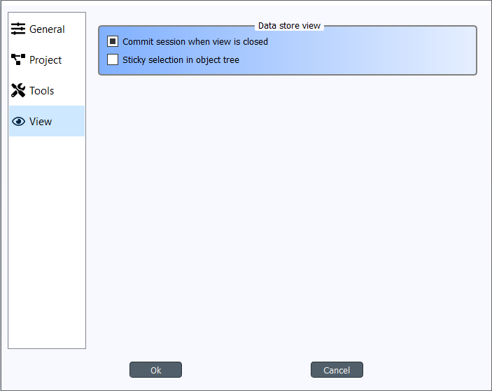

.. Settings form documentation
   Created 14.1.2019

.. _Settings:

********
Settings
********

You can open Spine Toolbox settings from the main window menu ``File->Settings...``, or by
pressing **F1**. Settings are categorized into four tabs; *General*, *Project*,
*Tool*, and *View*. In addition to application settings, each Project item has user adjustable
properties (See :ref:`Project Items`)

.. contents::
   :local:

General settings
----------------

.. image:: img/settings_general.png
   :align: center

The General tab contains the general application settings.

- **Open previous project at startup** If checked, application opens the project at startup that was
  open the last time the application was shut down. If left unchecked, application starts without a
  project open.

- **Show confirm exit prompt** If checked, confirm exit prompt is shown. If unchecked, application
  exits without prompt.

- **Save project at exit** Unchecked: Does not save project and does not show message box. Partially
  checked: Shows message box (default). Checked: Saves project and does not show message box.

- **Show date and time in Event Log messages** If checked, every Event Log message is prepended with
  a date and time 'tag'.

- **Delete data when project item is removed from project** Check this box to delete project item's data
  when a project item is removed from project. This means, that the *project item directory* and its
  contents will be deleted from your hard drive. You can find the project item directories from the
  ``<proj_dir>/.spinetoolbox/items/`` directory, where ``<proj_dir>`` is your current project directory.

- **Work directory** Directory where processing the Tool takes place. Default place (if left empty) is
  the ``/work`` subdirectory of Spine Toolbox install directory. You can change this directory.
  Make sure to clean up the directory every now and then.

- **Smooth zoom** Controls the way zooming (by using the mouse wheel) behaves in Design View and in
  Spine database editor. Controls if the zoom in/out is continuous or discrete. On older computers,
  smooth zoom is not recommended (because it may be slower).

- **Curved links** Controls the look of the arrows (connections) on Design View.

- **Design View background** Choosing grid shows a black grid as the Design View background. Choosing
  Solid and then clicking on the square next to it let's you choose the background color.

- **Data flow animation speed** This slider controls the speed of the 'arrow' animation on Design
  View when execution is about to start.

Project settings
----------------

These settings affect the project that is currently open. To save the project to a new directory
use the ``File->Save project as...`` menu item. Or you can simply copy the project directory anywhere
on your file system.

- **Name** The default name for new projects is the name of the project directory. You can
  change the project name here.

- **Description** You can type a description for your project here.

Tools settings
--------------

.. image:: img/settings_tools.png
   :align: center

- **GAMS executable** Path to GAMS executable you wish to use to execute *Exporter* project items and
  *Tool* project items that use a GAMS Tool specification. Leave this empty to use the system GAMS
  (i.e. GAMS set up in your system PATH variable).

- **Julia executable** Path to Julia executable you wish to use to execute *Tool* project items
  that use a Julia Tool specification. This is the Julia executable that will be used in the
  embedded Julia Console and also the Julia that is used when executing Julia Tool specifications
  as in the shell. Leave this empty, if you wish to use the system Julia.

- **Julia home project** Set the Julia home project here.

- **Use embedded Julia Console** Check this box to execute *Tool* project items that use a Julia
  Tool specification in the built-in Julia Console. If you leave this un-checked, Julia Tool
  specifications will be executed as in the shell. I.e on Windows this would be the equivalent to
  running command ``julia.exe example_script.jl`` in the command prompt. If you decide to use the
  embedded Julia Console, the ``example_script.jl`` is *included* into the console and executed there.
  It is recommended to use the embedded Julia Console, since this gives a significant performance
  boost compared to shell execution.

- **Python interpreter** Path to Python executable you wish to use to execute *Tool* project items
  that use a Python Tool specification. This is the Python that will be used in the embedded Python
  Console and also the Python that is used when executing Python Tool specifications as in the shell.
  Leave this empty to use the system Python.

- **Use embedded Python Console** Check this box to execute Python Tool specifications in the
  embedded Python Console. If you un-check this box, Python Tool specifications will be executed as
  in the shell. I.e on Windows this would be the equivalent to running command
  ``python.exe script.py`` in the command prompt. If you decide to use the embedded Python Console,
  ``script.py`` is executed there instead.

View settings
-------------

- **Commit session when view is closed** This checkbox controls what happens when you close the Spine
  database editor which has uncommitted changes. When this is unchecked, all changes are discarded without
  notice. When this is partially checked (default), a message box warning you about uncommitted
  changes is shown. When this is checked, a commit message box is shown immediately without first
  showing the message box.

- **Sticky selection in object tree** Controls how selecting items in Spine database editor's Object tree
  using the left mouse button works. If unchecked, single selection is enabled and pressing the
  Ctrl-button down enables multiple selection. If checked, Multiple selection is enabled and pressing
  the Ctrl-button down enables single selection.

Application preferences
-----------------------
Spine Toolbox remembers the size, location, and placement of most of the application windows from the
previous session (i.e. when closing and restarting the app).

Where are the application settings stored?
------------------------------------------
Application settings and preferences (see above) are saved to a location that depends on your
operating system. On Windows, there is no separate settings file. They are stored into registry key
``HKEY_CURRENT_USER\Software\SpineProject\Spine Toolbox``. It is safe to delete this key if you
want to reset Spine Toolbox to factory settings.

.. note::
   If you are looking for information on project item properties, see :ref:`Project Items`.
