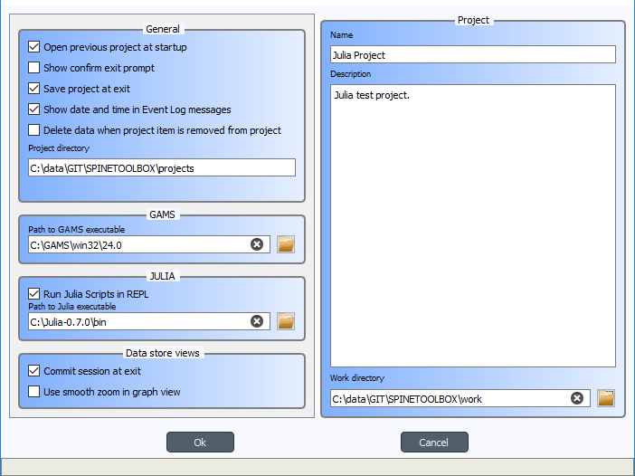

.. Settings form documentation
   Created 14.1.2019

.. _Settings:

********
Settings
********

Spine Toolbox settings are categorized in the following way

.. contents::
   :local:

Application settings
--------------------

You can open the application settings from the main window menu `File->Settings...`, or by pressing `F1`.

The settings on this form have been categorized into six categories. *General*, *GAMS*, *Julia*, *Python* and
*Data store views* settings are general application settings, which affect all projects. Settings in the
*Project* category only affect the current project.

General settings
================

- **Open previous project at startup** If checked, application opens the project at startup that was open the last
  time the application was shut down. If left unchecked, application starts without a project open.

- **Show confirm exit prompt** If checked, confirm exit prompt is shown. If unchecked, application exits
  without prompt.

- **Save project at exit** Unchecked: Does not save project and does not show message box. Partially checked:
  Shows message box (default). Checked: Saves project and does not show message box.

- **Show date and time in Event Log messages** If checked, date and time is appended into every Event Log message.

- **Delete data when project item is removed from project** Check this box to delete project item's data when
  a project item is removed from project. This means, that the project item directory and its contents will be
  deleted from your hard drive.

- **Project directory** Directory where projects are saved. This is non-editable at the moment.

- **Smooth zoom** Controls the way zooming (by using the mouse wheel) behaves in Design View and Graph View.
  Controls if the zoom in/out is continuous or discrete. On older computers, smooth zoom is not recommended.

- **Design View background** Choosing grid shows a black grid as the Design View background. Choosing Solid and then
  clicking on the square next to it let's you choose the background color.

GAMS settings
=============

- **GAMS program** Path to Gams executable you wish to use to execute GAMS Tool specifications. Leave this blank to use
  the system GAMS i.e. GAMS set up in your system PATH variable.

Julia settings
==============

- **Julia executable** Path to Julia executable you wish to use to execute Julia Tool specifications. This is the Julia
  that will be used in the embedded Julia Console and also the Julia that is used when executing Julia Tool specifications
  as in the shell. Leave this blank, if you wish to use the system Julia.

- **Julia home project** Set the Julia home project here.

- **Use embedded Julia Console** Check this box to execute Julia Tool specifications in the built-in Julia Console. If
  you leave this un-checked, Julia Tool specifications will be executed as in the shell. For example, on Windows this
  would be the equivalent as running command ``julia.exe example_script.jl`` in the command prompt. If you decide
  to use the embedded Julia Console, the ``example_script.jl`` is *included* into the console and executed there.
  It is highly recommended to use the embedded Julia Console, since this gives significant performance improvements
  compared to shell execution.

Python settings
===============

- **Python interpreter** Path to Python executable you wish to use to execute Python Tool specifications. This is the
  Python that will be used in the embedded Python Console and also the Python that is used when executing Python
  Tool specifications as in the shell. Leave this blank, if you wish to use the system Python.

- **Use embedded Python Console** Check this box to execute Python Tool specifications in the embedded iPython Console.
  If you un-check this box, Python Tool specifications will be executed as in the shell. For example, on Windows this
  would be the equivalent as running command ``python.exe script.py`` in the command prompt. If you decide to use
  the embedded Python Console, the ``script.py`` is executed there.

Data Store views settings
=========================

- **Commit session when view is closed** This checkbox controls what happens when you close the Tree view, the
  Graph view, or the tabular view and when you have uncommitted changes. Unchecked: Does not commit session and does
  not show message box. Partially checked: Shows message box (default). Checked: Commits session and does not show
  message box.

Project settings
================
These settings affect only the project that is currently open.

- **Name** Current project name. If you want to change the name of the project, use menu option `File-Save as...`.

- **Description** Current project description. You can edit the description here.

- **Work directory** Directory where processing the Tool takes place. You can change this directory. Make sure to
  clean up the directory every now and then.

Project item settings / properties
----------------------------------
Each project item (Data Connection, Data Store, Exporter, Importer, Tool and View) has its own set of properties.
These are saved into the project save file. You can view and edit them in project item properties on the main window.

Application preferences
-----------------------
Spine Toolbox remembers the size, location, and placement of most of the application windows from the
previous session (i.e. when closing and restarting the app).

Where are the Settings stored?
------------------------------
Application Settings and Preferences are saved to a location that depends on your operating system. On Windows,
there is no separate settings file, the settings are stored into registry key
``HKEY_CURRENT_USER\Software\SpineProject\Spine Toolbox``. It is safe to delete this key if you want to reset
application to factory settings.

Projects are saved to `.proj` files in the Project directory. In addition, each project has its own dedicated
directory under the Project directory which can be used to keep data from different projects separate. All project
items in a project have their own directory under that project's directory, where individual project item data can be
stored (e.g. `.sqlite` files in Data Store directories).
