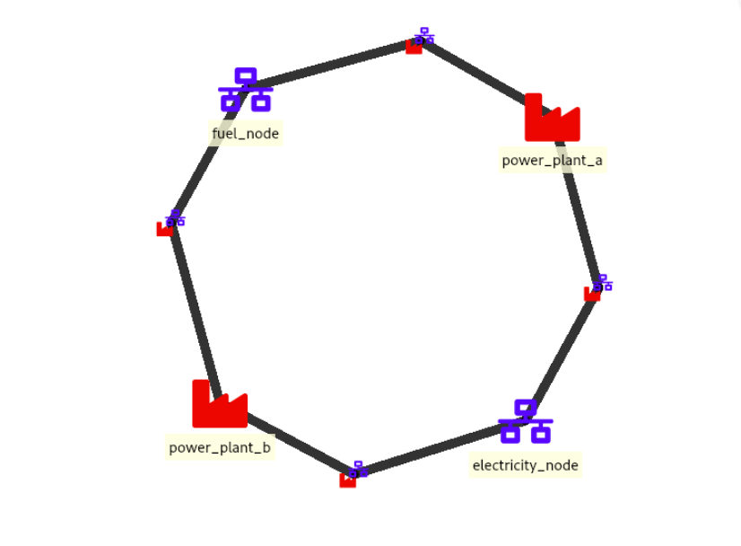
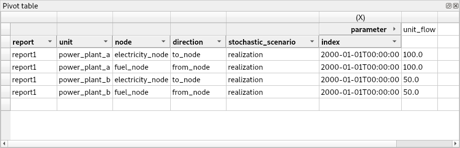

..  Case Study A5 tutorial
    Created: 18.6.2018

.. |ds_icon| image:: img/project_item_icons/database.svg
            :width: 16
.. |tool_icon| image:: img/project_item_icons/hammer.svg
             :width: 16
.. |execute_project| image:: ../../spinetoolbox/ui/resources/menu_icons/play-circle-solid.svg
             :width: 16
.. |file-regular| image:: ../../spinetoolbox/ui/resources/file-regular.svg
             :width: 16

**********************
Simple System tutorial
**********************

Welcome to Spine Toolbox's Symple System tutorial.

This tutorial provides a step-by-step guide to setup a simple energy system on Spine Toolbox
and is organized as follows:

.. contents::
   :local:

Introduction
------------

Model assumptions
=================

- Two power plants take fuel from a source node and release electricity to another node in order to supply a demand.

- Power plant 'a' has a capacity of 100 MWh, a variable operating cost of 25 euro/fuel unit, and generates 0.7 MWh of electricity
  per unit of fuel.

- Power plant 'b' has a capacity of 200 MWh, a variable operating cost of 50 euro/fuel unit, and generates 0.8 MWh of electricity
  per unit of fuel.

- The demand at the electricity node is 150 MWh.

- The fuel node is able to provide infinite energy.

Guide
-----

Installing requirements
=======================

.. note:: This tutorial is written for latest `Spine Toolbox 
   <https://github.com/Spine-project/Spine-Toolbox/>`_ and `SpineOpt 
   <https://github.com/Spine-project/SpineOpt.jl>`_ development versions.

- If you haven't, follow the instructions `here <https://github.com/Spine-project/SpineOpt.jl#installation>`_ 
  to install Spine Toolbox and SpineOpt in your system.

- If you already have Spine Toolbox and SpineOpt installed, please follow the instructions
  `here <https://github.com/Spine-project/Spine-Toolbox/blob/master/README.md#upgrading>`_
  and `here <https://github.com/Spine-project/SpineOpt.jl#upgrading>`_ to upgrade to the latest versions.

Installing the SpineOpt plugin
==============================

#. Launch Spine Toolbox and select **Plugins -> Install plugin...** from the main menu.
   The *Install plugin* dialog will pop up. Select SpineOpt from the list and press **Ok**.

   .. image:: img/install_spine_opt_plugin.png
      :align: center

   A new toolbar will appear, looking similar to this:

   .. image:: img/spine_opt_plugin_tool_bar.png
      :align: center

Setting up project
==================

#. Select **File -> New project...** from Spine Toolbox main menu.
   Browse to a location where you want to create the project and create a new folder for it,
   called e.g. ’SimpleSystem’, and then click **Open**.

#. Drag the *Data Store* icon |ds_icon| from the tool bar and drop it into the 
   *Design View*. This will open the *Add Data Store* dialog. 
   Type ‘input’ as the Data Store name and click **Ok**.

#. Repeat the above procedure to create a Data Store called ‘output’.

#. Create a database for the ‘input‘ Data Store:

   #. Select the `input` Data Store item in the *Design View* to show the *Data Store Properties* 
      (on the right side of the window, usually).

   #. In *Data Store Properties*, select the *sqlite* dialect at the top, and hit **New Spine db**.
      A dialog will pop up to let you select a name for the database file; just accept the default name.

#. Repeat the above procedure to create a database for the ‘output’ Data Store.

#. Drag the *Run SpineOpt* icon |tool_icon| from the SpineOpt tool bar into the *Design View*.
   This will open the *Add Tool* dialog. Accept the default name (‘Run SpineOpt 1’) and click **Ok**.

   .. note:: Each item in the *Design view* is equipped with three *connectors*
      (the small squares at the item boundaries).

#. Click on one of ‘input’ connectors to start a *connection*, and then on one of ‘Run SpineOpt 1’ connectors to close it.

#. Repeat the procedure to create a *connection* from ‘Run SpineOpt 1’ to ‘output’. 
   It should look something like this:

   .. image:: img/simple_system_item_connections.png
      :align: center

#. Setup the arguments for the `Run SpineOpt` Tool:

   #. Select the `Run SpineOpt` Tool to show the *Tool Properties* (on the right side of the window, usually).
      You should see two elements listed under *Available resources*, ``{db_url@input}`` and ``{db_url@output}``.

   #. Drag the first resource, ``{db_url@input}``, and drop it in *Command line arguments*;
      then drag the second resource, ``{db_url@output}``, and drop it right below the previous one.
      The panel should be now looking like this:

      .. image:: img/simple_system_cmdline_args.png
         :align: center

   #. Double-check that the *order* of the arguments is correct: first, ``{db_url@input}``, and second, ``{db_url@output}``.
      (You can drag and drop to reorganize them if needed.)

#. From the main menu, select **File -> Save project**.

Entering input data
===================

Importing the SpineOpt database template
~~~~~~~~~~~~~~~~~~~~~~~~~~~~~~~~~~~~~~~~

#. Download `the basic SpineOpt database template 
   <https://raw.githubusercontent.com/Spine-project/SpineOpt.jl/master/templates/models/basic_model_template.json>`_
   (right click on the link, then select *Save link as...*)

#. Select the 'input' Data Store item in the *Design View*.

#. Go to *Data Store Properties* and hit **Open editor**. This will open 
   the newly created database in the *Spine DB editor*, looking similar to this:

   .. image:: img/case_study_a5_spine_db_editor_empty.png
      :align: center

   .. note:: The *Spine DB editor* is a dedicated interface within Spine Toolbox
      for visualizing and managing Spine databases.

#. Press **Alt + F** to display the main menu, select **File -> Import...**,
   and then select the template file you previously downloaded. 
   The contents of that file will be imported into the current database,
   and you should then see classes like ‘commodity’, ‘connection’ and ‘model’ under 
   the root node in the *Object tree* (on the left).

#. From the main menu, select **Session -> Commit**.
   Enter ‘Import SpineOpt template’ as message in the popup dialog, and click **Commit**.

.. note:: The SpineOpt basic template contains (i) the fundamental entity classes
   and parameter definitions that SpineOpt recognizes and expects; and (ii) some
   predefined entities for a common deterministic model with a 'flat' temporal structure.

Creating objects
~~~~~~~~~~~~~~~~

#. Always in the Spine DB editor, locate the *Object tree* (typically at the top-left). Expand the `root`
   element if not expanded.

#. Right click on the `node` class, and select *Add objects* from the context menu.
   The *Add objects* dialog will pop up.

#. Enter the names for the system nodes as seen in the image below, then press *Ok*. This will create two objects
   of class `node`, called `fuel_node` and `electricity_node`.

   .. image:: img/simple_system_add_nodes.png
      :align: center

#. Right click on the `unit` class, and select *Add objects* from the context menu.
   The *Add objects* dialog will pop up.

#. Enter the names for the system units as seen in the image below, then press *Ok*. This will create two objects
   of class `unit`, called `power_plant_a` and `power_plant_b`.

   .. image:: img/simple_system_add_units.png
      :align: center

.. note:: In SpineOpt, nodes are points where an energy balance takes place, whereas units are energy conversion
   devices that can take energy from nodes, and release energy to nodes.

#. Right click on the `output` class, and select *Add objects* from the context menu.
   The *Add objects* dialog will pop up.

#. Enter `unit_flow` under *object name* as in the image below, then press *Ok*. This will create one object
   of class `unit`, called `unit_flow`.

   .. image:: img/simple_system_add_output.png
      :align: center

.. note:: In SpineOpt, outputs represent optimization variables that can be written to the output database as part of a report.

.. note:: To modify an object after you enter it, right click on it and select **Edit...** from the context menu.

Establishing relationships
~~~~~~~~~~~~~~~~~~~~~~~~~~

#. Always in the Spine DB editor, locate the *Relationship tree* (typically at the bottom-left).
   Expand the `root` element if not expanded.

#. Right click on the `unit__from_node` class, and select *Add relationships* from the context menu.
   The *Add relationships* dialog will pop up.

#. Select the names of the two units and their **sending** nodes, as seen in the image below; then press *Ok*.
   This will establish that both `power_plant_a` and `power_plant_b` take energy from the `fuel_node`.

   .. image:: img/simple_system_add_unit__from_node_relationships.png
      :align: center

#. Right click on the `unit__to_node` class, and select *Add relationships* from the context menu.
   The *Add relationships* dialog will pop up.

#. Select the names of the two units and their **receiving** nodes, as seen in the image below; then press *Ok*.
   This will establish that both `power_plant_a` and `power_plant_b` release energy into the `electricity_node`.

   .. image:: img/simple_system_add_unit__to_node_relationships.png
      :align: center

#. Right click on the `report__output` class, and select *Add relationships* from the context menu.
   The *Add relationships* dialog will pop up.

#. Enter `report1` under *report*, and `unit_flow` under *output*, as seen in the image below; then press *Ok*.
   This will tell SpineOpt to write the value of the `unit_flow` optimization variable to the output database,
   as part of `report1`.

   .. image:: img/simple_system_add_report__output_relationships.png
      :align: center

.. _Specifying object parameter values:

Specifying object parameter values
~~~~~~~~~~~~~~~~~~~~~~~~~~~~~~~~~~

#. Back to *Object tree*, expand the `node` class and select `electricity_node`.

#. Locate the *Object parameter* table (typically at the top-center).

#. In the *Object parameter* table (typically at the top-center),
   select the `demand` parameter and the `Base` alternative, and enter the value `100` as seen in the image below.
   This will establish that there's a demand of '100' at the electricity node.

   .. image:: img/simple_system_electricity_demand.png
      :align: center

#. Select `fuel_node` in the *Object tree*.

#. In the *Object parameter* table, select the `balance_type` parameter and the `Base` alternative,
   and enter the value `balance_type_none` as seen in the image below.
   This will establish that the fuel node is not balanced, and thus provide as much fuel as needed.

   .. image:: img/simple_system_fuel_balance_type.png
      :align: center

.. _Specifying relationship parameter values:

Specifying relationship parameter values
~~~~~~~~~~~~~~~~~~~~~~~~~~~~~~~~~~~~~~~~

#. In *Relationship tree*, expand the `unit__from_node` class and select `power_plant_a | fuel_node`.

#. In the *Relationship parameter* table (typically at the bottom-center),
   select the `vom_cost` parameter and the `Base` alternative, and enter the value `25` as seen in the image below.
   This will set the operating cost for `power_plant_a`.

   .. image:: img/simple_system_power_plant_a_vom_cost.png
      :align: center

#. Select `power_plant_b | fuel_node` in the *Relationship tree*.

#. In the *Relationship parameter* table, select the `vom_cost` parameter and the `Base` alternative,
   and enter the value `50` as seen in the image below.
   This will set the operating cost for `power_plant_b`.

   .. image:: img/simple_system_power_plant_b_vom_cost.png
      :align: center

#. In *Relationship tree*, expand the `unit__to_node` class and select `power_plant_a | electricity_node`.

#. In the *Relationship parameter* table, select the `unit_capacity` parameter and the `Base` alternative,
   and enter the value `100` as seen in the image below.
   This will set the capacity for `power_plant_a`.

   .. image:: img/simple_system_power_plant_a_capacity.png
      :align: center

#. Select `power_plant_b | electricity_node` in the *Relationship tree*.

#. In the *Relationship parameter* table, select the `unit_capacity` parameter and the `Base` alternative,
   and enter the value `200` as seen in the image below.
   This will set the capacity for `power_plant_b`.

   .. image:: img/simple_system_power_plant_b_capacity.png
      :align: center

#. In *Relationship tree*, select the `unit__node__node` class, and come back to the *Relationship parameter* table.

#. In the *Relationship parameter* table, select `power_plant_a | electricity_node | fuel_node` under *object name list*,
   `fix_ratio_out_in_unit_flow` under *parameter name*, `Base` under *alternative name*, and enter `0.7` under *value*.
   Repeat the operation for `power_plant_b`, but this time enter `0.8` under *value*.
   This will set the conversion ratio from fuel to electricity for `power_plant_a` and `power_plant_b` to `0.7` and `0.8`,
   respectively.
   It should like the image below.

   .. image:: img/simple_system_fix_ratio_out_in_unit_flow.png
      :align: center

When you're ready, commit all changes to the database.

Executing the workflow
======================

#. Go back to Spine Toolbox's main window, and hit the **Execute project** button |execute_project| from 
   the tool bar.

   You should see ‘Executing All Directed Acyclic Graphs’ printed in the *Event log*
   (at the bottom left by default).

#. Select the 'Run SpineOpt 1' Tool. You should see the output from SpineOpt in the *Julia Console*.

Examining the results
=====================

#. Select the output data store and open the Spine DB editor.

#. Press **Alt + F** to display the main menu, and select **Pivot -> Index**.

#. Select `report__unit__node__direction__stochastic_scenario` under **Relationship tree**, and
   the first cell under **alternative** in the *Frozen table*.

#. The *Pivot table* will be populated with results from the SpineOpt run. It will look something like the image below.

