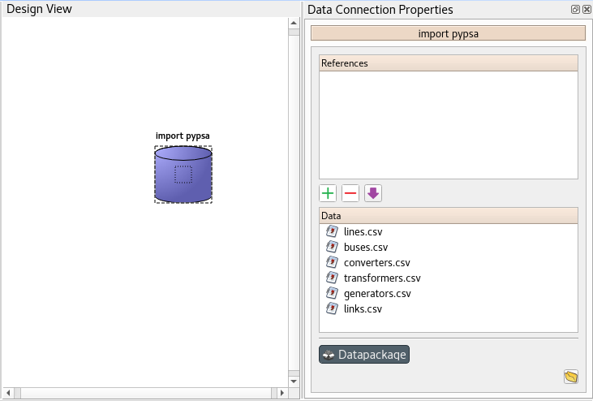
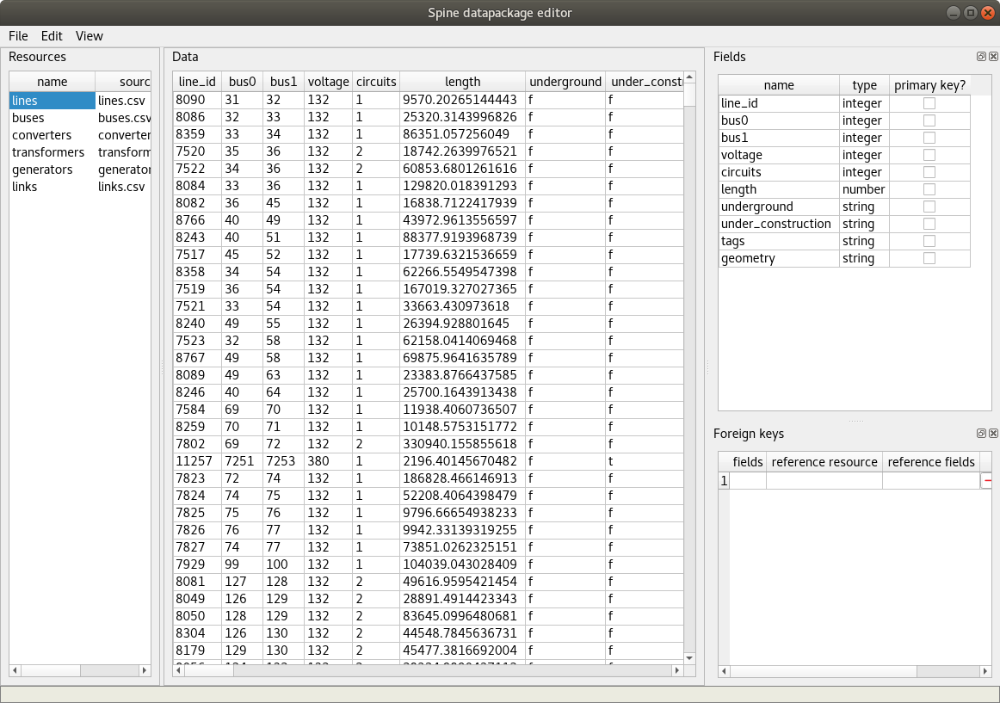

..  Spine datapackage editor
    Created: 15.1.2019

.. _Spine datapackage editor:

************************
Spine datapackage editor
************************

.. note:: This section is a work in progress.

This section describes the Spine datapackage editor, used to interact with tabular data and export it into
Spine format.

To open the Spine datapackage editor, select a **Data Connection** with *CSV files* in it,
and press the **Datapackage** button in its *Properties*:

