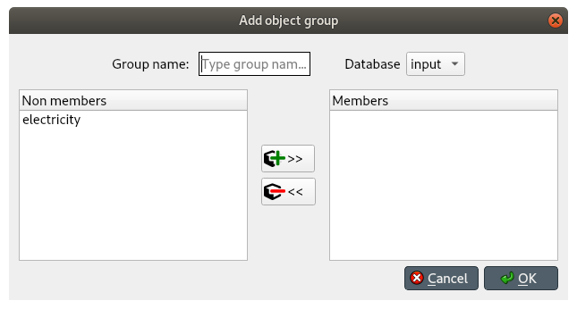
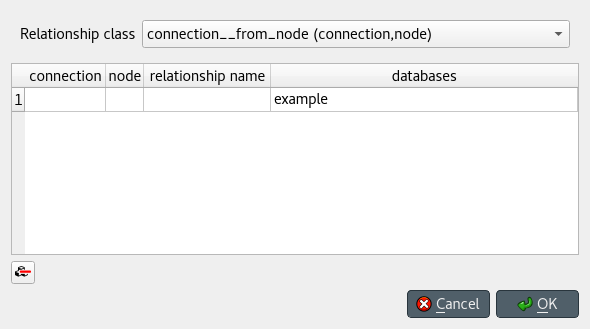

Adding data
-----------

This section describes the available tools to add new data.

.. contents::
   :local:

Adding object classes
=====================

From *Object tree*
~~~~~~~~~~~~~~~~~~

Right-click on the root item in *Object tree* to display the context menu, and select **Add object classes**.

The *Add object classes* dialog will pop up:

.. image:: img/add_object_classes_dialog.png
   :align: center

Enter the names of the classes you want to add under the *object class name* column. 
Optionally, you can enter a description for each class under the *description* column.
To select icons for your classes, double click on the corresponding cell under the *display icon* column.
Finally, select the databases where you want to add the classes under *databases*.
When you're ready, press **Ok**.

Adding objects
==============

From *Object tree* or *Entity graph*
~~~~~~~~~~~~~~~~~~~~~~~~~~~~~~~~~~~~

Right-click on an object class item in *Object tree*, or on an empty space in the *Entity graph*,
and select **Add objects** from the context menu.

The *Add objects* dialog will pop up:

.. image:: img/add_objects_dialog.png
   :align: center

Enter the names of the object classes under *object class name*, and the names of the objects under *object name*.
To display a list of available classes, start typing or double click on any cell under the *object class name* column.
Optionally, you can enter a description for each object under the *description* column.
Finally, select the databases where you want to add the objects under *databases*.
When you're ready, press **Ok**.

From *Pivot table*
~~~~~~~~~~~~~~~~~~
To add an object to a specific class, bring the class to *Pivot table* using any input type
(see :ref:`using_pivot_table_and_frozen_table`).
Then, enter the object name in the last cell of the header corresponding to that class.

Duplicating objects
~~~~~~~~~~~~~~~~~~~
To duplicate an existing object with all its relationships and parameter values,
right-click over the corresponding object item in *Object tree* to display the context menu,
and select **Duplicate object**. Enter a name for the duplicate and press **Ok**.

Adding object groups
====================

Right-click on an object class item in *Object tree*,
and select **Add object group** from the context menu.

The *Add object group* dialog will pop up:

Enter the name of the group, and select the database where you want the group to be created.
Select the member objects under *Non members*, and press the button in the middle that has a plus sign.
Multiple selection works.

When you're happy with your selections, press **Ok** to add the group to the database.

Adding relationship classes
===========================

From *Object tree* or *Relationship tree*
~~~~~~~~~~~~~~~~~~~~~~~~~~~~~~~~~~~~~~~~~
Right-click on an object class item in *Object tree*, or on the root item in *Relationship tree*,
and select **Add relationship classes** from the context menu.

The *Add relationship classes* dialog will pop up:

.. image:: img/add_relationship_classes_dialog.png
   :align: center

Select the number of dimensions using the spinbox at the top;
then, enter the names of the object classes for each dimension under each *object class name* column,
and the names of the relationship classes under *relationship class name*.
To display a list of available object classes, 
start typing or double click on any cell under the *object class name* columns.
Optionally, you can enter a description for each relationship class under the *description* column.
Finally, select the databases where you want to add the relationship classes under *databases*.
When you're ready, press **Ok**.

Adding relationships
====================

From *Object tree* or *Relationship tree*
~~~~~~~~~~~~~~~~~~~~~~~~~~~~~~~~~~~~~~~~~

Right-click on a relationship class item either in *Object tree* or *Relationship tree*,
and select **Add relationships** from the context menu.

The *Add relationships* dialog will pop up:

Select the relationship class from the combo box at the top;
then, enter the names of the objects for each member object class under the corresponding column,
and the name of the relationship under *relationship name*.
To display a list of available objects for a member class, 
start typing or double click on any cell under that class's column.
Finally, select the databases where you want to add the relationships under *databases*.
When you're ready, press **Ok**.

From *Pivot table*
~~~~~~~~~~~~~~~~~~
To add a relationship for a specific class, 
bring the class to *Pivot table* using the **Relationship** input type
(see :ref:`using_pivot_table_and_frozen_table`).
The *Pivot table* headers will be populated
with all possible combinations of objects across the member classes.
Locate the objects you want as members in the new relationship,
and check the corresponding box in the table body.

From *Entity graph*
~~~~~~~~~~~~~~~~~~~
Make sure all the objects you want as members in the new relationship are in the graph.
To start the relationship, either double click on one of the object items,
or right click on it to display the context menu, and choose **Add relationships**.
A menu will pop up showing the available relationship classes.
Select the class you want; the mouse cursor will adopt a cross-hairs shape.
Click on each of the remaining member objects, one by one and in the right order, to add them to the relationship.
Once you've added enough objects for the relationship class, a dialog will pop up.
Check the boxes next to the relationships you want to add, and press **Ok**.

.. tip:: All the *Add...* dialogs support pasting tabular (spreadsheet) data from the clipboard.
   Just select any cell in the table and press **Ctrl+V**. 
   If needed, the table will grow to accommodate the exceeding data.
   To paste data on multiple cells, select all the cells you want to paste on and press **Ctrl+V**.

Adding parameter definitions
============================

From *Stacked tables*
~~~~~~~~~~~~~~~~~~~~~

To add new parameter definitions for an object class,
just fill the last empty row of *Object parameter definition*.
Enter the name of the class under *object_class_name*, and the name of the parameter under *parameter_name*.
To display a list of available object classes, 
start typing or double click under the *object_class_name* column.
Optionally, you can also specify a default value, a parameter value list, or any number of parameter tags
under the appropriate columns.
The parameter is added when the background of the cells under *object_class_name*
and *parameter_name* become gray.

To add new parameter definitions for a relationship class,
just fill the last empty row of *Relationship parameter definition*,
following the same guidelines as above.

From *Pivot table*
~~~~~~~~~~~~~~~~~~

To add a new parameter definition for a class,
bring the corresponding class to *Pivot table* using the **Parameter value** input type
(see :ref:`using_pivot_table_and_frozen_table`).
The **parameter** header of *Pivot table* will be populated
with existing parameter definitions for the class.
Enter a name for the new parameter in the last cell of that header.

Adding parameter values
=======================

From *Stacked tables*
~~~~~~~~~~~~~~~~~~~~~

To add new parameter values for an object,
just fill the last empty row of *Object parameter value*.
Enter the name of the class under *object_class_name*, the name of the object under *object_name*,
the name of the parameter under *parameter_name*, and the name of the alternative under *alternative_name*.
Optionally, you can also specify the parameter value right away under the *value* column.
To display a list of available object classes, objects, parameters, or alternatives,
just start typing or double click under the appropriate column.
The parameter value is added when the background of the cells under *object_class_name*,
*object_name*, and *parameter_name* become gray.

To add new parameter values for a relationship class,
just fill the last empty row of *Relationship parameter value*,
following the same guidelines as above.

.. note:: To add parameter values for an object, the object has to exist beforehand.
   However, when adding parameter values for a relationship, you can specify any valid combination
   of objects under *object_name_list*, and a relationship will be created among those objects
   if one doesn't yet exist.

From *Pivot table*
~~~~~~~~~~~~~~~~~~

To add parameter value for any object or relationship,
bring the corresponding class to *Pivot table* using the **Parameter value** input type
(see :ref:`using_pivot_table_and_frozen_table`).
Then, enter the parameter value in the corresponding cell in the table body.

.. tip:: All *Stacked tables* and *Pivot table* support pasting tabular (e.g., spreadsheet) data from the clipboard.
   Just select any cell in the table and press **Ctrl+V**. 
   If needed, *Stacked tables* will grow to accommodate the exceeding data.
   To paste data on multiple cells, select all the cells you want to paste on and press **Ctrl+V**.

Adding tools, features, and methods
===================================

To add a new feature, go to *Tool/Feature tree* and select the last item under **feature** in the appropriate database,
start typing or press **F2** to display available parameter definitions, and select the one you want to become a feature.

.. note:: Only parameter definitions that have associated a parameter value list can become features.

To add a new tool, just select the last item under **tool** in the appropriate database,
and enter the name of the tool.

To add a feature for a particular tool, drag the feature item and drop it over the **tool_feature** list
under the corresponding tool.

To add a new method for a tool-feature, select the last item under *tool_feature_method* (in the appropriate database),
start typing or press **F2** to display available methods, and select the one you want to add.

Adding alternatives
===================

From *Alternative tree*
~~~~~~~~~~~~~~~~~~~~~~~

To add a new alternative, just select the last item appropriate database,
and enter the name of the alternative.

You can also copy and paste alternatives between different databases.

From *Pivot table*
~~~~~~~~~~~~~~~~~~

Select the **Scenario** input type (see :ref:`using_pivot_table_and_frozen_table`).
To add a new alternative, enter a name in the last cell of the **alternative** header.

Adding scenarios
================

From *Scenario tree*
~~~~~~~~~~~~~~~~~~~~

To add a new scenario, just select the last item under the appropriate database,
and enter the name of the scenario.

To add an alternative for a particular scenario, drag the alternative item from *Alternative tree*
and drop it under the corresponding scenario.
The position where you drop it determines the alternative's *rank* within the scenario.
Alternatives can also be copied from *Alternative tree*
and pasted at the appropriate position in *Scenario tree*.

.. note:: Alternatives with higher rank have priority when determining the parameter value for a certain scenario.
   If the parameter value is specified for two alternatives, and both of them happen to coexist in a same scenario,
   the value from the alternative with the higher rank takes precedence.

If it is desirable to base a scenario on an existing one, scenarios can be duplicated
using the **Duplicate** item in the right-click context menu, or by pressing **Ctrl+D**.
It is also possible to copy and paste scenarios between databases.

From *Pivot table*
~~~~~~~~~~~~~~~~~~

Select the **Scenario** input type (see :ref:`using_pivot_table_and_frozen_table`).
To add a new scenario, enter a name in the last cell of the **scenario** header.

From *Generate scenarios*
~~~~~~~~~~~~~~~~~~~~~~~~~

Scenarios can be added also by automatically generating them from existing alternatives.
Select the alternatives in *Alternative tree* (using **Ctrl** and **Shift** while clicking the items),
then right click to open a context menu.
Select **Generate scenarios...**

.. image:: img/generate_scenarios.png
   :align: center

Give the scenario names a prefix.
An index will be appended to the prefix automatically: **prefix01**, **prefix02**,...
Select appropriate operation from the combo box.
Checking the **Use base alternative** check box will add the selected alternative to
all generated scenarios as the lowest rank alternative.
The **Alternative by rank** list allows reordering the ranks of the alternatives.

Adding parameter value lists
============================

To add a new parameter value list, go to *Parameter value list* and select the last item under the appropriate database,
and enter the name of the list.

To add new values for the list, select the last empty item under the corresponding
list item, and enter the value. To enter a complex value, right-click on the empty item and select
**Open editor** from the context menu.

.. note:: To be actually added to the database, a parameter value list must have at least one value.

Adding metadata and item metadata
=================================

To add new metadata go to *Metadata* and add a new name and value to the last row.

To add a new link metadata for an item,
select an entity from one of the entity trees
or a parameter value from one of the parameter value tables.
Then go to *Item metadata* and select the appropriate metadata name and value on the last row.
