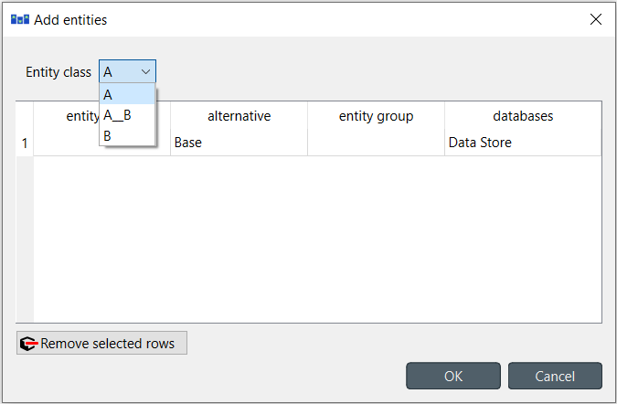

.. |add| image:: ../../../spinetoolbox/ui/resources/menu_icons/cube_plus.svg
   :width: 16
.. |remove| image:: ../../../spinetoolbox/ui/resources/menu_icons/cube_minus.svg
   :width: 16

Adding data
-----------

This section describes the available tools to add new data. Note that after adding
data to a Spine Database, it still needs to be committed in order for the changes
to take effect beyond just the current session in the Spine Database Editor. More
information about this in the chapter :ref:`committing_and_history`.

.. contents::
   :local:

Adding entity classes
=====================

From **Entity Tree**
~~~~~~~~~~~~~~~~~~~~

Right-click on the root item in **Entity Tree** to display the context menu, and select **Add entity classes**.

The *Add entity classes* dialog will pop up:

Select the number of dimensions using the spinbox at the top. The amount of dimensions determines the number
of dimension names that need to be selected. With 0-dimensional classes, like in the image above, only the name
of the created entity class is required. The class's name is to be entered below the header **entity class name**.
In other cases like in the image below, in addition to the created classes name, also the classes making up the new
class need to be selected:

.. image:: img/add_entity_classes_dialog_2D.png
   :align: center

They need to be filled under the headers **dimension name (1)** through **dimension name (N)** where N is the
selected dimension. Note that because of this, there needs to be at least N entity classes already defined in the
database when creating an N dimensional entity class. To display a list of available classes, start typing or double
click on the cell below the header. Optionally, you can enter a description for each class under the **description**
header. Double clicking the cell under the header **display icon** will open up the icon editor where the visual
representation of the class can be modified:

The boolean value of **active by default** will determine whether the entities created under the created class
will have the value under entity alternative set as true or false by default. Finally, select the databases where
you want to add the entity classes under **databases**.

Multiple additions can be at once. When some information is inserted into the preceding row, a new empty row will
appear in the dialog where a new class with the same dimensions can be defined. Delete entire rows from the dialog
with **Remove selected rows**. When you're ready, press **Ok** to make the additions.

.. tip:: All the *Add...* dialogs support pasting tabular (spreadsheet) data from the clipboard.
   Just select any cell in the table and press **Ctrl+V**.
   If needed, the table will grow to accommodate the exceeding data.
   To paste data on multiple cells, select all the cells you want to paste on and press **Ctrl+V**.

Adding entities
===============

From **Entity Tree** or **Graph View**
~~~~~~~~~~~~~~~~~~~~~~~~~~~~~~~~~~~~~~

Right-click on the root item in **Entity Tree** and select **Add entities**, or click on an empty space
in the **Graph View** and select **Add entities...** from the context menu.

This will open up the **Add entities** dialog:

Select the class where you want to add the entities from **Entity class**. It will list all of the entity classes.
To narrow down the list, instead of opening the dialog from the root item, open it from a specific entity class item
in the **Entity Tree**. This way the class will be preselected from the list and the list will overall only contain
other classes that are relevant to the selected class.

Enter the names of the entities under **entity name**. Finally, select the databases where you want to add the
objects under **databases**. When you're ready, press **Ok**. Rows can once again be deleted with the
**Remove selected rows** -button.

With N-D entity classes, the elements need to be specified. After defining the elements the entity's name can be
modified:

New entities for an existing N-D entity class can also be created easily from the **Graph view**.
Make sure all the objects you want as members in the new entity are in the graph.
To start the new N-D entity, either double click on one of the entity items in the graph,
or right click on it to display the context menu, and choose the class from **Connect entities**.
After selecting the class the mouse cursor will adopt a cross-hairs shape.

When hovering over a entity item, the cursor will aid by indicating an entity that can't be a
member by turning into a red restriction -sign. When nearly all of the selections made and only the
last member needs to be selected, the cursor will turn into a green checkmark when hovering over an
appropriate entity. Click on each of the remaining member entities one by one to add them to the new
entity. Once you've added enough members for the entity class, a dialog will pop up. In the dialog,
all of the possible permutations of the selected members are presented. Check the boxes next to the
entities you want to add, and press **OK**.

From **Pivot View**
~~~~~~~~~~~~~~~~~~~

To add an object to a specific 0-D entity class, bring the class to **Pivot View** using either **Value** or **Index**
(see :ref:`using_pivot_table_and_frozen_table`). There under the class name just type a new name and the new entity
will be added under the class. Note that is only possible to add 0-D entities this way even if you have selected
an N-D class from the **Entity Tree**.

To enter a new entity to an N-D class, select the **Element** -view from the hamburger menu. This view contains
all of the possible combinations of elements in the selected class. The entities can be added by checking the
boxes and removed by unchecking them.

Duplicating entities
~~~~~~~~~~~~~~~~~~~~

To duplicate an existing entity with all its parameter values and other associated data, right-click over the
corresponding entity item in **Entity Tree** to display the context menu, and select **Duplicate object**. The
new entity will have the same name with an added (1) to indicate that it is a copy of the original entity. It
can be renamed to be something else afterwards.

Adding entity groups
====================

Right-click on an object class item in **Entity Tree**,
and select **Add entity group** from the context menu.

The **Add entity group** dialog will pop up:

Enter the name of the group, and select the database where you want the group to be created.
Select the members under *Non members*, and press (|add|>>) to add the members and (|remove| <<) to remove them.
Multiple selection is supported with **Ctrl** and **Shift**. Finally press **OK** to create the group.

When you're happy with your selections, press **OK** to add the group to the database.

Adding parameter definitions
============================

From **Table View**
~~~~~~~~~~~~~~~~~~~~

To add new parameter definitions for an entity class, just fill the last empty row of *Parameter definition*.
Only two of the fields are required when creating a new parameter definition: *entity_class_name* and
*parameter_name*. Enter the name of the class under *entity_class_name*. To display a list of available
entity classes, start typing in the empty cell or double click it. For the name of the parameter choose
something that isn't already defined for the specified entity class. Optionally, you can also
specify a parameter value list, a default value and a description.

In the column *value_list_name* a name for a parameter value list can be selected. Leaving this field empty
means that later on when creating parameter values with this definition, the values are arbitrary. Meaning that
the value could for example be a string or an integer. When the parameter value list is defined in the parameter
definition, only the values in the list will be allowed to be chosen. For the creation of parameter value lists,
see :ref:`parameter_value_list`.

In the *default_value* field, the default value can be set. The default value can be used in cases where the value
is not specified. The usage of *default_value* is really tool dependent, meaning that the Spine Database Editor
doesn't use the information of the default value anywhere, but it is instead left to the tool creators on how to
utilize the default value. A short description for the parameter can be written in the *description* column.

The parameter is added when the background of the cells under *entity_class_name* and *database* become gray.

From **Pivot View**
~~~~~~~~~~~~~~~~~~~

To add a new parameter definition for a class,
bring the corresponding class to **Pivot View** using the **Value** input type
(see :ref:`using_pivot_table_and_frozen_table`).
The **parameter** header of **Pivot View** will be populated
with existing parameter definitions for the class.
Enter a name for the new parameter in the last cell of that header.

Adding parameter values
=======================

From *Table View*
~~~~~~~~~~~~~~~~~~~~~

To add new parameter values for an entity, just fill the last empty row of the *Parameter value* -table.
Enter the name of the class under *entity_class_name*, the name of the object under *entity_byname*,
the name of the parameter under *parameter_name*, and the name of the alternative under *alternative_name*.
Optionally, you can also specify the parameter value right away under the *value* column. The database where
the value will be added to is displayed in the last column of the table. To display a list of available
entity classes, entities, parameters, or alternatives, just start typing or double click under the appropriate
column. The parameter value is added when the background of the cells under *object_class_name* and *database*
become gray.

.. note:: To add parameter values for a 0-D entity, the entity has to exist beforehand.
   However, when adding parameter values for an N-D entity, you can specify any valid combination
   of elements by double clicking the cell under *entity_byname*, which opens up the *Select elements* -dialog.
   The specified N-D entity will be created if it doesn't yet exist.

From **Pivot View**
~~~~~~~~~~~~~~~~~~~

To add parameter value for any entity,
bring the corresponding class to **Pivot View** using the **Value** input type
(see :ref:`using_pivot_table_and_frozen_table`).
Then, enter the parameter value in the corresponding cell in the table body.

.. tip:: All **Tables Views** and **Pivot Views** support pasting tabular (e.g., spreadsheet) data from the clipboard.
   Just select any cell in the table and press **Ctrl+V**.
   If needed, **Table Views** will grow to accommodate the exceeding data.
   To paste data on multiple cells, select all the cells you want to paste on and press **Ctrl+V**.

Adding entity alternatives
==========================

To add an entity alternative, open the **Entity Alternative** -**Table View**. There under *entity_class_name* select
the class. Under *entity_byname* select the specific entity from that class and from *alternative_name* select the
alternative. Then set the value of the *active* -column to either true or false by double clicking it. The background
of the cells under *entity_class_name* and *database* should become gray, indicating that the entity alternative has
been added.

Adding alternatives
===================

From **Alternative**
~~~~~~~~~~~~~~~~~~~~

To add a new alternative, just select the last item under the appropriate database, and enter the name of the
new alternative.

You can also copy and paste alternatives between different databases.

From **Pivot View**
~~~~~~~~~~~~~~~~~~~

Select the **Scenario** input type (see :ref:`using_pivot_table_and_frozen_table`).
To add a new alternative, enter a name in the last cell of the **alternative** header.

Adding scenarios
================

From **Scenario Tree**
~~~~~~~~~~~~~~~~~~~~~~

To add a new scenario, just select the last item under the appropriate database,
and enter the name of the scenario.

To add an alternative for a particular scenario, drag the alternative item from **Alternative**
and drop it under the corresponding scenario.
The position where you drop it determines the alternative's *rank* within the scenario.
Alternatives can also be copied from **Alternative**
and pasted at the appropriate position in **Scenario Tree**.

If it is desirable to base a scenario on an existing one, scenarios can be duplicated
using the **Duplicate** item in the right-click context menu. It is also possible to
copy and paste scenarios between databases.

.. note:: Alternatives with higher rank have priority when determining the parameter value for a certain scenario.
   If the parameter value is specified for two alternatives, and both of them happen to coexist in a same scenario,
   the value from the alternative with the higher rank takes precedence.

.. note:: As noted in the tooltip, scenario names longer than 20 characters may become shortened in generated files.
   This can happen for example when exporting the scenarios using the Exporter -project item. This can lead to confusion
   later on if the first 20 characters of the scenario names are identical. Therefore it is recommended to have a unique
   identifier for each scenario in the first 20 characters of its name.

From **Pivot View**
~~~~~~~~~~~~~~~~~~~

Select the **Scenario** input type (see :ref:`using_pivot_table_and_frozen_table`).
To add a new scenario, enter a name in the last cell of the **scenario** header.

From **Generate scenarios**
~~~~~~~~~~~~~~~~~~~~~~~~~~~

Scenarios can be added also by automatically generating them from existing alternatives.
Select the alternatives in **Alternative** (using **Ctrl** and **Shift** while clicking the items),
then right click to open a context menu.
Select **Generate scenarios...**

Give the scenario names a prefix.
An index will be appended to the prefix automatically: **prefix01**, **prefix02**,...
Select appropriate operation from the **Operation** combo box.
Checking the **Use base alternative** check box will add the selected alternative to
all generated scenarios as the lowest rank alternative.
The **Alternative by rank** list allows reordering the ranks of the alternatives.

.. _parameter_value_list:

Adding parameter value lists
============================

To add a new parameter value list, go to **Parameter Value List** and select the last item under the appropriate
database, and enter the name of the list.

To add new values for the list, expand the list with the right-arrow and select the last empty item under the
corresponding list item, and enter the value. To enter a complex value, right-click on the empty item and select
**Edit...** from the context menu to open the value editor.

.. note:: To be actually added to the database, a parameter value list must have at least one value.

Adding metadata and item metadata
=================================

To add new metadata go to **Metadata** and add a new name and value to the last row.

To add a new link metadata for an item,
select an entity from one of the entity trees
or a parameter value from one of the parameter value tables.
Then go to **Item metadata** and select the appropriate metadata name and value on the last row.
