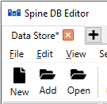

.. _committing_and_history:

Committing and History
======================

.. contents::
   :local:

Committing
----------

.. note:: Changes are not immediately saved to the database(s). They need to be committed separately.

An asterisk (*) in a tab of Spine Database Editor indicates that the session has uncommitted changes:

To commit your changes, select **Session -> Commit** from the hamburger menu or press **Ctrl+Enter** while the
Spine Database Editor -window is active to open the commit dialog:

There is a default text "Updated" readily filled in. It is however good practise to write a short message
that clearly describes what changes have been made to the database. Once the commit message is to you liking,
press **Commit**. Any changes made in the current session will be saved into the database.

If you try to close a tab with uncommitted changes the following dialog will open:

There are a few different options: **Commit and close** will do exactly what it says, **Discard changes and close**
will automatically rollback the changes to the last commit and then close the editor tab. **Cancel** just closes
the dialog and allows you to work on the database again. If you check the box **Do not ask me again** and select
any of the other options beside **Cancel**, the selection you made will be automatically presumed whenever you
close a tab with uncommitted changes. This means that you will not see this dialog again but the changes
will be automatically committed or not depending on the selection you made previously.

Rollback
--------

To undo *all* changes since the last commit, select **Session -> Rollback** from the hamburger menu or press
**Ctrl+Backspace** while the Spine Database Editor -window is active. A dialog confirming the rollback action
will open. From there, select **Rollback** to proceed.

.. tip:: To undo/redo individual changes, use the **Edit -> Undo** and **Edit -> Redo** actions from the hamburger menu.

.. note:: After rolling back to the last commit, the changes made in the session will no longer be available
          through undo/redo.

History
-------

To examine the commit history of the database, select **Session -> History...** from the hamburger menu.
The **commit viewer** will pop up:

All the commits made in the database will show here, each includes the timestamp. author and commit message.
By selecting individual commits, the affected items can be inspected in the box on the right.
