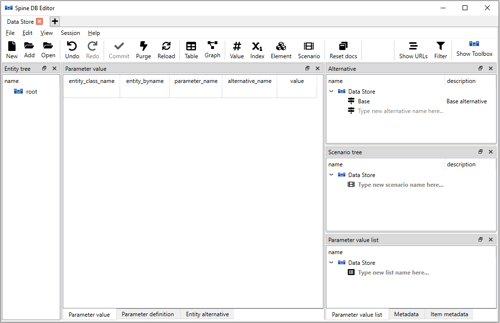

.. |reload| image:: ../../../spinetoolbox/ui/resources/menu_icons/sync.svg
   :width: 16
.. |database| image:: ../../../spinetoolbox/ui/resources/database.svg
   :width: 16

***************
Getting started
***************

This section gives a short outline on how to get started using the editor and how to navigate the ui.
Information about the settings for the editor can be found in :ref:`DB editor settings`.

.. contents::
   :local:

Launching the editor
--------------------

From Spine Toolbox
==================

There are two different ways to open a single database in Spine database editor from Spine Toolbox:

Using a *Data Store* project item:

1. Create a *Data Store* project item.
2. Select the *Data Store*.
3. Enter the url of the database in *Data Store Properties*.
4. Press the **Open editor...** button in *Data Store Properties* or double-click the *Data Store* project item.

Without a *Data Store*:

1. From the main window select **File -> New DB Editor**.
2. Open the menu by clicking on the hamburger menu icon (☰) or by pressing **ALT+F** or **ALT+E**.
3. Select **Open...** to open an existing database, **New..** to create a new one or paste a database URL into
   the URL bar.

From the command line
=====================

To open a single database in Spine database editor, use the ``spine-db-editor`` 
application which comes with Spine Toolbox. After the virtual environment is activated
the editor can be opened with the following command::

    spine-db-editor "...url of the database..."

Note that for e.g. an SQLite database, the url should start with ``sqlite:///`` followed by the path.

Adding multiple databases to one editor
---------------------------------------

It is possible to open multiple databases in the same editor. This allows one to view and modify
the data of the open databases in one editor.

To open multiple SQLite databases in the same Spine database editor by file browser:

1. Open a database Database editor using any of the ways explained before.
2. Select **Add...** from the editor's hamburger menu (☰).
3. Browse to the directory of the SQLite file and open it.

By using the database URL:

1. Open a database Database editor using any of the ways explained before.
2. In the URL bar, after the already open database's URL add a semicolon ``;``
   and after that the URL of the other database to be opened in the same editor.

Knowing the UI
--------------

When you open an empty database for the first time in a Spine Database Editor, it should look something
like this:

The dock widgets can be scaled by dragging them from the sides and moved around by dragging them from their
darker colored headers. Like with other widgets, Toolbox remembers the customizations and the editor will
open in the same configuration when it is opened the next time. If the view is changed from the hamburger
menu, the modifications will be lost and the UI will be reverted back to default.

Tab bar
=======

The uppermost UI element is the tab bar. One editor window can have multiple tabs. New tabs can be added by
pressing the plus-sign (**+**) in the tab bar. In the newly created tab, databases can be opened once again
with the instructions given above. Tabs can be deleted from the editor by pressing the cross (**X**) inside
a tab. The tabs can be dragged from the tab bar to create new editor windows. Tabs from different windows
can also be dragged into others, fusing them into the same editor window.

Navigation bar
==============

Right below the tab bar there is the navigation bar. With the backwards and forwards arrows it is possible
to go back to the database that was previously loaded in the specific tab. This is kind of analogous of web
browsers and going back to the previous page. Next to the arrows there is the **reload** (|reload|) button.
It can be used to reload the data of the database. Next up is the Data Store icon (|database|) which lists
the Data Store items in the project and can be used to open any of them in the current tab. The URL bar
contains the URL of the databases tha are currently open in the tab. As mentioned before, databases can
be opened by inserting valid database URLs into this field and pressing enter. The URL bar also contains
the filter (more about this later). After the URL bar there is the Spine-Toolbox logo which when clicked
brings up the Spine-Toolbox main window. Finally there is the hamburger menu (☰) which holds many of the
functionalities of the Spine Database Editor.

Hamburger menu
==============

The hamburger menu (☰) can be located in the upper left corner of the Spine Database Editor. It is the place
where options and other such things can be found.

File
~~~~

The uppermost section in the menu is dedicated to actions related
to databases. There you can create a new Spine db from **New...**, open an existing one from **Open...** or add
another database to the current tab form **Add...** as explained before. There are also options **Import...**,
**Export...** and **Export session...**. The importing works kind of like adding another database to the existing
tab but instead of just opening the other database it brings all of the data from the other database and merges it
into the current database. With export it is possible to export the current database into it's own ``.sqlite`` file.
The export session works just like export but instead of exporting the whole database, it exports just the new
modifications that have been made since the last commit.

Edit
~~~~

In the **Edit** section there lies the **Undo** and **Redo** -buttons. These can be used to undo and redo the
actions that have been made in the editor (**CTR+Z** and **CTR+Y** also work). The **Copy name(s) as text** allows
the user to copy items into the clipboard that can then be pasted elsewhere. The **Paste** option does
exactly what it says, it pastes the data on the clipboard into the selected field(s). The **Purge...** button is
quite useful when there is a need to get rid of a lot of data quickly. Clicking it will open a new window where
options for the purging are given. Find out more about purging in the section :ref:`Removing data`.
The **Vacuum** option tries to free up some memory from the claws of the database.

View
~~~~

The different view modes are listed in the **View** -section. Also the **Docks...** button for managing the
visibility of the UI elements is located here. When switching to the **Value**, **Index** and **Element** views
something need to selected from the entity tree in order for the view to show anything meaningful. The Graph view
will show an graphical representation of the entities whereas the table view shows the plain data in table format.
By pressing the **Docks...** one can customize what UI elements are displayed. This way it is possible to for example
have the graph and scenario pivot table views open at the same time.

Session
~~~~~~~

The **Commit..** button is for committing the changes in the database. Pressing the button will open up a commit
dialog box, where a commit message can be written. The default commit message is just "Updated" but it is good
practise to write descriptive and concise messages. The **Rollback** button reverts the database to the state
it was in when it was committed the last time. This means that all modifications to the data that haven't been
committed will be lost. It is also good to note that this action clears the undo/redo stack which means that the
operation is irreversible. The **History** button allows one to view the commit history of the database.

Other
~~~~~

In the bottom part of the hamburger menu there is a button to open the User Guide in a web browser, **Settings**
button to open the Spine Database Editor settings and a **Close** button for closing the editor. More information
about the settings can be found in :ref:`DB editor settings`.

Filter
======

The filter can be used to select which items are allowed to be shown in the editor. The filter is based on scenarios.
By pressing the filter image in the right end of the URL bar, the filter selector widget opens up. There the desired
scenario can be selected. When a selection is made and the **Update filters** button is pressed, the changes will be
applied to the editor. Now all entities, parameters etc. will be filtered out if they don't belong to the scenario
specified in the filter.

.. tip:: Note that after applying the filter, the URL gets updated with some additional information about the filters.
         It is therefore possible to make changes to the filtering just by modifying the URL from the URL bar.

Undo and redo
=============

Whenever changes are made to the data in the Spine Database Editor, the changes get stored into memory. This
allows undoing and redoing the operations made in the editor. Buttons for these operations can be found in the
hamburger menu and the usual shortcuts **Ctrl+Z** and **Ctrl+Y** work also. However if the changes are committed,
the memory for the changes gets cleared meaning that the changes before the commit can't be undone anymore.

Views and trees
===============

Spine Database Editor has the following main UI components:

- *Entity tree*:
  they present the structure of entities in all databases in the shape of a tree.
- *Table views* (*Parameter value*, *Parameter definition*, *Entity alternative*):
  they present entity data in the form of stacked tables.
- *Pivot table* and *Frozen table*: they present data in the form of a pivot table,
  optionally with frozen dimensions.
- *Graph view*: it presents the structure of classes and entities in the shape of a graph.
- *Parameter value list*: it presents parameter value lists available in the databases.
- *Alternative*: it presents alternatives defined in the databases in the shape of a tree.
- *Scenario tree*: it presents scenarios defined in the databases in the shape of a tree.
- *Metadata*: presents metadata defined in the databases.
- *Item metadata*: shows metadata associated with the currently selected entities or parameter values.

.. tip:: You can customize the UI from the **View** section in the hamburger ☰ menu. There the **Docks...**
         menu can be used to enable and disable the different UI components listed above.

Items from the trees can be selected by clicking them with the left mouse button and the views will react to
the changes. By default, multiple items can be selected at the same time across the trees by holding down **Ctrl**
while making the selections. This behavior can be flipped from the editor settings (**Ctrl+,**) by toggling the
*Sticky selection* -setting.

In the next section you will learn more about the different UI components and views available in the editor
