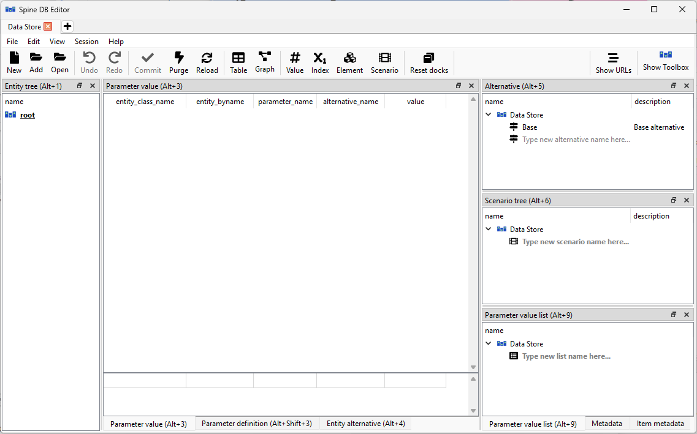

.. |black-plus| image:: ../../../spinetoolbox/ui/resources/black_plus.svg
          :width: 16
.. |database| image:: ../../../spinetoolbox/ui/resources/database.svg
   :width: 16
.. |reload| image:: ../../../spinetoolbox/ui/resources/menu_icons/sync.svg
   :width: 16

***************
Getting started
***************

This section gives a short outline on how to get started using the editor and how to navigate the ui.
Information about the settings for the editor can be found in :ref:`DB editor settings`.

.. contents::
   :local:

Launching the editor
--------------------

From Spine Toolbox
==================

There are two different ways to open a single database in Spine database editor from Spine Toolbox:

Using a *Data Store* project item:

1. Create a *Data Store* project item.
2. Select the *Data Store*.
3. Enter the url of the database in *Data Store Properties*.
4. Press the **Open editor...** button in *Data Store Properties* or double-click the *Data Store* project item.

Without a *Data Store*:

1. From the main window select **File -> New DB Editor**.
2. From the **Menu bar** select **File -> Open...** to open an existing database or **New..** to create a new one.

From the command line
=====================

To open a single database in Spine database editor, use the ``spine-db-editor`` 
application which comes with Spine Toolbox. After the virtual environment is activated
the editor can be opened with the following command::

    spine-db-editor "...url of the database..."

Note that for e.g. an SQLite database, the url should start with ``sqlite:///`` followed by the path.

Adding multiple databases to one editor
---------------------------------------

It is possible to open multiple databases in the same editor. This allows one to view and modify
the data of the open databases in one editor.

To open multiple SQLite databases in the same Spine database editor by file browser:

1. Open a database Database editor using any of the ways explained before.
2. Select **Add...** from the editor's **Menu bar**.
3. Browse to the directory of the SQLite file and open it.

Knowing the UI
--------------

When you open an empty database for the first time in a Spine Database Editor, it should look something
like this:

The dock widgets can be scaled by dragging them from the sides and moved around by dragging them from their
darker colored headers. Like with other widgets, Toolbox remembers the customizations and the editor will
open in the same configuration when it is opened the next time. The dock configurations are URL specific.
the configurations for the URL can be restored back to default from the **Menu bar->View->Docks...->Reset docks**,
or from the button in the **Toolbar** with the same name.

There are keyboard shortcuts to activate most of the widgets. For example Entity tree is activated with **Alt+1**.

Tab bar
=======

The uppermost UI element is the **Tab bar**. One editor window can have multiple tabs. New tabs can be added by
pressing the plus-sign (|black-plus|) in the **Tab bar**. In the newly created tab, databases can be opened once again
with the instructions given above. Tabs can be deleted from the editor by pressing the cross (**X**) inside
a tab. The tabs can be dragged from the **Tab bar** to create new editor windows. Tabs from different windows
can also be dragged into others, fusing them into the same editor window.

Menu bar
========

Right below the **Tab bar** there is the **Menu bar**. The **Menu bar** has five different sections: **File**, **Edit**,
**View**, **Session**, and **Help**.

File
~~~~

The leftmost section in the menu is dedicated to actions related
to databases. There you can create a new Spine db from **New...**, open an existing one from **Open...** or
**Open recent**, and finally add another database to the current tab with **Add...** as explained before.
There are also options **Import...**, **Export...** and **Export session...**. The importing works kind of like adding
another database to the existing tab but instead of just opening the other database it brings all of the data from the
other database and merges it into the current database. With export it is possible to export the current database into
it's own ``.sqlite`` file. The export session works just like export but instead of exporting the whole database, it
exports just the new modifications that have been made since the last commit. The last menu item is **Settings...**,
which opens up the settings. More information about the settings can be found in :ref:`DB editor settings`

Edit
~~~~

In the **Edit** section  The **Copy as text** allows the user to copy items into the clipboard that can then be
pasted elsewhere. The **Paste** option does exactly what it says, it pastes the data on the clipboard into the
selected field(s). The **Vacuum** option tries to free up some memory from the claws of the database. More information
about vacuumng here: :ref:`vacuum`.

View
~~~~

From **View**, one can toggle what UI elements are displayed. This way it is possible to for example
have the graph and scenario pivot table views open at the same time. The selections made in the **View** get saved
to the currently open view type and are also database specific. The **Reset docs** can be used to make a factory reset
to the layout of the widgets.

Session
~~~~~~~

The **Commit..** button is for committing the changes in the database. Pressing the button will open up a commit
dialog box, where a commit message can be written. The default commit message is just "Updated" but it is good
practise to write descriptive and concise messages. The **Rollback** button reverts the database to the state
it was in when it was committed the last time. This means that all modifications to the data that haven't been
committed will be lost. It is also good to note that this action clears the undo/redo stack which means that the
operation is irreversible. The **History** button allows one to view the commit history of the database. **Close**
just shuts down the current session and closes the current tab in the editor.

Help
~~~~

Contains a link to the index page of the Spine Database Editor documentation.

Toolbar
=======

The **Toolbar** houses many useful features that come in handy when working with a database. Starting from the left,
there **New**, **Add** and **Open** -buttons. With these you can create a new Spine db in sqlite form, add an
existing one to the tab or open an existing one instead. Next are the **Undo** and **Redo** -buttons. These can be
used to undo and redo the actions that have been made in the editor (**CTR+Z** and **CTR+Y** also work). **Commit**
saves the changes made in the editor into the database. More information about committing can be found in here
:ref:`committing_and_history`. The **Purge...** button is quite useful when there is a need to get rid of a lot of
data quickly. Clicking it will open a new window where options for the purging are given. Find out more about purging
in the section :ref:`Removing data`. **reload** (|reload|) button can be used to reload the data of the database.

The following six buttons are used to switch between the different views in the editor. Short introductions to the
different views can be found on the bottom of this page and more indepth explanations from here: :ref:`viewing data`.
The last button on the left side is **Reset docs**. When pressed, the dock widgets get reset to their default positions
in all views and Toolbox will forget the previous modifications. These modifications are database specific, so pressing
this button will only reset the editor to factory state for the currently open database.

The right side of the **Toolbar** houses tow buttons. **Show URLs** opens up a popup window, which houses the names and
URLs of the currently open databases. From there they can be copied, if one needs the URL for some purpose.
After that there is the Spine-Toolbox logo which, when clicked, brings up the Spine Toolbox main window.

Undo and redo
=============

Whenever changes are made to the data in the Spine Database Editor, the changes get stored into memory. This
allows undoing and redoing the operations made in the editor. Buttons for these operations can be found in the
**Toolbar** and the usual shortcuts **Ctrl+Z** and **Ctrl+Y** work also.

Views and trees
===============

Spine Database Editor has the following main UI components:

- *Entity tree*:
  they present the structure of entities in all databases in the shape of a tree.
- *Table views* (*Parameter value*, *Parameter definition*, *Entity alternative*):
  they present entity data in the form of stacked tables.
- *Pivot table* and *Frozen table*: they present data in the form of a pivot table,
  optionally with frozen dimensions.
- *Graph view*: it presents the structure of classes and entities in the shape of a graph.
- *Parameter value list*: it presents parameter value lists available in the databases.
- *Alternative*: it presents alternatives defined in the databases in the shape of a tree.
- *Scenario tree*: it presents scenarios defined in the databases in the shape of a tree.
- *Metadata*: presents metadata defined in the databases.
- *Item metadata*: shows metadata associated with the currently selected entities or parameter values.

.. tip:: You can customize the UI from the **View** section in the **Menu bar** by enabling and disabling
         the different UI components listed above.

Items from the trees can be selected by clicking them with the left mouse button and the views will react to
the changes. By default, multiple items can be selected at the same time across the trees by holding down **Ctrl**
while making the selections. This behavior can be flipped from the editor settings (**Ctrl+,**) by toggling the
*Sticky selection* -setting.

In the next section you will learn more about the different UI components and views available in the editor
