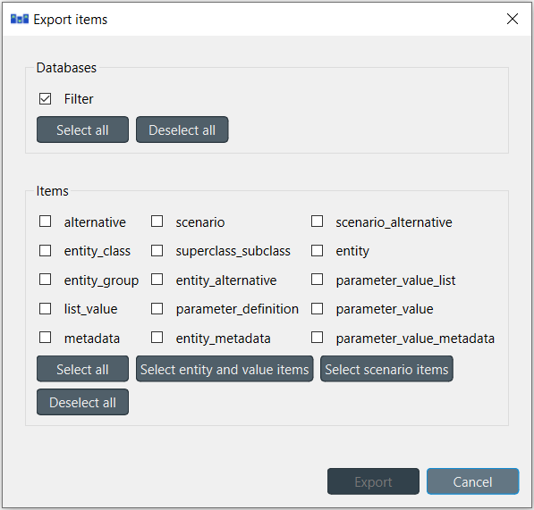

Importing and exporting data
----------------------------

This section describes the available tools to import and export data.

.. contents::
   :local:

Overview
========

Spine Database Editor supports importing and exporting data in three different formats: SQLite, JSON, and Excel.
The SQLite import/export uses the Spine Database format. The JSON and Excel import/export use a specific format
described in :ref:`format_specifications`.

Importing
=========

To import a file, select **File --> Import** from the hamburger menu.
The *Import file* dialog will pop up.
Select the file type (SQLite, JSON, or Excel), enter the path of the file to import, and accept the dialog.

.. tip:: You can undo import operations using **Edit -> Undo**.

Exporting
=========

Mass export
~~~~~~~~~~~

To export items in mass, select **File --> Export** from the hamburger menu.
The *Export items* dialog will pop up:

Select the databases you want to export under *Databases*, and the type of items under *Items*,
then press **Ok**.
The *Export file* dialog will pop up now.
Select the file type (SQLite, JSON, or Excel), enter the path of the file to export, and accept the dialog.

Selective export
~~~~~~~~~~~~~~~~

To export a specific subset of items, select the corresponding items in the **Entity Tree**,
right click on the selection to bring the context menu, and select **Export**.

The *Export file* dialog will pop up.
Select the file type (SQLite, JSON, or Excel), enter the path of the file to export, and accept the dialog.

Session export
~~~~~~~~~~~~~~

To export only uncommitted changes made in the current session, select **File --> Export session** from
the hamburger menu.

The *Export file* dialog will pop up.
Select the file type (SQLite, JSON, or Excel), enter the path of the file to export, and accept the dialog.

.. note:: Export operations include all uncommitted changes.

Accessing/using exported files
==============================

Whenever you successfully export a file, 
a button with the file name is created in the *Exports* bar at the bottom of the form.
Pressing that button will open the JSON or Excel file with the default program that your
system associates with that filetype. Exports of SQLite file type will be opened in a new tab
of the Spine Database Editor. To open the folder containing the export, click on the arrow next
to the file name and select **Open containing folder** from the popup menu.

  .. image:: img/export_bar.png
     :align: center

.. _format_specifications:

Format specifications
=====================

.. tip:: To create a template file with the JSON or Excel format you can simply export an existing Spine database
   into one of those formats.

Excel format
~~~~~~~~~~~~

The Excel format consists of one sheet per entity class.
Each sheet can have one of four different formats:

1. Object class with scalar parameter data:

  .. image:: img/excel_object_sheet.png
     :align: center

2. Object class with indexed parameter data:

   .. image:: img/excel_object_sheet_timeseries.png
      :align: center

3. Relationship class with scalar parameter data:

   .. image:: img/excel_relationship_sheet.png
      :align: center

4. Relationship class with indexed parameter data:

   .. image:: img/excel_relationship_sheet_timeseries.png
      :align: center

JSON format
~~~~~~~~~~~

The JSON format consists of a single JSON object with the following ``OPTIONAL`` keys:

- **object_classes**: the value of this key ``MUST`` be a JSON array,
  representing a list of object classes.
  Each element in this array ``MUST`` be itself a JSON array and ``MUST`` have three elements:

  - The first element ``MUST`` be a JSON string, indicating the object class name.
  - The second element ``MUST`` be either a JSON string, indicating the object class description, or null.
  - The third element ``MUST`` be either a JSON integer, indicating the object class icon code, or null.

- **relationship_classes**: the value of this key ``MUST`` be a JSON array,
  representing a list of relationships classes.
  Each element in this array ``MUST`` be itself a JSON array and ``MUST`` have three elements:

  - The first element ``MUST`` be a JSON string, indicating the relationship class name.
  - The second element ``MUST`` be a JSON array, indicating the member object classes.
    Each element in this array ``MUST`` be a JSON string, indicating the object class name.
  - The third element ``MUST`` be either a JSON string, indicating the relationship class description, or null.

- **parameter_value_lists**: the value of this key ``MUST`` be a JSON array,
  representing a list of parameter value lists.
  Each element in this array ``MUST`` be itself a JSON array and ``MUST`` have two elements:

  - The first element ``MUST`` be a JSON string, indicating the parameter value list name.
  - The second element ``MUST`` be a JSON array, indicating the values in the list.
    Each element in this array ``MUST`` be either a JSON object, string, number, or null,
    indicating the value.

- **object_parameters**: the value of this key ``MUST`` be a JSON array,
  representing a list of object parameter definitions.
  Each element in this array ``MUST`` be itself a JSON array and ``MUST`` have five elements:

  - The first element ``MUST`` be a JSON string, indicating the object class name.
  - The second element ``MUST`` be a JSON string, indicating the parameter name.
  - The third element ``MUST`` be either a JSON object, string, number, or null,
    indicating the parameter default value.
  - The fourth element ``MUST`` be a JSON string, indicating the associated parameter value list, or null.
  - The last element ``MUST`` be either a JSON string, indicating the parameter description, or null.

- **relationship_parameters**: the value of this key ``MUST`` be a JSON array,
  representing a list of relationship parameter definitions.
  Each element in this array ``MUST`` be itself a JSON array and ``MUST`` have five elements:

  - The first element ``MUST`` be a JSON string, indicating the relationship class name.
  - The second element ``MUST`` be a JSON string, indicating the parameter name.
  - The third element ``MUST`` be either a JSON object, string, number, or null,
    indicating the parameter default value.
  - The fourth element ``MUST`` be a JSON string, indicating the associated parameter value list, or null
  - The last element ``MUST`` be either a JSON string, indicating the parameter description, or null.

- **objects**: the value of this key ``MUST`` be a JSON array,
  representing a list of objects.
  Each element in this array ``MUST`` be itself a JSON array and ``MUST`` have three elements:

  - The first element ``MUST`` be a JSON string, indicating the object class name.
  - The second element ``MUST`` be a JSON string, indicating the object name.
  - The third element ``MUST`` be either a JSON string, indicating the object description, or null.

- **relationships**: the value of this key ``MUST`` be a JSON array,
  representing a list of relationships.
  Each element in this array ``MUST`` be itself a JSON array and ``MUST`` have two elements:

  - The first element ``MUST`` be a JSON string, indicating the relationship class name.
  - The second element ``MUST`` be a JSON array, indicating the member objects.
    Each element in this array ``MUST`` be a JSON string, indicating the object name.

- **object_parameter_values**: the value of this key ``MUST`` be a JSON array,
  representing a list of object parameter values.
  Each element in this array ``MUST`` be itself a JSON array and ``MUST`` have four elements:

  - The first element ``MUST`` be a JSON string, indicating the object class name.
  - The second element ``MUST`` be a JSON string, indicating the object name.
  - The third element ``MUST`` be a JSON string, indicating the parameter name.
  - The fourth element ``MUST`` be either a JSON object, string, number, or null,
    indicating the parameter value.

- **relationship_parameter_values**: the value of this key ``MUST`` be a JSON array,
  representing a list of relationship parameter values.
  Each element in this array ``MUST`` be itself a JSON array and ``MUST`` have four elements:

  - The first element ``MUST`` be a JSON string, indicating the relationship class name.
  - The second element ``MUST`` be a JSON array, indicating the relationship's member objects.
    Each element in this array ``MUST`` be a JSON string, indicating the object name.
  - The third element ``MUST`` be a JSON string, indicating the parameter name.
  - The fourth element ``MUST`` be either a JSON object, string, number, or null,
    indicating the parameter value.

Example::

    {
        "object_classes": [
            ["connection", "An entity where an energy transfer takes place", 280378317271233],
            ["node", "An entity where an energy balance takes place", 280740554077951],
            ["unit", "An entity where an energy conversion process takes place", 281470681805429],
        ],
        "relationship_classes": [
            ["connection__node__node", ["connection", "node", "node"] , null],
            ["unit__from_node", ["unit", "node"], null],
            ["unit__to_node", ["unit", "node"], null],
        ],
        "parameter_value_lists": [
            ["balance_type_list", ["\"balance_type_node\"", "\"balance_type_group\"", "\"balance_type_none\""]],
            ["truth_value_list", ["\"value_false\"", "\"value_true\""]],
        ],
        "object_parameters": [
            ["connection", "connection_availability_factor", 1.0, null, null],
            ["node", "balance_type", "balance_type_node", "balance_type_list", null],
        ],
        "relationship_parameters": [
            ["connection__node__node", "connection_flow_delay", {"type": "duration", "data": "0h"}, null, null],
            ["unit__from_node", "unit_capacity", null, null, null],
            ["unit__to_node", "unit_capacity", null, null, null],
        ],
        "objects": [
            ["connection", "Bastusel_to_Grytfors_disch", null],
            ["node", "Bastusel_lower", null],
            ["node", "Bastusel_upper", null],
            ["node", "Grytfors_upper", null],
            ["unit", "Bastusel_pwr_plant", null],
        ],
        "relationships": [
            ["connection__node__node", ["Bastusel_to_Grytfors_disch", "Grytfors_upper", "Bastusel_lower"]],
            ["unit__from_node", ["Bastusel_pwr_plant", "Bastusel_upper"]],
            ["unit__to_node", ["Bastusel_pwr_plant", "Bastusel_lower"]],
        ],
        "object_parameter_values": [
            ["node", "Bastusel_upper", "demand", -0.2579768519],
            ["node", "Bastusel_upper", "fix_node_state", {"type": "time_series", "data": {"2018-12-31T23:00:00": 5581.44, "2019-01-07T23:00:00": 5417.28}}],
            ["node", "Bastusel_upper", "has_state", "value_true"],
        ],
        "relationship_parameter_values": [
            ["connection__node__node", ["Bastusel_to_Grytfors_disch", "Grytfors_upper", "Bastusel_lower"], "connection_flow_delay", {"type": "duration", "data": "1h"}],
            ["unit__from_node", ["Bastusel_pwr_plant", "Bastusel_upper"], "unit_capacity", 127.5],
        ]
    }
