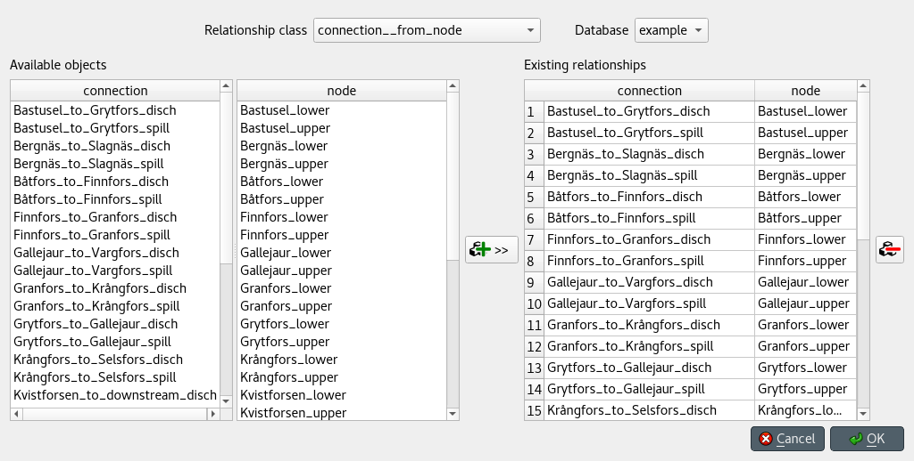

Managing data
-------------

This section describes the available tools to manage data, i.e., adding, updating or removing data at the same time.

.. contents::
   :local:

Managing object groups
=======================

To modify object groups, expand the corresponding item in *Object tree* to display the **members** item,
right-click on the latter and select **Manage members** from the context menu.
The *Manage parameter tags* dialog will pop up:

.. image:: img/manage_members_dialog.png
   :align: center

To add new member objects, select them under *Non members*, and press the button in the middle that has a plus sign.
To remove current member objects, select them under *Members*, and press the button in the middle that has a minus sign.
Multiple selection works in both lists.

When you're happy, press **Ok**.

.. note:: Changes made using the *Manage members* dialog are not applied to
   the database until you press **Ok**.

Managing relationships
======================

Select **Edit -> Manage relationships** from the menu bar.
The *Manage relationships* dialog will pop up:

To get started, select a relationship class and a database from the combo boxes at the top.

To add relationships, select the member objects for each class under *Available objects*
and press the **Add relationships** button at the middle of the form.
The relationships will appear at the top of the table under *Existing relationships*.

To add multiple relationships at the same time,
select multiple objects for one or more of the classes.

.. tip:: To *extend* the selection of objects for a class, 
   press and hold the **Ctrl** key while clicking on more items.

.. note:: The set of relationships to add is determined by applying the *product*
   operation over the objects selected for each class.

To remove relationships, select the appropriate rows under *Existing relationships*
and press the **Remove relationships** button on the right.

When you're happy with your changes, press **Ok**.

.. note:: Changes made using the *Manage relationships* dialog are not applied to
   the database until you press **Ok**.