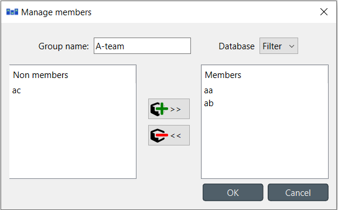

.. |add| image:: ../../../spinetoolbox/ui/resources/menu_icons/cube_plus.svg
   :width: 16
.. |remove| image:: ../../../spinetoolbox/ui/resources/menu_icons/cube_minus.svg
   :width: 16

Managing data
-------------

This section describes the available tools to manage data, i.e., adding, updating or removing data at the same time.

.. contents::
   :local:

Managing entity groups
======================

To modify entity groups, expand the corresponding entity class item in **Entity Tree** to display the group item,
right-click on it and select **Manage members** from the context menu.
The *Manage members* dialog will pop up:

To add new member entities, select them under *Non members*, and press the (|add|>>) button in the middle.
To remove current members, select them under *Members*, and press the (|remove| <<) button in the middle.
Multiple selection works in both lists.

When you're happy with the members, press **OK**.

.. note:: Changes made using the *Manage members* dialog are not applied to
   the database until you press **OK**.

Managing N-D entities
=====================

Right click the root item, or an N-D entity item in **Entity Tree** and from the context menu select
**Manage elements**. The *Manage elements* dialog will pop up:

To get started, select an entity class and a database from the combo boxes at the top.

To add entities, select the elements for each class under *Available elements*
and press the add button (|add|>>) in the middle of the form.
The entities will appear at the top of the table under *Existing entities*.

To add multiple entities at the same time,
select multiple elements for one or more of the classes. All possible permutations
of the selected elements will be added to *Existing entities*.

.. tip:: To *extend* the selection of objects for a class, 
   press and hold the **Ctrl** key while clicking on more items. Holding down **Shift**
   allows to select an area of items by clicking the start and end of the selection.

To remove entities, select the appropriate rows under *Existing entities*
and press the remove button (|remove|) on the right.

When you're happy with your changes, press **OK**.

.. note:: Changes made using the *Manage elements* dialog are not applied to
   the database until you press **OK**.
