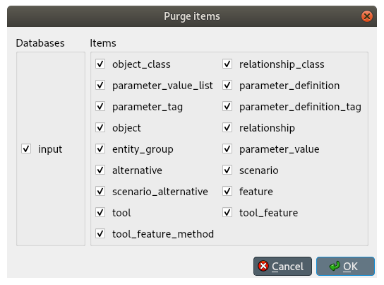

Removing data
-------------

This section describes the available tools to remove data.

.. contents::
   :local:

Removing entities and classes
=============================

From *Object tree*, *Relationship tree*, or *Entity graph*
~~~~~~~~~~~~~~~~~~~~~~~~~~~~~~~~~~~~~~~~~~~~~~~~~~~~~~~~~~

Select the items in *Object tree*, *Relationship tree*, or *Entity graph*, corresponding to the entities and classes
you want to remove. Then, right-click on the selection and choose **Remove** from the context menu.

The *Remove items* dialog will popup:

.. image:: img/remove_entities_dialog.png
   :align: center

Specify the databases from where you want to remove each item under the *databases* column,
and press **Ok**.

From *Pivot table*
~~~~~~~~~~~~~~~~~~
To remove objects or relationships from a specific class, bring the class to *Pivot table*
using the **Parameter value** input type
(see :ref:`using_pivot_table_and_frozen_table`),
and select the cells in the table headers corresponding to the objects and/or relationships you want to remove.
Then, right-click on the selection and choose the corresponding **Remove** option from the context menu.

Alternatively, to remove relationships for a specific class, 
bring the class to *Pivot table* using the **Relationship** input type
(see :ref:`using_pivot_table_and_frozen_table`).
The *Pivot table* headers will be populated
with all possible combinations of objects across the member classes.
Locate the member objects of the relationship you want to remove,
and uncheck the corresponding box in the table body.

Removing parameter definitions and values
=========================================

From *Stacked tables*
~~~~~~~~~~~~~~~~~~~~~

To remove parameter definitions or values,
go to the relevant *Stacked table* and select any cell in the row corresponding to the items
you want to remove.s
Then, right-click on the selection and choose the appropriate **Remove** option from the context menu.

From *Pivot table*
~~~~~~~~~~~~~~~~~~

To remove parameter definitions and/or values for a certain class,
bring the corresponding class to *Pivot table* using the **Parameter value** input type
(see :ref:`using_pivot_table_and_frozen_table`).
Then:

1. Select the cells in the *parameter* header corresponding to the parameter definitions you want to remove,
   right-click on the selection and choose **Remove parameter definitions** from the context menu
2. Select the cells in the table body corresponding to the parameter values you want to remove,
   right-click on the selection and choose **Remove parameter values** from the context menu.

Purging items
=============

To remove all items of specific types, select **Edit -> Purge** from the hamburger menu.
The *Purge items* dialog will pop up:

Select the databases from where you want to remove the items under *Databases*,
and the type of items you want to remove under *Items*.
Then, press **Ok**.

Removing alternatives
=====================

From *Pivot table*
~~~~~~~~~~~~~~~~~~

Select the **Scenario** input type (see :ref:`using_pivot_table_and_frozen_table`).
To remove alternatives, just edit the proper cells in the **alternative** header,
right-click on the selection and choose **Remove** from the context menu.

From *Alternative tree*
~~~~~~~~~~~~~~~~~~~~~~~

To remove an alternative, just select the corresponding items in *Alternative tree*,
right-click on the selection and choose **Remove** from the context menu.

Removing scenarios
==================

From *Pivot table*
~~~~~~~~~~~~~~~~~~

Select the **Scenario** input type (see :ref:`using_pivot_table_and_frozen_table`).
To remove scenarios, just select the proper cells in the **scenario** header,
right-click on the selection and choose **Remove** from the context menu.

From *Scenario tree*
~~~~~~~~~~~~~~~~~~~~

To remove a scenario, just select the corresponding items in *Scenario tree*,
right-click on the selection and choose **Remove** from the context menu.

To remove a scenario alternative, select the corresponding alternative items in *Scenario tree*,
right-click  on the selection and choose **Remove** from the context menu.

Removing tools and features
===========================

To remove a feature, tool, or method, just select the corresponding items in *Tool/Feature tree*,
right-click on the selection and choose **Remove** from the context menu.

Removing parameter value lists
==============================

To remove a parameter value list or any of its values, just select the corresponding items in *Parameter value list*,
right-click on the selection and choose **Remove** from the context menu.

Removing metadata
=================

Select the corresponding items in *Metadata*, right-click on the selection and choose **Remove row(s)**
from the context menu.

Removing item metadata
======================

Select the corresponding items in *Item metadata*, right-click on the selection and choose **Remove row(s)**
from the context menu.
