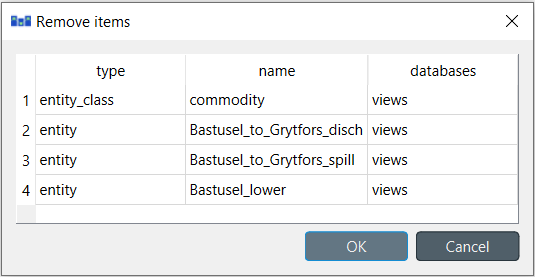

.. _Removing data:

Removing data
-------------

This section describes the available tools to remove data.

.. contents::
   :local:

Purging items
=============

To remove all items of specific types, select **Edit -> Purge...** (|purge|) from the hamburger menu.
The *Purge items* dialog will pop up:

The databases that are opened in the Editor are listed under *Databases*. From there you can select
the databases where the mass removal will take place. The *Select all* -option will check all of the
boxes and *Deselect all* will in turn uncheck every box.

The type of items that are to be deleted, need to be specified under *Items*. There are a couple of useful
buttons in addition to the same *Select all* and *Deselect all*: *Select entity and value items* and
*Select scenario items*. The former will select the *entity*, *entity_group*, *parameter_value*,
*entity_metadata* and *parameter_value_metadata* items in the list. The latter will select the *alternative*,
*scenario* and *scenario_alternative* items. When you are happy with your choices, press **Purge** to perform
the mass removal.

.. note:: The purge dialog can also be opened from the **Properties** -dock widget of a Data Store.

.. tip:: Purging can also be an automated part of the workflow. See :ref:`Links` for more information
         about purging a database automatically.

Removing entities and classes
=============================

From **Entity Tree** or **Graph View**
~~~~~~~~~~~~~~~~~~~~~~~~~~~~~~~~~~~~~~

Select the items in **Entity Tree** or **Graph View**, corresponding to the entities and classes
you want to remove. Then, right-click on the selection and choose **Remove** from the context menu.

The *Remove items* dialog will popup:

Specify the databases from where you want to remove each item under the *databases* column,
and press **OK**.

From **Pivot View**
~~~~~~~~~~~~~~~~~~~

To remove entities from a specific class, bring the class to **Pivot View**
using the **Value** input type (see :ref:`using_pivot_table_and_frozen_table`),
and select the cells in the table headers corresponding to the entities you want to remove.
Then, right-click on the selection and choose the **Remove entities** option from the context menu.
This will remove the selected rows.

Alternatively, to remove N-D entities of a specific class,
bring the class to **Pivot View** using the **Element** input type
(see :ref:`using_pivot_table_and_frozen_table`).
The **Pivot View** headers will be populated
with all possible combinations of entities across the member classes.
Locate the member entities you want to remove,
and uncheck the corresponding box in the table body.

Removing parameter definitions and values
=========================================

From **Table View**
~~~~~~~~~~~~~~~~~~~

To remove parameter definitions or values,
go to the relevant **Table View** and select any cell in the row corresponding to the items
you want to remove. Then, right-click on the selection and select the **Remove row(s)**
option from the context menu. Multiple selection is supported and the removal can also be
performed by pressing **Ctrl+Del**.

From **Pivot View**
~~~~~~~~~~~~~~~~~~~

To remove parameter definitions and/or values for a certain class,
bring the corresponding class to **Pivot View** using the **Value** input type
(see :ref:`using_pivot_table_and_frozen_table`).
Then:

1. Select the cells in the *parameter* header corresponding to the parameter definitions you want to remove,
   right-click on the selection and choose **Remove parameter definitions** from the context menu
2. Select the cells in the table body corresponding to the parameter values you want to remove,
   right-click on the selection and choose **Remove parameter values** from the context menu.

Removing alternatives
=====================

From **Pivot View**
~~~~~~~~~~~~~~~~~~~

Select the **Scenario** input type (see :ref:`using_pivot_table_and_frozen_table`).
To remove alternatives, select the to be removed items in the **alternative** header,
right-click on the selection and choose **Remove alternatives** from the context menu.

From **Alternative**
~~~~~~~~~~~~~~~~~~~~

To remove an alternative, just select the corresponding items in **Alternative**,
right-click on the selection and choose **Remove** from the context menu.

Removing scenarios
==================

From **Pivot View**
~~~~~~~~~~~~~~~~~~~

Select the **Scenario** input type (see :ref:`using_pivot_table_and_frozen_table`).
To remove scenarios, just select the proper cells in the **scenario** header,
right-click on the selection and choose **Remove scenarios** from the context menu.

From **Scenario Tree**
~~~~~~~~~~~~~~~~~~~~~~

To remove a scenario, just select the corresponding items in **Scenario Tree**,
right-click on the selection and choose **Remove** from the context menu.

To remove a scenario alternative from a scenario, select the corresponding alternative items
in **Scenario Tree**, right-click on the selection and choose **Remove** from the context menu.

Removing parameter value lists
==============================

To remove a parameter value list or any of its values, just select the corresponding items in *Parameter value list*,
right-click on the selection and choose **Remove** from the context menu.

Removing metadata
=================

Select the corresponding items in **Metadata**, right-click on the selection and choose **Remove row(s)**
from the context menu.

Removing item metadata
======================

Select the corresponding items in **Item metadata**, right-click on the selection and choose **Remove row(s)**
from the context menu.
